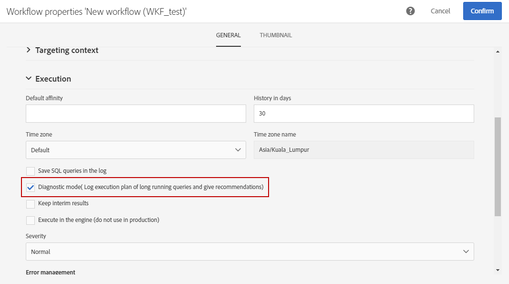

# Uitvoeringsopties beheren {#managing-execution-options}

Als u de uitvoeringsopties van een workflow wilt wijzigen, gebruikt u de knop  om de workfloweigenschappen te openen en selecteert u de sectie **[!UICONTROL Execution]**.

Mogelijke opties zijn:

* **[!UICONTROL Default affinity]**: in dit veld kunt u ervoor zorgen dat een workflow of een werkstroomactiviteit op een bepaalde computer wordt uitgevoerd.

* **[!UICONTROL History in days]**: geeft het aantal dagen aan waarna de historie moet worden gewist. De geschiedenis bevat elementen die gerelateerd zijn aan de workflow: logbestanden, taken, gebeurtenissen (technische objecten die zijn gekoppeld aan de workflowbewerking), evenals bestanden die zijn gedownload door de activiteit **[!UICONTROL Transfer file]**. De standaardwaarde is 30 dagen voor workflowsjablonen buiten de box.

   De geschiedenis wordt gewist door de technische workflow voor het opschonen van databases, die dagelijks standaard wordt uitgevoerd (zie [Lijst met technische workflows](../../administration/using/technical-workflows.md).)

   >[!IMPORTANT]
   >
   >Als het veld **[!UICONTROL History in days]** leeg blijft, wordt de waarde ervan beschouwd als &quot;1&quot;, wat betekent dat de historie na 1 dag wordt gewist.

* **[!UICONTROL Save SQL queries in the log]**: Hiermee kunt u de SQL-query&#39;s uit de workflow opslaan in de logbestanden.

* **[!UICONTROL Diagnostic mode (Log execution plan of long running queries and give recommendations)]**: Schakel deze optie in als u het hele uitvoeringsplan wilt registreren. Deze optie is standaard uitgeschakeld.

   Raadpleeg deze [sectie](#diagnostic-mode) voor meer informatie over deze optie.

* **[!UICONTROL Keep interim results]**: Schakel deze optie in als u de details van de overgangen wilt bekijken.

   >[!CAUTION]
   >
   >Deze optie verbruikt veel schijfruimte en is ontworpen om u te helpen een workflow te maken en een correcte configuratie en functionaliteit te garanderen. Laat deze optie uitgeschakeld op productie-instanties.

* **[!UICONTROL Execute in the engine (do not use in production)]**: Hiermee kunt u de workflow lokaal uitvoeren voor testdoeleinden in de ontwikkelomgeving.

* **[!UICONTROL Severity]**: kunt u een prioriteitsniveau opgeven voor het uitvoeren van workflows in uw Adobe Campaign-instantie. Dit veld wordt alleen voor monitoringdoeleinden gebruikt door Adobe-teams.

De sectie **[!UICONTROL Error management]** biedt extra opties waarmee u kunt beheren hoe workflows zich gedragen in het geval van fouten. Deze opties worden beschreven in de sectie [Foutbeheer](../../automating/using/monitoring-workflow-execution.md#error-management).

## Diagnosemodus {#diagnostic-mode}

>[!CAUTION]
>
>Deze optie kan de workflowprestaties aanzienlijk beïnvloeden en moet spaarzaam worden gebruikt.

Wanneer toegelaten, **[!UICONTROL Diagnostic mode (Log execution plan of long running queries and give recommendations)]** optie in **[!UICONTROL Execution]** sectie van de werkschemaeigenschappen registreert het volledige uitvoeringsplan als een vraag meer dan één minuut neemt.

Nadat u deze optie hebt ingeschakeld en uw workflow hebt gestart, wordt het uitvoeringsplan geregistreerd als uw query meer dan één minuut duurt. U kunt uw uitvoeringsplan dan terugwinnen door EXPLAIN ANALYZE te gebruiken.

Raadpleeg [PostSQL-documentatie](https://www.postgresql.org/docs/9.4/using-explain.html) voor meer informatie hierover.

Als u een opeenvolgingsaftasten in deze vraag hebt, **[!UICONTROL Diagnostic mode]** zal ook aanbevelingen verstrekken om een index met behulp van een filteruitdrukking tot stand te brengen.

>[!NOTE]
>
> Deze aanbevelingen zijn uitsluitend bedoeld voor referentiedoeleinden en dienen zorgvuldig te worden gebruikt, afhankelijk van uw gebruiksgeval.

Tijdens de uitvoering van de workflow moet aan de volgende twee voorwaarden worden voldaan om aanbevelingen te activeren:

* De opeenvolgingsaftasten neemt meer dan 40% tijd van de vraag.

* De resulterende rijen na de opeenvolgingsaftasten zijn minder dan 1 % van de totale rijen aanwezig in de lijst.

U kunt de optie vanuit het geavanceerde menu beheren door **[!UICONTROL Administration]** > **[!UICONTROL Application settings]** > **[!UICONTROL Options]** te selecteren:

* **[!UICONTROL Time of query execution (in milliseconds)(DiagnosticModeQueryTime)]**: Vanuit het  **[!UICONTROL Value]** veld kunt u een nieuwe tijd voor de uitvoering van de query instellen. Als uw vraaguitvoering deze waarde overschrijdt, zal het uitvoeringsplan worden geregistreerd.

   

* **[!UICONTROL Percentage of seq scan time (DiagnosticModeSeqScanPercentage)]**: Van het  **[!UICONTROL Value]** gebied, kunt u het percentage van vraagtijd veranderen het opeenvolgingsaftasten voor de te produceren aanbeveling moet nemen.

   
