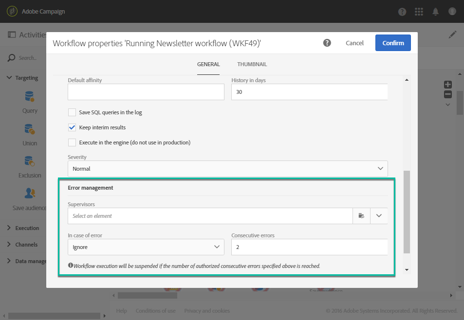

# Workflowuitvoering controleren {#monitoring}

## Workflowlogboek en taken {#workflow-log-and-tasks}

De  opent het werkschemalogboek en taakmenu.

De workflowgeschiedenis wordt opgeslagen voor de duur die is opgegeven in de opties voor workflowuitvoering (zie [Workflow-eigenschappen](../../automating/using/managing-execution-options.md)). Tijdens deze duur, worden alle berichten daarom bewaard, zelfs na een nieuw begin. Als u de berichten van een vorige uitvoering niet wilt opslaan, moet u de geschiedenis wissen door op de knop  knop.

De **[!UICONTROL Log]** bevat de uitvoeringsgeschiedenis van alle activiteiten of van alle geselecteerde activiteiten. De uitgevoerde bewerkingen en uitvoeringsfouten worden in chronologische volgorde geïndexeerd.

De **[!UICONTROL Tasks]** tabblad bevat informatie over de volgorde van uitvoering van de activiteiten. Klik op een taak voor meer informatie.

In deze twee lijsten:

* Klik op de teller om het totale aantal activiteiten weer te geven op basis van het toegepaste filter. De teller wordt standaard weergegeven als het aantal elementen in de lijst kleiner is dan 30.
* De **[!UICONTROL Configure list]** kunt u de weergegeven informatie kiezen, de kolomvolgorde definiëren en de lijst sorteren.
* Met filters kunt u sneller de informatie vinden die u nodig hebt. Gebruik het zoekveld om te zoeken naar een specifieke tekst in namen van workflowactiviteiten (bijvoorbeeld: &quot;query&quot;) en logbestanden.

## Foutbeheer {#error-management}

Wanneer een fout optreedt, wordt de werkstroom gepauzeerd en de activiteit die werd uitgevoerd toen de fout flitsrood werd aangetroffen.

De workflowstatus wordt rood en de fout wordt opgenomen in het logbestand.

U kunt de workflow zodanig configureren dat deze niet wordt gepauzeerd en verder wordt uitgevoerd zonder fouten. Ga hiertoe naar de workfloweigenschappen via de  en, in de **[!UICONTROL Execution]** selecteert u de **Negeren** in de **In geval van fout** veld.

In dit geval wordt de onjuiste taak afgebroken. Deze modus is vooral geschikt voor workflows die zijn ontworpen om de bewerking later opnieuw te proberen (periodieke handelingen).

>[!NOTE]
>
>U kunt deze configuratie afzonderlijk toepassen voor elke activiteit. U doet dit door een activiteit te selecteren en deze te openen met de snelle actie . Selecteer vervolgens de modus voor foutbeheer in het dialoogvenster **Uitvoeropties** tab. Zie [Opties voor het uitvoeren van activiteiten](../../automating/using/activity-properties.md).

In de [eigenschappen van workflow](../../automating/using/managing-execution-options.md)zijn aanvullende opties beschikbaar met betrekking tot foutbeheer.

Mogelijke opties zijn:

* **[!UICONTROL Supervisors]**: hiermee kunt u de groep personen definiëren die een melding moeten ontvangen (e-mail en meldingen in de app) als er een fout optreedt in de workflow. Als er geen groep wordt gedefinieerd, wordt niemand op de hoogte gebracht. Voor meer informatie over Adobe Campaign-notificaties raadpleegt u [Adobe Campaign-notificaties](../../administration/using/sending-internal-notifications.md).

* **[!UICONTROL In case of error]**: hiermee kunt u opgeven welke actie moet worden uitgevoerd als er een fout optreedt. Hiervoor zijn twee opties beschikbaar:

   * **Het proces onderbreken**: de workflow wordt automatisch opgeschort. De workflowstatus is dan **Onjuist** en de bijbehorende kleur wordt rood. Start de workflow opnieuw als het probleem is opgelost.
   * **Negeren**: de activiteit wordt niet uitgevoerd en bijgevolg zijn er ook geen van de activiteiten die erop volgen (in dezelfde tak). Dit kan handig zijn voor terugkerende taken. Als de tak een eerder geplaatste planner heeft, zou dit op de volgende uitvoeringsdatum moeten teweegbrengen.

* **[!UICONTROL Consecutive errors]** Met : kunt u een aantal opeenvolgende fouten definiëren die zijn geautoriseerd voordat de uitvoering van de workflow automatisch wordt onderbroken.

   * Als het opgegeven getal **[!UICONTROL 0]** of zolang het opgegeven aantal niet is bereikt, worden activiteiten die fouten tegenkomen, genegeerd. De andere werkstroomvertakkingen worden normaal uitgevoerd.

   * Als het opgegeven aantal is bereikt, wordt de gehele workflow onderbroken en wordt deze **[!UICONTROL Erroneous]**. Als toezichthouders zijn gedefinieerd, worden ze automatisch via e-mail op de hoogte gesteld. Zie [Adobe Campaign-meldingen](../../administration/using/sending-internal-notifications.md).
