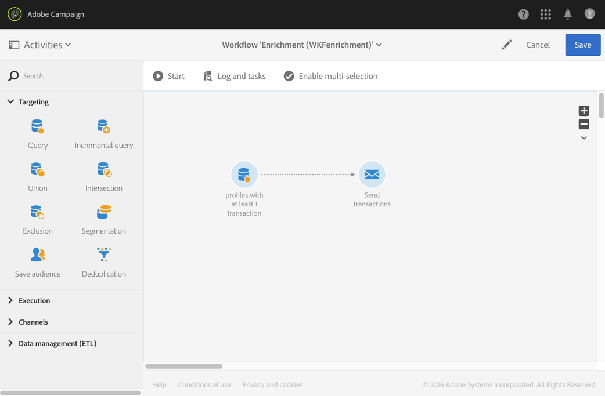
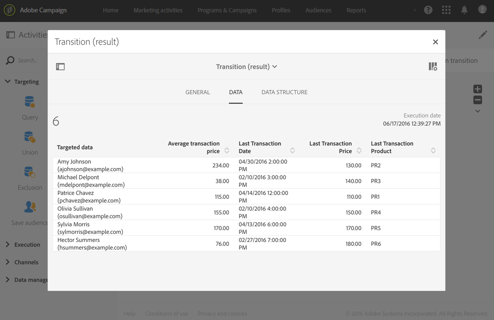

# Een e-mail personaliseren met aanvullende data {#example--personalizing-an-email-with-additional-data}

Het volgende voorbeeld toont hoe u verschillende typen aanvullende data toevoegt aan een query en hoe u deze data gebruikt voor een personalisatieveld in een e-mailbericht. Zie **[!UICONTROL Query]** deze sectie [voor meer informatie over het verrijken van de gegevens waarop een](../../automating/using/query.md#enriching-data)activiteit is gericht.

In dit voorbeeld worden [aangepaste bronnen](../../developing/using/data-model-concepts.md) gebruikt:

* De **profielbron** werd uitgebreid om een veld toe te voegen waarin de loyaliteitspunten van elk profiel kunnen worden opgeslagen.
* Er is een **transactiebron** gemaakt waarmee alle aankopen die door de profielen in de database zijn uitgevoerd, worden geïdentificeerd. De datum, de prijs en het gekochte product worden voor elke transactie opgeslagen.
* Er is een **productbron** gemaakt die verwijst naar de producten die kunnen worden gekocht.

We willen nu een e-mail sturen naar alle profielen waarvoor ten minste één transactie is opgeslagen. Via deze e-mail ontvangen de klanten een herinnering van de laatste uitgevoerde transactie en een overzicht van al hun transacties: het aantal gekochte producten, het uitgegeven totaalbedrag en het totale aantal loyaliteitspunten dat ze hebben opgebouwd.

De workflow wordt als volgt weergegeven:

1. Add a [Query](../../automating/using/query.md) activity, which allows you to target the profiles that have carried out at least one transaction.

   

1. Op het tabblad **[!UICONTROL Additional data]** van de query definieert u de verschillende data die in de uiteindelijke e-mail moeten komen:

   * Het eenvoudige veld van de **profieldimensie** die overeenkomt met de loyaliteitspunten. Raadpleeg de sectie [Een eenvoudig veld toevoegen](../../automating/using/query.md#adding-a-simple-field).
   * Twee aggregaten gebaseerd op de transactieverzameling: het aantal gekochte producten en het totale bestede bedrag. U kunt deze toevoegen vanaf het tabblad **[!UICONTROL Data]** van het samengevoegde configuratievenster. Gebruik de aggregaten **Count** en **Sum**. Raadpleeg de sectie [Een aggregaat toevoegen](../../automating/using/query.md#adding-an-aggregate).
   * Een verzameling waarmee het bestede bedrag, de datum en het product van de laatste uitgevoerde transactie wordt geretourneerd.

      Hiervoor moet u de verschillende velden toevoegen die u wilt weergeven op het tabblad **[!UICONTROL Data]** van het configuratievenster van de verzameling.

      Als u alleen de meest recente transactie wilt retourneren, moet u &quot;1&quot; voor **[!UICONTROL Number of lines to return]** invoeren en een aflopende sortering toepassen voor het veld **Date** van de verzameling. Hiervoor gebruikt u het tabblad **[!UICONTROL Sort]**.

      Raadpleeg de secties [Een verzameling toevoegen](../../automating/using/query.md#adding-a-collection) en [Aanvullende data sorteren](../../automating/using/query.md#sorting-additional-data).
   

1. Als u wilt controleren dat de data correct door de uitgaande overgang van de activiteit worden overgebracht, start u de workflow voor de eerste keer (zonder de activiteit **[!UICONTROL Email delivery]**) en opent u de uitgaande overgang van de query.

   

1. Voeg een [e-mailleveringsactiviteit](../../automating/using/email-delivery.md) toe. Voeg de personalisatievelden toe aan de e-mail die overeenkomen met de data die in de query zijn berekend. Deze zijn beschikbaar via de koppeling **[!UICONTROL Additional data (targetData)]** van de verkennertool voor personalisatievelden.

   

Uw workflow kan nu worden uitgevoerd. De profielen die in de query worden getarget, ontvangen een gepersonaliseerde e-mail met de data die van hun transacties zijn berekend.
