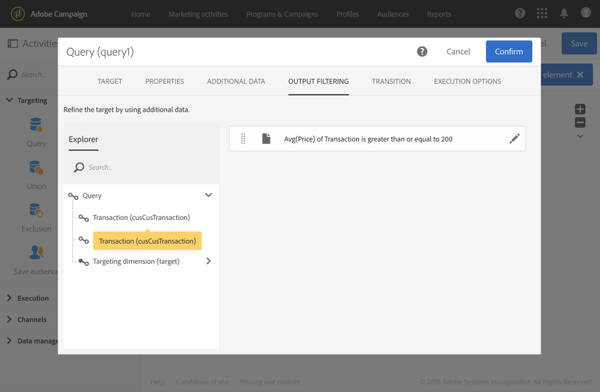

# Query{#query}

## Beschrijving {#description}

Met de activiteit **[!UICONTROL Query]** kunt u een populatie van elementen filteren en extraheren uit de Adobe Campaign-database. Via een toegewezen tabblad kunt u **[!UICONTROL Additional data]** voor de doelpopulatie definiëren. Deze data worden in extra kolommen opgeslagen en kunnen alleen worden gebruikt voor de actieve workflow.

Deze activiteit maakt gebruikt van de tool Query-editor. Deze tool wordt gedetailleerd beschreven in een [specifieke sectie](../../automating/using/editing-queries.md#about-query-editor).

**Verwante onderwerpen:**

* [Voorbeelden van query’s](../../automating/using/query-samples.md)
* [Gebruiksscenario: Retargeting van een workflow om een nieuwe levering te zenden naar personen die het bericht niet hebben geopend](../../automating/using/workflow-cross-channel-retargeting.md)

## Gebruikscontext {#context-of-use}

De activiteit **[!UICONTROL Query]** kan voor diverse doeleinden worden gebruikt:

* Individuele gebruikers segmenteren om het doel van een bericht, doelgroep, enz te bepalen.
* Data van de gehele Adobe Campaign-databasetabel verrijken.
* Data exporteren.

## Configuratie {#configuration}

1. Sleep een activiteit **[!UICONTROL Query]** en zet deze neer in uw workflow.
1. Selecteer de activiteit en open deze met de knop  vanuit de snelle acties die verschijnen. Standaard is de activiteit vooraf geconfigureerd om te zoeken naar profielen.
1. Als u een query wilt uitvoeren op een andere bron dan een profielbron, gaat u naar het tabblad **[!UICONTROL Properties]** van de activiteit en selecteert u een **[!UICONTROL Resource]** en een **[!UICONTROL Targeting dimension]**.

   Met de optie **[!UICONTROL Resource]** kunt u de filters verfijnen die in het palet worden weergegeven, terwijl de optie **[!UICONTROL Targeting dimension]** (binnen de context van de geselecteerde bron) overeenkomt met het type populatie dat u wilt verkrijgen (geïdentificeerde profielen, leveringen, data die zijn gekoppeld aan de geselecteerde bron, enz.).

   Raadpleeg [Doeldimensies en bronnen](#targeting-dimensions-and-resources) voor meer informatie hierover.

1. Voer op het tabblad **[!UICONTROL Target]** uw query uit door regels te definiëren en te combineren.
1. Via een toegewezen tabblad kunt u **[!UICONTROL Additional data]** voor de doelpopulatie definiëren. Deze data worden in extra kolommen opgeslagen en kunnen alleen worden gebruikt voor de actieve workflow. U kunt met name data toevoegen uit de Adobe Campaign-databasetabellen die zijn gekoppeld aan de doeldimensie van de query. Raadpleeg de sectie [Data verrijken](#enriching-data).

   >[!NOTE]
   >
   >Standaard is de optie **[!UICONTROL Remove duplicate rows (DISTINCT)]** ingeschakeld op het tabblad **[!UICONTROL Advanced options]** van de **[!UICONTROL Additional data]** query. Als de activiteit **[!UICONTROL Query]** veel (vanaf 100) extra gedefinieerde data bevat, kunt u deze optie het beste uitschakelen omdat anders het systeem erg traag kan worden. Houd er rekening mee dat u door deze optie uit te schakelen, mogelijk ook duplicaten ophaalt. Dit is afhankelijk van de data in de query.

1. Op het tabblad **[!UICONTROL Transition]** kunt u met de optie **[!UICONTROL Enable an outbound transition]** een uitgaande overgang toevoegen na de queryactiviteit, zelfs als hierbij geen data worden opgehaald.

   The outbound transition&#39;s segment code can be personalized using a standard expression and events variables (see [this page](../../automating/using/customizing-workflow-external-parameters.md)).

1. Bevestig de configuratie van uw activiteit en sla de workflow op.

## Targetingdimensies en bronnen {#targeting-dimensions-and-resources}

Met targetingdimensies en bronnen definieert u de elementen waarop een query wordt gebaseerd om de target van een levering te bepalen.

Zij worden gevormd in [doelafbeeldingen](../../administration/using/target-mappings-in-campaign.md), en worden bepaald wanneer het creëren van een werkschema, op het **[!UICONTROL Properties]** lusje van een activiteit van de Vraag.

>[!NOTE]
>
>De targetingdimensie kan ook worden gedefinieerd wanneer de doelgroep wordt gemaakt (zie [deze sectie](../../audiences/using/creating-audiences.md)).

Targetingdimensies en bronnen zijn gekoppeld. De beschikbare targetingdimensies zijn daarom afhankelijk van de geselecteerde bron.

Zo zijn de volgende targetingdimensies beschikbaar voor de bron **[!UICONTROL Profiles (profile)]**:

Bij **[!UICONTROL Deliveries (delivery)]** bevat de lijst echter de volgende targetingdimensies:

Zodra de targetingdimensie en bron zijn gespecificeerd, beschikt de query over een aantal verschillende filters.

Voorbeeld van beschikbare filters voor de bron **[!UICONTROL Profiles (profile)]**:

Voorbeeld van beschikbare filters voor de bron **[!UICONTROL Deliveries (delivery)]**:

Standaard worden de targetingdimensie en bron ingesteld om profielen te targetten. Maar soms is het handig om een andere bron te gebruiken dan de targetingdimensie als u wilt zoeken naar een specifieke record in een verafgelegen tabel.

Raadpleeg het volgende gebruiksgeval voor meer informatie: [Bronnen gebruiken die verschillen van doelgerichte dimensies](../../automating/using/using-resources-different-from-targeting-dimensions.md)

## Data verrijken {#enriching-data}

Op het tabblad **[!UICONTROL Additional data]** van de activiteiten **[!UICONTROL Query]**, **[!UICONTROL Incremental query]** en **[!UICONTROL Enrichment]** kunt u de getargete data verrijken en voor gebruik overdragen naar de volgende workflowactiviteiten. U kunt met name het volgende toevoegen:

* Eenvoudige data
* Aggregaten
* Verzamelingen

Bij aggregaten en verzamelingen wordt automatisch een **[!UICONTROL Alias]** gedefinieerd om een technische id toe te kennen aan een complexe expressie. Met deze alias, die uniek moet zijn, kunnen de aggregaten en verzamelingen gemakkelijk achteraf worden gevonden. U kunt de naam veranderen in een naam die gemakkelijk te herkennen is.

>[!NOTE]
>
>De aliassen moeten de volgende syntaxisregels in acht nemen: alleen alfanumerieke tekens en de tekens &quot;_&quot; zijn toegestaan. De aliassen zijn hoofdlettergevoelig. De alias moet beginnen met het teken &quot;@&quot;. Het teken dat onmiddellijk volgt op &quot;@&quot; mag niet numeriek zijn. Bijvoorbeeld: @mijnAlias_1 en @_1Alias zijn correct; maar @mijnAlias#1 en @1Alias zijn onjuist.

Nadat u aanvullende data hebt toegevoegd, kunt u een extra filterniveau toepassen op de oorspronkelijk getargete data door voorwaarden in te stellen op basis van de aanvullende gedefinieerde data.

>[!NOTE]
>
>Standaard is de optie **[!UICONTROL Remove duplicate rows (DISTINCT)]** ingeschakeld op het tabblad **[!UICONTROL Advanced options]** van de **[!UICONTROL Additional data]** query. Als de activiteit **[!UICONTROL Query]** veel (vanaf 100) extra gedefinieerde data bevat, kunt u deze optie het beste uitschakelen omdat anders het systeem erg traag kan worden. Houd er rekening mee dat u door deze optie uit te schakelen, mogelijk ook duplicaten ophaalt. Dit is afhankelijk van de data in de query.

In [deze sectie](../../automating/using/personalizing-email-with-additional-data.md)wordt een gebruiksscenario weergegeven voor het aanpassen van e-mails met aanvullende gegevens.

### Een eenvoudig veld toevoegen {#adding-a-simple-field}

Door een eenvoudig veld toe te voegen als aanvullende data, wordt dat veld direct zichtbaar in de uitgaande overgang van de activiteit. Hierdoor kan de gebruiker bijvoorbeeld controleren of de data in de query inderdaad ook de gewenste data zijn.

1. Voeg een nieuw element toe op het tabblad **[!UICONTROL Additional data]**.
1. Ga naar het veld **[!UICONTROL Expression]** in het venster dat wordt geopend en selecteer een van de velden die rechtstreeks beschikbaar zijn in de targetingdimensie of in een van de gekoppelde dimensies. U kunt expressies bewerken en functies of eenvoudige berekeningen (behalve aggregaten) toepassen vanuit de dimensievelden.

   Er wordt automatisch een **[!UICONTROL Alias]** gemaakt als u een expressie bewerkt die geen eenvoudig XPATH-pad is (bijvoorbeeld: &quot;Year(&lt;@birthDate>)&quot;). U kunt dit desgewenst wijzigen. Als u slechts één veld selecteert (bijvoorbeeld: &quot;@age&quot;), hoeft u geen definitie op te geven voor een **[!UICONTROL Alias]**.

1. Selecteer **[!UICONTROL Add]** om te bevestigen dat het veld wordt toegevoegd aan de aanvullende data. Wanneer de query wordt uitgevoerd, is er een extra kolom in de uitgaande overgang van de activiteit. Deze kolom komt overeen met het toegevoegde veld.

### Een aggregaat toevoegen {#adding-an-aggregate}

Met aggregaten kunt u waarden berekenen op basis van de velden van de targetingdimensie, of op basis van de velden van dimensies die zijn gekoppeld aan de targetingdimensie. Bijvoorbeeld: het gemiddelde bedrag dat door een profiel wordt aangekocht.
Als u een aggregaat toepast bij een query, kan de functie een nulwaarde retourneren. Deze waarde wordt als NULL beschouwd. Gebruik het tabblad **[!UICONTROL Output filtering]** van uw query om de aggregaatwaarde te filteren:

* Als u nulwaarden wilt gebruiken, moet u filteren op **[!UICONTROL is null]**.
* Als u geen nulwaarden wilt, filtert u op **[!UICONTROL is not null]**.

Merk op: als u sortering op het aggregaat moet toepassen, moet u nulwaarden wegfilteren. Anders wordt de waarde NULL weergegeven als het grootste getal.

1. Voeg een nieuw element toe op het tabblad **[!UICONTROL Additional data]**.
1. In het venster dat wordt geopend selecteert u in het veld **[!UICONTROL Expression]** de verzameling waarmee u het aggregaat wilt maken.

   Er wordt automatisch een **[!UICONTROL Alias]** gemaakt. Als u wilt, kunt u dit wijzigen door terug te gaan naar het tabblad **[!UICONTROL Additional data]** van de query.

   Het venster voor de samengevoegde definitie wordt geopend.

1. Definieer een aggregaat op het tabblad **[!UICONTROL Data]**. Afhankelijk van het geselecteerde type aggregaat, zijn alleen elementen met compatibele data beschikbaar in het veld **[!UICONTROL Expression]**. Een som kan bijvoorbeeld alleen met numerieke data worden berekend.

   

   U kunt verschillende aggregaten toevoegen voor de velden van de geselecteerde verzameling. Zorg ervoor dat u expliciete labels definieert om de verschillende kolommen in de details van de uitgaande data van de activiteit te onderscheiden.

   U kunt ook de aliassen wijzigen die automatisch voor elk aggregaat worden gedefinieerd.

   

1. Indien nodig kunt u een filter toevoegen om de data waarmee u rekening wilt houden te beperken.

   Raadpleeg de sectie [Toegevoegde data filteren](#filtering-added-data).

1. Selecteer **[!UICONTROL Confirm]** om aggregaten toe te voegen.

>[!NOTE]
>
>U kunt geen expressie maken die een aggregaat bevat dat rechtstreeks uit het veld **[!UICONTROL Expression]** van het venster **[!UICONTROL New additional data]** komt.

### Een verzameling toevoegen {#adding-a-collection}

1. Voeg een nieuw element toe op het tabblad **[!UICONTROL Additional data]**.
1. In het venster dat wordt geopend selecteert u in het veld **[!UICONTROL Expression]** de verzameling die u wilt toevoegen. Er wordt automatisch een **[!UICONTROL Alias]** gemaakt. Als u wilt, kunt u dit wijzigen door terug te gaan naar het tabblad **[!UICONTROL Additional data]** van de query.
1. Selecteer **[!UICONTROL Add]**. Er wordt een nieuw venster geopend waarin u de verzamelingsdata die u wilt weergeven kunt verfijnen.
1. Op het tabblad **[!UICONTROL Parameters]** selecteert u **[!UICONTROL Collection]**. Definieer vervolgens het aantal regels van de verzameling dat u wilt toevoegen. Als u bijvoorbeeld de drie meest recente aankopen van elk profiel wilt ophalen, typt u &quot;3&quot; in het veld **[!UICONTROL Number of lines to return]**.

   >[!NOTE]
   >
   >U moet een getal invoeren dat groter is dan of gelijk is aan 1.

1. Op het tabblad **[!UICONTROL Data]** definieert u de velden van de verzameling die u voor elke regel wilt weergeven.

   

1. U kunt desgewenst een filter toevoegen om het aantal verzamelingsregels waarmee u rekening wilt houden te beperken.

   Raadpleeg de sectie [Toegevoegde data filteren](#filtering-added-data).

1. Als u wilt kunt u een datasortering definiëren.

   Als u bijvoorbeeld 3 regels hebt geselecteerd die u wilt retourneren op het tabblad **[!UICONTROL Parameters]** en u wilt de drie meest recente aankopen bepalen, dan kunt u een aflopende sortering definiëren in het datumveld van de verzameling die overeenkomt met de transacties.

1. Raadpleeg de sectie [Aanvullende data sorteren](#sorting-additional-data).
1. Selecteer **[!UICONTROL Confirm]** om de verzameling toe te voegen.

### Toegevoegde data filteren {#filtering-added-data}

Wanneer u een aggregaat of verzameling toevoegt, kunt u een extra filter opgeven om het aantal data te beperken dat u wilt weergeven.

Als u bijvoorbeeld alleen de verzamelingsregels van transacties met bedragen van 50 dollar en hoger wilt verwerken, dan kunt u vanaf het tabblad **[!UICONTROL Filter]** een voorwaarde aan het veld toevoegen die overeenkomt met het transactiebedrag.

### Aanvullende data sorteren {#sorting-additional-data}

Wanneer u een aggregaat of verzameling toevoegt aan de data van een query, kunt u opgeven of u een sortering wilt toepassen (oplopend of aflopend). Dit kan op basis van de waarde van het veld of de gedefinieerde expressie.

Als u bijvoorbeeld alleen de transactie wilt opslaan die het laatst door een profiel is uitgevoerd, typt u &quot;1&quot; in het veld **[!UICONTROL Number of lines to return]** van het tabblad **[!UICONTROL Parameters]**. Via het tabblad **[!UICONTROL Sort]** past u vervolgens een aflopende sortering toe op het veld dat overeenkomt met de transactiedatum.

### De getargete data filteren op basis van aanvullende data {#filtering-the-targeted-data-according-to-additional-data}

Als u eenmaal aanvullende data hebt toegevoegd, wordt een nieuw tabblad **[!UICONTROL Output filtering]** weergegeven in **[!UICONTROL Query]**. Op dit tabblad kunt u een extra filter toepassen op de data die oorspronkelijk zijn getarget op het tabblad **[!UICONTROL Target]** door de toegevoegde data erbij te betrekken.

Als u bijvoorbeeld alle profielen hebt getarget die ten minste één transactie hebben uitgevoerd en een aggregaat aan **[!UICONTROL Additional data]** is toegevoegd, waarmee het gemiddelde transactiebedrag voor elk profiel wordt berekend, dan kunt u de oorspronkelijk berekende populatie verfijnen met behulp van dit gemiddelde. 

Hiervoor hoeft u op het tabblad **[!UICONTROL Output filtering]** alleen maar een voorwaarde toe te voegen voor deze aanvullende data.

