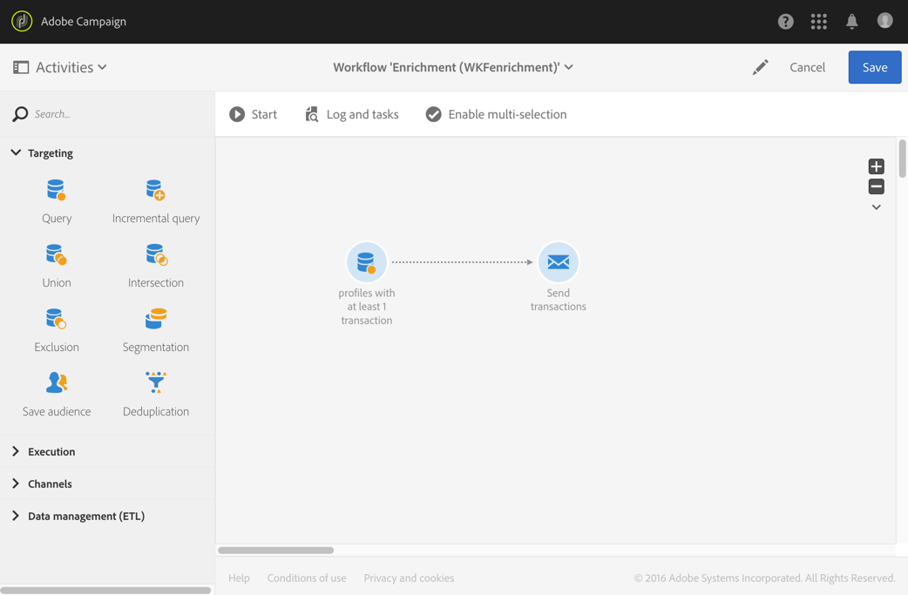
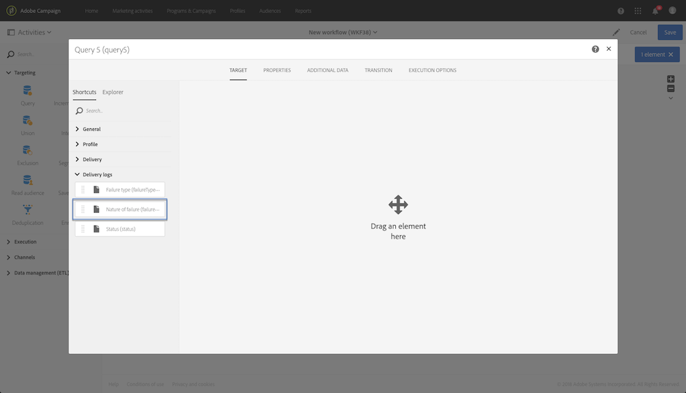

# Query{#query}

## Beschrijving {#description}

Met deze **[!UICONTROL Query]** activiteit kunt u een aantal elementen filteren en extraheren uit de Adobe Campagne-database. U kunt **[!UICONTROL Additional data]** voor de doelpopulatie definiëren via een toegewezen tabblad. Deze gegevens worden opgeslagen in extra kolommen en kunnen alleen worden gebruikt voor de actieve workflow.

De activiteit gebruikt het hulpmiddel van de vraagredacteur. Dit hulpmiddel wordt gedetailleerd in een [specifieke sectie](../../automating/using/editing-queries.md#about-query-editor).

## Gebruikscontext {#context-of-use}

De **[!UICONTROL Query]** activiteit kan voor diverse soorten gebruik worden gebruikt:

* Individuen segmenteren om het doel van een bericht, publiek, enz. te bepalen.
* Verrijkende gegevens van de gehele Adobe Campagne-databasetabel.
* Gegevens exporteren.

## Configuratie {#configuration}

1. Sleep een **[!UICONTROL Query]** activiteit naar uw werkstroom.
1. Selecteer de activiteit, dan open het gebruikend de  knoop van de snelle acties die verschijnen. Standaard is de activiteit vooraf geconfigureerd voor het zoeken naar profielen.
1. Als u een vraag op een middel buiten het profielmiddel zou willen in werking stellen, ga naar het **[!UICONTROL Properties]** lusje van de activiteit en selecteer **[!UICONTROL Resource]** en **[!UICONTROL Targeting dimension]**.

   Met de optie **[!UICONTROL Resource]** kunt u de filters verfijnen die in het palet worden weergegeven, terwijl de **[!UICONTROL Targeting dimension]** context met betrekking tot de geselecteerde bron overeenkomt met het type populatie dat u wilt verkrijgen (geïdentificeerde profielen, leveringen, gegevens die zijn gekoppeld aan de geselecteerde bron, enz.).

   Raadpleeg [Doeldimensies en bronnen](#targeting-dimensions-and-resources)voor meer informatie hierover.

1. Voer op het **[!UICONTROL Target]** tabblad uw query uit door regels te definiëren en te combineren.
1. U kunt **[!UICONTROL Additional data]** voor de doelpopulatie definiëren via een toegewezen tabblad. Deze gegevens worden opgeslagen in extra kolommen en kunnen alleen worden gebruikt voor de actieve workflow. Met name kunt u gegevens uit de Adobe Campagne-databasetabellen toevoegen die zijn gekoppeld aan de doeldimensie van de query. Raadpleeg de sectie [Verrijkende gegevens](#enriching-data) .

   >[!NOTE]
   >
   >Standaard is de **[!UICONTROL Remove duplicate rows (DISTINCT)]** optie ingeschakeld op het tabblad **[!UICONTROL Advanced options]** van de **[!UICONTROL Additional data]** query. Als de **[!UICONTROL Query]** activiteit vele (van 100) bepaalde extra gegevens bevat, wordt geadviseerd om deze optie, om prestatiesredenen uit te schakelen. Houd er rekening mee dat het uitschakelen van deze optie kan leiden tot het ophalen van duplicaten, afhankelijk van de gevraagde gegevens.

1. Op het **[!UICONTROL Transition]** lusje, laat de **[!UICONTROL Enable an outbound transition]** optie u een uitgaande overgang na de vraagactiviteit toevoegen, zelfs als het geen gegevens terugwint.

   De het segmentcode van de uitgaande overgang kan worden gepersonaliseerd gebruikend een standaarduitdrukking en gebeurtenisvariabelen (zie [het Aanpassen van activiteiten met gebeurtenisvariabelen](../../automating/using/calling-a-workflow-with-external-parameters.md#customizing-activities-with-events-variables)).

1. Bevestig de configuratie van uw activiteit en sla uw werkschema op.

## Doeldimensies en bronnen {#targeting-dimensions-and-resources}

Het richten dimensies en middelen laten u bepalen op welke elementen een vraag zal worden gebaseerd om het doel van een levering te bepalen.

Doelafmetingen worden gedefinieerd in doeltoewijzingen. For more on this, refer to [this section](../../administration/using/target-mappings-in-campaign.md).

### Het bepalen van het richten dimensie en middel van een vraag {#defining-the-targeting-dimension-and-resource-of-a-query}

De gerichte dimensie en de middelen worden bepaald wanneer het creëren van een werkschema, op het **[!UICONTROL Properties]** lusje van een activiteit van de Vraag.

>[!NOTE]
>
>De doeldimensie kan ook worden gedefinieerd bij het maken van een publiek (zie [deze sectie](../../audiences/using/creating-audiences.md)).

Doeldimensies en bronnen zijn gekoppeld. De beschikbare doeldimensies zijn daarom afhankelijk van de geselecteerde bron.

Bijvoorbeeld, voor het Middel **[!UICONTROL Profiles (profile)]**, zullen de volgende het richten dimensies beschikbaar zijn:

De lijst bevat de volgende doelafmetingen voor **[!UICONTROL Deliveries (delivery)]** de bewerking while:

Zodra het richten afmeting en middel worden gespecificeerd, zijn de verschillende filters beschikbaar in de vraag.

Voorbeeld van beschikbare filters voor de **[!UICONTROL Profiles (profile)]** bron:

Voorbeeld van beschikbare filters voor de **[!UICONTROL Deliveries (delivery)]** bron:

### Bronnen gebruiken die verschillen van doelgerichte dimensies {#using-resources-different-from-targeting-dimensions}

Standaard worden de doeldimensie en -bron ingesteld op doelprofielen.

Het kan echter handig zijn om een andere bron te gebruiken dan de doeldimensie als u wilt zoeken naar een specifieke record in een verafgelegen tabel.

**Voorbeeld 1: het identificeren van profielen die door de levering met het etiket worden gericht &quot;Welkom terug!&quot;**.

* In dit geval willen we profielen als doel instellen. We zullen de doelgerichtheid bepalen op **[!UICONTROL Profiles (profile)]**.
* We willen de geselecteerde profielen filteren op basis van het leveringslabel. We zullen de middelen dus op **[!UICONTROL Delivery logs]** zetten. Op deze manier filteren we rechtstreeks in de tabel van het leveringslogboek, wat betere prestaties biedt.

**Voorbeeld 2: het identificeren van profielen die niet door de levering met het etiket &quot;Welkom terug!&quot;werden gericht**

In het vorige voorbeeld hebben we een andere bron gebruikt dan de doeldimensie. Deze bewerking is alleen mogelijk als u een record wilt zoeken die aanwezig **** is in de verafgelegen tabel (in ons voorbeeld voor leveringslogboeken).

Als wij een verslag willen vinden dat niet aanwezig **in de verre lijst (bijvoorbeeld, profielen die niet door een specifieke levering werden gericht)** is, moet u het zelfde middel en het richten dimensie gebruiken, aangezien het verslag niet in de verre lijst (leveringslogboeken) aanwezig zal zijn.

* In dit geval willen we profielen als doel instellen. We zullen de doelgerichtheid bepalen op **[!UICONTROL Profiles (profile)]**.
* We willen de geselecteerde profielen filteren op basis van het leveringslabel. Het is niet mogelijk om direct op leveringslogboeken te filtreren aangezien wij naar een verslag niet aanwezig in de lijst van leveringslogboeken zoeken. Daarom zullen wij het middel aan plaatsen **[!UICONTROL Profile (profile)]** en onze vraag op de profielenlijst bouwen.

## Gegevens worden verrijkt {#enriching-data}

Op het **[!UICONTROL Additional data]** tabblad **[!UICONTROL Query]** en **[!UICONTROL Incremental query]** **[!UICONTROL Enrichment]** activiteiten kunt u de beoogde gegevens verrijken en deze gegevens overdragen naar de volgende workflowactiviteiten, waar ze kunnen worden gebruikt. U kunt met name het volgende toevoegen:

* Eenvoudige gegevens
* Aggregaten
* Verzamelingen

Voor aggregaten en verzamelingen **[!UICONTROL Alias]** wordt automatisch een technische id aan een complexe expressie toegewezen. Met deze alias, die uniek moet zijn, kunnen de aggregaten en verzamelingen achteraf gemakkelijk worden gevonden. U kunt de naam wijzigen en deze een gemakkelijk herkenbare naam geven.

>[!NOTE]
>
>De aliassen moeten de volgende syntaxisregels in acht nemen: Alleen alfanumerieke tekens en de tekens &quot;_&quot; zijn toegestaan. De aliassen zijn hoofdlettergevoelig. De alias moet beginnen met het teken &quot;@&quot;. Het teken dat onmiddellijk volgt op de &#39;@&#39; mag niet numeriek zijn. Bijvoorbeeld: @myAlias_1 en @_1Alias zijn correct; overwegende dat @myAlias#1 en @1Alias onjuist zijn.

Nadat u aanvullende gegevens hebt toegevoegd, kunt u een extra filterniveau toepassen op de gegevens waarop u oorspronkelijk bent gericht door voorwaarden te maken op basis van de aanvullende gedefinieerde gegevens.

>[!NOTE]
>
>Standaard is de **[!UICONTROL Remove duplicate rows (DISTINCT)]** optie ingeschakeld op het tabblad **[!UICONTROL Advanced options]** van de **[!UICONTROL Additional data]** query. Als de **[!UICONTROL Query]** activiteit vele (van 100) bepaalde extra gegevens bevat, wordt geadviseerd om deze optie, om prestatiesredenen uit te schakelen. Houd er rekening mee dat het uitschakelen van deze optie kan leiden tot het ophalen van duplicaten, afhankelijk van de gevraagde gegevens.

### Een eenvoudig veld toevoegen {#adding-a-simple-field}

Door een eenvoudig veld als aanvullende gegevens toe te voegen, wordt dat veld direct zichtbaar in de uitgaande overgang van de activiteit. Hierdoor kan de gebruiker bijvoorbeeld controleren of de gegevens van de query de gewenste gegevens zijn.

1. Voeg op het **[!UICONTROL Additional data]** tabblad een nieuw element toe.
1. Selecteer in het venster dat wordt geopend in het **[!UICONTROL Expression]** veld een van de velden die rechtstreeks beschikbaar zijn in de doeldimensie of in een van de gekoppelde afmetingen. U kunt expressies bewerken en functies of eenvoudige berekeningen (behalve aggregaten) gebruiken vanuit de dimensievelden.

   Er **[!UICONTROL Alias]** wordt automatisch een expressie gemaakt als u een expressie bewerkt die geen eenvoudig XPATH-pad is (bijvoorbeeld: &quot;Year(&lt;@geboorteDate>)&quot;). U kunt het desgewenst wijzigen. Als u slechts één veld selecteert (bijvoorbeeld: &quot;@age&quot;), hoeft u geen definitie van een **[!UICONTROL Alias]** waarde op te geven.

1. Selecteer deze optie **[!UICONTROL Add]** om te bevestigen dat het veld wordt toegevoegd aan de aanvullende gegevens. Wanneer de vraag wordt uitgevoerd, zal een extra kolom die aan het toegevoegde gebied beantwoordt in de uitgaande overgang van de activiteit aanwezig zijn.

### Een aggregaat toevoegen {#adding-an-aggregate}

Met aggregaten kunnen waarden worden berekend op basis van velden van de doeldimensie of op basis van velden van dimensies die verband houden met de doeldimensie. Bijvoorbeeld: het gemiddelde bedrag dat door een profiel wordt aangekocht.
Wanneer het gebruiken van aggregaat met vraag, kan zijn functie aan nul terugkeren die dan als ONGELDIG wordt beschouwd. Gebruik het **[!UICONTROL Output filtering]** lusje van uw vraag om de bijeengevoegde waarde te filtreren:

* Als u nulwaarden wilt gebruiken, moet u hierop filteren **[!UICONTROL is null]**.
* Als u geen nulwaarden wilt inschakelen **[!UICONTROL is not null]**.

Als u sortering op het aggregaat moet toepassen, moet u nul-waarden wegfilteren. Anders wordt de waarde NULL weergegeven als het grootste getal.

1. Voeg op het **[!UICONTROL Additional data]** tabblad een nieuw element toe.
1. Selecteer in het venster dat wordt geopend de verzameling die u wilt gebruiken om uw aggregaat in het **[!UICONTROL Expression]** veld te maken.

   Er **[!UICONTROL Alias]** wordt automatisch een koppeling gemaakt. Als u wilt, kunt u het wijzigen door terug naar het **[!UICONTROL Additional data]** lusje van de vraag te gaan.

   Het venster voor geaggregeerde definitie wordt geopend.

1. Definieer een aggregaat op het **[!UICONTROL Data]** tabblad. Afhankelijk van het geselecteerde type aggregaat zijn alleen de elementen waarvan de gegevens compatibel zijn, beschikbaar in het **[!UICONTROL Expression]** veld. Een som kan bijvoorbeeld alleen met numerieke gegevens worden berekend.

   

   U kunt verschillende aggregaten toevoegen voor de velden van de geselecteerde verzameling. Zorg ervoor om expliciete etiketten te bepalen om de verschillende kolommen in het detail van de uitgaande gegevens van de activiteit te onderscheiden.

   U kunt ook de aliassen wijzigen die automatisch voor elk aggregaat worden gedefinieerd.

   

1. Indien nodig kunt u een filter toevoegen om de gegevens te beperken waarmee u rekening houdt.

   Raadpleeg de sectie [Toegevoegde gegevens](#filtering-added-data) filteren.

1. Selecteer **[!UICONTROL Confirm]** om aggregaten toe te voegen.

>[!NOTE]
>
>U kunt geen expressie maken die een aggregaat rechtstreeks vanuit het **[!UICONTROL Expression]** veld van het **[!UICONTROL New additional data]** venster bevat.

### Een verzameling toevoegen {#adding-a-collection}

1. Voeg op het **[!UICONTROL Additional data]** tabblad een nieuw element toe.
1. Selecteer in het venster dat wordt geopend de verzameling die u in het **[!UICONTROL Expression]** veld wilt toevoegen. Er **[!UICONTROL Alias]** wordt automatisch een koppeling gemaakt. Als u wilt, kunt u het wijzigen door terug naar het **[!UICONTROL Additional data]** lusje van de vraag te gaan.
1. Selecteer **[!UICONTROL Add]**. Er wordt een nieuw venster geopend waarin u de verzamelingsgegevens die u wilt weergeven, kunt verfijnen.
1. Selecteer op het **[!UICONTROL Parameters]** tabblad het aantal regels van de verzameling dat u wilt toevoegen **[!UICONTROL Collection]** en definieer dit aantal. Als u bijvoorbeeld wilt dat de drie meest recente aankopen door elk profiel worden uitgevoerd, typt u &quot;3&quot; in het **[!UICONTROL Number of lines to return]** veld.

   >[!NOTE]
   >
   >U moet een getal invoeren dat groter is dan of gelijk is aan 1.

1. Definieer op het **[!UICONTROL Data]** tabblad de velden van de verzameling die u voor elke regel wilt weergeven.

   

1. U kunt desgewenst een filter toevoegen om de in aanmerking genomen verzamelingslijnen te beperken.

   Raadpleeg de sectie [Toegevoegde gegevens](#filtering-added-data) filteren.

1. U kunt desgewenst een gegevenssortering definiëren.

   Als u bijvoorbeeld 3 regels hebt geselecteerd die u wilt retourneren op het **[!UICONTROL Parameters]** tabblad en u de drie meest recente aankopen wilt bepalen, kunt u een aflopende sortering definiëren in het veld &quot;datum&quot; van de verzameling die overeenkomt met de transacties.

1. Raadpleeg de sectie [Sorteren van aanvullende gegevens](#sorting-additional-data) .
1. Selecteer **[!UICONTROL Confirm]** om de verzameling toe te voegen.

### Toegevoegde gegevens filteren {#filtering-added-data}

Wanneer u een aggregaat of een verzameling toevoegt, kunt u een extra filter opgeven om de gegevens te beperken die u wilt weergeven.

Als u bijvoorbeeld alleen de verzamelingslijnen van transacties met bedragen van 50 dollar en hoger wilt verwerken, kunt u vanuit het **[!UICONTROL Filter]** tabblad een voorwaarde toevoegen aan het veld die overeenkomt met het transactiebedrag.

### Extra gegevens sorteren {#sorting-additional-data}

Wanneer u een aggregaat of een verzameling toevoegt aan de gegevens van een query, kunt u opgeven of u een sortering wilt toepassen (oplopend of aflopend) op basis van de waarde van het veld of de gedefinieerde expressie.

Als u bijvoorbeeld alleen de transactie wilt opslaan die het laatst door een profiel is uitgevoerd, typt u &quot;1&quot; in het **[!UICONTROL Number of lines to return]** veld van het **[!UICONTROL Parameters]** tabblad en past u een aflopende sortering toe op het veld dat overeenkomt met de transactiedatum via het **[!UICONTROL Sort]** tabblad.

### De doelgegevens filteren op basis van aanvullende gegevens {#filtering-the-targeted-data-according-to-additional-data}

Nadat u aanvullende gegevens hebt toegevoegd, wordt een nieuw **[!UICONTROL Output filtering]** tabblad weergegeven in het **[!UICONTROL Query]** dialoogvenster. Op dit tabblad kunt u een extra filter toepassen op de gegevens waarop het **[!UICONTROL Target]** tabblad aanvankelijk is gericht, door rekening te houden met de toegevoegde gegevens.

Als u bijvoorbeeld alle profielen hebt geselecteerd die ten minste één transactie hebben uitgevoerd en als een aggregaat dat het gemiddelde transactiebedrag voor elk profiel berekent, aan het profiel is toegevoegd, kunt u de oorspronkelijk berekende populatie verfijnen met behulp van dit gemiddelde. **[!UICONTROL Additional data]**

Hiervoor voegt u op het **[!UICONTROL Output filtering]** tabblad een voorwaarde toe aan deze aanvullende gegevens.

### Voorbeeld: aanpassen van een e-mail met extra gegevens {#example--personalizing-an-email-with-additional-data}

In het volgende voorbeeld ziet u hoe u verschillende typen aanvullende gegevens toevoegt aan een query en hoe u deze gebruikt als een verpersoonlijkingsveld in een e-mailbericht.

In dit voorbeeld worden [aangepaste bronnen](../../developing/using/data-model-concepts.md) gebruikt:

* Het **profielmiddel** werd uitgebreid om een gebied toe te voegen dat de loyaliteitspunten van elk profiel om toelaat worden bewaard.
* Er is een **bron voor transacties** gemaakt en alle aankopen die door de profielen in de database worden uitgevoerd, worden geïdentificeerd. De datum, de prijs en het gekochte product worden voor elke transactie opgeslagen.
* Er is een **productbron** gemaakt en er wordt verwezen naar de producten die u kunt kopen.

Het doel is een e-mail te verzenden naar de profielen waarvoor ten minste één transactie is opgeslagen. Via deze e-mail ontvangen de klanten een herinnering aan de laatste uitgevoerde transactie en een overzicht van al hun transacties: het aantal aangekochte producten, het totale aantal uitgegeven producten, een herinnering aan het totale aantal loyaliteitspunten dat zij hebben opgebouwd.

De workflow wordt als volgt weergegeven:

1. Voeg een **[!UICONTROL Query]** activiteit toe, die u toestaat om de profielen te richten die minstens één transactie hebben uitgevoerd.

   

   Definieer op het **[!UICONTROL Additional data]** tabblad van de query de verschillende gegevens die in de laatste e-mail moeten worden weergegeven:

   * Het eenvoudige gebied van de **profieldimensie** die aan de loyaliteitspunten beantwoordt. Raadpleeg de sectie Een eenvoudig veld  toevoegen.
   * Twee aggregaten gebaseerd op de transactieverzameling: het aantal aangekochte producten en het totale bestede bedrag. U kunt ze toevoegen vanaf het **[!UICONTROL Data]** tabblad van het geaggregeerde configuratievenster met behulp van de aggregaten **Aantal** en **Som** . Raadpleeg het gedeelte [Een aggregaat](#adding-an-aggregate) toevoegen.
   * Een inning die het bestede bedrag, de datum, en het product van de laatste uitgevoerde transactie terugkeert.

      Hiervoor moet u de verschillende velden toevoegen die u wilt weergeven op het **[!UICONTROL Data]** tabblad van het verzamelingsconfiguratievenster.

      Als u alleen de meest recente transactie wilt retourneren, moet u &quot;1&quot; voor de verzameling invoeren **[!UICONTROL Number of lines to return]** en een aflopende sortering toepassen in het veld **Datum** van de verzameling op het **[!UICONTROL Sort]** tabblad.

      Raadpleeg de secties [Een verzameling](#adding-a-collection) toevoegen en [Extra gegevens](#sorting-additional-data) sorteren.
   

   Als u zou willen controleren dat de gegevens correct door de uitgaande overgang van de activiteit worden overgebracht, begin het werkschema voor het eerst (zonder de **[!UICONTROL Email delivery]** activiteit) en open de uitgaande overgang van de vraag.

   

1. Voeg een **[!UICONTROL Email delivery]** activiteit toe. Voeg in de e-mailinhoud de personalisatievelden in die overeenkomen met de gegevens die in de query zijn berekend. U kunt het vinden via de **[!UICONTROL Additional data (targetData)]** verbinding van de verpersoonlijkingsgebiedsverkenner.

   

Uw workflow kan nu worden uitgevoerd. De profielen die in de vraag worden bedoeld zullen een gepersonaliseerde e-mail ontvangen die de gegevens bevat die van hun transacties worden berekend.

## Zoekvoorbeelden {#query-samples}

### Toewijzen aan eenvoudige profielkenmerken {#targeting-on-simple-profile-attributes}

Het volgende voorbeeld toont een vraagactiviteit die wordt gevormd om mannen tussen 18 en 30 jaar te richten, woonend in Londen.

### Gericht op e-mailkenmerken {#targeting-on-email-attributes}

In het volgende voorbeeld ziet u een queryactiviteit die is geconfigureerd voor doelprofielen met het e-mailadresdomein &quot;orange.co.uk&quot;.

In het volgende voorbeeld ziet u een queryactiviteit die is geconfigureerd voor doelprofielen waarvan het e-mailadres is opgegeven.

### Doelprofielen waarvan de verjaardag vandaag is {#targeting-profiles-whose-birthday-is-today}

Het volgende voorbeeld toont een vraagactiviteit die aan doelprofielen wordt gevormd de waarvan verjaardag vandaag is.

1. Sleep het **[!UICONTROL Birthday]** filter in uw vraag.

   

1. Stel de **[!UICONTROL Filter type]** optie in op **[!UICONTROL Relative]** en selecteer **[!UICONTROL Today]**.

   

### Doelprofielen die een specifieke levering hebben geopend {#targeting-profiles-who-opened-a-specific-delivery}

In het volgende voorbeeld ziet u een query-activiteit die is geconfigureerd voor filterprofielen die de levering hebben geopend met het label &#39;Zomertijd&#39;.

1. Sleep het **[!UICONTROL Opened]** filter in uw vraag.

   

1. Selecteer de levering en klik op **[!UICONTROL Confirm]**.

   

### Doelprofielen waarvoor leveringen om een bepaalde reden zijn mislukt {#targeting-profiles-for-whom-deliveries-failed-for-a-specific-reason}

Het volgende voorbeeld toont een vraagactiviteit die aan filterprofielen wordt gevormd voor wie de leveringen ontbraken omdat hun brievenbus volledig was. Deze query is alleen beschikbaar voor gebruikers met beheerrechten die tot de **[!UICONTROL All (all)]** organisatie-eenheden behoren (zie [deze sectie](../../administration/using/organizational-units.md)).

1. Selecteer het **[!UICONTROL Delivery logs]** middel om direct in de lijst van het leveringslogboek te filtreren (zie het [Gebruiken van middelen verschillend van het richten van dimensies](#using-resources-different-from-targeting-dimensions)).

   

1. Sleep het **[!UICONTROL Nature of failure]** filter in uw vraag.

   

1. Selecteer het type fout dat u als doel wilt instellen. In ons geval **[!UICONTROL Mailbox full]**.

   

### Doelprofielen waarmee geen contact is opgenomen in de afgelopen 7 dagen {#targeting-profiles-not-contacted-during-the-last-7-days}

In het volgende voorbeeld ziet u een queryactiviteit die is geconfigureerd voor filterprofielen die tijdens de laatste 7 dagen niet zijn benaderd.

1. Sleep het **[!UICONTROL Delivery logs (logs)]** filter in uw vraag.

   

   Selecteer **[!UICONTROL Does not exist]** in de vervolgkeuzelijst en sleep het **[!UICONTROL Delivery]** filter.

   

1. Configureer het filter zoals hieronder.

   

### Doelprofielen die op een specifieke koppeling hebben geklikt {#targeting-profiles-who-clicked-a-specific-link-}

1. Sleep het **[!UICONTROL Tracking logs (tracking)]** filter in uw vraag.

   

1. Sleep het **[!UICONTROL Label (urlLabel)]** filter.

   

1. Typ in het **[!UICONTROL Value]** veld het label dat is gedefinieerd bij het invoegen van de koppeling in de levering en bevestig vervolgens de koppeling.

   

