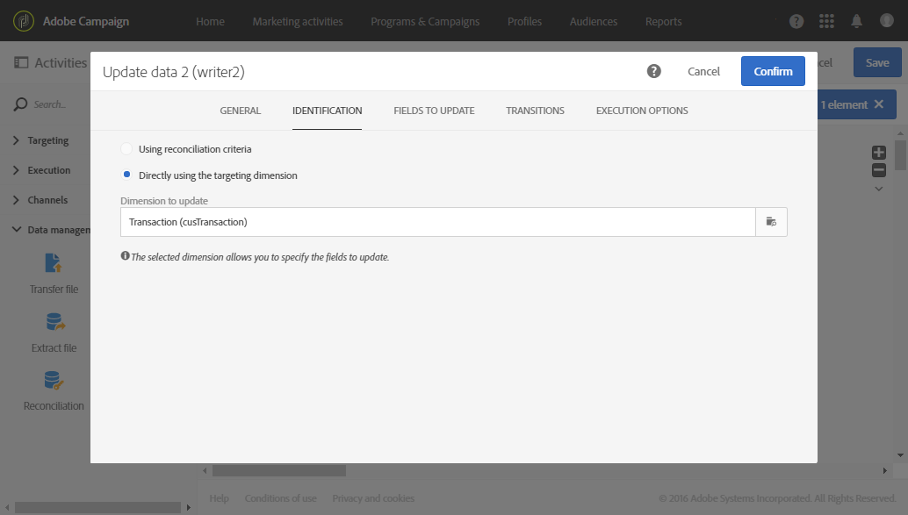

# Afstemming van data met behulp van relaties {#reconciliation-relations}

In het volgende voorbeeld ziet u een workflow die de database bijwerkt met de aankoopdata in een bestand. De aankoopdata bevatten data die verwijzen naar elementen van andere dimensies, zoals de e-mails en productcodes van de klant.

>[!NOTE]
>
>De resources **Transactions** en **Products** die in dit voorbeeld worden gebruikt, bestaan standaard niet in de Adobe Campaign-database. Ze zijn daarom vooraf gemaakt met behulp van de functie [Aangepaste resources](../../developing/using/data-model-concepts.md). De profielen die overeenkomen met de e-mailadressen in het geïmporteerde bestand zijn evenals de producten vooraf in de database geladen.

De workflow bestaat uit de volgende activiteiten:


* A [Load file](../../automating/using/load-file.md) activity, which loads and detects the data of the file to import. Het geïmporteerde bestand bevat de volgende data:

   * Transactiedatum
   * E-mailadres van klant
   * Code van het aangekochte product

   ```
   date;client;product
   2015-05-19 09:00:00;mail1@email.com;ZZ1
   2015-05-19 09:01:00;mail2@email.com;ZZ2
   2015-05-19 09:01:01;mail3@email.com;ZZ2
   2015-05-19 09:01:02;mail4@email.com;ZZ2
   2015-05-19 09:02:00;mail5@email.com;ZZ3
   2015-05-19 09:03:00;mail6@email.com;ZZ4
   2015-05-19 09:04:00;mail7@email.com;ZZ5
   2015-05-19 09:05:00;mail8@email.com;ZZ7
   2015-05-19 09:06:00;mail9@email.com;ZZ6
   ```

* A [Reconciliation](../../automating/using/reconciliation.md) activity to bind purchasing data to database profiles as well as products. Daarom moet een relatie worden gedefinieerd tussen de bestandsdata enerzijds en de profieltabel en producttabel anderzijds. Deze configuratie wordt uitgevoerd op het tabblad **[!UICONTROL Relations]** van de activiteit:

   * Relatie met de **profielen**: de kolom **client** van het bestand is gekoppeld aan het veld **email** van de dimensie **Profiles**.
   * Relatie met de **producten**: de kolom **product** van het bestand is gekoppeld aan het veld **productCode** van de dimensie **Profiles**.

   Kolommen worden toegevoegd aan de binnenkomende data om te verwijzen naar de externe sleutels van de gekoppelde dimensies.

   

* An [Update data](../../automating/using/update-data.md) activity allows you to define the database fields to update using the imported data. Aangezien de data in de vorige activiteit reeds zijn geïdentificeerd als behorend tot de dimensie **Transactions**, kunt u de identificatieoptie **[!UICONTROL Directly using the targeting dimension]** gebruiken.

   Als u gebruikmaakt van de optie waarmee automatisch velden worden gedetecteerd die moeten worden bijgewerkt, worden de koppelingen die in de vorige activiteit zijn geconfigureerd (naar profielen en producten), toegevoegd aan de lijst **[!UICONTROL Fields to update]**. U moet ook controleren of het veld dat overeenkomt met de transactiedatum, correct is toegevoegd aan deze lijst.

   

   
