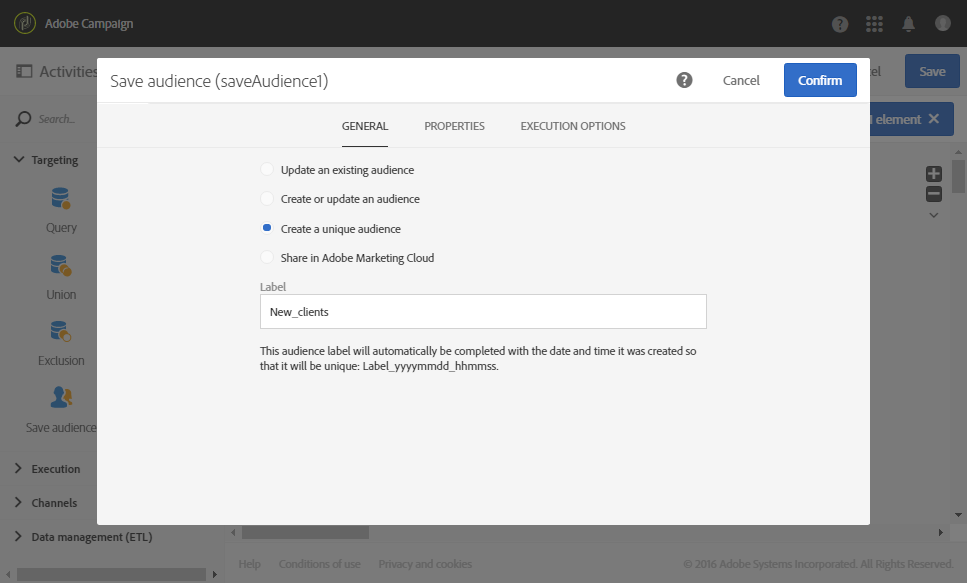

# Verzoening{#reconciliation}

## Beschrijving {#description}


Met deze **[!UICONTROL Reconciliation]** activiteit kunt u niet-geïdentificeerde gegevens koppelen aan bestaande bronnen.

## Gebruikscontext {#context-of-use}

De **[!UICONTROL Reconciliation]** activiteit wordt hoofdzakelijk gebruikt voor gegevensbeheerdoeleinden en houdt twee verschillende gebruiksgevallen in:

* Relaties toevoegen: op een **[!UICONTROL Links]** tabblad kunt u koppelingen toevoegen tussen de binnenkomende gegevens en verschillende andere databaseafmetingen van Adobe Campagne.

   Een bestand met aankoopgegevens kan bijvoorbeeld ook informatie bevatten om de aangekochte producten en de koper te identificeren. De bestandsgegevens hebben derhalve betrekking op twee extra dimensies (naast die van **aankopen**): de afmetingen van de **producten** en **profielen** . Vervolgens moeten er relaties worden aangelegd tussen deze en de **inkoopdimensie** (zie het volgende voorbeeld).

   Bij het definiëren van een relatie wordt een kolom toegevoegd aan de binnenkomende gegevens om te verwijzen naar de externe sleutel van de gekoppelde dimensie.

   >[!NOTE]
   >
   >Deze bewerking houdt in dat de gegevens van de gekoppelde afmetingen al in de database staan. Als u bijvoorbeeld een aankoopbestand importeert waarin wordt aangegeven welk product op welk moment, door welke client enzovoort is aangeschaft, moeten het product en de client al in de database aanwezig zijn.

* Gegevensidentificatie: op een **[!UICONTROL Identification]** tabblad kunt u alleen binnenkomende gegevens koppelen aan kolommen van een bestaande dimensie in de Adobe Campagne-database. Na de activiteit, worden de gegevens geïdentificeerd als behorend tot de bepaalde dimensie.

   U kunt dan bijvoorbeeld een publiek opslaan, de database bijwerken, enzovoort.

De **[!UICONTROL Reconciliation]** activiteit kan bijvoorbeeld worden geplaatst na het laden van gegevens met als doel niet-standaardgegevens in de database te importeren.

## Configuratie {#configuration}

1. Sleep een **[!UICONTROL Reconciliation]** activiteit naar uw werkstroom na een overgang met een populatie waarvan de doeldimensie niet rechtstreeks afkomstig is uit Adobe Campagne. Raadpleeg [Doeldimensies en bronnen](../../automating/using/query.md#targeting-dimensions-and-resources)voor meer informatie hierover.
1. Selecteer de activiteit, dan open het gebruikend de  knoop van de snelle acties die verschijnen.
1. Ga naar het **[!UICONTROL Links]** tabblad als u koppelingen wilt definiëren tussen de binnenkomende gegevens en andere databaseafmetingen.

   Voeg zoveel relaties toe als nodig is. Selecteer eerst voor elke relatie de gekoppelde dimensie en geef vervolgens in de koppelingsdetails de bijbehorende velden op.

1. Als u eenvoudig de binnenkomende gegevens wilt identificeren, ga naar het **[!UICONTROL Identification]** lusje en controleer het **[!UICONTROL Identify the document from the working data]** vakje.

   Selecteer de doeldimensie waarmee u de binnenkomende gegevens wilt afstemmen.

   Voeg verzoeningscriteria toe om een binnenkomende overgangsverslag aan een geselecteerd gericht afmetingsverslag te verbinden. Als er meerdere criteria zijn opgegeven, moeten deze allemaal worden geverifieerd voordat het verband tussen al hun gegevens kan worden gecontroleerd.

   Kies de **[!UICONTROL Processing unidentified source lines]** modus:

   * **[!UICONTROL Ignore them]**: alleen de identificeerbare gegevens worden bewaard in de uitgaande overgang van de activiteit.
   * **[!UICONTROL Keep in the outbound population]**: alle gegevens van de binnenkomende overgang worden gehouden in de uitgaande overgang van de activiteit.

1. Bevestig de configuratie van uw activiteit en sla uw werkschema op.

## Voorbeeld 1: Relatiedefinitie {#example-1--relation-definition}

In het volgende voorbeeld ziet u een workflow die de database bijwerkt met de aankoopgegevens in een bestand. De aankoopgegevens bevatten gegevens die verwijzen naar elementen van andere dimensies, zoals de e-mails van de klant en productcodes.

>[!NOTE]
>
>De **Transacties** en de middelen van **Producten** die in dit voorbeeld worden gebruikt bestaan niet door gebrek in het gegevensbestand van de Campagne van Adobe. Ze zijn daarom vooraf gemaakt met behulp van de functie [Aangepaste bronnen](../../developing/using/data-model-concepts.md) . De profielen die overeenkomen met de e-mailadressen in het geïmporteerde bestand en de producten zijn vooraf in de database geladen.

De workflow bestaat uit de volgende activiteiten:


* Een **[!UICONTROL Load file]** activiteit die de gegevens laadt en detecteert van het bestand dat moet worden geïmporteerd. Het geïmporteerde bestand bevat de volgende gegevens:

   * Transactiedatum
   * E-mailadres client
   * Code van het aangekochte product

   ```
   date;client;product
   2015-05-19 09:00:00;mail1@email.com;ZZ1
   2015-05-19 09:01:00;mail2@email.com;ZZ2
   2015-05-19 09:01:01;mail3@email.com;ZZ2
   2015-05-19 09:01:02;mail4@email.com;ZZ2
   2015-05-19 09:02:00;mail5@email.com;ZZ3
   2015-05-19 09:03:00;mail6@email.com;ZZ4
   2015-05-19 09:04:00;mail7@email.com;ZZ5
   2015-05-19 09:05:00;mail8@email.com;ZZ7
   2015-05-19 09:06:00;mail9@email.com;ZZ6
   ```

* Een **[!UICONTROL Reconciliation]** activiteit om het kopen gegevens aan gegevensbestandprofielen evenals producten te binden. Daarom moet een verband worden gedefinieerd tussen de bestandsgegevens en de profielentabel en de producttabel. Deze configuratie wordt uitgevoerd op het **[!UICONTROL Relations]** tabblad van de activiteit:

   * Relatie met de **profielen**: De **clientkolom** van het bestand is gekoppeld aan het **e-mailveld** van de **profieldimensie** .
   * Verhouding tot de **producten**: De **productkolom** van het bestand is gekoppeld aan het veld **productCode** van de **profieldimensie** .
   Kolommen worden toegevoegd aan de binnenkomende gegevens om te verwijzen naar de externe sleutels van de gekoppelde afmetingen.

   

* Met een **[!UICONTROL Update data]** activiteit kunt u de databasevelden definiëren die u wilt bijwerken met behulp van de geïmporteerde gegevens. Aangezien de gegevens reeds als deel van de dimensie van **Transacties** in de vorige activiteit werden geïdentificeerd, kunt u de **[!UICONTROL Directly using the targeting dimension]** identificatieoptie gebruiken.

   Als u de optie gebruikt waarmee automatisch velden worden gedetecteerd die moeten worden bijgewerkt, worden de koppelingen die in de vorige activiteit zijn geconfigureerd (naar profielen en producten) toegevoegd aan de lijst met **[!UICONTROL Fields to update]**. U moet er ook voor zorgen dat het veld dat overeenkomt met de transactiedatum correct wordt toegevoegd aan deze lijst.

   

   

## Voorbeeld 2: Identificatie {#example-2--identification}

In het volgende voorbeeld ziet u een workflow die een publiek van profielen rechtstreeks maakt vanuit een geïmporteerd bestand dat nieuwe clients bevat. Het bestaat uit de volgende activiteiten:


* Een **[!UICONTROL Load file]** activiteit die de gegevens laadt en detecteert van het bestand dat moet worden geïmporteerd. Het geïmporteerde bestand bevat de volgende gegevens:

   ```
   lastname;firstname;email;dateofbirth
   jackman;megan;megan.jackman@testmail.com;07/08/1975
   phillips;edward;phillips@testmail.com;09/03/1986
   weaver;justin;justin_w@testmail.com;11/15/1990
   martin;babeth;babeth_martin@testmail.net;11/25/1964
   reese;richard;rreese@testmail.com;02/08/1987
   cage;nathalie;cage.nathalie227@testmail.com;07/03/1989
   xiuxiu;andrea;andrea.xiuxiu@testmail.com;09/12/1992
   grimes;daryl;daryl_890@testmail.com;12/06/1979
   tycoon;tyreese;tyreese_t@testmail.net;10/08/1971
   ```

* Een **[!UICONTROL Reconciliation]** activiteit die elke kolom van het geladen bestand koppelt aan een kolom met profielafmetingen. De bestandsrecords die niet kunnen worden geïdentificeerd (ontbrekende gegevens, incompatibel gegevenstype, enz.) worden genegeerd om de integriteit van de uiteindelijke publieksgegevens te behouden.

   

* Een **[!UICONTROL Save audience]** activiteit waarmee het publiek van profielen wordt opgeslagen.

   

