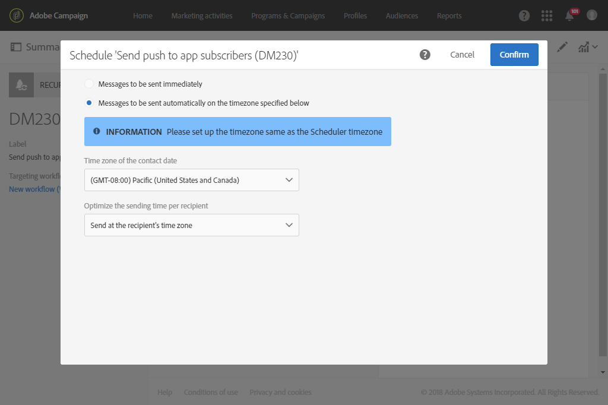

# Een terugkerende pushmelding verzenden met een workflow {#sending-a-recurring-push-notification-with-a-workflow}

In dit voorbeeld wordt elke eerste dag van de maand om 21.00 uur een persoonlijke pushmelding verzonden naar de abonnees van uw mobiele toepassing, afhankelijk van hun tijdzone.

Voer de volgende stappen uit om de workflow te maken:

1. De activiteit van de [Planner](../../automating/using/scheduler.md) staat u toe om de werkschemadagen vóór het begin van de levering te beginnen om het bericht aan elke abonnee te kunnen verzenden bij 8 pm in om het even welke bepaalde tijdzone:

   * In the **[!UICONTROL Execution frequency]** field, select Monthly.
   * Selecteer 8 pm in het **[!UICONTROL Time]** veld.
   * Kies op welke dag de levering elke maand wordt verzonden.
   * Selecteer een begindatum voor de workflow, ten minste één dag voor het begin van de levering. Anders, zouden sommige ontvangers het bericht een dag later kunnen ontvangen als de geselecteerde tijd reeds in hun tijdzones is overgegaan.
   * Selecteer op het **[!UICONTROL Execution options]** tabblad in welke tijdzone de workflow in het **[!UICONTROL Time zone]** veld moet beginnen. Hier begint de workflow bijvoorbeeld om 20.00 uur Stille-Oceaantijd, één week voor de eerste dag van de maand, zodat er enige tijd is om de leveringen voor alle toepasselijke tijdzones te maken.

   >[!NOTE]
   >
   >Standaard is de geselecteerde tijdzone de tijdzone die is gedefinieerd in de workfloweigenschappen (zie [Een workflow maken](../../automating/using/building-a-workflow.md)).

   

1. Met de activiteit [Query](../../automating/using/query.md) kunt u zich richten op uw VIP klanten tussen de 20 en 30 jaar die zich hebben geabonneerd op uw mobiele toepassing en die de door u verzonden e-mail niet hebben geopend:

   * Selecteer een publiek (uw VIP klanten) en filter op hun leeftijd.
   * Sleep de **abonnementen naar een toepassingselement** en zet ze neer in de werkruimte. Selecteer **Bestaat** en selecteer de mobiele toepassing die u wilt gebruiken.
   * Selecteer het e-mailbericht dat u naar uw klanten hebt verzonden.
   * Sleep het element **Leveringslogboeken (logboeken)** naar de werkruimte en selecteer **Bestaat** om alle klanten aan te wijzen die de e-mail hebben ontvangen.
   * Sleep het element Logbestanden **bijhouden (bijhouden)** naar de werkruimte en selecteer **Bestaat** niet voor alle klanten die de e-mail niet hebben geopend.

      

1. Met de [activiteit voor het verzenden](../../automating/using/push-notification-delivery.md) van pushberichten kunt u de inhoud van uw bericht invoeren en de velden voor het aanpassen van uw boodschap selecteren die u wilt gebruiken:

   * Selecteer de **[!UICONTROL Recurring notification]** optie.
   * Definieer de inhoud van het pushbericht. For more information on push notification content, refer to this [section](../../channels/using/preparing-and-sending-a-push-notification.md).
   * In the **[!UICONTROL Schedule]** block, select **[!UICONTROL Messages to be sent automatically on the time zone specified below]**. Hier hebben we de **[!UICONTROL Time zone of the contact date]** Pacific gekozen zoals in de workflow **[!UICONTROL Scheduler]**.
   * Selecteer in het veld **[!UICONTROL Optimize the sending time per recipient]** de optie **[!UICONTROL Send at the recipient's time zone]**.

      

1. Klik op de **[!UICONTROL Start]** knop om de terugkerende workflow te starten.

   

Uw workflow is nu actief. Het zal bij de gekozen begindatum van de **[!UICONTROL Scheduler]** om 22.00 uur Pacific tijd beginnen, zal de terugkomende duw dan elke eerste dag van de maand om 8.00 uur afhankelijk van de klantentijdzone worden verzonden.
