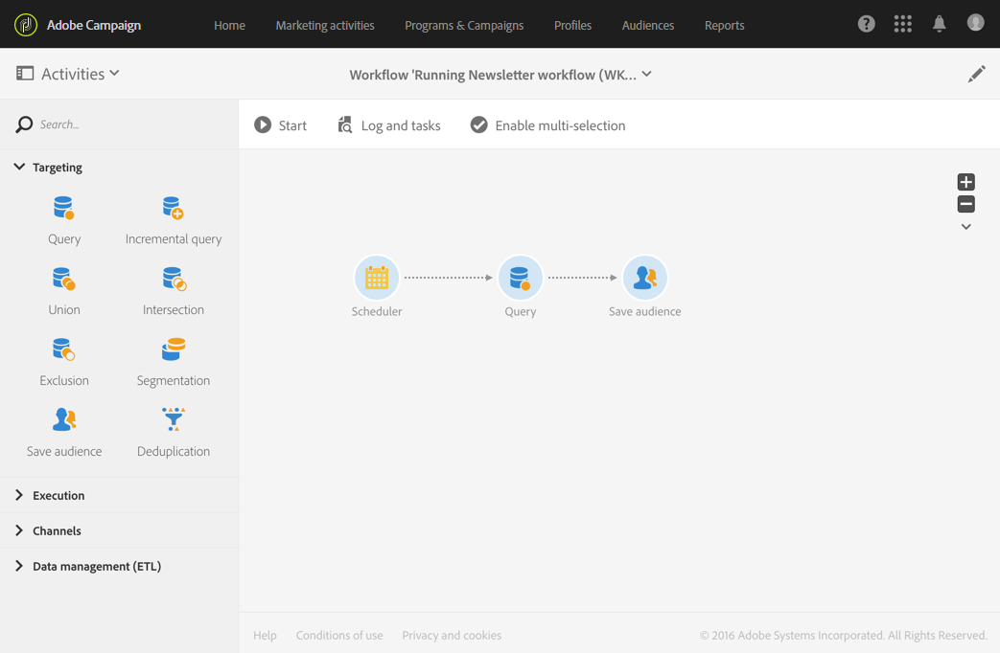

# Doelgroep opslaan{#save-audience}

## Beschrijving {#description}

Met de activiteit **[!UICONTROL Save audience]** kunt u een bestaande doelgroep bijwerken of een nieuwe doelgroep maken op basis van de populatie die stroomopwaarts in een workflow is berekend. De doelgroepen die vanaf deze activiteit worden gemaakt of bijgewerkt, zijn de doelgroepen **List** of **File**. Ze worden toegevoegd aan de lijst met doelgroepen van applicaties en en worden beschikbaar gesteld via het menu **[!UICONTROL Audiences]**.

>[!NOTE]
>
>Als de doelgroep die via de activiteit **[!UICONTROL Save audience]** is gemaakt, wordt verrijkt met aanvullende data, kunt u deze data niet gebruiken om een individuele levering te personaliseren. Ze kunnen alleen worden gebruikt vanuit een levering die wordt uitgevoerd in een workflow.

Met deze activiteit kunt u ook profielen exporteren als Adobe Experience Cloud-doelgroepen/-segmenten. Op die manier kunt u deze doelgroepen benutten in andere Adobe Experience Cloud-oplossingen. Voor meer informatie over gedeelde doelgroepen raadpleegt u [Werken met Campaign en de kernservice People](../../integrating/using/about-campaign-audience-manager-or-people-core-service-integration.md).

## Gebruikscontext {#context-of-use}

De activiteit **[!UICONTROL Save audience]** wordt hoofdzakelijk gebruikt om berekende populatiegroepen in dezelfde workflow te houden door deze in herbruikbare doelgroepen om te zetten.

## Configuratie {#configuration}

1. Zet een activiteit **[!UICONTROL Save audience]** neer in uw workflow.
1. Verbind deze na de andere targetingactiviteiten zoals een query, een doorsnede, een samenvoeging of een uitsluiting.
1. Selecteer de activiteit en open deze met de knop  vanuit de snelle acties die verschijnen.
1. Selecteer de actie die u wilt uitvoeren:

   * **[!UICONTROL Update an existing audience]**: Selecteer een bestaande doelgroep en kies het updatetype:

      * **[!UICONTROL Replace audience content with new data]**: De volledige content van de doelgroep wordt vervangen. De oude data gaan verloren. Alleen de data van de binnenkomende overgang van de activiteit voor het opslaan van de doelgroep blijven behouden.
      * **[!UICONTROL Complete audience with new data]**: De oude doelgroepsdata worden bewaard en de data van de binnenkomende overgang van de activiteit voor het opslaan van de doelgroep worden eraan toegevoegd.
   * **[!UICONTROL Create then update an audience]**: Voer de naam in van de doelgroep en selecteer het updatetype. Als de doelgroep nog niet bestaat, wordt deze gemaakt. Als deze al bestaat, wordt deze bijgewerkt volgens de geselecteerde modus:

      * **[!UICONTROL Replace audience content with new data]**: De volledige content van de doelgroep wordt vervangen. De oude data gaan verloren. Alleen de data van de binnenkomende overgang van de activiteit voor het opslaan van de doelgroep blijven behouden.

         Waarschuwing: Met deze optie wist u het doelgroeptype en de doeldimensie van de bijgewerkte doelgroep.

      * **[!UICONTROL Complete audience with new data]**: De oude doelgroepsdata worden bewaard en de data van de binnenkomende overgang van de activiteit voor het opslaan van de doelgroep worden eraan toegevoegd.

         Waarschuwing: Deze optie veroorzaakt een fout als het doelgroeptype of de doeldimensie van de bijgewerkte doelgroep niet compatibel is met de huidige configuratie van de workflow. U kunt een doelgroep van het type File bijvoorbeeld niet voltooien met profielen die afkomstig zijn van een query.
   * **[!UICONTROL Create a new audience]**: Voer de naam in van de doelgroep die u wilt maken. De tijd en datum waarop de doelgroep wordt gemaakt, worden automatisch toegevoegd aan de naam van de doelgroep. Dit maakt de doelgroep uniek telkens wanneer de workflow wordt uitgevoerd.
   * **[!UICONTROL Share in Adobe Experience Cloud]**: Als u profielen doelgericht hebt benaderd en u uw doelgroep wilt exporteren naar Adobe Experience Cloud, selecteert u deze optie en vervolgens selecteert u een bestaande gedeelde doelgroep of maakt u een nieuwe doelgroep.

      Selecteer ook een **[!UICONTROL Shared Data source]** die overeenkomt met de resource van de data in de doelgroep, zodat de data op de juiste wijze worden afgestemd in Adobe Experience Cloud.

      Als u deze optie gebruikt, wordt de gedeelde doelgroep niet toegevoegd aan de lijst met Adobe Campaign-doelgroepen die beschikbaar zijn via het menu **[!UICONTROL Audiences]**.

      >[!NOTE]
      >
      >Deze optie is alleen beschikbaar als de functionaliteit voor gedeelde doelgroepen met Adobe Experience Cloud door uw beheerder is geconfigureerd. Voor meer informatie raadpleegt u [Werken met Campaign en de kernservice People](../../integrating/using/about-campaign-audience-manager-or-people-core-service-integration.md).

   Het type doelgroepen dat tijdens een update wordt opgeslagen of beschikbaar is, is afhankelijk van de activiteiten die stroomopwaarts in de workflow worden geplaatst.

   Als de doeldimensie van de doelgroep onbekend is wanneer deze wordt opgeslagen (bijvoorbeeld als deze afkomstig is van een geïmporteerd bestand), wordt de doelgroep gemaakt of bijgewerkt als een doelgroep van het type **[!UICONTROL File]**.

   Als de doeldimensie van de opgeslagen doelgroep al is gedefinieerd wanneer deze wordt opgeslagen (bijvoorbeeld als deze afkomstig is van een targeting, na een query, enzovoort), dan wordt de doelgroep opgeslagen of bijgewerkt als een doelgroep van het type **[!UICONTROL List]**.

   De content van de opgeslagen doelgroep is vervolgens beschikbaar in de gedetailleerde weergave van de doelgroep, die toegankelijk is via het menu **[!UICONTROL Audiences]**. De kolommen die beschikbaar zijn vanaf deze weergave, komen overeen met de kolommen van de binnenkomende overgang van de activiteit voor het opslaan van de doelgroep van de workflow. Bijvoorbeeld: de kolommen van het geïmporteerde bestand, de extra data die via een query zijn toegevoegd.

1. Bevestig de configuratie van uw activiteit en sla de workflow op.

## Voorbeeld {#example}

De workflow die in dit voorbeeld wordt gedefinieerd, toont een regelmatige doelgroepupdate vanaf targeting:

* Deze wordt automatisch één keer per maand uitgevoerd met behulp van een **[!UICONTROL Scheduler]**.
* U kunt een **[!UICONTROL Query]** gebruiken om alle profielen te herstellen die geabonneerd zijn op de verschillende beschikbare applicatieservices.
* De activiteit **[!UICONTROL Save audience]** werkt de doelgroep bij door profielen te schrappen die zich voor de service hebben uitgeschreven sinds de laatste workflowuitvoering en door de onlangs ingeschreven profielen toe te voegen.

De activiteit **[!UICONTROL Save audience]** wordt als volgt geconfigureerd:

