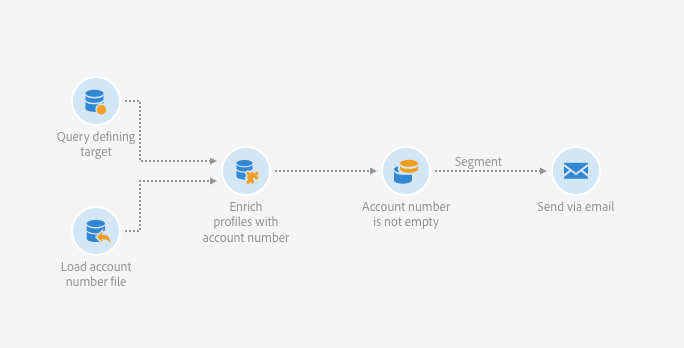

# Een e-mail met verrijkte velden verzenden {#sending-email-enriched-fields}

<!--A new example showing how to send an email containing additional data retrieved from a load file activity has been added. [Read more](example-2-email-with-enriched-fields)-->

Met de activiteit voor het laden van een bestand kunt u ook een e-mail verzenden die is verrijkt met aanvullende data van een extern bestand in dezelfde workflow.

In het onderstaande voorbeeld ziet u hoe u een e-mail verzendt met behulp van aanvullende data die via de activiteit voor het laden van het bestand zijn opgehaald uit een extern bestand. In dit voorbeeld bevat het externe bestand een lijst met profielen met het bijbehorende accountnummer. U wilt deze data importeren om een e-mail te verzenden naar elk profiel met het bijbehorende accountnummer.

Voer de volgende stappen uit om de workflow te maken:

1. Drag and drop a [Query](../../automating/using/query.md) activity into your workflow and open it to define the main target.

   <!--The Query activity is presented in the [Query](../../automating/using/query.md) section.-->

1. Drag and drop a [Load file](../../automating/using/load-file.md) activity to assign some data to a profile. In dit voorbeeld laadt u een bestand met accountnummers die overeenkomen met bepaalde profielen van de database.

   

1. Drag and drop an [Enrichment](../../automating/using/enrichment.md) activity into your workflow and link the load file and query activities to it.

1. Selecteer op het tabblad **[!UICONTROL Advanced relations]** van de activiteit voor het verrijken de optie **[!UICONTROL 0 or 1 cardinality simple link]** en definieer de velden die moeten worden gebruikt voor afstemming. Hier gebruiken we de achternaam om de data af te stemmen op de databaseprofielen.

   

1. Selecteer op het tabblad **[!UICONTROL Additional data]** de elementen die u in de e-mail wilt gebruiken. Hier selecteert u Account number (kolom uit het bestand dat u hebt opgehaald via de activiteit voor het laden van een bestand).

   

   <!---->

   Zie de sectie [Verrijking](../../automating/using/enrichment.md) voor meer informatie.

1. Drag and drop a [Segmentation](../../automating/using/segmentation.md) activity into your workflow and open it to refine the main target.

   

   Zie de sectie [Segmentatie](../../automating/using/segmentation.md) voor meer informatie.

1. Drag and drop an [Email delivery](../../automating/using/email-delivery.md) activity into your workflow and open it.

   <!--The Email delivery activity is presented in the [Email delivery](../../automating/using/email-delivery.md) section.-->

1. Voeg een personalisatieveld toe en selecteer de aanvullende data die in de activiteit voor het verrijken (hier Account number) zijn gedefinieerd vanaf het knooppunt **[!UICONTROL Additional data (targetData)]**. Hiermee kunt u het accountnummer van elk profiel in de e-mailcontent op een dynamische manier ophalen.

   

1. Sla de e-mail op en start de workflow.

De e-mail wordt naar het doel verzonden. Elk profiel ontvangt de e-mail met het overeenkomstige accountnummer.

