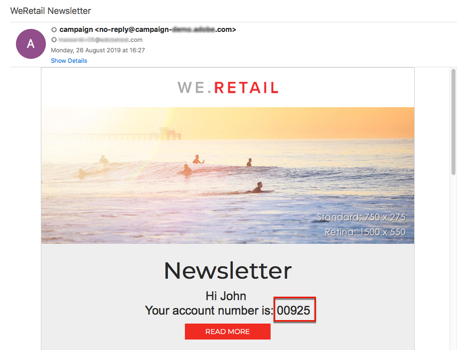

# Een e-mail verzenden met verrijkte velden {#sending-email-enriched-fields}

<!--A new example showing how to send an email containing additional data retrieved from a load file activity has been added. [Read more](example-2-email-with-enriched-fields)-->

Met de activiteit van het ladingsdossier kunt u ook een e-mail verzenden die met extra gegevens van een extern dossier in het zelfde werkschema wordt verrijkt.

In het onderstaande voorbeeld ziet u hoe u een e-mail verzendt met behulp van aanvullende gegevens die via het laden van het bestand zijn opgehaald uit een extern bestand. In dit voorbeeld bevat het externe bestand een lijst met profielen met het bijbehorende accountnummer. U wilt deze gegevens importeren om een e-mail naar elk profiel met het bijbehorende accountnummer te verzenden.

Voer de volgende stappen uit om de workflow te maken:

1. Sleep een [query](../../automating/using/query.md) -activiteit naar uw werkstroom en open deze om het hoofddoel te definiëren.

   <!--The Query activity is presented in the [Query](../../automating/using/query.md) section.-->

1. Sleep een [activiteit Bestand](../../automating/using/load-file.md) laden om gegevens aan een profiel toe te wijzen. In dit voorbeeld laadt u een bestand met accountnummers die overeenkomen met bepaalde profielen van de database.

   

1. Sleep een [verrijkingsactiviteit](../../automating/using/enrichment.md) naar uw werkstroom en koppel het ladingsdossier en vraagactiviteiten aan het.

1. Selecteer op het **[!UICONTROL Advanced relations]** tabblad van de verrijkingsactiviteit de velden **[!UICONTROL 0 or 1 cardinality simple link]** en definieer de velden die moeten worden gebruikt voor afstemming. Hier gebruiken we de achternaam om de gegevens te combineren met de databaseprofielen.

   

1. Selecteer op het **[!UICONTROL Additional data]** tabblad de elementen die u in de e-mail wilt gebruiken. Hier selecteert u Account-nummer (kolom uit het bestand dat u hebt opgehaald via de activiteit van het laadbestand).

   

   <!---->

   Zie de sectie [Verrijking](../../automating/using/enrichment.md) voor meer informatie.

1. Sleep een [segmentatie](../../automating/using/segmentation.md) -activiteit naar uw werkstroom en open deze om het hoofddoel te verfijnen.

   

   Zie de sectie [Segmentatie](../../automating/using/segmentation.md) voor meer informatie.

1. Sleep een [e-mailbezorgingsactiviteit](../../automating/using/email-delivery.md) naar uw werkstroom en open deze.

   <!--The Email delivery activity is presented in the [Email delivery](../../automating/using/email-delivery.md) section.-->

1. Voeg een verpersoonlijkingsgebied toe en selecteer de extra gegevens die in de verrijkingsactiviteit (hier het aantal van de Rekening) van de **[!UICONTROL Additional data (targetData)]** knoop worden bepaald. Hiermee kunt u dynamisch het accountnummer van elk profiel in de e-mailinhoud ophalen.

   

1. Sla de e-mail op en start de workflow.

Het e-mailbericht wordt naar het doel verzonden. Elk profiel ontvangt het e-mailbericht met het corresponderende accountnummer.

