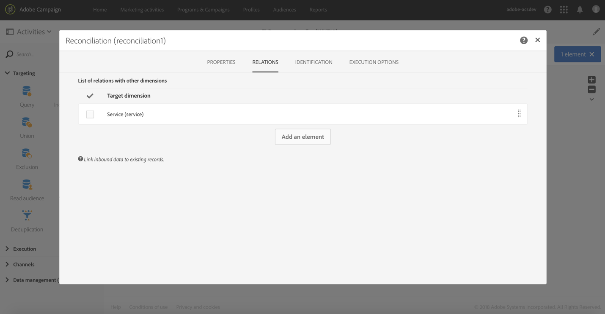

# Abonnementsservices {#subscription-services}

## Beschrijving {#description}


Met de activiteit **[!UICONTROL Subscription Services]** kunt u profielen massaal in- of uitschrijven bij een service.

>[!CAUTION]
>
>Als een abonnement wordt beheerd in de context van een workflow, ontvangen de ingeschreven of uitgeschreven profielen niet de verschillende bevestigings-e-mails die in de service-eigenschappen zijn gedefinieerd.

## Gebruikscontext {#context-of-use}

De activiteit **[!UICONTROL Subscription Services]** is de enige functionaliteit in Adobe Campaign waarmee u meerdere profielen in één enkele actie kunt in- of uitschrijven bij een service.

U kunt deze activiteit gebruiken nadat u een targetingactiviteit hebt uitgevoerd of een bestand met geïdentificeerde data hebt geïmporteerd.

Als deze activiteit in een bestand is opgegeven via toegewezen kolommen, kunt u hiermee ook de actie (inschrijven of uitschrijven) en de service kiezen waarop de actie moet worden uitgevoerd.

**Verwante onderwerpen:**

* [Hoofdlettergebruik: Meerdere abonnementstatussen bijwerken vanuit een bestand](../../automating/using/updating-subscriptions-from-file.md)
* [Hoofdlettergebruik: Profielen vanuit een bestand abonneren op een specifieke service](../../automating/using/subscribing-profiles-from-file.md)

## Configuratie {#configuration}

1. Sleep een activiteit **[!UICONTROL Subscription Services]** en zet deze neer in uw workflow.
1. Koppel deze activiteit na andere targetingactiviteiten, zoals een query of een afstemming na een importbewerking.
1. Selecteer de activiteit en open deze met de knop  vanuit de snelle acties die verschijnen.
1. Selecteer de **[!UICONTROL Service]** waarvoor u de abonnementen wilt beheren aan de hand van een van de volgende opties:

   * **[!UICONTROL Select a specific service]**: Selecteer handmatig een service.
   * **[!UICONTROL Select services from the inbound transition]**: De service wordt opgegeven in de binnenkomende overgang. U kunt bijvoorbeeld een bestand importeren dat de service opgeeft die voor elke regel moet worden beheerd. Als u deze optie kiest, maak dan vooraf een koppeling tussen de data en de resource **Service**, zoals weergegeven in [dit voorbeeld](#example--updating-multiple-subscription-statuses-from-a-file).

      De service waarop de bewerking moet worden uitgevoerd, wordt dan dynamisch geselecteerd voor elke record.

1. Selecteer het **[!UICONTROL Operation type]** dat u wilt uitvoeren aan de hand van een van de volgende opties:

   * **[!UICONTROL Select a specific operation type]**: Selecteer dit handmatig als u **[!UICONTROL Subscribe]** of **[!UICONTROL Unsubscribe]** wilt uitvoeren op de profielen.
   * **[!UICONTROL Select an operation type from a path of inbound transition]**: Selecteer de kolom met de binnenkomende data die de bewerking aangeeft die voor elke record moet worden uitgevoerd.

      In deze kolom moet de bewerking worden opgegeven als een booleaanse waarde of geheel getal. Gebruik **0** om een record uit te schrijven en **1** om een record in te schrijven.

      Als de waarden in een geïmporteerd bestand niet overeenkomen met de bovenstaande vereisten, kunt u toch de optie [Remapping of values](../../automating/using/load-file.md#column-format) gebruiken die beschikbaar is in de activiteit **[!UICONTROL Load file]**.

1. Als de binnenkomende data een kolom bevatten die overeenkomt met de abonnementsdatum van het profiel voor de service, selecteer deze dan. U kunt dit leeg laten, maar dan wordt er geen abonnementsdatum ingesteld wanneer de workflow wordt uitgevoerd.
1. Geef de oorsprong van het abonnement op. U kunt dit instellen op een van de velden van de binnenkomende data of op een constante waarde van uw keuze door de optie **[!UICONTROL Set a constant as origin]** in te schakelen. U kunt dit leeg laten, maar dan wordt er geen oorsprong ingesteld wanneer de workflow wordt uitgevoerd.
1. U kunt indien nodig een uitgaande overgang produceren. Deze overgang bevat precies dezelfde data als de overgang in de binnenkomende activiteit.
1. Bevestig de configuratie van uw activiteit en sla de workflow op.

   De configuratie kan nu worden uitgevoerd. Zodra deze is uitgevoerd, kunt u de profielen die zich hebben ingeschreven of uitgeschreven bij de service bekijken in de details van de service.

## Voorbeeld: Profielen na het importeren van een bestand abonneren op een specifieke service {#example--subscribing-profiles-to-a-specific-service-after-importing-a-file}

In dit voorbeeld ziet u hoe u een bestand met profielen importeert en deze abonneert op een bestaande service. Nadat het bestand is geïmporteerd, moet een afstemming worden uitgevoerd, zodat de geïmporteerde data kunnen worden geïdentificeerd als profielen. Om ervoor te zorgen dat het bestand geen duplicaten bevat, wordt een ontdubbelingsactiviteit uitgevoerd op de data.

De workflow wordt als volgt weergegeven:


* Een activiteit **[!UICONTROL Load file]** laadt het profielbestand en definieert de structuur van de geïmporteerde kolommen.

   In dit voorbeeld heeft het geladen bestand de csv-indeling en bevat het de volgende data:

   ```
   lastname;firstname;email;birthdate;subdate
   jackman;megan;megan.jackman@testmail.com;07/08/1975;10/08/2017
   phillips;edward;phillips@testmail.com;09/03/1986;10/08/2017
   weaver;justin;justin_w@testmail.com;11/15/1990;10/08/2017
   martin;babeth;babeth_martin@testmail.net;11/25/1964;10/08/2017
   reese;richard;rreese@testmail.com;02/08/1987;11/08/2017
   cage;nathalie;cage.nathalie227@testmail.com;07/03/1989;11/08/2017
   xiuxiu;andrea;andrea.xiuxiu@testmail.com;09/12/1992;11/08/2017
   grimes;daryl;daryl_890@testmail.com;12/06/1979;12/08/2017
   tycoon;tyreese;tyreese_t@testmail.net;10/08/1971;12/08/2017
   ```

   

* Een activiteit **[!UICONTROL Reconciliation]** identificeert de data van het bestand als deel van de profieldimensie van de Adobe Campaign-database. Alleen het tabblad **[!UICONTROL Identification]** is geconfigureerd. De bestandsdata worden geïdentificeerd aan de hand van de e-mailadressen van de profielen.

   

* Een **[!UICONTROL Deduplication]** die is gebaseerd op het veld **Email** van de tijdelijke resource (als resultaat van de afstemming) identificeert eventuele duplicaten. Als de data die uit het bestand zijn geïmporteerd, duplicaten bevatten, mislukt de inschrijving op een service voor alle data.

   

* Met een activiteit **[!UICONTROL Subscription Services]** kunt u de service selecteren waarop de profielen moeten worden geabonneerd, het veld dat overeenkomt met de abonnementsdatum en de oorsprong van het abonnement.

   

## Voorbeeld: Meerdere abonnementsstatussen bijwerken vanuit een bestand {#example--updating-multiple-subscription-statuses-from-a-file}

In dit voorbeeld wordt getoond hoe u een bestand met profielen kunt importeren en hun inschrijving op verschillende services die in het bestand zijn opgegeven, kunt bijwerken. Nadat het bestand is geïmporteerd, moet een afstemming worden uitgevoerd, zodat de geïmporteerde data kunnen worden geïdentificeerd als profielen met een koppeling naar services. Om ervoor te zorgen dat het bestand geen duplicaten bevat, wordt een ontdubbelingsactiviteit uitgevoerd op de data.

De workflow wordt als volgt weergegeven:


* Een activiteit **[!UICONTROL Load file]** laadt het profielbestand en definieert de structuur van de geïmporteerde kolommen.

   In dit voorbeeld heeft het geladen bestand de csv-indeling en bevat het de volgende data:

   ```
   lastname;firstname;email;birthdate;service;operation
   jackman;megan;megan.jackman@testmail.com;07/08/1975;SVC2;sub
   phillips;edward;phillips@testmail.com;09/03/1986;SVC3;unsub
   weaver;justin;justin_w@testmail.com;11/15/1990;SVC3;sub
   martin;babeth;babeth_martin@testmail.net;11/25/1964;SVC3;unsub
   reese;richard;rreese@testmail.com;02/08/1987;SVC3;sub
   cage;nathalie;cage.nathalie227@testmail.com;07/03/1989;SVC3;sub
   xiuxiu;andrea;andrea.xiuxiu@testmail.com;09/12/1992;SVC4;sub
   grimes;daryl;daryl_890@testmail.com;12/06/1979;SVC3;unsub
   tycoon;tyreese;tyreese_t@testmail.net;10/08/1971;SVC2;sub
   ```

   

   Zoals u misschien hebt opgemerkt, wordt de bewerking in het bestand opgegeven als ‘sub’ of ‘unsub’. Het systeem verwacht dat een waarde **Boolean** of **Integer** de bewerking herkent die moet worden uitgevoerd: 0 voor uitschrijven en 1 voor inschrijven. Om aan deze vereiste te voldoen, wordt een nieuwe toewijzing van waarden uitgevoerd in de details van de kolom Operation.

   

   Als in uw bestand al 0 en 1 worden gebruikt om de bewerking te identificeren, hoeft u deze waarden niet opnieuw toe te wijzen. Zorg alleen dat de kolom op het tabblad **[!UICONTROL Column definition]** wordt verwerkt als een **Boolean** of **Integer**.

* Een activiteit **[!UICONTROL Reconciliation]** identificeert de data van het bestand als deel van de profieldimensie van de Adobe Campaign-database. Via het tabblad **[!UICONTROL Identification]** wordt het veld **Email** van het bestand afgestemd op het veld **Email** van de profielresource.

   

   Op het tabblad **[!UICONTROL Relations]** wordt een koppeling met de serviceresource gemaakt zodat het veld **service** van het bestand kan worden herkend. In dit voorbeeld komen de waarden overeen met het veld **name** van de serviceresource.

   

* Een **[!UICONTROL Deduplication]** die is gebaseerd op het veld **Email** van de tijdelijke resource (als resultaat van de afstemming) identificeert de duplicaten. Het is belangrijk om duplicaten te verwijderen aangezien het abonnement op de service voor alle data zal mislukken als er duplicaten zijn.

   

* Met de activiteit **[!UICONTROL Subscription Services]** worden de services die moeten worden bijgewerkt en afkomstig zijn van de overgang, geïdentificeerd via de koppeling die in de activiteit **[!UICONTROL Reconciliation]** wordt gemaakt.

   Het **[!UICONTROL Operation type]** wordt geïdentificeerd als afkomstig van het veld **operation** van het bestand. U kunt hier alleen de velden Boolean of Integer selecteren. Als de kolom van het bestand dat de uit te voeren bewerking bevat, niet in de lijst voorkomt, moet u controleren of u de kolomindeling in de activiteit **[!UICONTROL Load file]** correct hebt ingesteld, zoals eerder in dit voorbeeld wordt uitgelegd.

   

