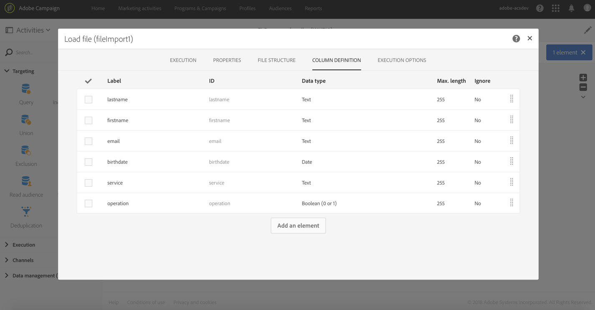

# Abonnementsservices {#subscription-services}

## Beschrijving {#description}


Met de **[!UICONTROL Subscription Services]** activiteit kunt u profielen in massa nemen en deze aan een service abonneren of u kunt deze afmelden bij een service.

>[!CAUTION]
>
>Als een abonnement wordt beheerd in de context van een workflow, ontvangen de geabonneerde of niet-geabonneerde profielen niet de andere bevestigingse-mails die zijn gedefinieerd in de service-eigenschappen.

## Gebruikscontext {#context-of-use}

De **[!UICONTROL Subscription Services]** activiteit is de enige functionaliteit van Adobe Campaign die het mogelijk maakt om aan meerdere profielen te worden geabonneerd of om van de dienst in één enkele actie te worden geabonneerd.

U kunt deze activiteit gebruiken nadat u een gericht bestand hebt uitgevoerd of een bestand met geïdentificeerde gegevens hebt geïmporteerd.

Als opgegeven in een bestand via toegewezen kolommen, kunt u met deze activiteit ook de handeling (abonneren of afmelden) en de service kiezen waarop de handeling moet worden uitgevoerd.

**Verwante onderwerpen:**

* [Hoofdlettergebruik: Meerdere abonnementstatussen bijwerken vanuit een bestand](../../automating/using/updating-subscriptions-from-file.md)
* [Hoofdlettergebruik: Profielen vanuit een bestand abonneren op een specifieke service](../../automating/using/subscribing-profiles-from-file.md)

## Configuratie {#configuration}

1. Sleep een **[!UICONTROL Subscription Services]** activiteit naar uw werkstroom.
1. Sluit de toepassing aan na andere doelactiviteiten, zoals een query of een afstemming na het importeren.
1. Selecteer de activiteit, dan open het gebruikend de  knoop van de snelle acties die verschijnen.
1. Selecteer de abonnementen **[!UICONTROL Service]** waarvoor u deze wilt beheren met een van de volgende opties:

   * **[!UICONTROL Select a specific service]**: Selecteer handmatig een service.
   * **[!UICONTROL Select services from the inbound transition]**: de dienst wordt gespecificeerd in de binnenkomende overgang. U kunt bijvoorbeeld een bestand importeren dat de service opgeeft die voor elke regel moet worden beheerd. Als u deze optie kiest, zorg ervoor een verbinding van tevoren tussen de gegevens en het middel van de **Dienst** , zoals aangetoond in [dit voorbeeld](#example--updating-multiple-subscription-statuses-from-a-file)is gecreeerd.

      De dienst waarop om de verrichting uit te voeren wordt dan dynamisch geselecteerd voor elke verslag.

1. Selecteer de **[!UICONTROL Operation type]** optie die u wilt uitvoeren met een van de volgende opties:

   * **[!UICONTROL Select a specific operation type]**: Selecteer handmatig als u profielen wilt **[!UICONTROL Subscribe]** of **[!UICONTROL Unsubscribe]** .
   * **[!UICONTROL Select an operation type from a path of inbound transition]**: Selecteer de kolom met de binnenkomende gegevens die de bewerking aangeeft die voor elke record moet worden uitgevoerd.

      In deze kolom moet de bewerking worden opgegeven als een Booleaanse waarde of geheel getal. Gebruik **0** om een record op te zeggen en **1** om te abonneren.

      Als de waarden in een geïmporteerd bestand niet overeenkomen met de bovenstaande vereisten, kunt u toch de optie [Opnieuw toewijzen van waarden](../../automating/using/load-file.md#column-format) gebruiken die beschikbaar is in de **[!UICONTROL Load file]** activiteit.

1. Als de binnenkomende gegevens een kolom bevatten met de abonnementsdatum van het profiel aan de dienst, selecteer het. U kunt deze leeg laten, maar er is geen abonnementsdatum ingesteld wanneer de workflow wordt uitgevoerd.
1. Geef de oorsprong van het abonnement op. U kunt het aan één van de gebieden van de binnenkomende gegevens of aan een constante waarde van uw keus plaatsen door de **[!UICONTROL Set a constant as origin]** optie te controleren. U kunt deze leeg laten, maar er wordt geen oorsprong ingesteld wanneer de workflow wordt uitgevoerd.
1. Indien nodig, kunt u een uitgaande overgang produceren. Deze overgang bevat precies dezelfde gegevens als die in de binnenkomende activiteit.
1. Bevestig de configuratie van uw activiteit en sla uw werkschema op.

   Het is nu klaar om te worden uitgevoerd. Zodra uitgevoerd, kunt u de profielen bekijken die aan of unsubscribed van de dienst in het detail van de dienst zijn ingetekend.

## Voorbeeld: Profielen na het importeren van een bestand abonneren op een specifieke service {#example--subscribing-profiles-to-a-specific-service-after-importing-a-file}

In dit voorbeeld ziet u hoe u een bestand met profielen importeert en deze abonneert op een bestaande service. Na het importeren van het bestand moet een afstemming plaatsvinden, zodat de geïmporteerde gegevens kunnen worden geïdentificeerd als profielen. Om ervoor te zorgen dat het bestand geen duplicaten bevat, wordt een deduplicatieactiviteit uitgevoerd op de gegevens.

De workflow wordt als volgt weergegeven:


* Een **[!UICONTROL Load file]** activiteit laadt het profieldossier en bepaalt de structuur van de ingevoerde kolommen.

   In dit voorbeeld heeft het geladen bestand de .csv-indeling en bevat het de volgende gegevens:

   ```
   lastname;firstname;email;birthdate;subdate
   jackman;megan;megan.jackman@testmail.com;07/08/1975;10/08/2017
   phillips;edward;phillips@testmail.com;09/03/1986;10/08/2017
   weaver;justin;justin_w@testmail.com;11/15/1990;10/08/2017
   martin;babeth;babeth_martin@testmail.net;11/25/1964;10/08/2017
   reese;richard;rreese@testmail.com;02/08/1987;11/08/2017
   cage;nathalie;cage.nathalie227@testmail.com;07/03/1989;11/08/2017
   xiuxiu;andrea;andrea.xiuxiu@testmail.com;09/12/1992;11/08/2017
   grimes;daryl;daryl_890@testmail.com;12/06/1979;12/08/2017
   tycoon;tyreese;tyreese_t@testmail.net;10/08/1971;12/08/2017
   ```

   

* Met een **[!UICONTROL Reconciliation]** activiteit worden de gegevens uit het bestand geïdentificeerd als behorend tot de profieldimensie van de Adobe Campaign-database. Alleen het **[!UICONTROL Identification]** tabblad is geconfigureerd. De bestandsgegevens worden geïdentificeerd aan de hand van de e-mailadressen van de profielen.

   

* Een **[!UICONTROL Deduplication]** formulier dat is gebaseerd op het veld **E-mail** van de tijdelijke bron (dat is afgeleid van de afstemming), identificeert eventuele duplicaten. Als de gegevens die uit het bestand zijn geïmporteerd, duplicaten bevatten, mislukt het abonnement op een service voor alle gegevens.

   

* Met een **[!UICONTROL Subscription Services]** activiteit kunt u de service selecteren waarop de profielen moeten worden geabonneerd, het veld dat overeenkomt met de abonnementsdatum en de oorsprong van het abonnement.

   

## Voorbeeld: Meerdere abonnementstatussen bijwerken vanuit een bestand {#example--updating-multiple-subscription-statuses-from-a-file}

In dit voorbeeld wordt getoond hoe u een bestand met profielen kunt importeren en hun abonnement kunt bijwerken naar verschillende services die in het bestand zijn opgegeven. Na het importeren van het bestand moet een afstemming plaatsvinden, zodat de geïmporteerde gegevens kunnen worden geïdentificeerd als profielen met een koppeling naar services. Om ervoor te zorgen dat het bestand geen duplicaten bevat, wordt een deduplicatieactiviteit uitgevoerd op de gegevens.

De workflow wordt als volgt weergegeven:


* Een **[!UICONTROL Load file]** activiteit laadt het profieldossier en bepaalt de structuur van de ingevoerde kolommen.

   In dit voorbeeld heeft het geladen bestand de .csv-indeling en bevat het de volgende gegevens:

   ```
   lastname;firstname;email;birthdate;service;operation
   jackman;megan;megan.jackman@testmail.com;07/08/1975;SVC2;sub
   phillips;edward;phillips@testmail.com;09/03/1986;SVC3;unsub
   weaver;justin;justin_w@testmail.com;11/15/1990;SVC3;sub
   martin;babeth;babeth_martin@testmail.net;11/25/1964;SVC3;unsub
   reese;richard;rreese@testmail.com;02/08/1987;SVC3;sub
   cage;nathalie;cage.nathalie227@testmail.com;07/03/1989;SVC3;sub
   xiuxiu;andrea;andrea.xiuxiu@testmail.com;09/12/1992;SVC4;sub
   grimes;daryl;daryl_890@testmail.com;12/06/1979;SVC3;unsub
   tycoon;tyreese;tyreese_t@testmail.net;10/08/1971;SVC2;sub
   ```

   

   Zoals u misschien hebt opgemerkt, wordt de bewerking in het bestand opgegeven als &quot;sub&quot; of &quot;unsub&quot;. Het systeem verwacht dat een **Booleaanse** of **gehele** waarde de bewerking herkent die moet worden uitgevoerd: &quot;0&quot; voor afmelden en &quot;1&quot; voor abonneren. Om aan dit vereiste te voldoen, wordt een nieuwe toewijzing van waarden uitgevoerd in het detail van de &quot;verrichting&quot;kolom.

   

   Als in uw bestand al &quot;0&quot; en &quot;1&quot; worden gebruikt om de bewerking te identificeren, hoeft u deze waarden niet opnieuw toe te wijzen. Zorg alleen dat de kolom op het **tabblad als een** Booleaanse **of** gehele kolom **[!UICONTROL Column definition]** wordt verwerkt.

* Met een **[!UICONTROL Reconciliation]** activiteit worden de gegevens uit het bestand geïdentificeerd als behorend tot de profieldimensie van de Adobe Campaign-database. Via het **[!UICONTROL Identification]** tabblad komt het veld **E-mail** van het bestand overeen met het veld **E-mail** van de profielbron.

   

   Op het **[!UICONTROL Relations]** lusje, wordt een verbinding gecreeerd met het de dienstmiddel om het de **dienstgebied** van het dossier toe te laten om worden erkend. In dit voorbeeld, passen de waarden het **naamgebied** van het de dienstmiddel aan.

   

* Een **[!UICONTROL Deduplication]** formulier dat is gebaseerd op het veld **E-mail** van de tijdelijke bron (dat is afgeleid van de afstemming), identificeert duplicaten. Het is belangrijk om dubbele gegevens te elimineren aangezien het abonnement aan de dienst voor alle gegevens in het geval van duplicaten zal ontbreken.

   

* A **[!UICONTROL Subscription Services]** identificeert de diensten om als afkomstig van de overgang, door de verbinding bij te werken die in de **[!UICONTROL Reconciliation]** activiteit wordt gecreeerd.

   Het **[!UICONTROL Operation type]** wordt geïdentificeerd als afkomstig van het **bewerkingsveld** van het bestand. U kunt hier alleen Booleaanse of gehele getallen selecteren. Als de kolom van het bestand dat de uit te voeren bewerking bevat, niet in de lijst voorkomt, moet u de kolomindeling correct instellen in de **[!UICONTROL Load file]** activiteit, zoals eerder in dit voorbeeld wordt uitgelegd.

   

