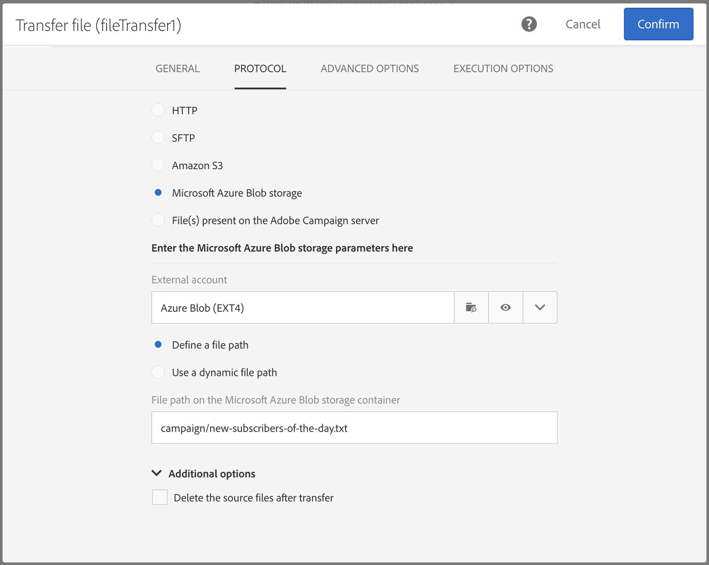

# Bestand overdragen{#transfer-file}

## Beschrijving {#description}

Met de activiteit **[!UICONTROL Transfer file]** kunt u bestanden ontvangen of verzenden, testen of er bestanden aanwezig zijn of een lijst met bestanden weergeven in Adobe Campaign.

## Gebruikscontext {#context-of-use}

De manier waarop de data worden geëxtraheerd, wordt gedefinieerd wanneer de activiteit wordt geconfigureerd. Het te laden bestand kan bijvoorbeeld een lijst met contactpersonen zijn.

U kunt deze activiteit gebruiken om data te herstellen die vervolgens met de activiteit **[!UICONTROL Load file]** zullen worden gestructureerd.

**Verwante onderwerpen:**

* [Hoofdlettergebruik: Gegevens bijwerken op basis van een automatische bestandsdownload](../../automating/using/update-data-automatic-download.md)

## Configuratie {#configuration}

1. Zet een activiteit **[!UICONTROL Transfer file]** neer in uw workflow.
1. Selecteer de activiteit en open deze met de knop  vanuit de snelle acties die verschijnen.
1. Gebruik de vervolgkeuzelijst in het veld **[!UICONTROL Action]** om een van de volgende activiteitsacties te selecteren:

   

   * **File download**: Hiermee kunt u een bestand downloaden.
   * **File upload**: Hiermee kunt u een bestand uploaden. Wanneer u een bestand uploadt uit een Adobe Campaign-bestand, wordt een logboekvermelding in het menu **[!UICONTROL Export audits]** gegenereerd. Raadpleeg de sectie [Audits uitvoeren op exportlogboeken](../../administration/using/auditing-export-logs.md) voor meer informatie over exportaudits.
   * **Test to see if file exists**: Hiermee kunt u controleren of er een bestand is.
   * **File listing**: Hiermee kunt u de bestanden weergeven die aanwezig zijn op de server die is gedefinieerd op het tabblad **[!UICONTROL Protocol]**. Deze actie wordt hoofdzakelijk gebruikt voor foutopsporing, om te controleren of de activiteit volgens uw behoeften is geconfigureerd voordat de bestanden van de externe server worden gedownload.

1. Selecteer het protocol dat u wilt gebruiken:
   * [HTTP](#HTTP-configuration-wf)
   * [SFTP](#SFTP-configuration-wf)
   * [Amazon S3](#S3-configuration-wf)
   * [Microsoft Azure Blob Storage](#azure-blob-configuration-wf)
   * [Bestand(en) aanwezig op de Adobe Campaign-server](#files-server-configuration-wf)

1. In de sectie **[!UICONTROL Additional options]**, die afhankelijk is van het geselecteerde protocol, kunt u parameters toevoegen aan uw protocol. U kunt het volgende doen:

   * **[!UICONTROL Delete the source files after transfer]**
   * **[!UICONTROL Disable passive mode]**
   * **[!UICONTROL List all files]**: Deze optie is beschikbaar wanneer u de actie **[!UICONTROL File listing]** selecteert op het tabblad **[!UICONTROL General]**. Hiermee kunt u alle bestanden indexeren die aanwezig zijn op de server in de gebeurtenisvariabele **vars.filenames** waarin de bestandsnamen worden gescheiden door de tekens **‘n’** 

1. In de sectie **[!UICONTROL If no files are found]** van het tabblad **[!UICONTROL Advanced options]** kunt u specifieke acties configureren als er fouten of onbestaande bestanden worden gedetecteerd wanneer de activiteit wordt gestart.

   U kunt ook nieuwe pogingen definiëren. De verschillende nieuwe pogingen worden weergegeven in het logboek voor workflowuitvoering.

   

1. Bevestig de configuratie van uw activiteit en sla de workflow op.

### Configuratie met HTTP {#HTTP-configuration-wf}

Met het HTTP-protocol kunt u beginnen met het downloaden van een bestand vanaf een extern account of van een URL.

Met dit protocol kunt u de optie **[!UICONTROL Use connection parameters defined in an external account]** kiezen. Selecteer in dit geval het gewenste account en geef het pad op van het bestand dat u wilt downloaden.

U kunt ook de optie **[!UICONTROL Quick configuration]** kiezen. U hoeft de URL alleen in te voeren in het veld URL.

### Configuratie met SFTP {#SFTP-configuration-wf}

Met het SFTP-protocol kunt u beginnen met het downloaden van een bestand vanaf een URL of een extern account.

Met dit protocol kunt u de optie **[!UICONTROL Use connection parameters defined in an external account]** kiezen, vervolgens het gewenste account selecteren en het pad opgeven van het bestand dat u wilt downloaden.

>[!CAUTION]
>
>Jokertekens worden ondersteund.

U kunt ook de optie **[!UICONTROL Quick configuration]** kiezen. U hoeft de URL alleen in te voeren in het veld URL.

### Configuratie met Amazon S3 {#S3-configuration-wf}

Met het Amazon S3-protocol kunt u beginnen met het downloaden van een bestand vanaf een URL of een extern account via Amazon Simple Storage Service (S3).

1. Selecteer een extern Amazon S3-account. Raadpleeg [deze pagina](../../administration/using/external-accounts.md#amazon-s3-external-account) voor meer informatie.

2. Kies **[!UICONTROL Define a file path]** of **[!UICONTROL Use a dynamic file path]**.

3. Geef het pad op van het bestand dat u wilt downloaden.

   

4. Als u de bronbestanden wilt verwijderen wanneer de overdracht is voltooid, selecteert u **[!UICONTROL Delete the source files after transfer]**.

### Configuratie met Microsoft Azure Blob Storage {#azure-blob-configuration-wf}

Met het Microsoft Azure Blob-protocol hebt u toegang tot een blob op een Microsoft Azure Blob Storage-account.

1. Selecteer een extern **[!UICONTROL Microsoft Azure Blob]**-account. Raadpleeg [deze pagina](../../administration/using/external-accounts.md#microsoft-azure-external-account) voor meer informatie.

1. Kies **[!UICONTROL Define a file path]** of **[!UICONTROL Use a dynamic file path]**.

   

1. Geef het pad op van het bestand dat u wilt downloaden. Dit pad kan overeenkomen met meerdere blobs. In dat geval activeert de activiteit **[!UICONTROL File transfer]** de uitgaande overgang eenmaal per aangetroffen blob. Vervolgens worden ze in alfabetische volgorde verwerkt.

   >[!CAUTION]
   >
   >Jokertekens worden niet ondersteund om overeen te komen met meerdere bestandsnamen. In plaats daarvan moet u een voorvoegsel invoeren. Alle blobnamen die overeenkomen met dat voorvoegsel, komen in aanmerking.

   Hieronder vindt u een lijst met voorbeelden van bestandspaden:

   * **“campaign/”**: Komt overeen met alle blobs in de map Campaign in de hoofdmap van de container.
   * **‘campaign/new-’**: Komt overeen met alle blobs met een bestandsnaam die begint met ‘new-’ en zich in de map Campaign bevindt.
   * **“”**: Door een leeg pad toe te voegen, kunt u alle blobs afstemmen die in de container beschikbaar zijn.

### Configuratie met bestanden die aanwezig zijn op de Adobe Campaign-server {#files-server-configuration-wf}

Het protocol **[!UICONTROL File(s) present on the Adobe Campaign server]** komt overeen met de opslagplaats die de te herstellen bestanden bevat.
Metatekens of jokertekens (bijvoorbeeld * of ?) kunnen worden gebruikt om bestanden te filteren.

Kies **[!UICONTROL Define a file path]** of **[!UICONTROL Use a dynamic file path]**.
Met de optie **[!UICONTROL Use a dynamic file path]** kunt u een standaardexpressie en gebeurtenisvariabelen gebruiken om de naam van het over te dragen bestand te personaliseren. Raadpleeg [deze pagina](../../automating/using/customizing-workflow-external-parameters.md) voor meer informatie.

Houd er rekening mee dat het pad relatief moet zijn ten opzichte van de map met de opslagruimte van de Adobe Campaign-server. De bestanden bevinden zich in de map **sftp&lt;yourinstancename>/**. U kunt ook niet door de mappen boven de opslagruimte bladeren. Bijvoorbeeld:

    >**user&amp;lt;yourinstancename>/my_recipients.csv** is correct.
    >
    >**../hello/my_recipients.csv** is onjuist.
    >
    >**//myserver/hello/myrecipients.csv** is onjuist.

## Instellingen genereren van historische data {#historization-settings}

Telkens wanneer een activiteit **[!UICONTROL Transfer file]** wordt uitgevoerd, worden de geüploade of gedownloade bestanden opgeslagen in een speciale map. Er wordt één map gemaakt voor elke activiteit **[!UICONTROL Transfer file]** van een workflow. Daarom is het belangrijk om de grootte van deze map te kunnen beperken om fysieke ruimte op de server vrij te houden.

Hiervoor kunt u **[!UICONTROL Historization settings]** definiëren in de **[!UICONTROL Advanced options]** van de activiteit **[!UICONTROL Transfer File]**.

Met **[!UICONTROL Historization settings]** kunt u een maximum aantal bestanden of een totale grootte voor de map van de activiteit definiëren. Standaard zijn 100 bestanden en 50 MB geautoriseerd.

Telkens wanneer de activiteit wordt uitgevoerd, wordt de map als volgt gecontroleerd:

* Alleen bestanden die meer dan 24 uur vóór de uitvoering van de activiteit zijn gemaakt, worden in aanmerking genomen.
* Als het aantal bestanden dat in aanmerking komt, groter is dan de waarde van de parameter **[!UICONTROL Maximum number of files]**, worden de oudste bestanden verwijderd totdat het toegestane waarde voor **[!UICONTROL Maximum number of files]** is bereikt.
* Als de totale grootte van de bestanden die in aanmerking komen, groter is dan de waarde van de parameter **[!UICONTROL Maximum size (in MB)]**, worden de oudste bestanden verwijderd totdat de toegestane waarde voor **[!UICONTROL Maximum size (in MB)]** is bereikt.

>[!NOTE]
>
>Als de activiteit niet opnieuw wordt uitgevoerd, wordt de map niet gecontroleerd en ook niet leeggemaakt. Houd hier rekening mee bij het overdragen van grote bestanden.
