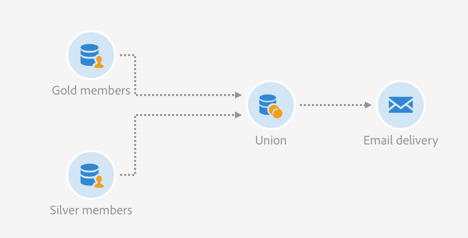

# Samenvoeging op twee verfijnde doelgroepen {#example--union-on-two-refined-audiences}

De workflow die in dit voorbeeld wordt gedefinieerd, toont de samenvoeging van twee activiteiten voor **[!UICONTROL Read audience]**. Het doel van deze workflow is om een e-mail te sturen naar Gold- of Silver-leden tussen 18 en 30 jaar oud. Er zijn al specifieke doelgroepen in het systeem gemaakt om de Gold- en Silver-leden bij te houden.

De workflow is als volgt ontworpen:

* Een eerste [Leespubliek](../../automating/using/read-audience.md) activiteit die het Gouden ledenpubliek terugwint en het door slechts profielen te selecteren verfijnt die tussen 18 en 30 jaar oud zijn.
* Een tweede activiteit **[!UICONTROL Read audience]** die de doelgroep met Silver-leden ophaalt en deze verfijnt door slechts profielen te selecteren die tussen 18 en 30 jaar oud zijn.
* A [Union](../../automating/using/union.md) activiteit die populaties van beide **[!UICONTROL Read audiences]** activiteiten verenigt in één eindpopulatie.
* Een [e-mailbezorging](../../automating/using/email-delivery.md) activiteit die de e-mail naar de populatie verzendt die uit de **[!UICONTROL Union]** activiteit komt.
