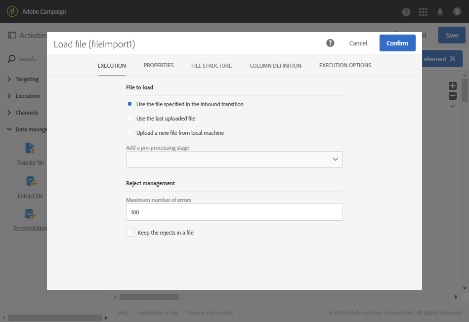

# Gegevens bijwerken op basis van een automatische bestandsdownload {#updating-data-automatic-file-download}

De activiteit voor het laden van een bestand structureert hoofdzakelijk de data van een activiteit voor het overdragen van een bestand om het in de bestaande data te integreren.

In het volgende voorbeeld wordt het resultaat getoond van een automatisch gedownloade activiteit voor het laden van een bestand via een activiteit voor het overdragen van een bestand, gevolgd door een activiteit voor het bijwerken van data. Deze workflow is bedoeld om de Adobe Campaign-database te verrijken met nieuwe profielen of om bestaande profielen bij te werken aan de hand van de data die uit het geïmporteerde bestand zijn hersteld.

Voer de volgende stappen uit om de workflow te maken:

1. Sleep en zet een activiteit [Bestand overdragen](../../automating/using/transfer-file.md) neer in uw workflow.
1. Selecteer de activiteit en open deze met de knop  vanuit de snelle acties die verschijnen.
1. Configureer de activiteit op een manier zodat het bestand dat u wilt herstellen wordt hersteld. Selecteer op het tabblad **[!UICONTROL Protocol]** de optie **SFTP**.
1. Selecteer de optie **Use connection parameters defined in an external account**.
1. Voer de naam van het externe account in.
1. Voer het **File path on the remote server** in.

   

1. Bevestig uw activiteit.
1. De belemmering en laat vallen a [ dossier ](../../automating/using/load-file.md) activiteit van de Lading in uw werkschema en plaatst het na de **[!UICONTROL Transfer file]** activiteit.
1. Selecteer de activiteit en open deze met de knop  vanuit de snelle acties die verschijnen.
1. Schakel in de sectie **[!UICONTROL File to load]** van het tabblad **[!UICONTROL Execution]** de optie **[!UICONTROL Use the file specified in the inbound transition]** in.

   

1. Configureer uw activiteit zoals eerder opgegeven.
1. De belemmering en laat vallen een [ gegevens van de Update ](../../automating/using/update-data.md) activiteit in uw werkschema en plaatst het na de **[!UICONTROL Load file]** activiteit, dan vormt het.

Nadat de workflow is gestart, worden de data uit het geüploade bestand geëxtraheerd en vervolgens gebruikt om de Adobe Campaign-database te verrijken.
