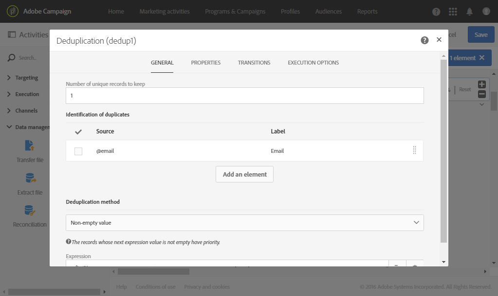

# Meerdere lidmaatschapsstatussen bijwerken vanuit een bestand {#updating-multiple-subscription-statuses-from-a-file}

In dit voorbeeld wordt getoond hoe u een bestand met profielen kunt importeren en hun inschrijving op verschillende services die in het bestand zijn opgegeven, kunt bijwerken. Nadat het bestand is geïmporteerd, moet een afstemming worden uitgevoerd, zodat de geïmporteerde data kunnen worden geïdentificeerd als profielen met een koppeling naar services. Om ervoor te zorgen dat het bestand geen duplicaten bevat, wordt een ontdubbelingsactiviteit uitgevoerd op de data.

De workflow wordt als volgt weergegeven:


* A [&#x200B; laadt dossier &#x200B;](../../automating/using/load-file.md) activiteit het profieldossier en bepaalt de structuur van de ingevoerde kolommen.

  In dit voorbeeld heeft het geladen bestand de csv-indeling en bevat het de volgende data:

  ```
  lastname;firstname;email;birthdate;service;operation
  jackman;megan;megan.jackman@testmail.com;07/08/1975;SVC2;sub
  phillips;edward;phillips@testmail.com;09/03/1986;SVC3;unsub
  weaver;justin;justin_w@testmail.com;11/15/1990;SVC3;sub
  martin;babeth;babeth_martin@testmail.net;11/25/1964;SVC3;unsub
  reese;richard;rreese@testmail.com;02/08/1987;SVC3;sub
  cage;nathalie;cage.nathalie227@testmail.com;07/03/1989;SVC3;sub
  xiuxiu;andrea;andrea.xiuxiu@testmail.com;09/12/1992;SVC4;sub
  grimes;daryl;daryl_890@testmail.com;12/06/1979;SVC3;unsub
  tycoon;tyreese;tyreese_t@testmail.net;10/08/1971;SVC2;sub
  ```

  

  Zoals u misschien hebt opgemerkt, wordt de bewerking in het bestand opgegeven als ‘sub’ of ‘unsub’. Het systeem verwacht dat een waarde **Boolean** of **Integer** de bewerking herkent die moet worden uitgevoerd: 0 voor uitschrijven en 1 voor inschrijven. Om aan deze vereiste te voldoen, wordt een nieuwe toewijzing van waarden uitgevoerd in de details van de kolom Operation.

  

  Als in uw bestand al 0 en 1 worden gebruikt om de bewerking te identificeren, hoeft u deze waarden niet opnieuw toe te wijzen. Zorg alleen dat de kolom op het tabblad **[!UICONTROL Column definition]** wordt verwerkt als een **Boolean** of **Integer**.

* A [&#x200B; de verzoenings &#x200B;](../../automating/using/reconciliation.md) activiteit identificeert de gegevens van het dossier als behorend tot de profieldimensie van het gegevensbestand van Adobe Campaign. Via het tabblad **[!UICONTROL Identification]** wordt het veld **Email** van het bestand afgestemd op het veld **Email** van de profielresource.

  

  Op het tabblad **[!UICONTROL Relations]** wordt een koppeling met de serviceresource gemaakt zodat het veld **service** van het bestand kan worden herkend. In dit voorbeeld komen de waarden overeen met het veld **name** van de serviceresource.

  

* A [&#x200B; Deduplicatie &#x200B;](../../automating/using/deduplication.md) die op het **wordt gebaseerd e-mail** gebied van het tijdelijke middel (resulterend uit de verzoening) identificeert duplicaten. Het is belangrijk om duplicaten te verwijderen aangezien het abonnement op de service voor alle data zal mislukken als er duplicaten zijn.

  

* De activiteit van de Diensten van het Abonnement van A [&#x200B; &#x200B;](../../automating/using/subscription-services.md) identificeert de diensten om als voortkomend uit de overgang, door de verbinding bij te werken die in de **[!UICONTROL Reconciliation]** activiteit wordt gecreeerd.

  Het **[!UICONTROL Operation type]** wordt geïdentificeerd als afkomstig van het veld **operation** van het bestand. U kunt hier alleen de velden Boolean of Integer selecteren. Als de kolom van het bestand dat de uit te voeren bewerking bevat, niet in de lijst voorkomt, moet u controleren of u de kolomindeling in de activiteit **[!UICONTROL Load file]** correct hebt ingesteld, zoals eerder in dit voorbeeld wordt uitgelegd.

  
