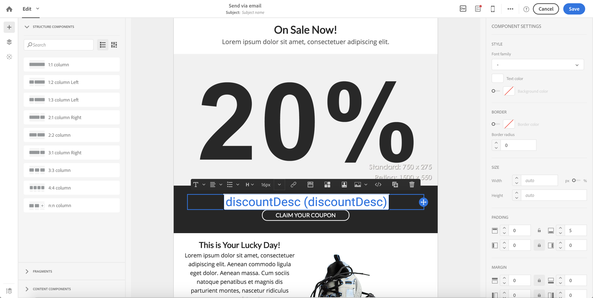

# Gebruiksscenario {#use-case}

Het onderstaande gebruiksgeval laat zien hoe u een workflow met parameters in uw workflows kunt aanroepen.

Het doel is een workflow te activeren vanaf een API-aanroep met externe parameters. Deze workflow laadt gegevens uit een bestand in uw database en maakt een gekoppeld publiek. Zodra het publiek is gecreeerd, zal een tweede werkschema worden teweeggebracht om een bericht te verzenden dat met de externe parameters wordt gepersonaliseerd die in de API vraag worden bepaald.

Voor dit gebruik moet u de volgende handelingen uitvoeren:

1. **Een API-aanroep maken** om Werkstroom 1 met externe parameters teweeg te brengen. Zie [Stap 1: De API-aanroep configureren](../../automating/using/use-case-calling-workflow.md#step-1--configuring-the-api-call).
1. **Workflow 1 samenstellen**: de workflow zal een bestand overbrengen en in de database laden . Vervolgens wordt getest of de gegevens leeg zijn of niet en worden de profielen uiteindelijk in een publiek opgeslagen. Tot slot zal het Werkschema 2 teweegbrengen. Zie [Stap 2: Workflow 1 configureren](../../automating/using/use-case-calling-workflow.md#step-2--configuring-workflow-1).
1. **Workflow 2 samenstellen**: De workflow leest het publiek dat in Workflow 1 is gemaakt en stuurt vervolgens een gepersonaliseerd bericht naar de profielen, met een segmentcode die met de parameters is aangepast. Zie [Stap 3: Workflow 2 configureren](../../automating/using/use-case-calling-workflow.md#step-3--configuring-workflow-2).


## Vereisten {#prerequisites}

Voordat u de workflows configureert, moet u eerst de workflows 1 en 2 maken met een **[!UICONTROL External signal]** in elk van hen. Deze manier, zult u deze signaalactiviteiten kunnen richten wanneer het roepen van de werkschema&#39;s.

## Stap 1: De API-aanroep configureren {#step-1--configuring-the-api-call}

Maak een API vraag om Werkstroom 1 met parameters teweeg te brengen. Raadpleeg voor meer informatie over de syntaxis van de API-aanroep de [Campaign Standard REST API&#39;s-documentatie](../../api/using/triggering-a-signal-activity.md).

In ons geval willen we de workflow met de volgende parameters bellen:

* **fileToTarget**: de naam van het bestand dat we in de database willen importeren.
* **discontoDesc**: de beschrijving die wij in de levering voor de korting willen tonen.

```
-X POST https://mc.adobe.io/<ORGANIZATION>/campaign/<TRIGGER_URL>
-H 'Authorization: Bearer <ACCESS_TOKEN>' 
-H 'Cache-Control: no-cache' 
-H 'X-Api-Key: <API_KEY>' 
-H 'Content-Type: application/json;charset=utf-8' 
-H 'Content-Length:79' 
-i
-d {
-d "source:":"API",
-d "parameters":{
-d "fileToTarget":"profile.txt",
-d "discountDesc":"Running shoes"
-d } 
```

## Stap 2: Workflow 1 configureren {#step-2--configuring-workflow-1}

Workflow 1 wordt als volgt samengesteld:

* **[!UICONTROL External signal]** activiteit: waar de externe parameters moeten worden gedeclareerd om binnen de werkstroom te worden gebruikt.
* **[!UICONTROL Transfer file]** activiteit: Hiermee importeert u het bestand met de naam die in de parameters is gedefinieerd.
* **[!UICONTROL Load file]** activiteit: laadt gegevens uit het geïmporteerde bestand in de database.
* **[!UICONTROL Update data]** activiteit: de database invoegen of bijwerken met gegevens uit het geïmporteerde bestand.
* **[!UICONTROL Test]** activiteit: controleert of er gegevens zijn geïmporteerd.
* **[!UICONTROL Save audience]** activiteit: als het bestand gegevens bevat, worden de profielen in een publiek opgeslagen.
* **[!UICONTROL End activity]** activiteit: roept Werkschema 2 met de parameters die u binnen het wilt gebruiken.


Voer de onderstaande stappen uit om de workflow te configureren:

1. Declareer de parameters die in de API vraag zijn bepaald. Om dit te doen, open **[!UICONTROL External signal]** en voeg vervolgens de namen en typen van de parameters toe.

   

1. Voeg een **[!UICONTROL Transfer file]** activiteit om gegevens in het gegevensbestand in te voeren. Om dit te doen, sleep en laat vallen de activiteit, open het dan selecteren **[!UICONTROL Protocol]** tab.
1. Selecteer **[!UICONTROL Use a dynamic file path]** en gebruikt u vervolgens de **fileToTarget** parameter als het over te dragen bestand:

   ```
   $(vars/@fileToTarget)
   ```

   

1. Laad de gegevens uit het bestand in de database.

   Hiervoor sleept u een **[!UICONTROL Load file]** activiteit in het werkschema, dan vorm het op uw behoeften.

1. De database invoegen en bijwerken met gegevens uit het geïmporteerde bestand.

   U doet dit door een **[!UICONTROL Update data]** activiteit, dan selecteer **[!UICONTROL Identification]** tab om een verzoeningscriterium toe te voegen (in ons geval **email** veld).

   

1. Selecteer **[!UICONTROL Fields to update]** en geeft u vervolgens de velden op die u wilt bijwerken in de database (in ons geval de **firstname** en **email** velden).

   

1. Controleer of gegevens uit het bestand zijn opgehaald. Hiervoor sleept u een **[!UICONTROL Test]** in de workflow en klik vervolgens op de knop **[!UICONTROL Add an element]** om een voorwaarde toe te voegen.
1. Geef de voorwaarde een naam en definieer deze. In ons geval, willen wij testen of bevat de uitgaande overgang gegevens met de syntaxis hieronder:

   ```
   $long(vars/@recCount)>0
   ```

   

1. Als gegevens worden opgehaald, slaat u deze op in een publiek. Hiervoor voegt u een **[!UICONTROL Save audience]** aan de **Doel is niet leeg** openen.
1. Selecteer **[!UICONTROL Use a dynamic label]** en gebruikt u vervolgens de **fileToTarget** parameter als label van het publiek:

   ```
   $(vars/@fileToTarget)
   ```

   

1. Sleep een **[!UICONTROL End]** activiteit die Werkschema 2 met parameters zal roepen, dan het openen.
1. Selecteer **[!UICONTROL External signal]** en geeft u vervolgens de workflow op die moet worden geactiveerd en de bijbehorende signaalactiviteit.
1. Bepaal de parameters die u binnen Werkschema 2 en hun bijbehorende waarden wilt gebruiken.

   In ons geval willen we de parameters doorgeven die oorspronkelijk in de API-aanroep zijn gedefinieerd (**fileToTarget** en **discontoDesc**) en een aanvullende **segmentCode** parameter met een constante waarde (&quot;20% korting&quot;).

   

Werkschema 1 wordt gevormd, kunt u Werkschema 2 nu bouwen. Raadpleeg [deze sectie](../../automating/using/use-case-calling-workflow.md#step-3--configuring-workflow-2) voor meer informatie.

## Stap 3: Workflow 2 configureren {#step-3--configuring-workflow-2}

Workflow 2 wordt als volgt samengesteld:

* **[!UICONTROL External signal]** activiteit: waar de parameters moeten worden gedeclareerd om binnen de werkstroom te worden gebruikt.
* **[!UICONTROL Read audience]** activiteit: leest het publiek dat is opgeslagen in Workflow 1.
* **[!UICONTROL Email delivery]** activiteit: verzendt een terugkerend bericht naar het gerichte publiek, gepersonaliseerd met parameters.


Voer de onderstaande stappen uit om de workflow te configureren:

1. Declareer de parameters die in Werkschema 1 zijn bepaald.

   Om dit te doen, open **[!UICONTROL External signal]** activiteit, dan voeg de naam en het type van elke parameter toe die in **[!UICONTROL End]** activiteit van Workflow 1.

   

1. Gebruik het publiek dat in Werkstroom 1 is opgeslagen. Hiervoor sleept u een **[!UICONTROL Read audience]** in de werkstroom te openen en vervolgens te openen.
1. Selecteer **[!UICONTROL Use a dynamic audience]** en gebruikt u vervolgens de **fileToTarget** parameter als de naam van het publiek dat moet worden gelezen:

   ```
   $(vars/@fileToTarget)
   ```

   

1. Geef de uitgaande overgang een naam op basis van de **segmentCode** parameter.

   Selecteer hiervoor de optie **[!UICONTROL Transition]** en vervolgens de **[!UICONTROL Use a dynamic segment code]** optie.

1. Gebruik de **segmentCode** parameter als naam van de uitgaande overgang:

   ```
   $(vars/@segmentCode)
   ```

   

1. Sleep een **[!UICONTROL Email delivery]** activiteit om een bericht naar het publiek te verzenden.
1. Identificeer de parameters in het bericht te gebruiken om het met te personaliseren **discontoDesc** parameter. Hiervoor opent u de geavanceerde opties van de activiteit en voegt u vervolgens de parameternaam en -waarde toe.

   

1. U kunt het bericht nu vormen. Open de activiteit en selecteer **[!UICONTROL Recurring email]**.

   

1. Selecteer de sjabloon die u wilt gebruiken en definieer de e-maileigenschappen naar wens.
1. Gebruik de **discontoDesc** parameter als een verpersoonlijkingsgebied. Selecteer dit in de lijst met personalisatievelden.

   

1. U kunt nu klaar zijn met het configureren van het bericht en het vervolgens op de gebruikelijke manier verzenden.

   

## Workflows uitvoeren {#executing-the-workflows}

Nadat de workflows zijn samengesteld, kunt u deze uitvoeren. Zorg ervoor dat de twee workflows zijn gestart voordat u de API-aanroep uitvoert.
