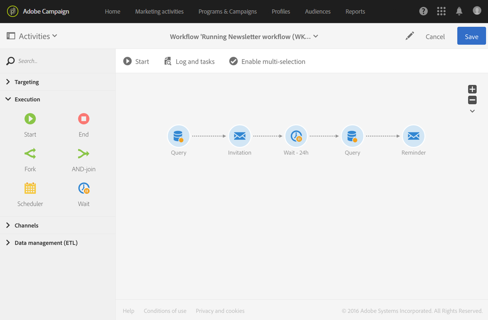

# Wait{#wait}

## Beschrijving {#description}

Met de activiteit **[!UICONTROL Wait]** wordt de uitvoering van een deel van de workflow tijdelijk opgeschort. De uitgaande overgang wordt na een vertraging (van een paar seconden tot meerdere maanden) weer geactiveerd, zodat de later geplaatste activiteiten worden uitgevoerd.

## Gebruikscontext {#context-of-use}

Met de activiteit **[!UICONTROL Wait]** kunt u een bepaalde tijd instellen tussen twee activiteiten die worden uitgevoerd. Bijvoorbeeld als u een aantal dagen wilt wachten na een e-mailleveringsactiviteit om het aantal open- en klikacties tijdens die periode te analyseren voordat u follow-upbewerkingen gaat uitvoeren (herinneringsmail, doelgroep maken, enz.).

## Configuratie {#configuration}

1. Sleep een activiteit **[!UICONTROL Wait]** en zet deze neer in uw workflow.
1. Selecteer de activiteit en open deze met de knop  vanuit de snelle acties die verschijnen.
1. Specificeer de **[!UICONTROL Duration]** van de wachttijd tussen het tijdstip waarop de binnenkomende en uitgaande overgangen van de activiteit worden geactiveerd.

   U kunt de tijdsduur handmatig of met de selectietool in het veld invoeren.

   

1. Bevestig de configuratie van uw activiteit en sla de workflow op.

## Voorbeeld {#example}

Het volgende voorbeeld illustreert de activiteit **[!UICONTROL Wait]** in een typisch gebruiksscenario. U stuurt een e-mailuitnodiging voor een evenement. Na 24 uur analyseert u de logboeken voor e-maillevering en stuurt u een herinneringsbericht naar iedereen die het eerste e-mailbericht wel heeft ontvangen maar zich niet heeft aangemeld.

De workflow wordt als volgt weergegeven:

* Een eerste **[!UICONTROL Query]** is gericht op de profielen waarnaar de e-mailuitnodiging wordt verzonden.
* Een **[!UICONTROL Email delivery]** verzendt de uitnodiging voor de eerste keer naar de geselecteerde profielen.
* Een **[!UICONTROL Wait]**-activiteit van 24 uur plaatst een pauze tussen het tijdstip waarop de uitnodiging is verzonden en de rest van de workflow.
* Een tweede **[!UICONTROL Query]** is gericht op de profielen die het eerste e-mailbericht wel hebben ontvangen, maar niet op de koppeling met de uitnodiging hebben geklikt.
* Een tweede **[!UICONTROL Email delivery]** stuurt een herinnering naar de geselecteerde personen.

