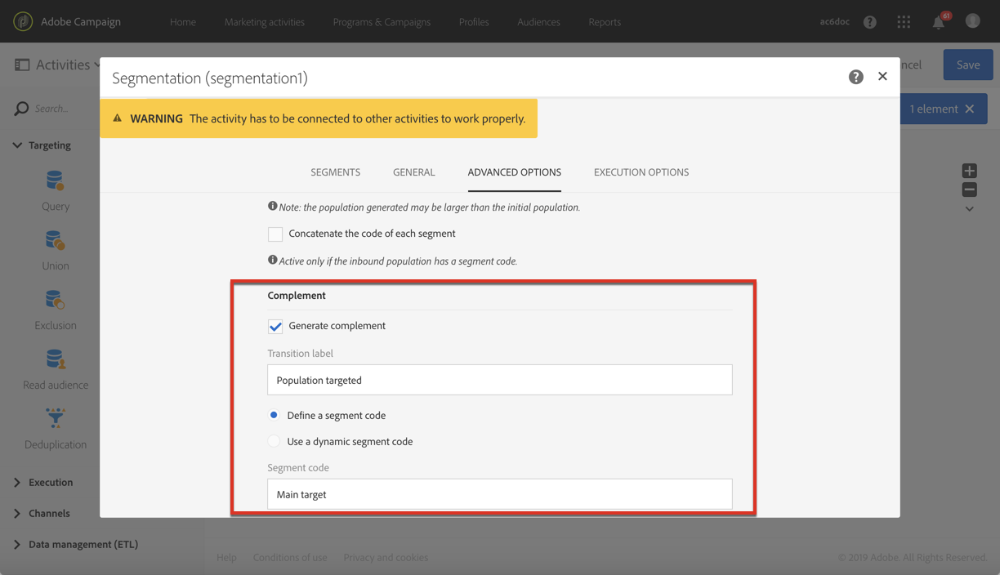
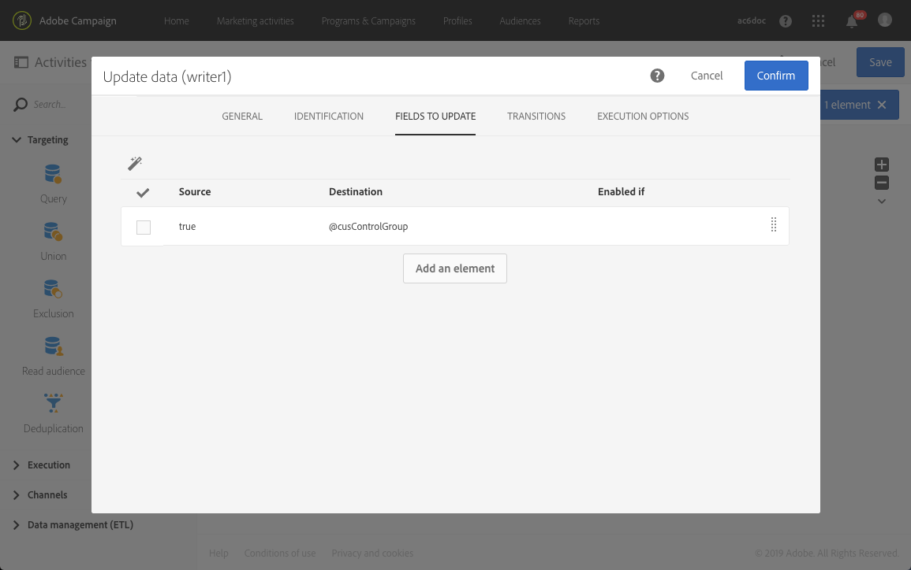

# Een controlegroep samenstellen {#building-control-group}

Om het effect van een levering te meten, kunt u sommige profielen van uw doel willen uitsluiten zodat zij geen bepaald bericht zullen ontvangen. Deze controlegroep kan worden gebruikt om een vergelijking met het gedrag van de doelbevolking te maken die het bericht ontving.

Hiertoe kunt u in Adobe Campaign Standard een workflow maken met de volgende activiteiten:
* Een activiteit van de [Vraag](../../automating/using/query.md) om een bepaalde bevolking te richten.
* Een [segmentatie](../../automating/using/segmentation.md) -activiteit om een willekeurige controlegroep van deze populatie te isoleren.
* An [Email delivery](../../automating/using/email-delivery.md) activity to send a message to the main target.
* An [Update data](../../automating/using/update-data.md) activity to update the profiles that were exclude from the target (the random control group).

## De profielbron uitbreiden {#extending-profile}

Eerst, moet u het **[!UICONTROL Profile]** middel met een nieuw gebied uitbreiden dat aan de controlegroep beantwoordt. Als de workflow eenmaal is uitgevoerd, wordt in dit veld gecontroleerd welke profielen zijn uitgesloten van het doel.

1. Klik **[!UICONTROL Administration]** in > **[!UICONTROL Development]** > **[!UICONTROL Custom Resources]** op **[!UICONTROL Create]**.
1. Als u het nog niet hebt uitgebreid, selecteer **[!UICONTROL Extend an existing resource]** en kies het **[!UICONTROL Profile]** middel.
1. Voeg op het **[!UICONTROL Data structure]** tabblad een nieuw veld toe voor de controlegroep en selecteer **[!UICONTROL Boolean]** **[!UICONTROL Type]** het veld.

   

1. Vouw op het **[!UICONTROL Screen definition]** tabblad de **[!UICONTROL Detail screen configuration]** sectie uit en selecteer het veld dat u net hebt gemaakt, zodat deze voor elk profiel wordt weergegeven.

   

1. Sla uw wijzigingen op.
1. Werk de databasestructuur bij om de **[!UICONTROL Profile]** uitgebreide bron te publiceren. Zie Een aangepaste bron [publiceren](../../developing/using/updating-the-database-structure.md#publishing-a-custom-resource).

Voor meer bij het uitbreiden van een douanemiddel, zie [Zeer belangrijke stappen om een middel](../../developing/using/key-steps-to-add-a-resource.md)toe te voegen.

## Een workflow maken {#creating-a-workflow}

1. Klik in **[!UICONTROL Marketing Activities]** en selecteer **[!UICONTROL Create]** de optie **[!UICONTROL Workflow]**.
1. Selecteer **[!UICONTROL New Workflow]** als workflowtype en klik op **[!UICONTROL Next]**.
1. Voer de eigenschappen van de workflow in en klik op **[!UICONTROL Create]**.

De gedetailleerde stappen voor het maken van een workflow worden weergegeven in de sectie [Een workflow](../../automating/using/building-a-workflow.md) maken.

## Query-activiteiten maken {#create-a-query-activity}

1. In **[!UICONTROL Activities]** > **[!UICONTROL Targeting]**, sleep en laat vallen een activiteit van de [Vraag](../../automating/using/query.md) .
1. Dubbelklik op de activiteit om het doel te definiëren.
1. U kunt bijvoorbeeld bij **[!UICONTROL Shortcuts]** slepen en neerzetten **[!UICONTROL Profile]** een selectie maken **[!UICONTROL Age]** met de operator **[!UICONTROL Greater than]** en 25 typen in het **[!UICONTROL Value]** veld.
1. Klik op **[!UICONTROL Confirm]**.

## Een segmentatieactiviteit maken {#creating-a-segmentation-activity}

1. Sleep een [segmentatie](../../automating/using/segmentation.md) -activiteit en dubbelklik erop.
1. Selecteer op het **[!UICONTROL Segments]** tabblad het segment dat u wilt bewerken.
1. Selecteer de **[!UICONTROL Configuration]** **[!UICONTROL Limit the population of this segment]** optie op het tabblad van dat segment.

   

1. Controleer of de optie op het **[!UICONTROL Limitation]** tabblad is **[!UICONTROL Random sampling]** geselecteerd.

   

1. Definieer een percentage van de oorspronkelijke populatie, bijvoorbeeld 10% en klik op **[!UICONTROL Confirm]**. De controlegroep bestaat uit 10% van de doelpopulatie, die willekeurig wordt geselecteerd.
1. Selecteer op het **[!UICONTROL Advanced options]** tabblad de **[!UICONTROL Generate complement]** optie en vul de **[!UICONTROL Transition label]** en de **[!UICONTROL Segment code]** velden in.

   

1. Klik op **[!UICONTROL Confirm]**.

## E-mailactiviteiten maken {#creating-an-email-activity}

1. Sleep in **[!UICONTROL Activities]** > **[!UICONTROL Channels]** een [e-mailbezorgingsactiviteit](../../automating/using/email-delivery.md) na het hoofddoelsegment.
1. Klik op de activiteit en selecteer deze  om deze te bewerken.
1. Selecteer **[!UICONTROL Single send email]** en klik op **[!UICONTROL Next]**.
1. Selecteer een e-mailsjabloon en klik op **[!UICONTROL Next]**.
1. Voer de e-maileigenschappen in en klik op **[!UICONTROL Next]**.
1. Klik op om de lay-out van uw e-mail te maken **[!UICONTROL Use the Email Designer]**.
1. Bewerk de inhoud en sla deze op.
1. Schakel in het **[!UICONTROL Schedule]** gedeelte van het berichtdashboard de optie **[!UICONTROL-verzoek bevestigen voordat u berichten verzendt}** uit.

## Een updategegevensactiviteit maken {#creating-update-data-activity}

1. Sleep en laat vallen een de gegevensactiviteit van de [Update](../../automating/using/update-data.md) na het segment van de controlegroep.
1. Selecteer de activiteit, dan open het gebruikend de  knoop van de snelle acties die verschijnen.
1. Selecteer op het **[!UICONTROL General]** tabblad een optie in de **[!UICONTROL Update]** **[!UICONTROL Operation type]** vervolgkeuzelijst.
1. Selecteer op het **[!UICONTROL Identification]** tabblad de **[!UICONTROL Directly using the targeting dimension]** optie.
1. Selecteer de **[!UICONTROL Profile]** bron die u eerder hebt uitgebreid als de dimensie die u wilt bijwerken.

   

1. Op het **[!UICONTROL Fields to update]** lusje, selecteer het gebied van de controlegroep dat u aan het **[!UICONTROL Profile]** middel als **[!UICONTROL Destination]** en ga waar als voorwaarde toevoegde.

   

1. Klik op **[!UICONTROL Confirm]**.

## De workflow uitvoeren {#running-the-workflow}

Klik **[!UICONTROL Start]** om de workflow uit te voeren.

Zodra het werkschema in werking wordt gesteld, wordt de bevolking van de controlegroep uitgesloten, en het bericht wordt verzonden naar het resterende belangrijkste doel.

De **[!UICONTROL Profile]** bron wordt als volgt bijgewerkt: als een profiel in de controlegroep was, wordt het overeenkomstige gebied gecontroleerd.

U kunt nu vergelijken hoe de ontvangers van het bericht zullen reageren vergeleken met de kleine groep die van het bericht werd uitgesloten en het niet ontving.

## Dezelfde controlegroep opnieuw gebruiken {#reusing-same-control-group}

In het bovenstaande voorbeeld kunt u een algemene controlegroep maken, omdat dit onafhankelijk van leveringen als profielkenmerk wordt opgeslagen. Het nieuwe veld &quot;Controlegroep&quot; dat is gemaakt als onderdeel van de **[!UICONTROL Profile]** resourceextensie wordt bijgewerkt nadat de bovenstaande workflow is uitgevoerd.

Dientengevolge, volgende keer u de zelfde controlegroep wilt gebruiken, kunt u op het nieuwe gebied van de &quot;groep van de Controle&quot;segmenteren eerder dan het doen van een willekeurige segmentatie.

Dit doet u als volgt:
1. Selecteer bij het maken van de **[!UICONTROL Segmentation]** activiteit het segment dat u wilt bewerken op het **[!UICONTROL Segments]** tabblad.
1. Zorg ervoor dat u op het **[!UICONTROL Configuration]** tabblad van dat segment de **[!UICONTROL Limit the population of this segment]** optie niet selecteert.
1. Sleep in het **[!UICONTROL Filtering]** **[!UICONTROL Profiles (attributes)]** tabblad naar de hoofdwerkruimte.

   

1. Selecteer in het **[!UICONTROL Add a rule - Profiles (attributes)]** venster &quot;Controlegroep&quot; (het veld dat u aan de **[!UICONTROL Profile]** bron hebt toegevoegd) en selecteer **[!UICONTROL Yes]** als filtervoorwaarde.

   
