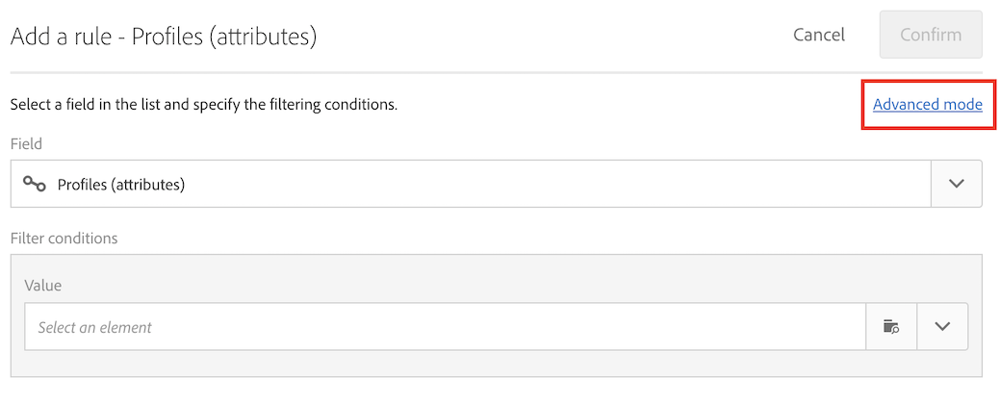

# Leveringen maken op de aanmaakdatum van profielen {#creation-date-query}

U kunt een voorstel via e-mail verzenden op de verjaardag van het maken van het profiel van de klant.

1. Klik in **[!UICONTROL Marketing Activities]** op **[!UICONTROL Create]** en selecteer **[!UICONTROL Workflow]**.
1. Selecteer **[!UICONTROL New Workflow]** als workflowtype en klik op **[!UICONTROL Next]**.
1. Voer de eigenschappen van de workflow in en klik op **[!UICONTROL Create]**.

## Een activiteit Planner maken {#creating-a-scheduler-activity}

1. In **[!UICONTROL Activities]** > **[!UICONTROL Execution]**, belemmering en laat vallen een [Planner](../../automating/using/scheduler.md) activiteit.
1. Dubbelklik op de activiteit.
1. Configureer de uitvoering van uw levering.
1. In **[!UICONTROL Execution frequency]** selecteert u **[!UICONTROL Daily]**.
1. Selecteer een **[!UICONTROL Time]** en **[!UICONTROL Repetition frequency]** van uitvoering voor uw werkschema.
1. Selecteer een **[!UICONTROL Start]** datum en **[!UICONTROL Expiration]** voor uw werkschema.
1. Bevestig uw activiteit en sla de workflow op.

>[!NOTE]
>
>Om uw werkschema bij een specifieke tijdzone, op het **[!UICONTROL Execution options]** lusje te beginnen, opstelling de tijdzone voor uw planner op het **[!UICONTROL Time zone]** gebied. Standaard is de geselecteerde tijdzone de tijdzone die is gedefinieerd in de workfloweigenschappen (zie [Een workflow maken](../../automating/using/building-a-workflow.md)).


## Een queryactiviteit maken {#creating-a-query-activity}

1. Als u ontvangers wilt selecteren, sleept u een [Query](../../automating/using/query.md)-activiteit en dubbelklikt u erop.
1. Voeg **[!UICONTROL Profiles]** toe en selecteer **[!UICONTROL no longer contact by email]** met de waarde **[!UICONTROL no]**.

### Profielen ophalen die zijn gemaakt op dezelfde dag als de dag van uitvoering {#retrieving-profiles-created-on-the-same-day}

1. Sleep in **[!UICONTROL Profile]** het veld **[!UICONTROL Created]**. en klik op **[!UICONTROL Advanced Mode]**.
   
1. Dubbelklik in **[!UICONTROL list of functions]** op **[!UICONTROL Day]** in het knooppunt **[!UICONTROL Date]**.
1. Voeg vervolgens het veld **[!UICONTROL Created]** in als argument.
1. Selecteer **[!UICONTROL equals to (=)]** als exploitant.
1. Selecteer **[!UICONTROL Day]** bij Waarde in het knooppunt **[!UICONTROL Date]** in **[!UICONTROL List of functions]**.
1. Voeg de functie **[!UICONTROL GetDate()]** in als argument.

U hebt de profielen opgehaald die op de aanmaakdag gelijk zijn aan de huidige dag.

U zou moeten eindigen met:

```Day(@created) = Day(GetDate())```


Klik op **[!UICONTROL Confirm]**.

### Profielen ophalen die zijn gemaakt op dezelfde maand als de maand van uitvoering{#retrieving-profiles-created-on-the-same-month}

1. Voor **[!UICONTROL Query]** redacteur, selecteer de eerste vraag en dupliceer het.
1. Open het duplicaat.
1. Vervang **[!UICONTROL Day]** door **[!UICONTROL Month]** in de vraag.
1. Klik op **[!UICONTROL Confirm]**.


U zou met dit moeten eindigen:

``` Month(@created) = Month(GetDate()) ```

De uiteindelijke query wordt weergegeven:

```Day(@created) = Day(GetDate()) AND Month(@created) = Month(GetDate())```


## Een e-maillevering maken{#creating-an-email-delivery}

1. Sleep een [e-maillevering](../../automating/using/email-delivery.md) activiteit.
1. Klik op de activiteit en selecteer  om te bewerken.
1. Selecteer **[!UICONTROL Recurring email]** en klik op **[!UICONTROL Next]**.
1. Selecteer een e-mailsjabloon en klik op **[!UICONTROL Next]**.
1. Voer de e-maileigenschappen in en klik op **[!UICONTROL Next]**.
1. Klik op **[!UICONTROL Email Designer]** om de lay-out van uw e-mail te bepalen.
1. Voeg elementen in of selecteer een bestaande sjabloon.
1. Personaliseer uw e-mail met velden en koppelingen.
Zie [Een e-mail ontwerpen](../../designing/using/designing-from-scratch.md#designing-an-email-content-from-scratch) voor meer informatie.
1. Klik op **[!UICONTROL Preview]** om uw lay-out te controleren.
1. Klik op **[!UICONTROL Save]**.

**Verwante onderwerpen:**

* [E-mailkanaal](../../channels/using/creating-an-email.md)
