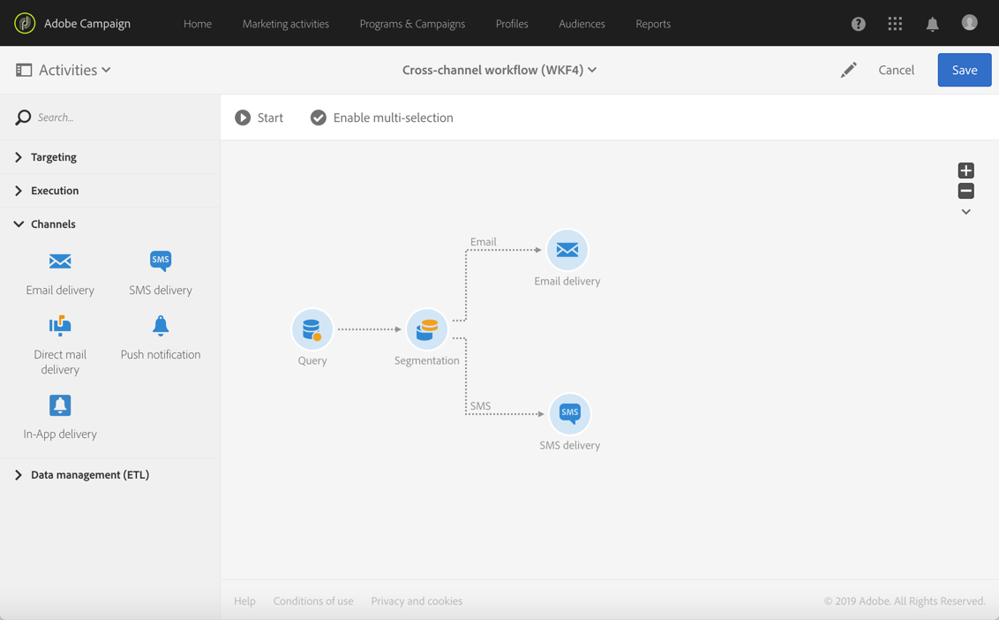

# Een kanaaloverschrijdende levering maken{#cross-channel-delivery}

Ontdek in dit document de volgende functionaliteit van Adobe Campaign met behulp van een standaardscenario: een workflow voor kanaaloverschrijdende levering maken.

Het is de bedoeling een doelgroep te selecteren uit de ontvangers in de database en deze te segmenteren in twee verschillende groepen met als doel een e-mail naar de eerste groep en een sms-bericht naar de tweede groep te sturen.

Raadpleeg de volgende documenten voor meer informatie over workflows en de verschillende kanalen die beschikbaar zijn in Adobe Campaign:

* [Workflows detecteren](../../automating/using/get-started-workflows.md)
* [Communicatiekanalen detecteren](../../channels/using/get-started-communication-channels.md)

## Een workflow maken {#creating-workflow}

U moet eerst het doel definiëren als u twee verschillende leveringen naar een bepaalde groep wilt verzenden.

Hiervoor moet u een query maken om de ontvangers te identificeren en daar hebt u een workflow voor nodig.

Maak een nieuwe workflow in het programma of de campagne van uw keuze:

1. Klik in **[!UICONTROL Marketing Activities]** op **[!UICONTROL Create]** en selecteer **[!UICONTROL Workflow]**.
1. Selecteer **[!UICONTROL New Workflow]** als workflowtype en klik op **[!UICONTROL Next]**.
1. Voer de eigenschappen van de workflow in en klik op **[!UICONTROL Create]**.

De gedetailleerde stappen voor het maken van een workflow worden uitgelegd in de sectie [Een workflow maken](../../automating/using/building-a-workflow.md).

## Een queryactiviteit maken {#creating-query-activity}

U hebt toegang tot de interface van een workflow zodra deze is gemaakt.

Voeg een queryactiviteit aan uw workflow toe om doelgericht de profielen te benaderen die uw leveringen zullen ontvangen.

1. Sleep in **[!UICONTROL Activities]** > **[!UICONTROL Targeting]** een [Query](../../automating/using/query.md)-activiteit en zet deze neer.
1. Dubbelklik op de activiteit.
1. Blader in het **[!UICONTROL Target]** tabblad door de sneltoetsen en selecteer een van uw [doelgroepen](../../audiences/using/about-audiences.md).
1. Sleep de sneltoets naar de bewerkingszone. Afhankelijk van het geselecteerde type sneltoets wordt een venster weergegeven.
1. Configureer de targetingelementen en bevestig uw query.

U kunt een query voor een of meerdere elementen maken.

Gebruik de knop **[!UICONTROL Count]** om een schatting te bekijken van het aantal profielen waarop de query zich richt.

## Een segmentatie-activiteit maken {#creating-segmentation-activity}

Zodra uw doel door de queryactiviteit is geïdentificeerd, moet u een criterium selecteren om het doel in twee verschillende populaties te segmenteren: een gedeelte ontvangt een e-mail en het andere gedeelte ontvangt een sms.

You have to use a [Segmentation](../../automating/using/segmentation.md) activity to create one or several segments from a population computed upstream in a query.

De groep **Email** richt zich op ontvangers waarvoor een e-mailadres, maar geen mobiel telefoonnummer is gedefinieerd. De **sms**-groep bevat de ontvangers van wie het mobiele telefoonnummer in het profiel is opgeslagen.

De eerste overgang configureren (e-mail):

1. In het tabblad **[!UICONTROL Segments]** is standaard een eerste segment geplaatst. Bewerk de eigenschappen om dat segment te configureren.

   

1. Selecteer de **[!UICONTROL Email]** van het profiel als filtercriterium.

   

1. Selecteer de operator **[!UICONTROL Is not empty]** in het nieuwe venster dat op het scherm wordt geopend.

   

1. Voeg een tweede filtercriterium **[!UICONTROL Mobile]** toe en selecteer de operator **[!UICONTROL Is empty]**.

   

   Alle profielen die afkomstig zijn van de query met een e-mailadres, maar zonder mobiel telefoonnummer, staan in deze overgang.

1. Bewerk het overgangslabel om de workflow te verduidelijken. Bevestig uw wijzigingen.

   

Uw eerste overgang is geconfigureerd. De tweede overgang (sms) configureren:

1. Klik op de knop **[!UICONTROL Add an element]** om een nieuwe overgang toe te voegen.
1. Definieer een voorwaarde waarmee u alle profielen met mobiele telefoonnummers kunt ophalen. Maak hiervoor een regel in het veld **[!UICONTROL Mobile]** met de logische operator **[!UICONTROL Is not empty]**.

   

   Alle profielen die afkomstig zijn van de query en waarvoor een mobiel telefoonnummer is gedefinieerd, bevinden zich in deze overgang.

1. U kunt het label van de overgang bewerken. Bevestig uw wijzigingen.

Uw tweede overgang is nu ook geconfigureerd.

## Leveringen maken {#creating-deliveries}

As two transitions were already created, you must now add two types of deliveries to the outbound transitions of the Segmentation activity: an [Email delivery](../../automating/using/email-delivery.md) activity and an [SMS delivery](../../automating/using/sms-delivery.md) activity.

Gebruik Adobe Campaign om leveringen aan een workflow toe te voegen. Om dit te kunnen doen, selecteert u een levering in de categorie **[!UICONTROL Channels]** van het activiteitenpalet van uw workflow.

Een e-maillevering maken:

1. Sleep een [e-mailleveringsactiviteit](../../automating/using/email-delivery.md) na het eerste segment.
1. Dubbelklik op de activiteit om deze te bewerken.
1. Selecteer **[!UICONTROL Simple email]**.
1. Selecteer **[!UICONTROL Add an outbound transition with the population]** en klik op **[!UICONTROL Next]**.

   

   De uitgaande overgang maakt het mogelijk om de populatie en de trackinglogboeken te herstellen. Gebruik dit bijvoorbeeld om een tweede e-mail te sturen naar de personen die niet in de eerste e-mail hebben geklikt.

1. Selecteer een e-mailsjabloon en klik op **[!UICONTROL Next]**.
1. Voer de e-maileigenschappen in en klik op **[!UICONTROL Next]**.
1. Selecteer **[!UICONTROL Use the Email Designer]** om de lay-out van uw e-mail te bepalen.
1. Bewerk de content en sla deze op.
1. In the **[!UICONTROL Schedule]** section of the message dashboard, unselect the **[!UICONTROL Request confirmation before sending messages]** option.

Een sms-levering maken:

1. Sleep een [SMS-leveringsactiviteit](../../automating/using/sms-delivery.md) na het andere segment.
1. Dubbelklik op de activiteit om deze te bewerken.
1. Selecteer **[!UICONTROL SMS]** en klik op **[!UICONTROL Next]**.
1. Selecteer een sms-sjabloon en klik op **[!UICONTROL Next]**.
1. Voer de sms-eigenschappen in en klik op **[!UICONTROL Next]**.
1. Bewerk de content en sla deze op.

U kunt de workflow starten zodra de leveringen zijn gemaakt en bewerkt.

## De workflow uitvoeren {#running-the-workflow}

Once the workflow is started, the population targeted by the **[!UICONTROL Query]** activity will be segmented to receive an Email or SMS delivery.

Klik op de knop **[!UICONTROL Start]** op de actiebalk om de workflow uit te voeren.

U kunt uw leveringen bekijken in het geavanceerde menu **[!UICONTROL Marketing plans]** > **[!UICONTROL Marketing activities]**, te bereiken via het Adobe Campaign-logo. Klik op de levering en vervolgens op de knop **[!UICONTROL Reports]** voor toegang tot de [leveringsrapporten](../../reporting/using/about-dynamic-reports.md#accessing-dynamic-reports), zoals het leveringsoverzicht, het openingspercentage of de e-mailweergave volgens de inbox van de ontvangers.
