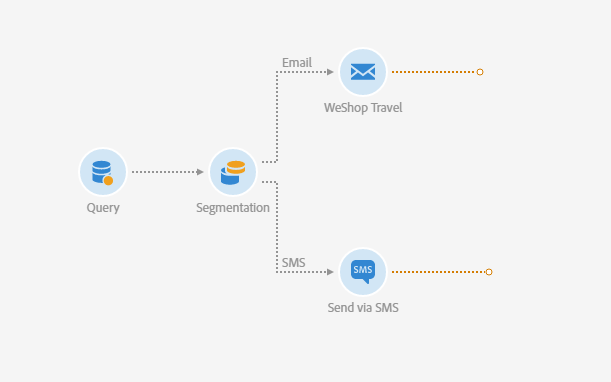

# Een levering tussen kanalen maken{#cross-channel-delivery}

In dit document kunt u de volgende Adobe Campaign-functionaliteit vinden via een standaard gebruiksscenario: het creëren van een workflow voor levering tussen kanalen.

Het doel is hier een publiek te selecteren uit de ontvangers van de database en deze te segmenteren in twee verschillende groepen met als doel een e-mail naar de eerste groep en een SMS-bericht naar de tweede groep te sturen.

Raadpleeg de volgende documenten voor meer informatie over workflows en de verschillende beschikbare kanalen in Adobe Campaign:

* [Workflows detecteren](../../automating/using/get-started-workflows.md)
* [Communicatiekanalen detecteren](../../channels/using/get-started-communication-channels.md)

## Een workflow maken {#creating-workflow}

Als u twee verschillende leveringen naar een bepaalde groep wilt verzenden, moet u eerst het doel definiëren.

Hiervoor moet u een query maken om de ontvangers te identificeren. Daarom moet u een workflow maken.

Maak een nieuwe workflow in het programma of de campagne die u kiest:

1. Klik in **[!UICONTROL Marketing Activities]** en selecteer **[!UICONTROL Create]** de optie **[!UICONTROL Workflow]**.
1. Selecteer **[!UICONTROL New Workflow]** als workflowtype en klik op **[!UICONTROL Next]**.
1. Voer de eigenschappen van de workflow in en klik op **[!UICONTROL Create]**.

De gedetailleerde stappen voor het maken van een workflow worden weergegeven in de sectie [Een workflow](../../automating/using/building-a-workflow.md) maken.

## Query-activiteiten maken {#creating-query-activity}

Zodra het werkschema wordt gecreeerd, kunt u tot zijn interface toegang hebben.

Voeg een activiteit van de Vraag in uw werkschema op om de profielen te richten die uw leveringen zullen ontvangen.

1. In **[!UICONTROL Activities]** > **[!UICONTROL Targeting]**, sleep en laat vallen een activiteit van de [Vraag](../../automating/using/query.md) .
1. Dubbelklik op de activiteit.
1. Blader op het **[!UICONTROL Target]** tabblad door de sneltoetsen en selecteer een van uw [doelgroepen](../../audiences/using/about-audiences.md).
1. Sleep de sneltoets naar de bewerkingszone. Afhankelijk van het geselecteerde type sneltoets wordt een venster weergegeven.
1. Vorm het richten elementen dan bevestig uw vraag.

U kunt een query voor een of meerdere elementen maken.

Gebruik de **[!UICONTROL Count]** knop om een schatting te zien van het aantal profielen dat de query als doel heeft.

## Een segmentatieactiviteit maken {#creating-segmentation-activity}

Zodra uw doel door de activiteit van de Vraag wordt geïdentificeerd, moet u een criterium selecteren om het doel in twee verschillende populaties te segmenteren: De ene ontvangt een e-mail en de andere ontvangt een SMS.

U moet een [Segmenteringsactiviteit](../../automating/using/segmentation.md) gebruiken om één of verscheidene segmenten van een bevolking tot stand te brengen die stroomopwaarts in een vraag wordt berekend.

De groep **E-mail** richt zich op ontvangers waarvoor een e-mailadres is gedefinieerd, maar geen mobiel telefoonnummer. De **SMS** -groep bevat de ontvangers waarvan het mobiele telefoonnummer in het profiel is opgeslagen.

De eerste overgang configureren (e-mail):

1. Op het **[!UICONTROL Segments]** tabblad is standaard een eerste segment aanwezig. Bewerk de eigenschappen om dat segment te configureren.

   

1. Selecteer het profiel **[!UICONTROL Email]** als filtercriterium.

   

1. Selecteer de **[!UICONTROL Is not empty]** operator in het nieuwe venster dat op het scherm wordt weergegeven.

   

1. Voeg een tweede filtercriterium toe **[!UICONTROL Mobile]** en selecteer de operator **[!UICONTROL Is empty]**.

   

   Alle profielen die afkomstig zijn van de query en die een e-mail hebben, maar geen mobiel telefoonnummer gedefinieerd, bevinden zich in deze overgang.

1. Om de workflow duidelijker te maken, kunt u het overgangslabel bewerken. Bevestig uw wijzigingen.

   

Uw eerste overgang wordt gevormd. De tweede overgang (SMS) configureren:

1. Klik op de **[!UICONTROL Add an element]** knop om een nieuwe overgang toe te voegen.
1. Definieer een voorwaarde waarmee u alle profielen kunt ophalen waarvan de mobiele telefoonnummers zijn opgegeven. Hiertoe maakt u een regel op het **[!UICONTROL Mobile]** veld met de **[!UICONTROL Is not empty]** logische operator.

   

   Alle profielen die afkomstig zijn van de query en waarvoor een mobiel telefoonnummer is gedefinieerd, bevinden zich in deze overgang.

1. U kunt het label van de overgang bewerken. Bevestig uw wijzigingen.

Uw tweede overgang is nu ook gevormd.

## Leveringen maken {#creating-deliveries}

Aangezien twee overgangen reeds werden gecreeerd, moet u twee soorten leveringen aan de uitgaande overgangen van de activiteit van de Segmentatie nu toevoegen: een [e-mailleveringsactiviteit](../../automating/using/email-delivery.md) en een [SMS-leveringsactiviteit](../../automating/using/sms-delivery.md) .

Met Adobe Campaign kunt u leveringen toevoegen aan een workflow. Selecteer hiertoe een levering in de **[!UICONTROL Channels]** categorie van het activiteitenpalet van uw workflow.

Een e-maillevering maken:

1. Sleep een [e-mailleveringsactiviteit](../../automating/using/email-delivery.md) na het eerste segment.
1. Dubbelklik op de activiteit om deze te bewerken.
1. Selecteer **[!UICONTROL Simple email]**.
1. Selecteer **[!UICONTROL Add an outbound transition with the population]** en klik op **[!UICONTROL Next]**.

   

   De uitgaande overgang zal u toestaan om de bevolking en het volgen logboeken terug te krijgen. U kunt dit bijvoorbeeld gebruiken om een tweede e-mail te sturen naar de personen die niet in de eerste e-mail hebben geklikt.

1. Selecteer een e-mailsjabloon en klik op **[!UICONTROL Next]**.
1. Voer de e-maileigenschappen in en klik op **[!UICONTROL Next]**.
1. Selecteer **[!UICONTROL Use the Email Designer]**.
1. Bewerk de inhoud en sla deze op.
1. Schakel in het **[!UICONTROL Schedule]** gedeelte van het berichtdashboard de optie **[!UICONTROL-verzoek bevestigen voordat u berichten verzendt}** uit.

Een SMS-verzending maken:

1. Sleep een [SMS-leveringsactiviteit](../../automating/using/sms-delivery.md) na het andere segment.
1. Dubbelklik op de activiteit om deze te bewerken.
1. Selecteer **[!UICONTROL SMS]** en klik op **[!UICONTROL Next]**.
1. Selecteer een SMS-sjabloon en klik op **[!UICONTROL Next]**.
1. Voer de SMS-eigenschappen in en klik op **[!UICONTROL Next]**.
1. Bewerk de inhoud en sla deze op.

Nadat u de leveringen hebt gemaakt en bewerkt, kunt u de workflow starten.

## De workflow uitvoeren {#running-the-workflow}

Zodra de workflow is gestart, wordt de populatie waarop de **[!UICONTROL Query]** activiteit betrekking heeft, gesegmenteerd om een e-mail- of sms-levering te ontvangen.

Klik op de **[!UICONTROL Start]** knop op de actiebalk om de workflow uit te voeren.

Via het Adobe Campaign-logo hebt u toegang tot uw leveringen via het menu **[!UICONTROL Marketing plans]** > **[!UICONTROL Marketing activities]** Geavanceerd. Klik op de levering en vervolgens op de **[!UICONTROL Reports]** knop om de [leveringsrapporten](../../reporting/using/about-dynamic-reports.md#accessing-dynamic-reports)te openen, zoals de leveringssamenvatting, de open snelheid of de e-mailrendering volgens het berichtvenster van de ontvangers.
