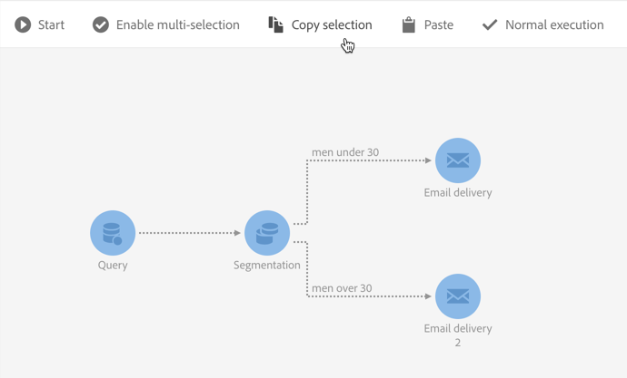

# Workflowinterface{#workflow-interface}

U kunt workflows maken om volledige processen in uw campagnes en programma&#39;s te beheren.

Het werkstroombewerkingsscherm bestaat uit de volgende elementen:

* Het [palet](#palette), waarin wordt verwezen naar de beschikbare activiteiten.
* De [werkruimte](#workspace)waarin de activiteiten zijn geconfigureerd en georganiseerd.
* De [actiebalk](#action-bar)bestaat uit knoppen waarmee u kunt communiceren met de workflow en/of de componenten ervan.
* Met de [snelle acties](#quick-actions), die rond een geselecteerde activiteit verschijnen, kunt u ermee werken.

## Palet {#palette}

Het palet bevindt zich aan de linkerkant van het scherm. Alle beschikbare activiteiten worden ingedeeld in verschillende categorieën:

* [Doelstelling](../../automating/using/about-targeting-activities.md): activiteiten die specifiek gericht zijn op doelgerichte activiteiten, manipulatie van bevolkingsgegevens en filteractiviteiten
* [Uitvoering](../../automating/using/about-execution-activities.md): specifieke activiteiten voor het organiseren en uitvoeren van workflows
* [Kanalen](../../automating/using/about-channel-activities.md): activiteiten die de verschillende beschikbare communicatiekanalen vertegenwoordigen
* [Gegevensbeheer (ETL)](../../automating/using/about-data-management-activities.md): specifieke activiteiten voor het manipuleren van gegevens

Als u een activiteit wilt gebruiken vanuit het palet in uw workflow, sleept u deze naar de werkruimte.

U moet elke activiteit vormen die vanaf het palet wordt toegevoegd alvorens het werkschema te beginnen.

## Werkruimte {#workspace}

De werkruimte is de centrale zone in de werkstroomeditor. Het is in deze streek dat u uw activiteiten kunt laten vallen, hen verbinden samen gebruikend overgangen, en hen vormen.

Als u twee activiteiten wilt koppelen, verplaatst u het einde van de pijl van de eerste activiteit naar de volgende activiteit totdat ze verbinding maken. U kunt de activiteit naar het punt van de pijl achter het bewegen om het aan de voorafgaande activiteit te verbinden. Als u een van de activiteiten verplaatst, blijven deze gekoppeld.

Overgangen na activiteiten die gegevens verwerken, bevatten de intermediaire populaties. U kunt ze openen door de **[!UICONTROL Keep interim results]** optie in het **[!UICONTROL Execution]** gedeelte van de workfloweigenschappen te selecteren.

>[!CAUTION]
>
>Deze optie verbruikt veel schijfruimte en is ontworpen om u te helpen een workflow te maken en een correcte configuratie en functionaliteit te garanderen. Laat deze optie uitgeschakeld op productie-instanties.

Wanneer een activiteit wordt geselecteerd, verschijnen de snelle acties rond de activiteit, toestaand u om met het in wisselwerking te staan. Als u bijvoorbeeld een activiteit wilt configureren, selecteert u deze en opent u deze vervolgens met de  knop in de snelle handelingen.

Bepaalde functies zijn alleen beschikbaar in de werkruimte:

* Selecteer verschillende activiteiten en overgangen door er een zone omheen te tekenen.
* Druk op **Ctrl** en klik met de linkermuisknop om meerdere handelingen en/of overgangen te selecteren.
* Druk op **Enter** om de details van de geselecteerde activiteit of overgang weer te geven.
* Druk op **Delete** om de geselecteerde activiteit te verwijderen.
* Druk op **Ctrl + C** om de geselecteerde activiteiten te kopiëren en op **Ctrl + V** om deze in de werkruimte te plakken.

## Actiebalk {#action-bar}

Afhankelijk van de elementen die zijn geselecteerd in de werkruimte of de uitvoeringsstatus van de workflow, kunnen de knoppen in de actiebalk afwijken.

 **[!UICONTROL Open activity]** Hiermee kunt u de eigenschappen van de workflow bewerken.

 **[!UICONTROL Start]** Start de workflow.

 **[!UICONTROL Pause]** Pauzeert de workflow.

 **[!UICONTROL Stop]** Onderbreekt de uitvoering van de workflow. Kan niet worden hervat vanwaar het werd gestopt.

 **[!UICONTROL Restart]** Start de workflow opnieuw.

 **[!UICONTROL Log and tasks]** Hiermee opent u het uitvoeringslogboek van de workflow.

 **[!UICONTROL Enable multi-selection]** Schakelt de modus voor meerdere selecties in. De workflow moet uit ten minste twee activiteiten bestaan.

 **[!UICONTROL Disable multi-selection]** Schakelt de multi-selectiemodus uit. 

 **[!UICONTROL Open transition]** Hiermee opent u de geselecteerde overgang. 

  **[!UICONTROL Normal execution]** Hiermee wordt de selectie opnieuw ingeschakeld als deze eerder is uitgeschakeld of gemarkeerd als gepauzeerd. 

 **[!UICONTROL Execution suspended]** Hiermee onderbreekt u de workflow bij de geselecteerde activiteit. 

 **[!UICONTROL No execution]** Hiermee wordt de activiteit uitgeschakeld. 

 **[!UICONTROL Delete selection]** Hiermee verwijdert u de geselecteerde activiteiten. 

 **[!UICONTROL Copy selection]** Kopieert de geselecteerde activiteiten.

 **[!UICONTROL Paste]** Hiermee plakt u de gekopieerde activiteiten.

## Snelle acties {#quick-actions}

Wanneer een activiteit wordt geselecteerd, verschijnen de snelle actieknopen rond de activiteit, die u toestaat om met het in wisselwerking te staan.

 **[!UICONTROL Open activity]** Hiermee opent u de geselecteerde activiteit.

 **[!UICONTROL Copy selection]** Hiermee kopieert u de geselecteerde activiteit.

 **[!UICONTROL Open the activity's advanced options]** Hiermee opent u de geavanceerde opties voor de geselecteerde verzending via e-mail of SMS.

 **[!UICONTROL Normal execution]** Hiermee wordt de selectie opnieuw ingeschakeld als deze eerder is uitgeschakeld of gemarkeerd als gepauzeerd.

 **[!UICONTROL Execution suspended]** Hiermee onderbreekt u de workflow bij de geselecteerde activiteit.

 **[!UICONTROL No execution]** Hiermee wordt de activiteit uitgeschakeld.

 **[!UICONTROL Immediate execution]** Hiermee wordt de selectie onmiddellijk verwerkt. Deze knoop is slechts beschikbaar voor dePlannerenWachtactiviteiten.

 **[!UICONTROL Delete selection]** Hiermee verwijdert u de geselecteerde activiteiten.

## Dubbele werkstroomactiviteiten {#duplicating-workflow-activities}

Met de werkruimte kunt u workflowactiviteiten dupliceren door deze naar dezelfde workflow te kopiëren en te plakken, of naar een andere workflow vanuit dezelfde Campagne-instantie.

Zodra een activiteit wordt gedupliceerd, wordt zijn volledige configuratie gehouden. Voor leveringsactiviteiten (e-mail, SMS, pushmelding...) wordt het leveringsobject dat aan de activiteit is gekoppeld, gedupliceerd.

>[!NOTE]
>
>Workflowactiviteiten kunnen niet van een instantie naar een andere worden gedupliceerd. Activiteiten uit technische werkstromen kunnen niet worden gedupliceerd.

Voer de volgende stappen uit om een activiteit te dupliceren:

1. Selecteer de activiteit, dan klik de **[!UICONTROL Copy selection]** knoop van de snelle acties.

   U kunt ook de sneltoets **Ctrl + C** gebruiken.

   

1. Klik met de rechtermuisknop in de werkruimte van de doelworkflow en klik vervolgens op de **[!UICONTROL Paste]** knop.

   U kunt ook de sneltoets **CTRL + V** gebruiken.

   

1. De activiteit wordt gedupliceerd, met alle montages die aanvankelijk zijn gevormd.

Het is ook mogelijk om meerdere activiteiten te kopiëren en te plakken, zodat u een volledige werkstroom kunt dupliceren.

U doet dit door de activiteiten te selecteren door er een zone omheen te tekenen. Klik vervolgens op de **[!UICONTROL Copy selection]** knop op de actiebalk (of druk op **Ctrl + C**). U kunt ze vervolgens op de gewenste locatie plakken.

