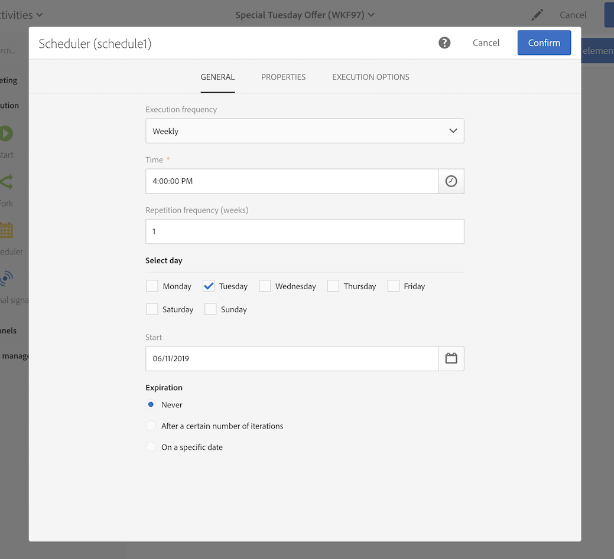

# Elke dinsdag een e-maillevering maken{#creating-email-every-tuesday}

U kunt elke dinsdag een e-mail naar alle klanten sturen voor speciale aanbiedingen.

1. Klik in **[!UICONTROL Marketing Activities]** op **[!UICONTROL Create]** en selecteer **[!UICONTROL Workflow]**.
1. Selecteer **[!UICONTROL New Workflow]** als workflowtype en klik op **[!UICONTROL Next]**.
1. Voer eigenschappen van de workflow in en klik op **[!UICONTROL Create]**.

## Een activiteit Planner maken{#creating-a-scheduler-activity}

1. In **[!UICONTROL Activities]** > **[!UICONTROL Execution]**, drag and drop a [Scheduler](../../automating/using/scheduler.md) activity.
1. Dubbelklik op de activiteit.
1. Configureer de uitvoering van uw levering.
1. In **[!UICONTROL Execution frequency]** selecteert u **[!UICONTROL Weekly]**.
1. Selecteer een **[!UICONTROL Time]** en een **[!UICONTROL Repetition frequency]** voor uw leveringen.
1. In **[!UICONTROL Days of the week]** selecteert u **[!UICONTROL Tuesday]**.
1. Geef de parameters **[!UICONTROL Start]** en **[!UICONTROL Expiration]** op voor de workflow.
1. Bevestig uw activiteit en sla de workflow op.

>[!NOTE]
>
>Om uw workflow in een specifieke **[!UICONTROL Time Zone]** te starten stelt u in het tabblad **[!UICONTROL Execution options]** de tijdzone voor uw planner in in het veld voor de tijdzone. Standaard is de geselecteerde tijdzone de tijdzone die is gedefinieerd in de workfloweigenschappen (zie [Een workflow maken](../../automating/using/building-a-workflow.md)).

## Een queryactiviteit maken{#creating-a-query-activity}

1. In **[!UICONTROL Activities]** > **[!UICONTROL Targeting]**, to select recipients, drag and drop a [Query](../../automating/using/query.md) activity and double-click it.
1. Sleep en zet een **[!UICONTROL Email]** neer in **[!UICONTROL Shortcuts]** > **[!UICONTROL Profile]**.
1. Selecteer **[!UICONTROL is not empty]** als een operator.
1. Voeg in **[!UICONTROL Shortcuts]** > **[!UICONTROL General]** profielen toe en selecteer **[!UICONTROL no longer contact by email]** met de waarde **[!UICONTROL No]**.
1. Klik op **[!UICONTROL Confirm]**.

## Een e-maillevering maken{#creating-an-email-delivery}

1. Sleep in **[!UICONTROL Activities]** > **[!UICONTROL Channels]** een activiteit voor het verzenden van [e-mail](../../automating/using/email-delivery.md) en zet deze neer.
1. Klik op de activiteit en selecteer  om te bewerken.
1. Selecteer **[!UICONTROL Recurring email]** en klik op **[!UICONTROL Next]**.
1. Selecteer een e-mailsjabloon en klik op **[!UICONTROL Next]**.
1. Voer de e-maileigenschappen in en klik op **[!UICONTROL Next]**.
1. Klik op **[!UICONTROL Use Email Designer]** om de lay-out van uw e-mail te bepalen.
1. Voeg elementen in of selecteer een bestaande sjabloon.
1. Personaliseer uw e-mail met velden en koppelingen.
1. Klik op **[!UICONTROL Save]**.

Raadpleeg [Een e-mail ontwerpen](../../designing/using/designing-from-scratch.md#designing-an-email-content-from-scratch) voor meer informatie.

**Verwante onderwerpen:**

* [E-mailkanaal](../../channels/using/creating-an-email.md)
