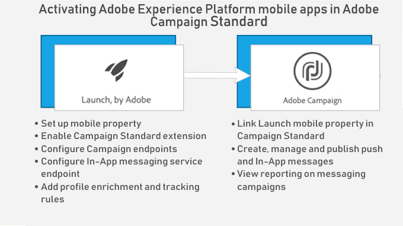

# In-app-berichten{#about-in-app-messaging}

In-app-berichten is een berichtenkanaal waarmee u een bericht kunt weergeven wanneer de gebruiker binnen de mobiele applicatie actief is. Dit berichttype is ter aanvulling van pushmeldingen die worden afgeleverd aan het meldingscentrum van de telefoon van gebruikers. Raadpleeg deze [sectie](../../channels/using/about-push-notifications.md)voor meer informatie over het pushmeldingenkanaal.

Voor dit kanaal moeten mobiele applicaties en worden geïntegreerd met de Adobe Experience Platform SDK. Deze apps moeten worden geactiveerd in Adobe Experience Platform Launch voordat ze beschikbaar zijn in Adobe Campaign voor in-app-leveringen.

Als u in-app-berichten wilt verzenden op mobiele toepassingen met behulp van de Experience Platform SDK, moet u aan de volgende voorwaarden voldoen:

1. Zorg ervoor dat u in Adobe Campaign toegang hebt tot het kanaal **[!UICONTROL In-App]**. Neem contact op met uw accountteam als u geen toegang hebt tot deze kanalen.

1. Als u mobiele gebruiksscenario’s in Adobe Campaign Standard wilt gebruiken met een Experience Cloud SDK-applicatie, moet u een mobiele app maken in Adobe Experience Platform Launch en deze configureren in Adobe Campaign Standard. Raadpleeg deze [pagina](https://helpx.adobe.com/nl/campaign/kb/configuring-app-sdk.html) voor de stapsgewijze handleiding.

1. Zodra de configuratie is voltooid, kunt u uw in-app-bericht voorbereiden. Raadpleeg [deze pagina](../../channels/using/preparing-and-sending-an-in-app-message.md#preparing-your-in-app-message) voor meer informatie.

1. Vervolgens kunt u een [in-app-bericht](../../channels/using/customizing-an-in-app-message.md) verzenden of een [bericht van het type lokale melding aanpassen](../../channels/using/customizing-an-in-app-message.md#customizing-a-local-notification-message-type).

1. Uw levering is nu klaar om te worden verzonden. Raadpleeg deze [pagina](../../channels/using/preparing-and-sending-an-in-app-message.md#sending-your-in-app-message) voor meer informatie.

**Gerelateerde content:**

* [In-app-rapport](../../reporting/using/in-app-report.md)
* [Mobiele gebruiksscenario’s die worden ondersteund in Adobe Campaign Standard](https://helpx.adobe.com/campaign/kb/configure-launch-rules-acs-use-cases.html)
* [Campaign Standard - gids voor mobiel gebruik](https://helpx.adobe.com/campaign/kb/acs-mobile.html)

## Veelgestelde vragen in de app {#in-app-faq}

### Wat zouden enkele nuttige hulpbronnenaanbevelingen zijn om meer te weten te komen over het In-App-kanaal in Adobe Campaign Standard? {#resources-inapp}

Ontdek de onderstaande bronnen:

* [Video-Tutorials](https://docs.adobe.com/content/help/en/campaign-standard-learn/tutorials/communication-channels/mobile/in-app/in-app-message-overview.html)
* [Blogbericht](https://theblog.adobe.com/get-more-out-of-the-new-in-app-message-channel-from-adobe-campaign/)
* [Community-pagina](https://experienceleaguecommunities.adobe.com/t5/adobe-campaign-standard/ct-p/adobe-campaign-standard-community)

### Wat is het doel van API&#39;s setLinkageField en resetLinkageField voor Campagneextensies? {#extensions-apis}

Aangezien de berichten in-app door SDK van Campagne worden getrokken, willen wij een veilig mechanisme verstrekken om ervoor te zorgen dat de Berichten in-app die PII gegevens bevatten niet in kwaadwillige handen vallen. Als dusdanig, hebben wij het volgende mechanisme op zijn plaats om de veilige levering van berichten aan het apparaat te verzekeren:

* Klanten markeren velden voor mobiele profielen (appSubscriberRcp-tabel) als Persoonlijk en Gevoelig als ze ervoor willen zorgen dat deze specifieke gegevens veilig worden geleverd.
* Als zodanig gemarkeerde velden kunnen alleen worden gebruikt in de profielsjabloon (niet in de appSubscriber-sjabloon of de Broadcast-sjabloon) waarvoor een extra beveiligingsmechanisme is ingebouwd.
* Berichten die zijn gemaakt met de profielsjabloon kunnen alleen worden gediend wanneer de gebruiker zich heeft aangemeld bij de app.
* Om deze veilige handshake te vergemakkelijken, moeten ontwikkelaars van mobiele apps aanvullende verificatiegegevens doorgeven met de setLinkageField-API. Let op: het koppelingsveld is het veld dat wordt geïdentificeerd als de koppeling tussen Mobiel profiel en CRM-profiel tijdens het uitbreiden van de tabel appSubscriberRcp.
* Ze moeten de in-app-berichten die op het apparaat zijn opgeslagen en resetLinkagefields verwijderen wanneer de gebruiker zich afmeldt bij de App met resetLinkageField. Dit zorgt ervoor dat als een andere gebruiker zich aanmeldt bij de app, deze de berichten die voor de vorige gebruiker worden bedoeld, niet ziet.
* Raadpleeg de API&#39;s van [Mobile SDK](https://aep-sdks.gitbook.io/docs/using-mobile-extensions/adobe-campaign-standard/adobe-campaign-standard-api-reference) voor het implementeren van dit beveiligingsmechanisme aan de clientzijde.

### Wat moet ik doen om In-App rapportering in Campaign toe te laten? {#enable-inapp-reporting}

U moet in-app het volgen postback vormen. Instructies vindt u [hier](https://helpx.adobe.com/campaign/kb/config-app-in-launch.html#InApptrackingpostback).

Raadpleeg deze [pagina](../../administration/using/local-tracking.md)als u lokale meldingen wilt bijhouden.

### Welke rapporten zijn beschikbaar voor het kanaal In-App? {#report-inapp}

Een out-of-the-box rapport is beschikbaar in Adobe Campaign for In-App channel. Raadpleeg deze [documentatie](../../reporting/using/in-app-report.md).

Zie deze [pagina](../../reporting/using/indicator-calculation.md#in-app-delivery) om te begrijpen hoe elke metriek In-App wordt berekend.

### Biedt u ondersteuning voor meertalige inhoudvarianten voor In-App, vergelijkbaar met Push? {#multilingual-inapp}

Er zijn nu geen meertalige sjablonen beschikbaar voor In-App-berichten.

Als het echter de bedoeling is een bericht in de app in een andere taal dan Engels te verzenden, kan de inhoud rechtstreeks in de beschikbare tekstvakken worden geplakt.

### Kunnen de gebieden van de Aanpassing van de Campagne aan Aangepast HTML worden toegevoegd? {#custom-html-inapp}

Nee, dit wordt nog niet ondersteund.

### Ik heb een waakzaam bericht gevormd maar het toont niet op het apparaat. {#alert-message}

Voor waarschuwingsberichten is ten minste één afwijzingsknop vereist (primaire of secundaire knop moet actie afwijzen). Anders, is het mogelijk om het bericht te bewaren maar het zal niet worden ontvangen.

### Als aangepaste iOS-geluiden voor lokale meldingen niet worden afgespeeld; wordt het standaardgeluid afgespeeld? {#local-notification-sound}

Voor aangepast geluid op iOS moet u een bestandsnaam met extensie opgeven wanneer u een lokale melding maakt (bijvoorbeeld sound.caf). Als deze extensie niet is opgegeven, wordt het standaardgeluid gebruikt.

### Worden de diepte gesteund in in-app berichten? {#inapp-deeplinks}

Ja, deplinks worden ondersteund in In-App-berichten. Deeplinks moeten omvatten:

* de taal die verklaart dat levering het volgen moet worden onbruikbaar gemaakt om de diepte te werken.
* Appsflyer met Tak als partners die het zuiveren volgen kunnen doen. Raadpleeg deze [pagina](https://help.branch.io/using-branch/docs/adobe-campaign-standard-1)voor meer informatie over de integratie met Branch en Adobe Campaign Standard.

### Kan een bericht in de app worden geactiveerd wanneer de gebruiker de app start via een pushmelding? {#inapp-push-trigger}

Ja, deze berichten worden ook bedoeld als de berichten van de madeliefketen. Volg het onderstaande proces:

1. Maak een bericht in de app.

1. Definieer een aangepaste gebeurtenis en selecteer deze als een gebeurtenisactivering voor deze IAM, bijvoorbeeld &quot;Trigger from fall preview Push&quot;.

1. Wanneer u uw pushbericht ontwerpt, definieert u een aangepaste variabele waarvan de waarde kan worden ingesteld als een gebeurtenis die IAM activeert, bijvoorbeeld Key = &quot;inappkey&quot; en value = &quot;Trigger from fall preview Push&quot;.

1. Implementeer gebeurtenistrigger in de mobiele toepassingscode als volgt:

   
