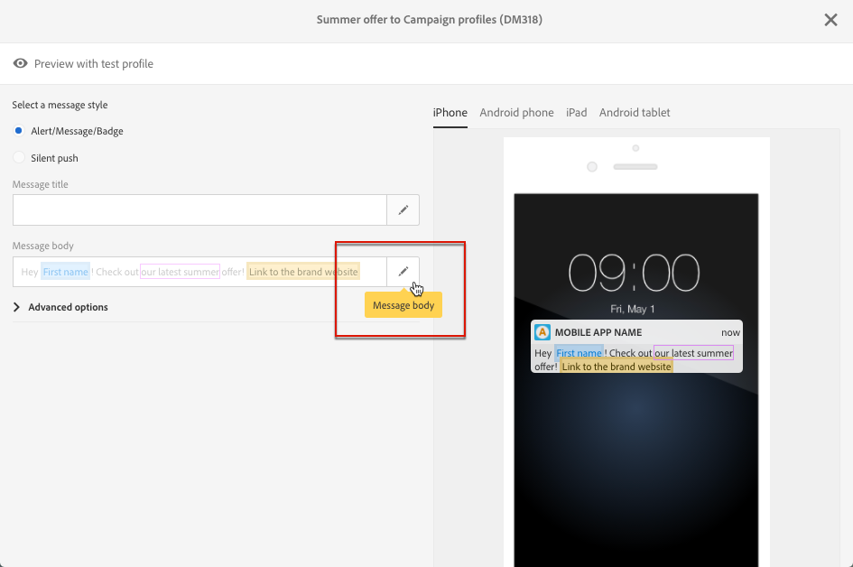

# Sms- en pushcontent ontwerpen{#about-sms-and-push-content-design}

Gebruik de contenteditor om de content van sms-berichten en pushmeldingen in Adobe Campaign te definiëren, aan te passen en te personaliseren.

In deze sectie worden de specifieke kenmerken van de editor voor sms- en pushcontent beschreven, inclusief de [interface voor sms- en pushcontent](../../channels/using/sms-and-push-content-editor-interface.md).

De acties die gemeenschappelijk zijn voor een of meer marketingactiviteiten worden in de volgende secties weergegeven:

* Zie [Een personalisatieveld invoegen](../../designing/using/personalization.md#inserting-a-personalization-field) en [Een contentblok toevoegen](../../designing/using/personalization.md#adding-a-content-block) voor meer informatie over het aanpassen van de content van sms- of pushberichten.
* Zie [Dynamische tekst definiëren](../../channels/using/defining-dynamic-text.md) voor meer informatie over het definiëren van voorwaardelijke tekst in een sms- of pushbericht.

Ga als volgt te werk om de editor voor sms- en pushcontent te openen:

* Klik op het blok **[!UICONTROL Content]** in een sms-dashboard.

   

* Klik op het potlood naast het veld **[!UICONTROL Message body]** in het dashboard voor pushberichten.

   

**Verwante onderwerpen:**

* [Een sms-bericht maken](../../channels/using/creating-an-sms-message.md)
* [Een pushbericht maken en verzenden](../../channels/using/preparing-and-sending-a-push-notification.md)
