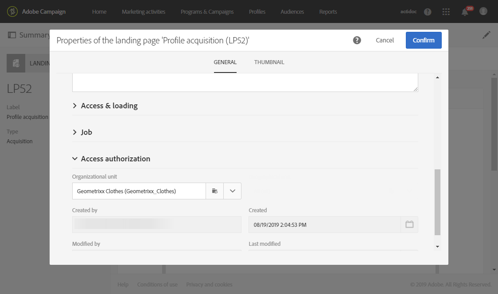
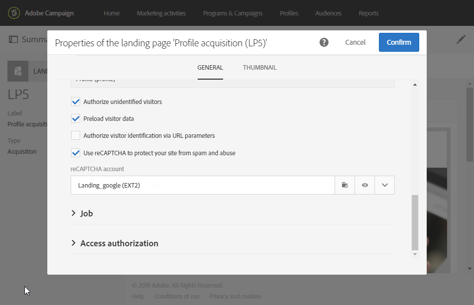
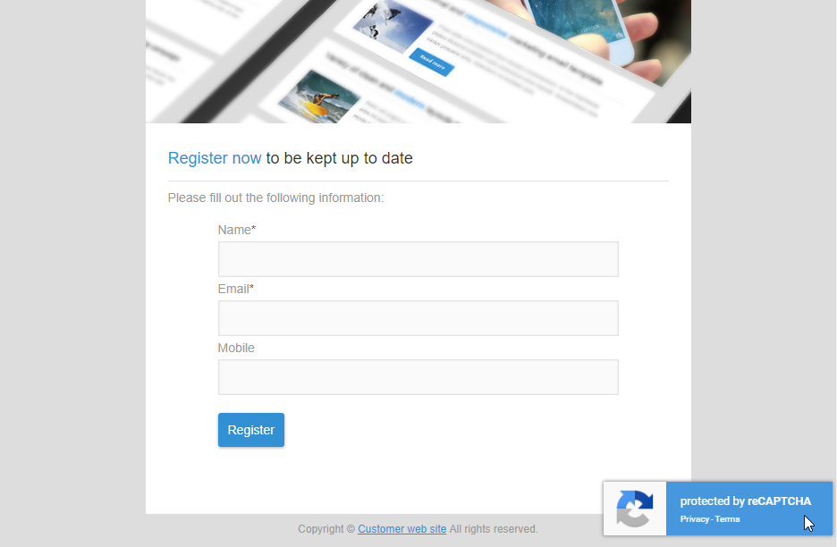

# Een openingspagina configureren {#configuring-landing-page}

## Verzending van een bestemmingspagina bevestigen {#confirm-a-landing-page-submission}

Wanneer een bestemmingspagina door een bezoeker wordt voorgelegd, kunt u de teweeggebrachte acties vormen. Dit doet u als volgt:

1. Bewerk de eigenschappen van de openingspagina die via het  pictogram in het dashboard van de bestemmingspagina worden benaderd en geef de **[!UICONTROL Job]** parameters weer.

   

1. Selecteer onder de **[!UICONTROL Specific actions]** sectie **[!UICONTROL Start sending message]** om te bepalen of een automatisch bericht wordt verzonden, bijvoorbeeld om abonnement op een service te bevestigen. Vervolgens moet u een sjabloon voor e-maillevering selecteren.

   Merk op dat als een bevestigingsbericht reeds op het de dienstniveau wordt gevormd, zou u niet één in dit scherm moeten selecteren om het verzenden van veelvoudige bevestigingsberichten te vermijden. Raadpleeg [Een service](../../audiences/using/creating-a-service.md)configureren.

1. Maken **[!UICONTROL Additional data]** om aanvullende gegevens op te slaan wanneer de landingspagina wordt verzonden. Deze gegevens zijn niet zichtbaar voor personen die de pagina bezoeken. Alleen constante waarden worden in aanmerking genomen.

   

## Een openingspagina koppelen aan een service {#linking-a-landing-page-to-a-service}

U kunt een formulier koppelen aan een service, zodat profielen zich kunnen abonneren op een specifieke service bij het valideren van de bestemmingspagina&#39;s.

Met de parameters voor het koppelen van een landingspagina kunt u het uitgevoerde handelingstype opgeven en opgeven of de landingspagina specifiek is gekoppeld aan één service of algemeen is.

Als u de service wilt selecteren die u wilt koppelen, moet u:

1. Bewerk de eigenschappen van de openingspagina die via het  pictogram in het dashboard van de bestemmingspagina worden benaderd en geef de **[!UICONTROL Job]** parameters weer.

   

1. Kies deze optie **[!UICONTROL Subscription]** in de **[!UICONTROL Specific actions]** vervolgkeuzelijst.

   

1. Selecteer deze optie **[!UICONTROL Specific service]** om de bestemmingspagina te koppelen aan één service. Selecteer deze optie niet als u meerdere services wilt gebruiken op de bestemmingspagina.

   Gebruik de **[!UICONTROL Specified service in the URL]** optie om de landingspagina te laten worden gebruikt voor verscheidene diensten. Daarom moet u de landingspagina van verwijzingen voorzien wanneer het vormen van de dienst.

## Machtigingen instellen en gegevens vooraf laden {#setting-permissions-and-pre-loading-data}

De toegang tot een landingspagina kan worden beperkt tot bepaalde bezoekers, die afkomstig zijn van een koppeling in een bericht dat bijvoorbeeld door Campagne wordt verzonden, of tot een specifieke organisatie-eenheid.
In het geval van geïdentificeerde bezoekers, kunt u hun gegevens in de landingspagina vooraf laden. Dit doet u als volgt:

1. Bewerk de eigenschappen van de openingspagina die via het  pictogram in het dashboard van de bestemmingspagina worden benaderd en geef de **[!UICONTROL Access & loading]** parameters weer.

   

1. Selecteer **[!UICONTROL Preload visitor data]**.

   Als een bezoeker van de pagina overeenkomt met een profiel in de database, worden de gegevens weergegeven in de velden van het formulier die zijn gekoppeld aan de databasegegevens en wordt rekening gehouden met de personalisatie-elementen van de bestemmingspagina.

   

U kunt ook:

* Gebruik de URL-parameters om de bezoekers te identificeren met behulp van de **[!UICONTROL Authorize visitor identification via URL parameters]** optie: kiest u de ladingssleutel en wijst u de filterparameters met de parameters van overeenkomstige URL toe.
* Geef een bezoeker de toestemming om toegang te krijgen tot de bestemmingspagina met de **[!UICONTROL Authorize unidentified visitors]** optie.

Aanlandingspagina&#39;s kunnen ook aan een organisatorische eenheid worden gekoppeld. Hiermee definieert u de toegang van gebruikers tot de verschillende bestemmingspagina&#39;s. Om een organisatorische eenheid toe te wijzen:

1. Open de eigenschappen van de openingspagina via het **[!UICONTROL Edit properties]** pictogram.

   

1. Ontvouw de **[!UICONTROL Access authorization]**.

1. Klik op het vervolgkeuzemenu en selecteer uw organisatie-eenheid. Raadpleeg deze [pagina](../../administration/using/organizational-units.md)voor meer informatie over hoe u organisatie-eenheid kunt maken.

   

1. De velden **[!UICONTROL Created by]**, **[!UICONTROL Created]****[!UICONTROL Access authorization]** en **[!UICONTROL Last modified]** velden worden automatisch ingevuld.

1. Klik **[!UICONTROL Confirm]** dan **[!UICONTROL Save]**.

De landingspagina kan nu alleen worden geopend en beheerd door gebruikers binnen de gekozen organisatie.

## Google reCAPTCHA instellen {#setting-google-recaptcha}

U kunt Google reCAPTCHA V3 instellen met uw bestemmingspagina om deze te beschermen tegen spam en misbruik door bots. Als u deze met uw bestemmingspagina wilt kunnen gebruiken, moet u eerst een externe account maken. Voor meer informatie over hoe te om het te vormen, verwijs naar deze [sectie](../../administration/using/external-accounts.md#google-recaptcha-external-account).

Zodra uw externe Google reCAPTCHA V3-account is ingesteld, kunt u deze toevoegen aan uw bestemmingspagina:

1. Voordat u de bestemmingspagina publiceert, opent u de pagina-eigenschappen die via het  pictogram worden benaderd op het dashboard van de landingspagina.

   

1. Het **[!UICONTROL Access & loading]** menu ontvouwen.
1. Schakel de **[!UICONTROL Use reCAPTCHA to protect your site from spam and abuse]** optie in.
1. Selecteer uw eerder gemaakte externe Google reCAPTCHA-account.

   

1. Klik op **[!UICONTROL Confirm]**.

Uw openingspagina is nu ingesteld met Google reCAPTCHA, die onder aan uw pagina te zien is.

Google reCAPTCHA retourneert vervolgens een score op basis van gebruikersinteracties met uw pagina. Maak verbinding met uw [Google-beheerconsole](https://g.co/recaptcha/admin)om uw score te controleren.
