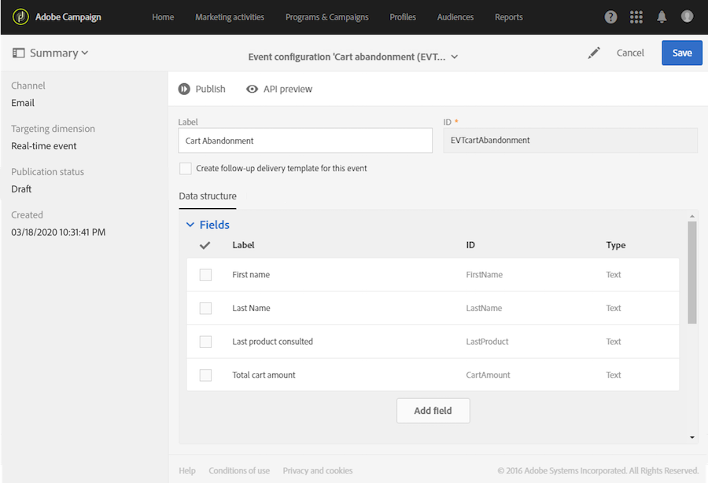
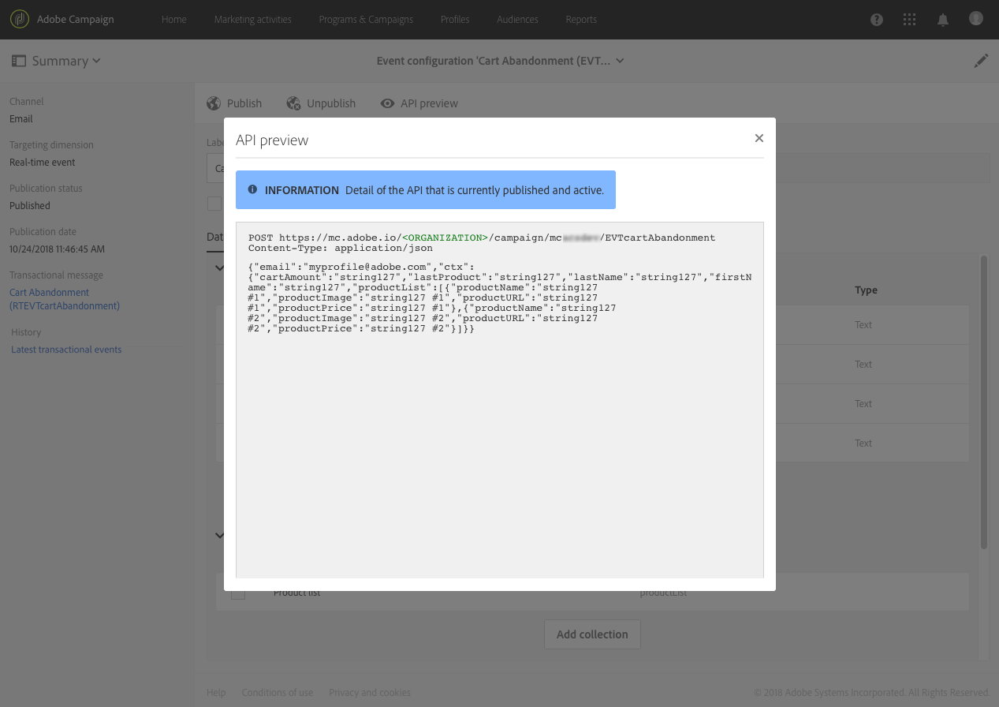
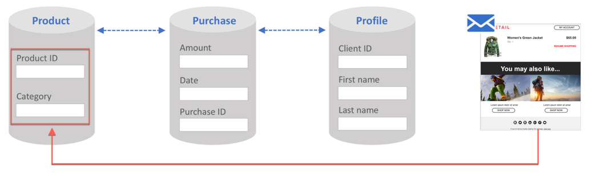
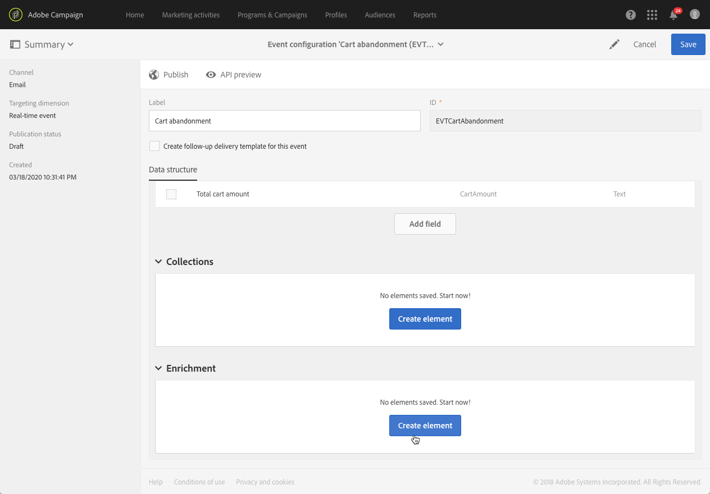
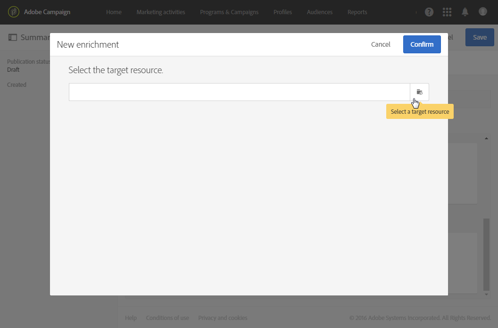
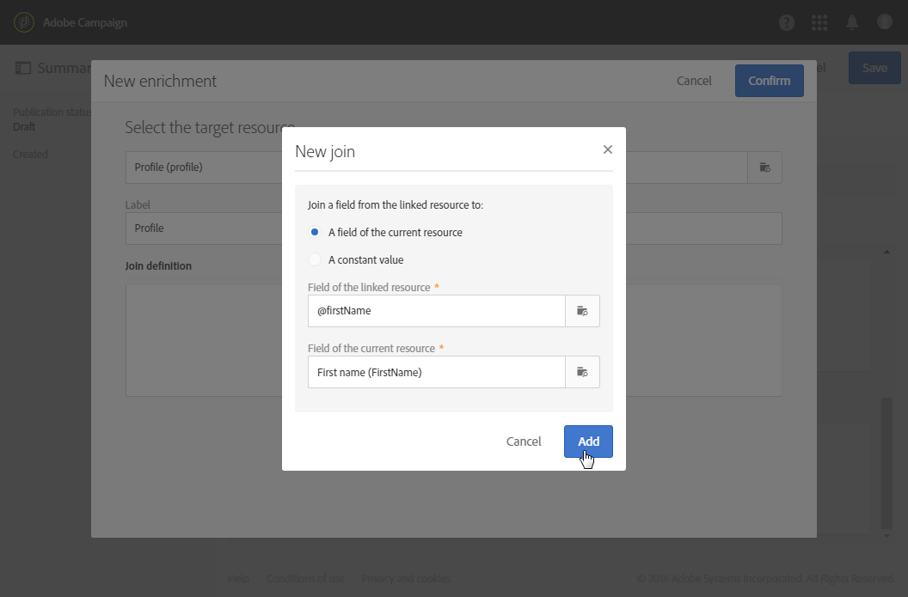
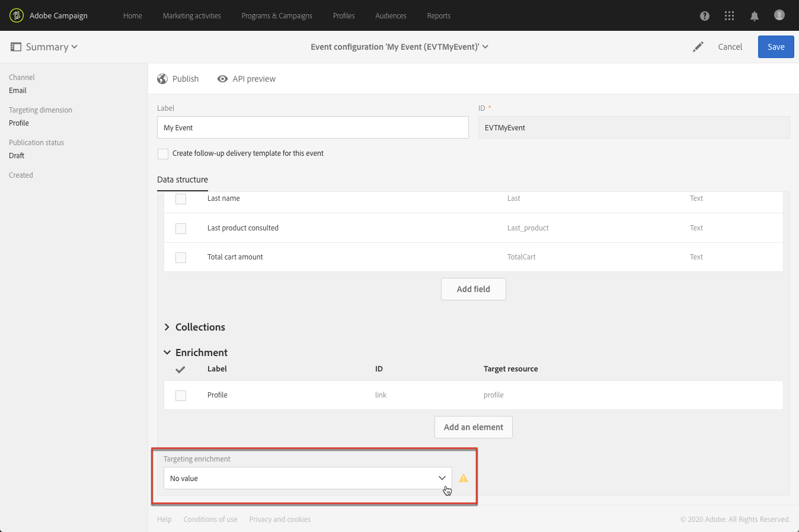
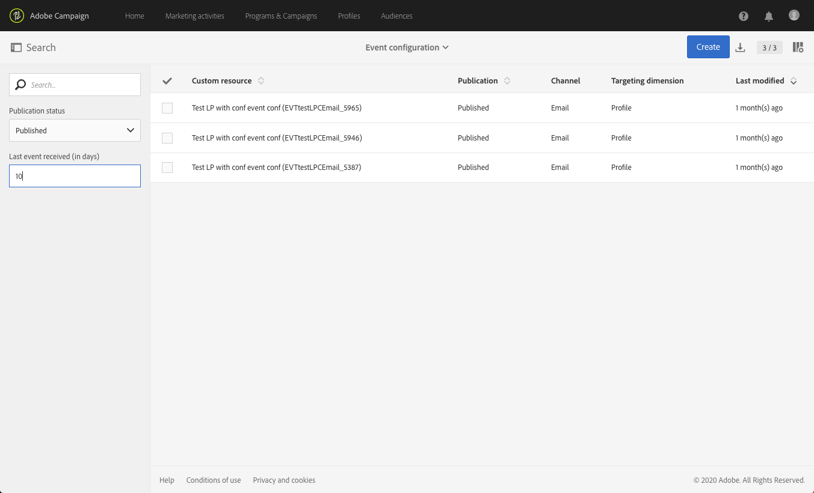

# Een transactiegebeurtenis configureren {#configuring-transactional-event}

Als u een transactiebericht met Adobe Campaign wilt verzenden, moet u eerst de structuur van de gebeurtenisgegevens beschrijven door een gebeurtenis te maken en te configureren.

>[!IMPORTANT]
>
>Slechts [&#x200B; Functionele beheerders &#x200B;](../../administration/using/users-management.md#functional-administrators) <!--being part of the **[!UICONTROL All]** [organizational unit](../../administration/using/organizational-units.md) --> hebben de aangewezen rechten om gebeurtenisconfiguraties tot stand te brengen en uit te geven.

De configuratie varieert afhankelijk van het [&#x200B; type van transactioneel bericht &#x200B;](../../channels/using/getting-started-with-transactional-msg.md#transactional-message-types) u, en op het kanaal wilt verzenden dat zal worden gebruikt. Voor meer op dit, zie [&#x200B; Specifieke configuraties &#x200B;](#transactional-event-specific-configurations).

Nadat de configuratie is voltooid, moet de gebeurtenis worden gepubliceerd. Zie [&#x200B; Publicerend een transactionele gebeurtenis &#x200B;](../../channels/using/publishing-transactional-event.md).

## Een gebeurtenis maken {#creating-an-event}

Maak de gebeurtenis die aan uw behoeften voldoet om aan de slag te gaan.

1. Klik het **Adobe** embleem, in de top-linkerhoek, dan uitgezocht **[!UICONTROL Marketing plans]** > **[!UICONTROL Transactional messages]** > **[!UICONTROL Event configuration]**.
1. Klik op **[!UICONTROL Create]** .
1. Voer een **[!UICONTROL Label]** en een **[!UICONTROL ID]** in voor de gebeurtenis. Het veld **[!UICONTROL ID]** is verplicht en moet beginnen met het voorvoegsel &quot;EVT&quot;. Als u dit voorvoegsel niet gebruikt, wordt het automatisch toegevoegd wanneer u op **[!UICONTROL Create]** klikt.

   

   >[!IMPORTANT]
   >
   >De id mag niet langer zijn dan 64 tekens, inclusief het voorvoegsel EVT.

1. Selecteer het kanaal dat wordt gebruikt om de transactiemeldingen **[!UICONTROL Email]** , **[!UICONTROL Mobile (SMS)]** of **[!UICONTROL Push notification]** te verzenden. Er kan slechts één kanaal worden gebruikt voor elke gebeurtenis en het kan achteraf niet worden gewijzigd.

1. Selecteer de doeldimensie die overeenkomt met de gewenste gebeurtenisconfiguratie en klik op **[!UICONTROL Create]** .

   Transactieberichten die zijn gebaseerd op gebeurtenissen, zijn gericht op gegevens die zich in de gebeurtenis zelf bevinden, terwijl op een profiel gebaseerde transactieberichten bedoeld zijn voor gegevens die zich in de Adobe Campaign-database bevinden. Voor meer op dit, verwijs naar [&#x200B; Specifieke configuraties &#x200B;](#transactional-event-specific-configurations).

>[!NOTE]
>
>Het aantal transactionele gebeurtenissen kan een effect op uw platform hebben. Voor optimale prestaties moet u ongebruikte gebeurtenissen verwijderen. Zie [&#x200B; het Schrappen van een gebeurtenis &#x200B;](../../channels/using/publishing-transactional-event.md#deleting-an-event).

## Gebeurteniskenmerken definiëren {#defining-the-event-attributes}

Definieer in de sectie **[!UICONTROL Fields]** de kenmerken die in de inhoud van de gebeurtenis worden geïntegreerd en die vervolgens kunnen worden gebruikt om het transactiebericht aan te passen.

De stappen voor het toevoegen van en het wijzigen van gebieden zijn het zelfde als voor [&#x200B; douanemiddelen &#x200B;](../../developing/using/configuring-the-resource-s-data-structure.md#adding-fields-to-a-resource).

>[!NOTE]
>
>Als u een meertalig transactiebericht wilt maken, definieert u een extra gebeurteniskenmerk met de id **[!UICONTROL AC_language]** . Dit is alleen van toepassing op transactieberichten voor gebeurtenissen. Nadat de gebeurtenis is gepubliceerd, zijn de stappen voor het bewerken van de inhoud van een meertalig transactiebericht gelijk aan die voor een meertalig standaard-e-mailbericht. Zie [&#x200B; Creërend een meertalige e-mail &#x200B;](../../channels/using/creating-a-multilingual-email.md).

## Gegevensverzamelingen definiëren {#defining-data-collections}

U kunt aan de inhoud van de gebeurtenis een inzameling van elementen toevoegen, elk element zelf met verscheidene attributen.

Deze inzameling kan in een transactie-e-mail worden gebruikt om [&#x200B; productlijsten &#x200B;](../../designing/using/using-product-listings.md) aan de inhoud van het bericht toe te voegen, bijvoorbeeld een lijst van producten - met de prijs, het verwijzingsaantal, de hoeveelheid, enz. voor elk product in de lijst.

1. Klik in de sectie **[!UICONTROL Collections]** op de knop **[!UICONTROL Create element]** .

   

1. Voeg een label en een id voor uw verzameling toe.
1. Voeg alle velden toe die u in het transactiebericht voor elk product in de lijst wilt weergeven.

   In dit voorbeeld hebben we de volgende velden toegevoegd:

   

1. Op het tabblad **[!UICONTROL Enrichment]** kunt u elk item van de verzameling verrijken. Op deze manier kunt u de elementen van de overeenkomende productlijst aanpassen met informatie uit de Adobe Campaign-database of uit andere bronnen die u hebt gemaakt.

>[!NOTE]
>
>De stappen voor het verrijken van de elementen van een inzameling zijn het zelfde zoals die in [&#x200B; wordt beschreven het Verrijken van de gebeurtenis &#x200B;](#enriching-the-transactional-message-content) sectie. Als u de gebeurtenis verrijkt, kunt u een verzameling niet verrijken: u moet een verrijking aan de verzameling zelf toevoegen in de sectie **[!UICONTROL Collections]** .

Zodra de gebeurtenis en het bericht worden gepubliceerd, zult u deze inzameling in uw transactiebericht kunnen gebruiken.

Hier volgt de API-voorvertoning voor dit voorbeeld:

**Verwante onderwerpen:**

* [De gebeurtenis voorvertonen en publiceren](../../channels/using/publishing-transactional-event.md#previewing-and-publishing-the-event)
* [Productaanbiedingen in een transactiebericht gebruiken](../../designing/using/using-product-listings.md)
* [Transactiebericht publiceren](../../channels/using/publishing-transactional-message.md#publishing-a-transactional-message)

## De gebeurtenis verrijken {#enriching-the-transactional-message-content}

U kunt de inhoud van het transactiebericht verrijken met informatie uit de Adobe Campaign-database om uw berichten aan te passen. Van achternaam of identiteitskaart van CRM van elk van uw ontvangers, bijvoorbeeld, kunt u gegevens zoals hun adres of geboortedatum of een ander douanegebied terugkrijgen dat in de lijst van het Profiel wordt toegevoegd, om de informatie te personaliseren die naar hen wordt verzonden.

Het is mogelijk om de inhoud van het transactiebericht te verrijken met informatie van uitgebreid **[!UICONTROL Profile and services Ext API]**. Voor meer informatie, zie [&#x200B; Uitbreidend API: het Publiceren van de uitbreiding &#x200B;](../../developing/using/step-2-publish-the-extension.md)

Deze informatie kan ook in nieuwe middelen worden opgeslagen. In dat geval moet de bron rechtstreeks of via een andere tabel worden gekoppeld aan de **[!UICONTROL Profile]** - of **[!UICONTROL Service]** -bronnen. In de onderstaande configuratie is het bijvoorbeeld mogelijk om de inhoud van het transactiebericht te verrijken met informatie uit de **[!UICONTROL Product]** -bron, zoals de productcategorie of id, als de **[!UICONTROL Product]** -bron is gekoppeld aan de **[!UICONTROL Profile]** -bron.

Voor meer bij het creëren van en het publiceren van middelen, zie [&#x200B; deze sectie &#x200B;](../../developing/using/key-steps-to-add-a-resource.md).

1. Klik in de sectie **[!UICONTROL Enrichment]** op de knop **[!UICONTROL Create element]** .

   

1. Selecteer de bron waarmee u uw bericht wilt koppelen. Kies in dit geval de **[!UICONTROL Profile]** -bron.

   

1. Gebruik de **[!UICONTROL Create element]** knoop om een gebied van het geselecteerde middel aan één van de gebieden te verbinden u eerder aan de gebeurtenis (zie [&#x200B; het Bepalen van de gebeurtenisattributen &#x200B;](#defining-the-event-attributes)) toevoegde.

   

   >[!NOTE]
   >
   >Als u een voorwaarde definieert die het mogelijk maakt meerdere ontvangers te selecteren (zoals een veld dat dezelfde waarde kan hebben voor meerdere profielen), wordt niet meer dan één profiel als doel ingesteld.

1. In dit voorbeeld combineren we de velden **[!UICONTROL Last name]** en **[!UICONTROL First name]** met de corresponderende velden in de **[!UICONTROL Profile]** -bron.

   

   U kunt de inhoud van het transactiemelding ook verrijken gebruikend het **[!UICONTROL Service]** middel. Voor meer op de diensten, zie [&#x200B; deze sectie &#x200B;](../../audiences/using/creating-a-service.md).

1. Als u creeert of a [&#x200B; op profiel-gebaseerde gebeurtenis &#x200B;](#profile-based-transactional-messages) uitgeeft, in de **[!UICONTROL Targeting enrichment]** sectie, selecteer de verrijking die als berichtdoel tijdens de leveringsuitvoering zal worden gebruikt.

   

   >[!NOTE]
   >
   >Het maken van een verrijking en het selecteren van een verrijking voor doelen op basis van de **[!UICONTROL Profile]** -bron zijn verplicht voor op profielen gebaseerde gebeurtenissen.

Zodra de gebeurtenis en het bericht worden gepubliceerd, zal deze verbinding u toestaan om de inhoud van het transactiebericht te verrijken.

**Verwante onderwerpen:**

* [De gebeurtenis voorvertonen en publiceren](../../channels/using/publishing-transactional-event.md#previewing-and-publishing-the-event)
* [Een transactiebericht aanpassen](../../channels/using/editing-transactional-message.md#personalizing-a-transactional-message)
* [Transactiebericht publiceren](../../channels/using/publishing-transactional-message.md#publishing-a-transactional-message)

## Transactiegebeurtenissen zoeken {#searching-transactional-events}

Voer de onderstaande stappen uit om de reeds gemaakte transactiegebeurtenissen te openen en te doorzoeken.

1. Klik het **Adobe** embleem, in de top-linkerhoek, dan uitgezocht **[!UICONTROL Marketing plans]** > **[!UICONTROL Transactional messages]** > **[!UICONTROL Event configuration]**.
1. Klik op **[!UICONTROL Show search]** .

   

1. U kunt filteren op de **[!UICONTROL Publication status]** . Zo kunt u bijvoorbeeld alleen de gepubliceerde gebeurtenissen weergeven.
1. U kunt de gebeurtenissen ook filteren met de methode **[!UICONTROL Last event received]** . Als u bijvoorbeeld 10 invoert, worden alleen de gebeurtenisconfiguraties met de laatste gebeurtenis die tien dagen geleden of later is ontvangen, weergegeven. Hierdoor kunt u weergeven welke gebeurtenissen gedurende een bepaalde periode inactief zijn geweest.

   

   >[!NOTE]
   >
   >De standaardwaarde is 0. Alle gebeurtenissen worden dan weergegeven.

## Specifieke configuraties {#transactional-event-specific-configurations}

De transactionele gebeurtenisconfiguratie kan afhankelijk van het [&#x200B; type van transactioneel bericht &#x200B;](../../channels/using/getting-started-with-transactional-msg.md#transactional-message-types) variëren u (gebeurtenis of profiel), en op het kanaal wilt verzenden dat zal worden gebruikt.

In de volgende secties wordt gedetailleerd welke specifieke configuratie moet worden ingesteld op basis van het gewenste transactiebericht. Voor meer op de algemene stappen om een gebeurtenis te vormen, verwijs naar [&#x200B; Creërend een gebeurtenis &#x200B;](#creating-an-event).

### Transactieberichten die zijn gebaseerd op gebeurtenissen {#event-based-transactional-messages}

U kunt transactiemeldingen voor gebeurtenissen verzenden die verwijzen naar een gebeurtenis. Dit type van transactieberichten bevat profielinformatie niet: het leveringsdoel wordt bepaald door de gegevens in de gebeurtenis zelf.

Om een op gebeurtenis-gebaseerd transactiebericht te verzenden, moet u eerst een gebeurtenis tot stand brengen en vormen richtend de **gegevens in de gebeurtenis zelf**.

1. Wanneer het creëren van de gebeurtenisconfiguratie, selecteer **[!UICONTROL Real-time event]** richtend afmeting (zie [&#x200B; Creërend een gebeurtenis &#x200B;](#creating-an-event)).
1. Voeg gebieden aan de gebeurtenis toe, om het transactionele bericht (zie [&#x200B; te kunnen personaliseren die de gebeurtenisattributen &#x200B;](#defining-the-event-attributes) bepalen).
1. Het op gebeurtenis-gebaseerde transactieoverseinen wordt verondersteld om slechts de gegevens te gebruiken die in de verzonden gebeurtenis zijn om de ontvanger en de verpersoonlijking van de berichtinhoud te bepalen.

   Nochtans, als u extra informatie van het gegevensbestand van Adobe Campaign wilt gebruiken, kunt u de transactionele berichtinhoud (zie [&#x200B; Verrijkend de transactionele berichtinhoud &#x200B;](#enriching-the-transactional-message-content)) verrijken.

1. Voorproef en publiceer de gebeurtenis (zie [&#x200B; Voorproef en het publiceren van de gebeurtenis &#x200B;](../../channels/using/publishing-transactional-event.md#previewing-and-publishing-the-event)).

   Wanneer u een voorvertoning van de gebeurtenis weergeeft, bevat de REST API een kenmerk dat het e-mailadres, de mobiele telefoon of specifieke kenmerken voor pushmeldingen opgeeft, afhankelijk van het geselecteerde kanaal.

   Nadat de gebeurtenis is gepubliceerd, wordt automatisch een transactiebericht gemaakt dat aan de nieuwe gebeurtenis is gekoppeld. Opdat de gebeurtenis het verzenden van een transactiebericht teweegbrengt, moet u [&#x200B; &#x200B;](../../channels/using/editing-transactional-message.md) wijzigen en [&#x200B; &#x200B;](../../channels/using/publishing-transactional-message.md) het bericht publiceren dat enkel werd gecreeerd.

1. Integreer de gebeurtenis in uw website (zie [&#x200B; de gebeurtenis die &#x200B;](../../channels/using/getting-started-with-transactional-msg.md#integrate-event-trigger) teweegbrengt integreren).

### Transactieberichten op basis van profielen {#profile-based-transactional-messages}

U kunt transactieberichten verzenden die op klantenprofielen worden gebaseerd, die u toestaat om de regels van de marketingtypologie toe te passen, de unsubscribe verbinding omvatten, het bericht toevoegen aan de globale levering rapportering en hefboomwerking het in de klantenreis.

Om een op profiel-gebaseerd transactiebericht te verzenden, moet u eerst een gebeurtenis creëren en vormen richtend **gegevens van het gegevensbestand van Adobe Campaign**.

1. Wanneer het creëren van de gebeurtenisconfiguratie, selecteer **[!UICONTROL Profile event]** richtend afmeting (zie [&#x200B; Creërend een gebeurtenis &#x200B;](#creating-an-event)).
1. Voeg gebieden aan de gebeurtenis toe, om het transactionele bericht (zie [&#x200B; te kunnen personaliseren die de gebeurtenisattributen &#x200B;](#defining-the-event-attributes) bepalen). U moet ten minste één veld toevoegen om een verrijking te maken. U te hoeven niet om andere gebieden zoals **tot stand te brengen Voornaam** en **Familienaam** aangezien u verpersoonlijkingsgebieden van het gegevensbestand van Adobe Campaign zult kunnen gebruiken.
1. Creeer een verrijking om de gebeurtenis aan het **[!UICONTROL Profile]** middel (zie [&#x200B; Verrijkend de gebeurtenis &#x200B;](#enriching-the-transactional-message-content)) te verbinden en deze verrijking als **[!UICONTROL Targeting enrichment]** te selecteren.

   >[!IMPORTANT]
   >
   >Deze stap is verplicht voor op profielen gebaseerde gebeurtenissen.

1. Voorproef en publiceer de gebeurtenis (zie [&#x200B; Voorproef en het publiceren van de gebeurtenis &#x200B;](../../channels/using/publishing-transactional-event.md#previewing-and-publishing-the-event)).

   Wanneer u een voorvertoning van de gebeurtenis weergeeft, bevat de REST API geen kenmerk dat het e-mailadres, de mobiele telefoon of specifieke kenmerken voor pushmeldingen opgeeft, aangezien deze worden opgehaald uit de **[!UICONTROL Profile]** -bron.

   Nadat de gebeurtenis is gepubliceerd, wordt automatisch een transactiebericht gemaakt dat aan de nieuwe gebeurtenis is gekoppeld. Opdat de gebeurtenis het verzenden van een transactiebericht teweegbrengt, moet u [&#x200B; &#x200B;](../../channels/using/editing-transactional-message.md) wijzigen en [&#x200B; &#x200B;](../../channels/using/publishing-transactional-message.md) het bericht publiceren dat enkel werd gecreeerd.

1. Integreer de gebeurtenis in uw website (zie [&#x200B; de gebeurtenis die &#x200B;](../../channels/using/getting-started-with-transactional-msg.md#integrate-event-trigger) teweegbrengt integreren).

<!--
### Transactional SMS messages {#transactional-sms}

The steps to configure an  event to send an SMS transactional message are the same as for the email channel. The only differences are as follows:

* When creating the corresponding event, you need to select the **[!UICONTROL Mobile (SMS)]** channel.

* When previewing the event corresponding to an event-based transactional SMS, the REST API contains an attribute specifying the mobile phone instead of the email address.

* The specificities to edit the content of an SMS transactional message are the same as for a [standard SMS](../../channels/using/about-sms-and-push-content-design.md).
-->

### Transactionele pushmeldingen {#transactional-push-notifications}

U kunt twee typen pushmeldingen voor transacties verzenden:
* Een anonieme pushmelding voor transacties naar alle gebruikers die zich hebben aangemeld om berichten van uw mobiele toepassing te ontvangen. Zie [&#x200B; Vormend op gebeurtenis-gebaseerde transactionele pushberichten &#x200B;](../../channels/using/transactional-push-notifications.md#event-based-transactional-push-notifications).
* Een pushmelding voor transacties naar de Adobe Campaign-profielen die zijn geabonneerd op uw mobiele toepassing. Zie [&#x200B; Vormend op profiel-gebaseerde transactionele pushberichten &#x200B;](../../channels/using/transactional-push-notifications.md#profile-based-transactional-push-notifications).

>[!IMPORTANT]
>
>Als u pushmeldingen over transacties wilt verzenden, moet u Adobe Campaign dienovereenkomstig configureren. Zie [&#x200B; Vormend een mobiele toepassing &#x200B;](../../administration/using/configuring-a-mobile-application.md).

### Vervolgberichten {#follow-up-messages}

U kunt een vervolgbericht verzenden naar de klanten die een specifiek transactiebericht hebben ontvangen.

De stappen om een gebeurtenis te vormen die toestaat om een follow-upbericht te verzenden zijn gedetailleerd in [&#x200B; deze sectie &#x200B;](../../channels/using/follow-up-messages.md#configuring-an-event-to-send-a-follow-up-message).
