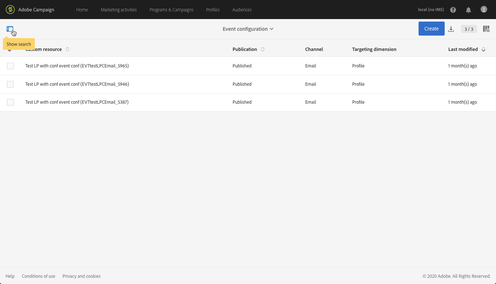

# Een transactionele gebeurtenis configureren {#configuring-transactional-event}

Als u een transactiebericht met Adobe Campaign wilt verzenden, moet u eerst de structuur van de gebeurtenisgegevens beschrijven door een gebeurtenis te maken en te configureren.

>[!IMPORTANT]
>
>Alleen [Functionele beheerders](../../administration/using/users-management.md#functional-administrators) <!--being part of the **[!UICONTROL All]** [organizational unit](../../administration/using/organizational-units.md) -->beschikken over de juiste rechten om gebeurtenisconfiguraties te maken en te bewerken.

De configuratie varieert afhankelijk van de [type transactiebericht](../../channels/using/getting-started-with-transactional-msg.md#transactional-message-types) u wilt verzenden, en op het kanaal dat zal worden gebruikt. Zie voor meer informatie [Specifieke configuraties](#transactional-event-specific-configurations).

Nadat de configuratie is voltooid, moet de gebeurtenis worden gepubliceerd. Zie [Transactiegebeurtenissen publiceren](../../channels/using/publishing-transactional-event.md).

## Een gebeurtenis maken {#creating-an-event}

Maak de gebeurtenis die aan uw behoeften voldoet om aan de slag te gaan.

1. Klik op de knop **Adobe** logo, in de linkerbovenhoek, en selecteer **[!UICONTROL Marketing plans]** > **[!UICONTROL Transactional messages]** > **[!UICONTROL Event configuration]**.
1. Klik op de knop **[!UICONTROL Create]**.
1. Voer een **[!UICONTROL Label]** en **[!UICONTROL ID]** voor de gebeurtenis. De **[!UICONTROL ID]** veld is verplicht en moet beginnen met het voorvoegsel &quot;EVT&quot;. Als u dit voorvoegsel niet gebruikt, wordt het automatisch toegevoegd zodra u klikt **[!UICONTROL Create]**.

   

   >[!IMPORTANT]
   >
   >De id mag niet langer zijn dan 64 tekens, inclusief het voorvoegsel EVT.

1. Selecteer het kanaal dat wordt gebruikt om uw transactiemeldingen te verzenden **[!UICONTROL Email]**, **[!UICONTROL Mobile (SMS)]** of **[!UICONTROL Push notification]**. Er kan slechts één kanaal worden gebruikt voor elke gebeurtenis en het kan achteraf niet worden gewijzigd.

1. Selecteer de doeldimensie die overeenkomt met de gewenste gebeurtenisconfiguratie en klik op **[!UICONTROL Create]**.

   Transactieberichten die zijn gebaseerd op gebeurtenissen, zijn gericht op gegevens die zich in de gebeurtenis zelf bevinden, terwijl op een profiel gebaseerde transactieberichten bedoeld zijn voor gegevens die zich in de Adobe Campaign-database bevinden. Raadpleeg voor meer informatie hierover [Specifieke configuraties](#transactional-event-specific-configurations).

>[!NOTE]
>
>Het aantal transnationale gebeurtenissen kan van invloed zijn op uw platform. Voor optimale prestaties moet u ongebruikte gebeurtenissen verwijderen. Zie [Een gebeurtenis verwijderen](../../channels/using/publishing-transactional-event.md#deleting-an-event).

## Gebeurteniskenmerken definiëren {#defining-the-event-attributes}

In de **[!UICONTROL Fields]** definieert u de kenmerken die in de inhoud van de gebeurtenis worden geïntegreerd en die vervolgens kunnen worden gebruikt om het transactiebericht aan te passen.

De stappen voor het toevoegen en wijzigen van velden zijn dezelfde als voor [aangepaste bronnen](../../developing/using/configuring-the-resource-s-data-structure.md#adding-fields-to-a-resource).

>[!NOTE]
>
>Als u een meertalig transactiebericht wilt maken, definieert u een extra gebeurteniskenmerk met de **[!UICONTROL AC_language]** ID. Dit is alleen van toepassing op transactieberichten voor gebeurtenissen. Nadat de gebeurtenis is gepubliceerd, zijn de stappen voor het bewerken van de inhoud van een meertalig transactiebericht gelijk aan die voor een meertalig standaard-e-mailbericht. Zie [Een meertalige e-mail maken](../../channels/using/creating-a-multilingual-email.md).

## Gegevensverzamelingen definiëren {#defining-data-collections}

U kunt aan de inhoud van de gebeurtenis een inzameling van elementen toevoegen, elk element zelf met verscheidene attributen.

Deze verzameling kan worden gebruikt in een transactie-e-mail om toe te voegen [productaanbiedingen](../../designing/using/using-product-listings.md) de inhoud van het bericht, bijvoorbeeld een lijst van producten - met de prijs, het referentienummer, de hoeveelheid, enz. voor elk product in de lijst.

1. In de **[!UICONTROL Collections]** klikt u op de **[!UICONTROL Create element]** knop.

   

1. Voeg een label en een id voor uw verzameling toe.
1. Voeg alle velden toe die u in het transactiebericht voor elk product in de lijst wilt weergeven.

   In dit voorbeeld hebben we de volgende velden toegevoegd:

   

1. De **[!UICONTROL Enrichment]** kunt u elk item van de verzameling verrijken. Op deze manier kunt u de elementen van de overeenkomende productlijst aanpassen met informatie uit de Adobe Campaign-database of uit andere bronnen die u hebt gemaakt.

>[!NOTE]
>
>De stappen voor het verrijken van de elementen van een verzameling zijn dezelfde als in het dialoogvenster [De gebeurtenis verrijken](#enriching-the-transactional-message-content) sectie. Door de gebeurtenis te verrijken, kunt u een verzameling niet verrijken: u moet een verrijking aan de inzameling zelf in toevoegen **[!UICONTROL Collections]** sectie.

Zodra de gebeurtenis en het bericht worden gepubliceerd, zult u deze inzameling in uw transactiebericht kunnen gebruiken.

Hier volgt de API-voorvertoning voor dit voorbeeld:

**Verwante onderwerpen:**

* [De gebeurtenis voorvertonen en publiceren](../../channels/using/publishing-transactional-event.md#previewing-and-publishing-the-event)
* [Productvermeldingen gebruiken in een transactiebericht](../../designing/using/using-product-listings.md)
* [Transactiebericht publiceren](../../channels/using/publishing-transactional-message.md#publishing-a-transactional-message)

## De gebeurtenis verrijken {#enriching-the-transactional-message-content}

U kunt de inhoud van het transactiebericht verrijken met informatie uit de Adobe Campaign-database om uw berichten aan te passen. Van achternaam of identiteitskaart van CRM van elk van uw ontvangers, bijvoorbeeld, kunt u gegevens zoals hun adres of geboortedatum of een ander douanegebied terugkrijgen dat in de lijst van het Profiel wordt toegevoegd, om de informatie te personaliseren die naar hen wordt verzonden.

Het is mogelijk om de inhoud van het transactiebericht te verrijken met informatie van uitgebreid **[!UICONTROL Profile and services Ext API]**. Zie voor meer informatie [API uitbreiden: De extensie publiceren](../../developing/using/step-2--publish-the-extension.md)

Deze informatie kan ook in nieuwe middelen worden opgeslagen. In dat geval moet de bron gekoppeld zijn aan de **[!UICONTROL Profile]** of **[!UICONTROL Service]** bronnen, rechtstreeks of via een andere tabel. In de onderstaande configuratie is het bijvoorbeeld mogelijk om de inhoud van het transactiebericht te verrijken met informatie uit de **[!UICONTROL Product]** bron zoals de productcategorie of id, als de **[!UICONTROL Product]** resource is gekoppeld aan de **[!UICONTROL Profile]** resource.

Voor meer informatie over het maken en publiceren van bronnen raadpleegt u [deze sectie](../../developing/using/key-steps-to-add-a-resource.md).

1. In de **[!UICONTROL Enrichment]** klikt u op de **[!UICONTROL Create element]** knop.

   

1. Selecteer de bron waarmee u uw bericht wilt koppelen. Kies in dat geval de optie **[!UICONTROL Profile]** resource.

   

1. Gebruik de **[!UICONTROL Create element]** om een veld van de geselecteerde bron te koppelen aan een van de velden die u eerder aan de gebeurtenis hebt toegevoegd (zie [Gebeurteniskenmerken definiëren](#defining-the-event-attributes)).

   

   >[!NOTE]
   >
   >Als u een voorwaarde definieert die het mogelijk maakt meerdere ontvangers te selecteren (zoals een veld dat dezelfde waarde kan hebben voor meerdere profielen), wordt niet meer dan één profiel als doel ingesteld.

1. In dit voorbeeld combineren we de **[!UICONTROL Last name]** en de **[!UICONTROL First name]** velden met de bijbehorende velden in de **[!UICONTROL Profile]** resource.

   

   U kunt de inhoud van het transactiemelding ook verrijken gebruikend **[!UICONTROL Service]** resource. Voor meer informatie over services raadpleegt u [deze sectie](../../audiences/using/creating-a-service.md).

1. Als u een [gebeurtenis op basis van profiel](#profile-based-transactional-messages)in de **[!UICONTROL Targeting enrichment]** selecteert u de verrijking die tijdens de uitvoering van de levering als doel voor het bericht wordt gebruikt.

   

   >[!NOTE]
   >
   >Een verrijking maken en een verrijking als doel selecteren op basis van de **[!UICONTROL Profile]** resource is verplicht voor op profielen gebaseerde gebeurtenissen.

Zodra de gebeurtenis en het bericht worden gepubliceerd, zal deze verbinding u toestaan om de inhoud van het transactiebericht te verrijken.

**Verwante onderwerpen:**

* [De gebeurtenis voorvertonen en publiceren](../../channels/using/publishing-transactional-event.md#previewing-and-publishing-the-event)
* [Een transactiebericht aanpassen](../../channels/using/editing-transactional-message.md#personalizing-a-transactional-message)
* [Transactiebericht publiceren](../../channels/using/publishing-transactional-message.md#publishing-a-transactional-message)

## Transactiegebeurtenissen zoeken {#searching-transactional-events}

Voer de onderstaande stappen uit om de reeds gemaakte transactiegebeurtenissen te openen en te doorzoeken.

1. Klik op de knop **Adobe** logo, in de linkerbovenhoek, en selecteer **[!UICONTROL Marketing plans]** > **[!UICONTROL Transactional messages]** > **[!UICONTROL Event configuration]**.
1. Klik op de knop **[!UICONTROL Show search]**.

   

1. U kunt filteren op de **[!UICONTROL Publication status]**. Zo kunt u bijvoorbeeld alleen de gepubliceerde gebeurtenissen weergeven.
1. U kunt de gebeurtenissen ook filteren met de **[!UICONTROL Last event received]**. Als u bijvoorbeeld 10 invoert, worden alleen de gebeurtenisconfiguraties met de laatste gebeurtenis die tien dagen geleden of later is ontvangen, weergegeven. Hierdoor kunt u weergeven welke gebeurtenissen gedurende een bepaalde periode inactief zijn geweest.

   

   >[!NOTE]
   >
   >De standaardwaarde is 0. Alle gebeurtenissen worden dan weergegeven.

## Specifieke configuraties {#transactional-event-specific-configurations}

De configuratie van de Transactionele gebeurtenis kan afhankelijk van [type transactiebericht](../../channels/using/getting-started-with-transactional-msg.md#transactional-message-types) wilt verzenden (gebeurtenis of profiel) en op het kanaal dat wordt gebruikt.

In de volgende secties wordt gedetailleerd welke specifieke configuratie moet worden ingesteld op basis van het gewenste transactiebericht. Raadpleeg voor meer informatie over de algemene stappen om een gebeurtenis te configureren: [Een gebeurtenis maken](#creating-an-event).

### Transactieberichten op basis van gebeurtenissen {#event-based-transactional-messages}

U kunt doelgericht transactieberichten voor gebeurtenissen verzenden. Dit type transactieberichten bevat geen profielinformatie: het leveringsdoel wordt bepaald door de data in de gebeurtenis zelf.

Als u een op een gebeurtenis gebaseerd transactiebericht wilt verzenden, moet u eerst een gebeurtenis maken en configureren die gericht is op de **gegevens in de gebeurtenis zelf**.

1. Selecteer bij het maken van de gebeurtenisconfiguratie de optie **[!UICONTROL Real-time event]** doelgerichtheid (zie [Een gebeurtenis maken](#creating-an-event)).
1. Voeg velden toe aan de gebeurtenis om het transactiemelding aan te passen (zie [Gebeurteniskenmerken definiëren](#defining-the-event-attributes)).
1. Het gebeurtenistransactiebericht wordt verondersteld om alleen de data in de verzendgebeurtenis zelf te gebruiken bij het bepalen van de ontvanger en de personalisatie van de berichtcontent.

   Als u echter aanvullende informatie uit de Adobe Campaign-database wilt gebruiken, kunt u de inhoud van het transactiebericht verrijken (zie [De inhoud van transactiemeldingen verrijken](#enriching-the-transactional-message-content)).

1. De gebeurtenis voorvertonen en publiceren (zie [De gebeurtenis voorvertonen en publiceren](../../channels/using/publishing-transactional-event.md#previewing-and-publishing-the-event)).

   Wanneer u een voorvertoning van de gebeurtenis weergeeft, bevat de REST API een kenmerk dat het e-mailadres, de mobiele telefoon of specifieke kenmerken voor pushmeldingen opgeeft, afhankelijk van het geselecteerde kanaal.

   Nadat de gebeurtenis is gepubliceerd, wordt automatisch een transactiebericht gemaakt dat aan de nieuwe gebeurtenis is gekoppeld. Als de gebeurtenis het verzenden van een transactiebericht moet activeren, moet u [wijzigen](../../channels/using/editing-transactional-message.md) en [publish](../../channels/using/publishing-transactional-message.md) het bericht dat zojuist is gemaakt.

1. De gebeurtenis in uw website integreren (zie [De gebeurtenis die leidt tot integratie](../../channels/using/getting-started-with-transactional-msg.md#integrate-event-trigger)).

### Transactieberichten op basis van profiel {#profile-based-transactional-messages}

U kunt transactieberichten verzenden die op klantenprofielen worden gebaseerd, die u toestaat om de regels van de marketingtypologie toe te passen, de unsubscribe verbinding omvatten, het bericht toevoegen aan de globale levering rapportering en hefboomwerking het in de klantenreis.

Als u een op een profiel gebaseerd transactiebericht wilt verzenden, moet u eerst een gebeurtenis maken en configureren die zich richt op **gegevens uit de Adobe Campaign-database**.

1. Selecteer bij het maken van de gebeurtenisconfiguratie de optie **[!UICONTROL Profile event]** doelgerichtheid (zie [Een gebeurtenis maken](#creating-an-event)).
1. Voeg velden toe aan de gebeurtenis om het transactiemelding aan te passen (zie [Gebeurteniskenmerken definiëren](#defining-the-event-attributes)). U moet ten minste één veld toevoegen om een verrijking te maken. U hoeft geen andere velden te maken, zoals **Voornaam** en **Achternaam** aangezien u verpersoonlijkingsgebieden van het gegevensbestand van Adobe Campaign zult kunnen gebruiken.
1. Een verrijking maken om de gebeurtenis te koppelen aan de **[!UICONTROL Profile]** resource (zie [De gebeurtenis verrijken](#enriching-the-transactional-message-content)) en selecteer deze verrijking als de **[!UICONTROL Targeting enrichment]**.

   >[!IMPORTANT]
   >
   >Deze stap is verplicht voor op profielen gebaseerde gebeurtenissen.

1. De gebeurtenis voorvertonen en publiceren (zie [De gebeurtenis voorvertonen en publiceren](../../channels/using/publishing-transactional-event.md#previewing-and-publishing-the-event)).

   Als u een voorvertoning van de gebeurtenis weergeeft, bevat de REST API geen kenmerk dat het e-mailadres, de mobiele telefoon of specifieke kenmerken voor pushmeldingen opgeeft, aangezien deze worden opgehaald uit het dialoogvenster **[!UICONTROL Profile]** resource.

   Nadat de gebeurtenis is gepubliceerd, wordt automatisch een transactiebericht gemaakt dat aan de nieuwe gebeurtenis is gekoppeld. Als de gebeurtenis het verzenden van een transactiebericht moet activeren, moet u [wijzigen](../../channels/using/editing-transactional-message.md) en [publish](../../channels/using/publishing-transactional-message.md) het bericht dat zojuist is gemaakt.

1. De gebeurtenis in uw website integreren (zie [De gebeurtenis die leidt tot integratie](../../channels/using/getting-started-with-transactional-msg.md#integrate-event-trigger)).

<!--### Transactional SMS messages {#transactional-sms}

The steps to configure an  event to send an SMS transactional message are the same as for the email channel. The only differences are as follows:

* When creating the corresponding event, you need to select the **[!UICONTROL Mobile (SMS)]** channel.

* When previewing the event corresponding to an event-based transactional SMS, the REST API contains an attribute specifying the mobile phone instead of the email address.

* The specificities to edit the content of an SMS transactional message are the same as for a [standard SMS](../../channels/using/about-sms-and-push-content-design.md).-->

### Transactionele pushmeldingen {#transactional-push-notifications}

U kunt twee typen pushmeldingen voor transacties verzenden:
* Een anonieme pushmelding voor transacties naar alle gebruikers die zich hebben aangemeld om berichten van uw mobiele toepassing te ontvangen. Zie [Transactiepushmeldingen op basis van gebeurtenissen configureren](../../channels/using/transactional-push-notifications.md#event-based-transactional-push-notifications).
* Een pushmelding voor transacties naar de Adobe Campaign-profielen die zijn geabonneerd op uw mobiele toepassing. Zie [Op profielen gebaseerde pushmeldingen voor transacties configureren](../../channels/using/transactional-push-notifications.md#profile-based-transactional-push-notifications).

>[!IMPORTANT]
>
>Als u pushmeldingen over transacties wilt verzenden, moet u Adobe Campaign dienovereenkomstig configureren. Zie [Een mobiele toepassing configureren](../../administration/using/configuring-a-mobile-application.md).

### Vervolgberichten {#follow-up-messages}

U kunt een vervolgbericht verzenden naar de klanten die een specifiek transactiebericht hebben ontvangen.

De stappen om een gebeurtenis te vormen die toestaat om een follow-upbericht te verzenden zijn gedetailleerd in [deze sectie](../../channels/using/follow-up-messages.md#configuring-an-event-to-send-a-follow-up-message).
