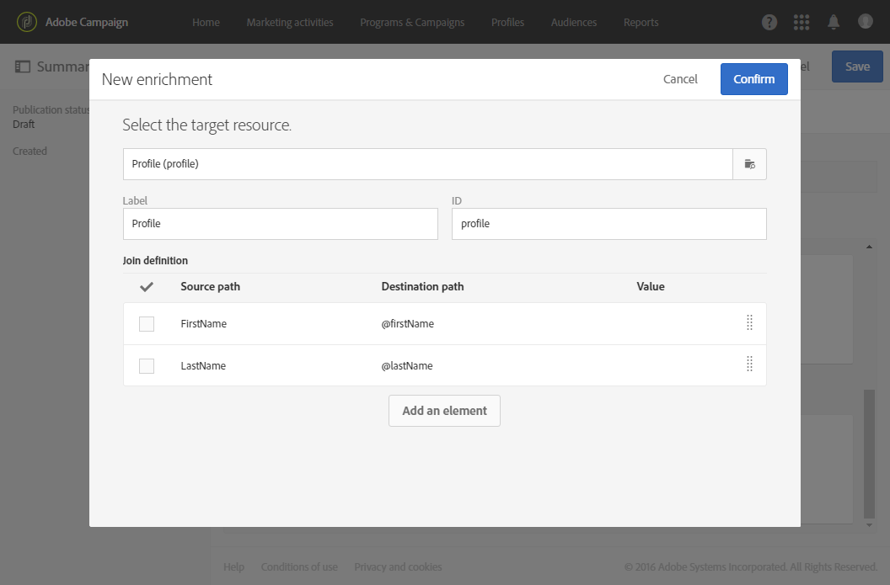

# Een transactionele gebeurtenis {#configuring-transactional-event} configureren

Als u een transactiebericht met Adobe Campaign wilt verzenden, moet u eerst de structuur van de gebeurtenisgegevens beschrijven door een gebeurtenis te maken en te configureren.

>[!IMPORTANT]
>
>Alleen [Functionele beheerders](../../administration/using/users-management.md#functional-administrators) <!--being part of the **[!UICONTROL All]** [organizational unit](../../administration/using/organizational-units.md) -->hebben de juiste rechten om gebeurtenisconfiguraties te maken en te bewerken.

De configuratie varieert afhankelijk van [type van transactioneel bericht](../../channels/using/getting-started-with-transactional-msg.md#transactional-message-types) u, en op het kanaal wilt verzenden dat zal worden gebruikt. Zie [Specifieke configuraties](#transactional-event-specific-configurations) voor meer informatie.

Nadat de configuratie is voltooid, moet de gebeurtenis worden gepubliceerd. Zie [Een transactiegebeurtenis publiceren](../../channels/using/publishing-transactional-event.md).

## Een gebeurtenis maken {#creating-an-event}

Maak de gebeurtenis die aan uw behoeften voldoet om aan de slag te gaan.

1. Klik in de linkerbovenhoek op het logo **[!UICONTROL Adobe Campaign]** en selecteer **[!UICONTROL Marketing plans]** > **[!UICONTROL Transactional messages]** > **[!UICONTROL Event configuration]**.
1. Klik op de knop **[!UICONTROL Create]**.
1. Voer een **[!UICONTROL Label]** en een **[!UICONTROL ID]** voor de gebeurtenis in. Het veld **[!UICONTROL ID]** is verplicht en moet beginnen met het voorvoegsel &quot;EVT&quot;. Als u dit voorvoegsel niet gebruikt, wordt het automatisch toegevoegd zodra u **[!UICONTROL Create]** klikt.

   

   >[!IMPORTANT]
   >
   >De id mag niet langer zijn dan 64 tekens, inclusief het voorvoegsel EVT.

1. Selecteer het kanaal dat wordt gebruikt om uw transactiemeldingen **[!UICONTROL Email]**, **[!UICONTROL Mobile (SMS)]** of **[!UICONTROL Push notification]** te verzenden. Er kan slechts één kanaal worden gebruikt voor elke gebeurtenis en het kan achteraf niet worden gewijzigd.

1. Selecteer de doeldimensie die overeenkomt met de gewenste gebeurtenisconfiguratie en klik op **[!UICONTROL Create]**.

   Transactieberichten die zijn gebaseerd op gebeurtenissen, zijn gericht op gegevens die zich in de gebeurtenis zelf bevinden, terwijl op een profiel gebaseerde transactieberichten bedoeld zijn voor gegevens die zich in de Adobe Campaign-database bevinden. Voor meer op dit, verwijs naar [Specifieke configuraties](#transactional-event-specific-configurations).

>[!NOTE]
>
>Het aantal transnationale gebeurtenissen kan van invloed zijn op uw platform. Voor optimale prestaties moet u ongebruikte gebeurtenissen verwijderen. Zie [Een gebeurtenis verwijderen](../../channels/using/publishing-transactional-event.md#deleting-an-event).

## Gebeurteniskenmerken definiëren {#defining-the-event-attributes}

In **[!UICONTROL Fields]** sectie, bepaal de attributen die in de gebeurtenisinhoud zullen worden geïntegreerd en dan kunnen worden gebruikt om het transactionele bericht te personaliseren.

De stappen voor het toevoegen en wijzigen van gebieden zijn het zelfde als voor [douanemiddelen](../../developing/using/configuring-the-resource-s-data-structure.md#adding-fields-to-a-resource).

>[!NOTE]
>
>Als u een meertalig transactiebericht wilt creëren, bepaal een extra gebeurtenisattribuut met **[!UICONTROL AC_language]** identiteitskaart Dit is alleen van toepassing op transactieberichten voor gebeurtenissen. Nadat de gebeurtenis is gepubliceerd, zijn de stappen voor het bewerken van de inhoud van een meertalig transactiebericht gelijk aan die voor een meertalig standaard-e-mailbericht. Zie [Een meertalige e-mail maken](../../channels/using/creating-a-multilingual-email.md).

## Gegevensverzamelingen {#defining-data-collections} definiëren

U kunt aan de inhoud van de gebeurtenis een inzameling van elementen toevoegen, elk element zelf met verscheidene attributen.

Deze verzameling kan worden gebruikt in een transactie-e-mail om [productaanbiedingen](../../channels/using/editing-transactional-message.md#using-product-listings-in-a-transactional-message) aan de inhoud van het bericht toe te voegen, bijvoorbeeld een lijst met producten - met de prijs, het referentienummer, het aantal, enz. voor elk product in de lijst.

1. Klik in de sectie **[!UICONTROL Collections]** op de knop **[!UICONTROL Create element]**.

   

1. Voeg een label en een id voor uw verzameling toe.
1. Voeg alle velden toe die u in het transactiebericht voor elk product in de lijst wilt weergeven.

   In dit voorbeeld hebben we de volgende velden toegevoegd:

   

1. Met het tabblad **[!UICONTROL Enrichment]** kunt u elk item van de verzameling verrijken. Op deze manier kunt u de elementen van de overeenkomende productlijst aanpassen met informatie uit de Adobe Campaign-database of uit andere bronnen die u hebt gemaakt.

>[!NOTE]
>
>De stappen voor het verrijken van de elementen van een inzameling zijn het zelfde als beschreven in [het Verrijken van de gebeurtenis](#enriching-the-transactional-message-content) sectie. Door de gebeurtenis te verrijken, kunt u een verzameling niet verrijken: u moet een verrijking aan de inzameling zelf in **[!UICONTROL Collections]** sectie toevoegen.

Zodra de gebeurtenis en het bericht worden gepubliceerd, zult u deze inzameling in uw transactiebericht kunnen gebruiken.

Hier volgt de API-voorvertoning voor dit voorbeeld:

**Verwante onderwerpen:**

* [De gebeurtenis voorvertonen en publiceren](../../channels/using/publishing-transactional-event.md#previewing-and-publishing-the-event)
* [Productvermeldingen gebruiken in een transactiebericht](../../channels/using/editing-transactional-message.md#using-product-listings-in-a-transactional-message)
* [Transactiebericht publiceren](../../channels/using/publishing-transactional-message.md#publishing-a-transactional-message)

## De gebeurtenis {#enriching-the-transactional-message-content} verrijken

U kunt de inhoud van het transactiebericht verrijken met informatie uit de Adobe Campaign-database om uw berichten aan te passen. Van achternaam of identiteitskaart van CRM van elk van uw ontvangers, bijvoorbeeld, kunt u gegevens zoals hun adres of geboortedatum of een ander douanegebied terugkrijgen dat in de lijst van het Profiel wordt toegevoegd, om de informatie te personaliseren die naar hen wordt verzonden.

Het is mogelijk om de inhoud van het transactiebericht met informatie van uitgebreide **[!UICONTROL Profile and services Ext API]** te verrijken. Zie [API uitbreiden voor meer informatie: De extensie publiceren](../../developing/using/step-2--publish-the-extension.md)

Deze informatie kan ook in nieuwe middelen worden opgeslagen. In dat geval moet de bron direct of via een andere tabel worden gekoppeld aan de **[!UICONTROL Profile]**- of **[!UICONTROL Service]**-bronnen. Bijvoorbeeld, in de configuratie hieronder, is het mogelijk om de inhoud van het transactionele bericht met informatie van de **[!UICONTROL Product]** middel zoals de productcategorie of identiteitskaart te verrijken, als **[!UICONTROL Product]** middel met **[!UICONTROL Profile]** middel wordt verbonden.

Zie [deze sectie](../../developing/using/key-steps-to-add-a-resource.md) voor meer informatie over het maken en publiceren van bronnen.

1. Klik in de sectie **[!UICONTROL Enrichment]** op de knop **[!UICONTROL Create element]**.

   

1. Selecteer de bron waarmee u uw bericht wilt koppelen. Kies in dit geval de **[!UICONTROL Profile]**-bron.

   

1. Met de knop **[!UICONTROL Create element]** kunt u een veld van de geselecteerde bron koppelen aan een van de velden die u eerder aan de gebeurtenis hebt toegevoegd (zie [De gebeurteniskenmerken definiëren](#defining-the-event-attributes)).

   

1. In dit voorbeeld combineren we de **[!UICONTROL Last name]**- en **[!UICONTROL First name]**-velden met de corresponderende velden in de **[!UICONTROL Profile]**-bron.

   

   U kunt de transactionele berichtinhoud ook verrijken gebruikend **[!UICONTROL Service]** middel. Zie [deze sectie](../../audiences/using/creating-a-service.md) voor meer informatie over services.

1. Als u een [op profiel-gebaseerde gebeurtenis](#profile-based-transactional-messages) creeert of uitgeeft, in **[!UICONTROL Targeting enrichment]** sectie, selecteer de verrijking die als berichtdoel tijdens de leveringsuitvoering zal worden gebruikt.

   

   >[!NOTE]
   >
   >Het maken van een verrijking en het selecteren van een verrijking voor doelen op basis van de **[!UICONTROL Profile]**-bron zijn verplicht voor op profielen gebaseerde gebeurtenissen.

Zodra de gebeurtenis en het bericht worden gepubliceerd, zal deze verbinding u toestaan om de inhoud van het transactiebericht te verrijken.

**Verwante onderwerpen:**

* [De gebeurtenis voorvertonen en publiceren](../../channels/using/publishing-transactional-event.md#previewing-and-publishing-the-event)
* [Een transactiebericht aanpassen](../../channels/using/editing-transactional-message.md#personalizing-a-transactional-message)
* [Transactiebericht publiceren](../../channels/using/publishing-transactional-message.md#publishing-a-transactional-message)

## Transactiegebeurtenissen zoeken {#searching-transactional-events}

Voer de onderstaande stappen uit om de reeds gemaakte transactiegebeurtenissen te openen en te doorzoeken.

1. Klik in de linkerbovenhoek op het logo **[!UICONTROL Adobe Campaign]** en selecteer **[!UICONTROL Marketing plans]** > **[!UICONTROL Transactional messages]** > **[!UICONTROL Event configuration]**.
1. Klik op de knop **[!UICONTROL Show search]**.

   

1. U kunt filteren op **[!UICONTROL Publication status]**. Zo kunt u bijvoorbeeld alleen de gepubliceerde gebeurtenissen weergeven.
1. U kunt de gebeurtenissen ook filteren met de **[!UICONTROL Last event received]**. Als u bijvoorbeeld 10 invoert, worden alleen de gebeurtenisconfiguraties met de laatste gebeurtenis die tien dagen geleden of later is ontvangen, weergegeven. Hierdoor kunt u weergeven welke gebeurtenissen gedurende een bepaalde periode inactief zijn geweest.

   

   >[!NOTE]
   >
   >De standaardwaarde is 0. Alle gebeurtenissen worden dan weergegeven.

## Specifieke configuraties {#transactional-event-specific-configurations}

Transactionele gebeurtenisconfiguratie kan afhankelijk van het [type van transactioneel bericht](../../channels/using/getting-started-with-transactional-msg.md#transactional-message-types) variëren u (gebeurtenis of profiel) wilt verzenden, en op het kanaal dat zal worden gebruikt.

In de volgende secties wordt gedetailleerd welke specifieke configuratie moet worden ingesteld op basis van het gewenste transactiebericht. Raadpleeg [Een gebeurtenis maken](#creating-an-event) voor meer informatie over de algemene stappen voor het configureren van een gebeurtenis.

### Transactieberichten op basis van gebeurtenissen {#event-based-transactional-messages}

U kunt doelgericht transactieberichten voor gebeurtenissen verzenden. Dit type transactieberichten bevat geen profielinformatie: het leveringsdoel wordt bepaald door de data in de gebeurtenis zelf.

Om een op gebeurtenis-gebaseerd transactiebericht te verzenden, moet u eerst een gebeurtenis tot stand brengen en vormen richtend de **gegevens in de gebeurtenis zelf**.

1. Wanneer u de gebeurtenisconfiguratie maakt, selecteert u de **[!UICONTROL Real-time event]**-doeldimensie (zie [Een gebeurtenis maken](#creating-an-event)).
1. Voeg velden aan de gebeurtenis toe om het transactiebericht aan te passen (zie [Gebeurteniskenmerken definiëren](#defining-the-event-attributes)).
1. Het gebeurtenistransactiebericht wordt verondersteld om alleen de data in de verzendgebeurtenis zelf te gebruiken bij het bepalen van de ontvanger en de personalisatie van de berichtcontent.

   Nochtans, als u extra informatie van het gegevensbestand van Adobe Campaign wilt gebruiken, kunt u de inhoud van het transactionele bericht verrijken (zie [Verrijkend de inhoud van het transactionele bericht](#enriching-the-transactional-message-content)).

1. Geef een voorvertoning weer van de gebeurtenis en publiceer de gebeurtenis (zie [De gebeurtenis voorvertonen en publiceren](../../channels/using/publishing-transactional-event.md#previewing-and-publishing-the-event)).

   Wanneer u een voorvertoning van de gebeurtenis weergeeft, bevat de REST API een kenmerk dat het e-mailadres, de mobiele telefoon of specifieke kenmerken voor pushmeldingen opgeeft, afhankelijk van het geselecteerde kanaal.

   Nadat de gebeurtenis is gepubliceerd, wordt automatisch een transactiebericht gemaakt dat aan de nieuwe gebeurtenis is gekoppeld. Als de gebeurtenis het verzenden van een transactiemelding moet activeren, moet u [modify](../../channels/using/editing-transactional-message.md) en [publish](../../channels/using/publishing-transactional-message.md) het bericht dat net is gemaakt.

1. Integreer de gebeurtenis in uw website (zie [De gebeurtenis activeren](../../channels/using/getting-started-with-transactional-msg.md#integrate-event-trigger)).

### Transactieberichten op basis van profiel {#profile-based-transactional-messages}

U kunt transactieberichten verzenden die op klantenprofielen worden gebaseerd, die u toestaat om de regels van de marketingtypologie toe te passen, de unsubscribe verbinding omvatten, het bericht toevoegen aan de globale levering rapportering en hefboomwerking het in de klantenreis.

Om een op profiel-gebaseerd transactiebericht te verzenden, moet u eerst een gebeurtenis creëren en vormen richtend **gegevens van het gegevensbestand van Adobe Campaign**.

1. Wanneer u de gebeurtenisconfiguratie maakt, selecteert u de **[!UICONTROL Profile event]**-doeldimensie (zie [Een gebeurtenis maken](#creating-an-event)).
1. Voeg velden aan de gebeurtenis toe om het transactiebericht aan te passen (zie [Gebeurteniskenmerken definiëren](#defining-the-event-attributes)). U moet ten minste één veld toevoegen om een verrijking te maken. U hoeft geen andere velden te maken, zoals **Voornaam** en **Achternaam**, omdat u verpersoonlijkingsvelden uit de Adobe Campaign-database kunt gebruiken.
1. Maak een verrijking om de gebeurtenis te koppelen aan de **[!UICONTROL Profile]**-bron (zie [De gebeurtenis verrijken](#enriching-the-transactional-message-content)) en selecteer deze verrijking als **[!UICONTROL Targeting enrichment]**.

   >[!IMPORTANT]
   >
   >Deze stap is verplicht voor op profielen gebaseerde gebeurtenissen.

1. Geef een voorvertoning weer van de gebeurtenis en publiceer de gebeurtenis (zie [De gebeurtenis voorvertonen en publiceren](../../channels/using/publishing-transactional-event.md#previewing-and-publishing-the-event)).

   Wanneer de voorvertoning van de gebeurtenis wordt weergegeven, bevat de REST API geen kenmerk dat het e-mailadres, de mobiele telefoon of specifieke kenmerken voor pushmeldingen opgeeft, aangezien deze worden opgehaald uit de **[!UICONTROL Profile]**-bron.

   Nadat de gebeurtenis is gepubliceerd, wordt automatisch een transactiebericht gemaakt dat aan de nieuwe gebeurtenis is gekoppeld. Als de gebeurtenis het verzenden van een transactiemelding moet activeren, moet u [modify](../../channels/using/editing-transactional-message.md) en [publish](../../channels/using/publishing-transactional-message.md) het bericht dat net werd gecreeerd.

1. Integreer de gebeurtenis in uw website (zie [De gebeurtenis activeren](../../channels/using/getting-started-with-transactional-msg.md#integrate-event-trigger)).

<!--### Transactional SMS messages {#transactional-sms}

The steps to configure an  event to send an SMS transactional message are the same as for the email channel. The only differences are as follows:

* When creating the corresponding event, you need to select the **[!UICONTROL Mobile (SMS)]** channel.

* When previewing the event corresponding to an event-based transactional SMS, the REST API contains an attribute specifying the mobile phone instead of the email address.

* The specificities to edit the content of an SMS transactional message are the same as for a [standard SMS](../../channels/using/about-sms-and-push-content-design.md).-->

### Transactionele pushmeldingen {#transactional-push-notifications}

U kunt twee typen pushmeldingen voor transacties verzenden:
* Een anonieme pushmelding voor transacties naar alle gebruikers die zich hebben aangemeld om berichten van uw mobiele toepassing te ontvangen. Zie [Transactiepushmeldingen op basis van gebeurtenissen configureren](../../channels/using/transactional-push-notifications.md#event-based-transactional-push-notifications).
* Een pushmelding voor transacties naar de Adobe Campaign-profielen die zijn geabonneerd op uw mobiele toepassing. Zie [Op profielen gebaseerde pushmeldingen voor transacties configureren](../../channels/using/transactional-push-notifications.md#profile-based-transactional-push-notifications).

>[!IMPORTANT]
>
>Als u pushmeldingen over transacties wilt verzenden, moet u Adobe Campaign dienovereenkomstig configureren. Zie [Een mobiele toepassing configureren](../../administration/using/configuring-a-mobile-application.md).

### Vervolgberichten {#follow-up-messages}

U kunt een vervolgbericht verzenden naar de klanten die een specifiek transactiebericht hebben ontvangen.

De stappen om een gebeurtenis te vormen die toestaat om een follow-upbericht te verzenden zijn gedetailleerd in [deze sectie](../../channels/using/follow-up-messages.md#configuring-an-event-to-send-a-follow-up-message).
