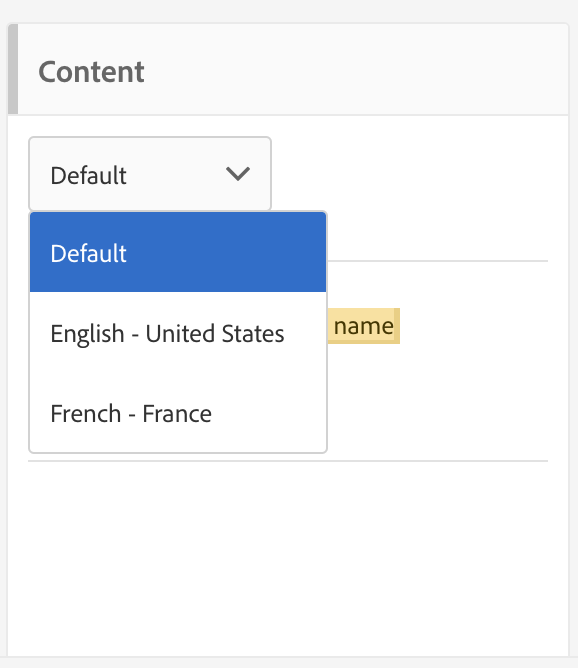

# Een meertalige e-mail maken{#creating-a-multilingual-email}

U kunt een meertalige e-mail verzenden naar profielen met verschillende voorkeurstalen: elk profiel zal een variant van e - mail in zijn aangewezen taal ontvangen .

Hiervoor controleert u of er een sjabloon voor meertalige e-mail beschikbaar is. Als dat niet het geval is, leert u hoe u er een maakt in [deze sectie](../../channels/using/multilingual-messages-template.md).

Het publiek is gebaseerd op profielen met een voltooide voorkeurstaal.

1. Maak een nieuwe e-mail op basis van een [meertalige sjabloon](../../channels/using/multilingual-messages-template.md).

   

1. Definieer de algemene eigenschappen en de doelgroep van de e-mail, net als voor een standaard-e-mail. Raadpleeg de sectie [Doelgroepen maken](../../audiences/using/creating-audiences.md).
1. Bij de vierde stap in de aanmaakwizard definieert u de variantopties. Als de [meertalige sjabloon](../../channels/using/multilingual-messages-template.md) al alle juiste parameters bevat, kunt u rechtstreeks op de **[!UICONTROL Create]** knop klikken.

   

   Voeg zo nodig varianten toe met de **[!UICONTROL Add an element]** knop. **[!UICONTROL Default]** De variant mag niet worden verwijderd. Wanneer ingesteld op **[!UICONTROL default]**, wordt [de voorkeurstaal](../../audiences/using/creating-profiles.md) van het profiel gebruikt om de variant te kiezen. U kunt de **[!UICONTROL Default]** variant ook instellen op een andere taal.

1. Maken van e-mail bevestigen: het e-maildashboard wordt dan weergegeven.
1. Definieer de e-mailinhoud voor elke variant. Afhankelijk van de sjabloon die u hebt gekozen, kunt u verschillende onderwerpen, verschillende namen van afzenders of verschillende content definiëren. Gebruik het vervolgkeuzemenu om tussen de verschillende varianten van het element te navigeren. Raadpleeg de sectie [Contenteditor](../../designing/using/designing-content-in-adobe-campaign.md) voor meer informatie.

   

1. Test en valideer uw bericht. Raadpleeg de sectie [Bewijs](../../sending/using/sending-proofs.md) verzenden.
1. Plan het verzenden met de **[!UICONTROL Send after confirmation option]** server.
1. Zodra uw e-mail wordt verzonden, kunt u tot zijn logboeken en rapporten toegang hebben om het succes van uw campagne te meten. Raadpleeg [deze sectie](../../reporting/using/about-dynamic-reports.md) voor meer informatie over rapporten.

**Verwant onderwerp:**

* [Meertalig publiek bereiken met één workflow](https://helpx.adobe.com/campaign/kb/simplify-campaign-management.html#Engageyourcustomersateverystep)
