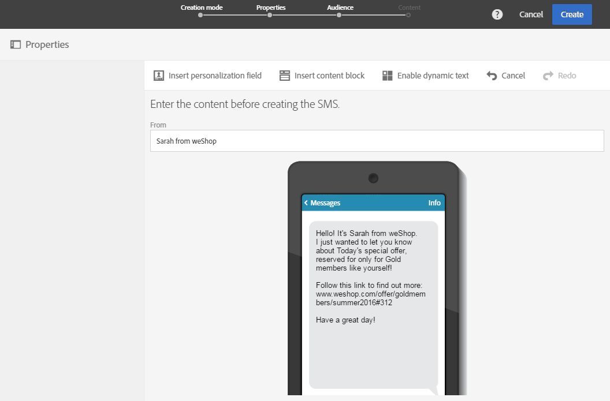

# Een sms-bericht maken{#creating-an-sms-message}

Het maken van een sms-verzending lijkt sterk op het maken van een standaard e-mail. In de volgende stappen wordt de configuratie beschreven die specifiek is voor dit kanaal. Zie [Een e-mail maken](../../channels/using/creating-an-email.md) voor meer informatie over andere opties.

De geavanceerde sms-parameters worden beschreven in de sectie [Sms-configuratie](../../administration/using/configuring-sms-channel.md).

 [Ontdek deze functie in video](#video)

Als u sms-berichten wilt maken en naar een mobiele telefoon verzenden, hebt u het volgende nodig:

* Een extern **[!UICONTROL Routing]**-account dat geconfigureerd is op het kanaal **[!UICONTROL Mobile (SMS)]** met de modus **[!UICONTROL Bulk delivery]**. Raadpleeg de sectie [Routering](../../administration/using/configuring-sms-channel.md#defining-an-sms-routing) voor meer informatie.
* Een leveringssjabloon die correct aan dit externe account is gekoppeld.

1. Maak een sms-levering. U kunt dit doen vanaf de [startpagina](../../start/using/interface-description.md#home-page) van Adobe Campaign, in een [campagne](../../start/using/marketing-activities.md#creating-a-marketing-activity) of in de [lijst met marketingactiviteiten](../../start/using/programs-and-campaigns.md#creating-a-campaign).

   U kunt ook een sms-activiteit toevoegen aan een workflow. Raadpleeg de handleiding [Workflows](../../automating/using/sms-delivery.md) voor meer informatie.

   Bij het maken van een bericht wordt een wizard weergegeven die u de belangrijkste stappen laat zien. Wat door de wizard is gedefinieerd, kan achteraf nog worden bewerkt vanaf het berichtdashboard.

1. Selecteer de sjabloon die u wilt gebruiken. U kunt de kant-en-klare sms-sjabloon of een van uw eigen sjablonen kiezen.

   

   Om aan een mobiele telefoon te leveren moet de leveringssjabloon correct gekoppeld zijn met het externe sms-routeringsaccount.

1. Voer de algemene eigenschappen van de sms in.

   

   Zowel het label als de id van de activiteit worden in de interface weergegeven, maar deze zijn niet zichtbaar voor de ontvangers van het bericht.

1. Geef de doelgroep op waarop u zich wilt richten. U kunt een bestaande doelgroep selecteren of een populatie targeten door regels te definiëren en te combineren.

   

1. Voeg content toe aan uw sms. U kunt de content ook definiëren door op de sectie **[!UICONTROL Content]** van het leveringsdashboard te klikken zodra de sms is gemaakt. Zie [Sms-content ontwerpen](../../channels/using/about-sms-and-push-content-design.md).

   Als u personalisatievelden of voorwaardelijke tekst in de content van uw sms-bericht hebt ingevoegd, kan de lengte van het bericht verschillen afhankelijk van de ontvanger. Door deze factoren kunnen immers tekens worden gebruikt die niet in aanmerking worden genomen door de gsm-codering. Daarom moet de berichtlengte worden geëvalueerd zodra de personalisatie is uitgevoerd. Zie [Sms-berichten personaliseren](../../channels/using/personalizing-sms-messages.md).

   

1. Bevestig dat het bericht wordt gemaakt. Het dashboard wordt vervolgens weergegeven.
1. Plan de verzending. De sms kan onmiddellijk na de berichtvoorbereiding handmatig worden verzonden of op een geplande datum automatisch worden verzonden. Zie [Berichten plannen](../../sending/using/about-scheduling-messages.md).
1. Bereid het bericht voor om de geldigheid, de personalisatie en het doel ervan te analyseren.

   

   >[!NOTE]
   >
   >U kunt algemene moeheidsregels tussen kanalen instellen om overvraagde profielen automatisch uit te sluiten van campagnes. Zie [Moeheidsregels](../../sending/using/fatigue-rules.md).

1. Verzend proeven om uw bericht te controleren en te valideren en de weergave ervan in inboxen te controleren. Zie de sectie [Proeven verzenden](../../sending/using/sending-proofs.md).
1. Bevestig de verzending van het bericht. Het verzenden wordt gestart volgens de door u gedefinieerde planning.

   

Het bericht wordt verzonden. U kunt de levering van het bericht controleren via het berichtdashboard en de logboeken.

Zodra het verzenden is voltooid, kunt u het effect van uw bericht beginnen meten met behulp van ingebouwde of aangepaste leveringsrapporten.

**Verwante onderwerpen:**

* [Bewerken van content van sms-berichten en pushmeldingen](../../channels/using/about-sms-and-push-content-design.md)
* [Sjablonen beheren](../../start/using/marketing-activity-templates.md)

## Video over zelfstudie {#video}

In deze video wordt getoond hoe u een SMS-levering kunt maken.

>[!VIDEO](https://video.tv.adobe.com/v/25265/?quality=12)

Er zijn [hier](https://experienceleague.adobe.com/docs/campaign-standard-learn/tutorials/overview.html?lang=nl) extra Campaign Standard hoe kan ik-video&#39;s beschikbaar.
