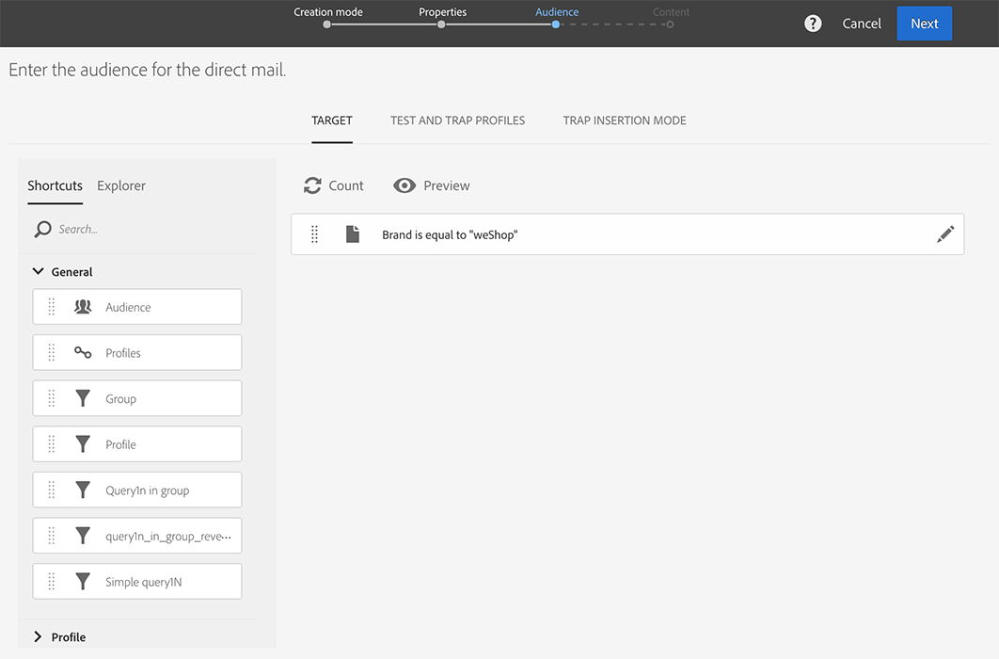

# Direct mail maken{#creating-the-direct-mail}

Het maken van een direct-maillevering lijkt veel op het maken van een gewone e-mail. In de volgende stappen wordt de configuratie beschreven die specifiek is voor dit kanaal. Zie [Een e-mail maken](../../channels/using/creating-an-email.md) voor meer informatie over andere opties.

1. Maak een nieuwe direct-maillevering. U kunt deze maken op de [startpagina](../../start/using/interface-description.md#home-page) van Adobe Campaign, in een [campagne](../../start/using/marketing-activities.md#creating-a-marketing-activity) of in een [lijst met marketingactiviteiten](../../start/using/programs-and-campaigns.md#creating-a-campaign).

   >[!NOTE]
   >
   >U kunt ook direct-mailactiviteiten toevoegen aan een workflow. Raadpleeg de handleiding [Workflows](../../automating/using/direct-mail-delivery.md) voor meer informatie.

   

1. Kies de kant-en-klare **[!UICONTROL Direct mail]**-sjabloon of een van uw eigen sjablonen.  Raadpleeg de sectie [Sjablonen beheren](../../start/using/marketing-activity-templates.md) voor meer informatie over sjablonen.

   

1. Voer de algemene eigenschappen van de levering in.

   

1. Definieer de doelgroep die u wilt opnemen in het extractiebestand en de test- en trapprofielen. Zie [De doelgroep voor direct mail definiëren](../../channels/using/defining-the-direct-mail-audience.md).

   

   >[!NOTE]
   >
   >Het definiëren van de doelgroep lijkt sterk op het definiëren van de doelgroep voor een normale e-mail. Zie [Doelgroepen maken](../../audiences/using/creating-audiences.md).

1. Bewerk de content van het bestand: kolommen die moeten worden opgenomen voor elk profiel, elke bestandsstructuur, elke kop- en voettekst. Zie [De content voor direct mail definiëren](../../channels/using/defining-the-direct-mail-content.md).

   

1. Klik op de sectie **[!UICONTROL Schedule]** van het leveringsdashboard om de contactdatum te bepalen. Voor direct mail is de contactdatum verplicht. Zie [De verzending plannen](../../sending/using/about-scheduling-messages.md) voor meer informatie.

   

1. Als u testprofielen hebt toegevoegd (zie [Test- en trapprofielen toevoegen](../../channels/using/defining-the-direct-mail-audience.md#adding-test-and-trap-profiles)), kunt u de levering testen voordat u het definitieve bestand voorbereidt. Hiermee kunt u een voorbeeldbestand maken dat alleen de geselecteerde testprofielen bevat.

   Klik op **[!UICONTROL Test]** om het voorbeeldbestand te genereren. Klik op **[!UICONTROL Summary]** in de linkerbovenhoek en selecteer **[!UICONTROL Proofs]**. Selecteer de proef in het linkergedeelte van het scherm en klik op **[!UICONTROL Download file]**.

   >[!NOTE]
   >
   >De rol **[!UICONTROL Export]** is vereist om Adobe Campaign toe te staan om het bestand te exporteren en het ter beschikking te stellen voor download. Neem contact op met uw beheerder.

   

1. Nadat u de content, de doelgroep en de contactdatum van de levering hebt gedefinieerd, klikt u op de knop **[!UICONTROL Prepare]** op het leveringsdashboard.

   

   Er worden typologieregels toegepast. Alle niet-opgegeven postadressen worden bijvoorbeeld van het doel uitgesloten. Daarom moet u het vakje **[!UICONTROL Address specified]** in de informatie van uw profielen (zie [Aanbevelingen](../../channels/using/about-direct-mail.md#recommendations)) inschakelen. Als u een **[!UICONTROL Maximum volume of message]** hebt gedefinieerd in de eigenschappen van de direct mail of op sjabloonniveau, wordt deze ook hier toegepast.

   

   >[!NOTE]
   >
   >U kunt algemene moeheidsregels tussen kanalen instellen om overvraagde profielen automatisch uit te sluiten van campagnes. Zie [Moeheidsregels](../../sending/using/fatigue-rules.md).

1. Klik op **[!UICONTROL Explore file]** om een voorbeeld van de eerste 100 regels van het bestand weer te geven.

   

   Het volledige bestand kan lokaal worden gedownload in het linkergedeelte van het scherm. Wanneer u het bestand downloadt, wordt een logboekvermelding gegenereerd in het menu **[!UICONTROL Export audits]**. Raadpleeg de sectie [Audits uitvoeren op exportlogboeken](../../administration/using/auditing-export-logs.md) voor meer informatie over exportaudits.

   >[!NOTE]
   >
   >De rol **[!UICONTROL Export]** is vereist om Adobe Campaign toe te staan om het bestand te exporteren en het ter beschikking te stellen voor download. Neem contact op met uw beheerder.

   Als u de content van de levering moet wijzigen, hoeft u alleen maar op de knop **[!UICONTROL Regenerate file]** te klikken om de wijziging door te voeren. De voorbereiding hoeft niet opnieuw te worden doorlopen.

   

1. Om te bevestigen dat dit het definitieve bestand is, klikt u op **[!UICONTROL Confirm]** in het leveringsdashboard.

   

U kunt het extractiebestand nu naar uw direct-mailprovider verzenden. Hiervoor hebt u verschillende opties:

* Verzend het via een gewone e-mail, met het bijgevoegde bestand
* Verstuur het via Campaign: voer uw direct mail uit binnen een campagne[workflow](../../automating/using/direct-mail-delivery.md) en voeg een **[!UICONTROL Transfer file]** toe om het bestand bijvoorbeeld via FTP te versturen. Zie [Bestand overdragen](../../automating/using/transfer-file.md)

De leverancier wint de lijst van onjuiste adressen terug en verzendt deze informatie naar Adobe Campaign die automatisch aan de lijst van afgewezen personen de onjuiste adressen toevoegt. Zie [Terug naar afzender](../../channels/using/return-to-sender.md).
