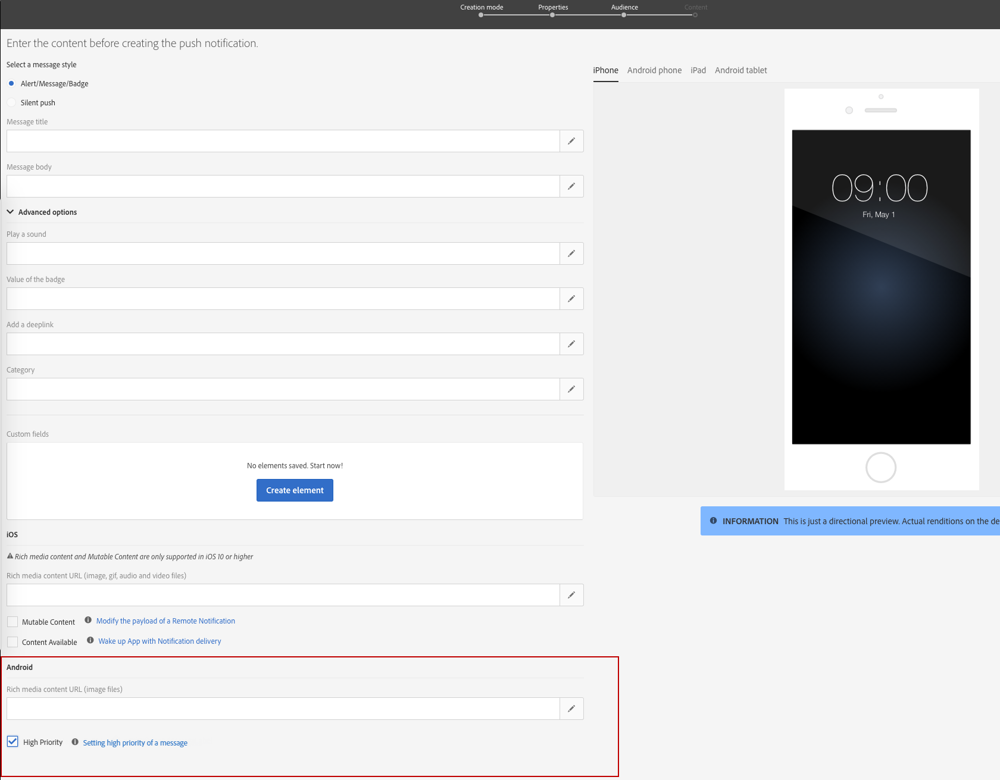

# Een pushmelding aanpassen{#customizing-a-push-notification}

Als u uw pushmelding wilt verfijnen, kunt u in Adobe Campaign een aantal geavanceerde opties gebruiken tijdens het ontwerpen van de melding.

Deskundige gebruikers kunnen voor het configureren van mobiele applicaties in Adobe Campaign de volgende technote raadplegen: [Understanding Campaign Standard Push Notifications Payload Structure](https://helpx.adobe.com/campaign/kb/understanding-campaign-standard-push-notifications-payload-struc.html).

**Gerelateerde content:**

* [Pushmeldingenrapport](../../reporting/using/push-notification-report.md)
* [Een pushmelding verzenden binnen een workflow](../../automating/using/push-notification-delivery.md)

## Geluid afspelen {#play-a-sound}

De functie **[!UICONTROL Play a sound]** geeft de applicatie de mogelijkheid om geluiden af te spelen op uw toestel wanneer een pushmelding wordt geleverd en de app niet actief is.

Met een geluid worden gebruikers gewaarschuwd dat er een pushmelding is, zodat deze meer zichtbaarheid krijgt. Een geluid opnemen in uw mobiele app:

1. Open de pushmelding en ga naar de sectie **[!UICONTROL Advanced options]**.
1. Typ in het veld **[!UICONTROL Play a sound]** de naam (zonder de extensie) van het geluidsbestand dat door het mobiele apparaat moet worden afgespeeld wanneer de melding wordt ontvangen.

   Raadpleeg de documentatie van [Apple](https://support.apple.com/kb/PH16864?locale=en_US) en [Android](https://developer.android.com/guide/topics/media/media-formats) voor meer informatie over ondersteunde media-indelingen.

   

1. Het geluidsbestand wordt afgespeeld bij het verzenden van de melding als het bestand is gedefinieerd in het pakket van de mobiele applicatie. Anders wordt het standaardgeluid van het apparaat afgespeeld.

De gebruiker ontvangt dan de pushmelding en het geluid alleen als zijn telefoon niet gedempt is.

## De badgewaarde vernieuwen {#refresh-the-badge-value}

Een badge wordt gebruikt om het aantal nieuwe ongelezen meldingen direct op het applicatiepictogram te tonen. De badgewaarde verdwijnt zodra de gebruiker de nieuwe content in de applicatie opent of leest.

Wanneer een melding op een apparaat wordt ontvangen, kan de badgewaarde voor de desbetreffende app worden vernieuwd of toegevoegd. Een badgewaarde verzenden vanaf de serverzijde:

1. Open de pushmelding en ga naar de sectie **[!UICONTROL Advanced options]**.
1. De badgewaarde moet een geheel getal zijn en kan op verschillende manieren worden bijgewerkt:

   * Typ 0 in het veld **[!UICONTROL Value of the badge]** om de badge te vernieuwen. Hierdoor wordt de badge van het applicatiepictogram verwijderd.
   * Voer een willekeurig nummer in het veld **[!UICONTROL Value of the badge]** in om een badgewaarde toe te voegen. Dit nummer wordt automatisch op de badge weergegeven zodra de gebruiker de pushmelding heeft ontvangen.
   * Als het veld leeg is of geen geheel getal bevat, verandert de badgewaarde niet.

   Hier hebben we 1 ingevoerd in het veld **[!UICONTROL Value of the badge]** om de gebruikers te laten weten dat de applicatie nieuwe informatie bevat.

   

1. Na het verzenden van uw bericht ontvangen gebruikers de pushmelding en geeft hun applicatie automatisch de nieuwe badgewaarde weer.

   

## Een deeplink toevoegen {#add-a-deeplink}

Met een deeplink kunt u gebruikers rechtstreeks naar de content in de applicatie brengen (in plaats van een webbrowserpagina te openen).

Een deeplink kan personalisatiegegevens bevatten voor een aangepaste in-app ervaring. Voornamen van ontvangers worden bijvoorbeeld automatisch ingevuld op de pagina die door de applicatie wordt weergegeven.

Een deeplink toevoegen aan een pushmelding:

1. Open de pushmelding en ga naar de sectie **[!UICONTROL Advanced options]**.
1. Typ de koppeling in het veld **[!UICONTROL Add a deeplink]**.

   

1. Na het verzenden van uw bericht ontvangen de gebruikers de pushmelding en hebben ze toegang tot een specifieke pagina in de app door interactie met de melding (bijv. door te tikken of klikken op de call-to-action-knop).

   

## Een handeling definiëren {#define-an-action}

U kunt een categorie-id toevoegen als deze beschikbaar is in de mobiele applicatie en vervolgens de knoppen voor handelingen weergeven. Met deze meldingen kan de gebruiker sneller verschillende taken uitvoeren als reactie op een melding zonder de applicatie te openen of erin te moeten navigeren.

Het dialoogvenster dat op de telefoon van de gebruiker verschijnt, vereist een beslissing om door te gaan. Wanneer de gebruiker een van de handelingen selecteert, brengt het systeem de applicatie op de hoogte, zodat deze eventuele bijbehorende taken kan uitvoeren.

Een categorie toevoegen aan een pushmelding:

1. Open de pushmelding en ga naar de sectie **[!UICONTROL Advanced options]**.
1. Voer in het veld **[!UICONTROL Category]** een vooraf gedefinieerde categorienaam in om knoppen voor handelingen weer te geven wanneer het pushbericht wordt ontvangen.

   De ontwikkelaar van de mobiele applicatie moet de categorie-id en het verwachte gedrag van de knoppen in de applicatie definiëren. Zie de [Apple Developer-documentatie](https://developer.apple.com/library/content/documentation/NetworkingInternet/Conceptual/RemoteNotificationsPG/SupportingNotificationsinYourApp.html) (sectie over **het configureren van categorieën en meldingen waarvoor een actie kan worden uitgevoerd**) of de [Android Developer-documentatie](https://developer.android.com/guide/topics/ui/notifiers/notifications.html) voor meer informatie hierover.

   

1. Na het verzenden van uw pushmelding ontvangen gebruikers het bericht en moeten ze actie ondernemen met de eerder geconfigureerde actieknoppen.

   

Afhankelijk van de actie van de gebruiker wordt de applicatie op de hoogte gebracht, zodat deze eventuele bijbehorende taken kan uitvoeren.

## Een vervaldatum toevoegen {#add-expiration-date}

Als u een vervaldatum instelt voor uw pushmelding, stelt u een specifieke datum in waarop het bericht niet langer wordt verzonden door Apple ([APNS](https://developer.apple.com/documentation/usernotifications/setting_up_a_remote_notification_server/sending_notification_requests_to_apns)) of Android ([FCM](https://firebase.google.com/docs/cloud-messaging/concept-options)).

Een vervaldatum toevoegen aan uw pushmelding:

1. Schakel de optie **[!UICONTROL Expire message]** in.

   >[!NOTE]
   >
   >Als u de optie **[!UICONTROL Expire message]** selecteert, wordt de duur automatisch ingesteld op 0. Als u de waarde niet wijzigt, proberen zowel APNS als FCM het bericht onmiddellijk te verzenden. Als het mislukt, wordt het bericht niet opnieuw verzonden.

1. Selecteer in het veld **[!UICONTROL Duration]** de geldigheid van uw pushmelding.

   

1. Als de gebruiker na het versturen van de pushmelding niet direct een bericht heeft ontvangen omdat de telefoon niet aanstaat of geen signaal heeft, wordt de pushmelding alsnog binnen het tijdsbestek van de vervaldatum verstuurd.

Als de pushmelding niet is verzonden vóór de vervaldatum, wordt deze genegeerd.

## Aangepaste velden toevoegen {#add-custom-fields}

Met aangepaste velden kunt u aangepaste data in de payload doorgeven in de vorm van een sleutelwaardepaar. Deze optie kan worden gebruikt om aanvullende data door te geven aan de applicatie buiten de vooraf gedefinieerde sleutels.

Dit doet u als volgt:

1. Open de pushmelding en ga naar de sectie **[!UICONTROL Advanced options]**.
1. Klik in de categorie **[!UICONTROL Custom fields]** op de knop **[!UICONTROL Add an element]**.
1. Voer uw **[!UICONTROL Keys]** in en vervolgens de **[!UICONTROL Values]** die aan elke sleutel zijn gekoppeld.

   

1. De verwerking en het doel van aangepaste velden zijn volledig afhankelijk van de mobiele app. In de onderstaande pushmelding heeft de app aangepaste velden gebruikt om knoplabels voor de pushmelding weer te geven.

   

## Rich media content toevoegen {#add-rich-media-content}

Met rich media content kunt u een betere betrokkenheid van de gebruiker bereiken. Dit houdt in dat gebruikers eerder geneigd zullen zijn om uw pushmelding te openen.

U kunt een afbeeldings-, GIF-, audio- of videobestand opnemen dat wordt afgespeeld of weergegeven in de melding zelf. Gebruikers van uw app hoeven de applicatie niet te openen om deze te kunnen zien.

Rich media opnemen in de pushmelding:

1. Open de pushmelding en ga naar de sectie **[!UICONTROL Advanced options]**.
1. Voer in het veld **[!UICONTROL Rich media content URL]** de URL van het bestand in voor elke indeling: iOS en Android.

   Voor iOS 10 of hoger kunt u afbeeldings-, GIF-, audio- en videobestanden invoegen. Voor eerdere iOS-versies wordt de pushmelding weergegeven zonder rich content. Raadpleeg deze [pagina](https://helpx.adobe.com/campaign/kb/display-image-push.html) voor gedetailleerde stappen over het weergeven van een afbeelding vanuit een pushmelding voor Adobe Campaign op een iOS-apparaat.

   Voor Android kunt u alleen afbeeldingen opnemen.

   

1. Na het verzenden van uw bericht ontvangt de gebruiker uw pushmelding en kan hij of zij de rich media content weergeven.

   

## Het meldingsgedrag voor iOS wijzigen {#change-the-notification-behavior-for-ios}

Voor iOS 10 of hoger zijn twee extra opties beschikbaar in de **[!UICONTROL Advanced options]** sectie met pushmeldingen: **[!UICONTROL Mutable content]** en **[!UICONTROL Content available]**.

Wanneer de optie **[!UICONTROL Mutable content]** is ingeschakeld en/of een URL voor rich media content wordt toegevoegd, wordt de markering voor veranderlijke content verzonden in de pushpayload en kan de content van de pushmelding worden gewijzigd door een uitbreiding van de berichtenservice die is opgegeven in iOS SDK. Zie [Apple Developer documentatie](https://developer.apple.com/library/content/documentation/NetworkingInternet/Conceptual/RemoteNotificationsPG/ModifyingNotifications.html) voor meer informatie hierover.

Vervolgens kunt u uw mobiele app-uitbreidingen gebruiken voor verdere aanpassing van de content of presentatie van binnenkomende pushberichten die vanuit Adobe Campaign zijn verzonden. Gebruikers kunnen deze optie bijvoorbeeld gebruiken om:

* Data te decoderen die in een gecodeerde indeling zijn geleverd
* Afbeeldingen of andere mediabestanden te downloaden en toe te voegen als bijlagen aan een melding
* De tekst of titel van een melding te wijzigen
* Een thread-id toe te voegen aan een bericht

Wanneer **[!UICONTROL Content available]** is ingeschakeld, wordt de markering voor beschikbare content verzonden in de pushpayload om ervoor te zorgen dat de app wordt geactiveerd zodra deze de pushmelding ontvangt. Dit betekent dat de app toegang kan krijgen tot de payloaddata. Dit werkt zelfs als de app op de achtergrond draait en zonder dat er enige gebruikersinteractie nodig is (bijv. tikken op pushmelding). Dit geldt echter niet als de app niet draait. Zie de [Apple Developer documentatie](https://developer.apple.com/library/content/documentation/NetworkingInternet/Conceptual/RemoteNotificationsPG/CreatingtheNotificationPayload.html) voor meer informatie hierover.

## Het meldingsgedrag voor Android wijzigen {#change-the-notification-behavior-for-android}

Voor Android kunt u de URL van uw bestand invoeren in het veld **Rich media content URL**. In tegenstelling tot de iOS-versie kunt u voor Android alleen afbeeldingen en geen GIF-, audio- of videobestanden opnemen.

Met het selectievakje **[!UICONTROL High priority]** kunt u een hoge of normale prioriteit instellen voor uw pushmeldingen. Zie de [Google Developer-documentatie](https://firebase.google.com/docs/cloud-messaging/concept-options#setting-the-priority-of-a-message) voor meer informatie over de prioriteit van berichten.

