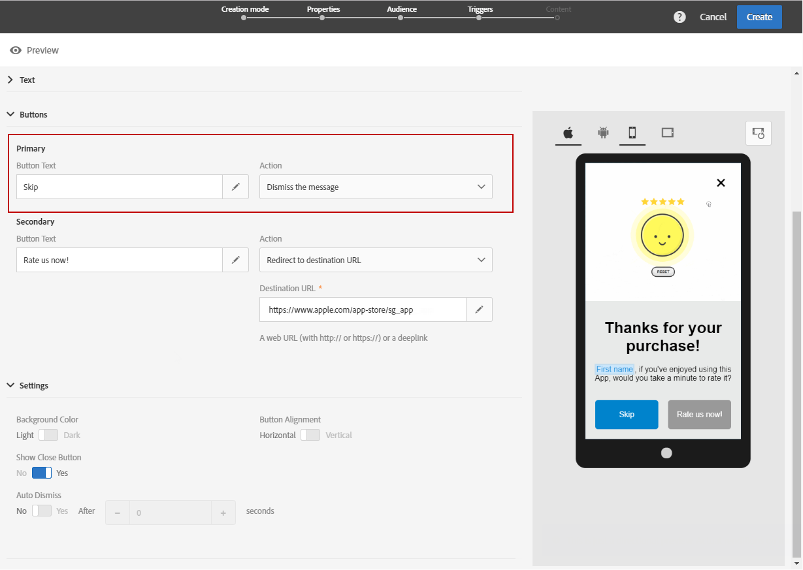
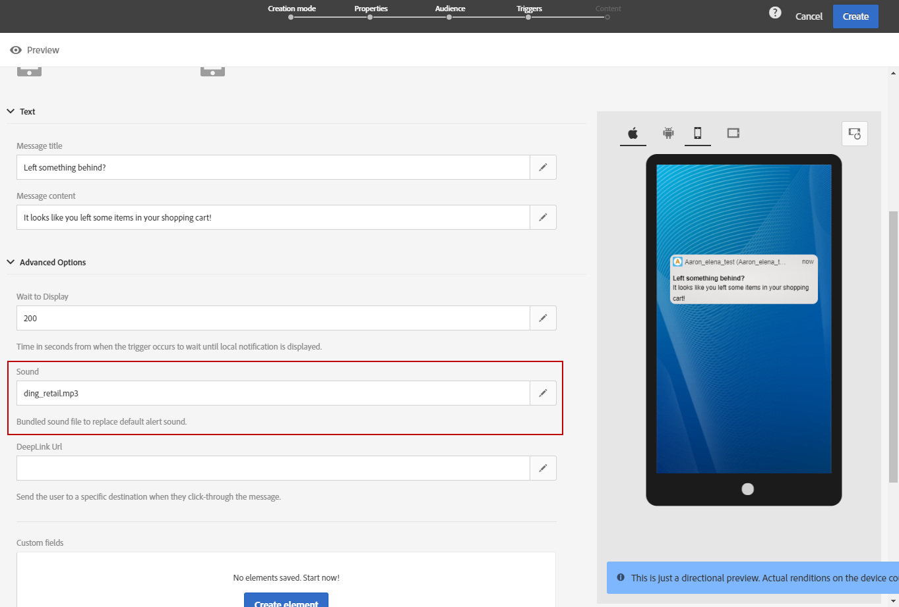

# Een in-app-bericht aanpassen{#customizing-an-in-app-message}

Als u uw in-app-bericht verder wilt verfijnen, krijgt u tijdens het ontwerpen van de in-app via Adobe Campaign toegang tot tal van geavanceerde opties.

Gebruik de in-app contenteditor om te kiezen uit twee in-app-berichtmodi:

* [Berichtsjabloon](#customizing-with-a-message-template): met deze sjabloon kunt u uw in-app volledig aanpassen met afbeeldingen of video&#39;s en actieknoppen.
* [Aangepast bericht](#customizing-with-a-custom-html-message): met deze sjabloon kunt u aangepaste HTML importeren.

>[!NOTE]
>
> In-app-berichtweergave wordt alleen ondersteund voor Android API 19 en latere versies.

**Verwante onderwerpen:**

* [Uw in-app-bericht verzenden](../../channels/using/preparing-and-sending-an-in-app-message.md#sending-your-in-app-message)
* [In-app-rapportage](../../reporting/using/in-app-report.md)
* [Lokale notificatietracking implementeren](../../administration/using/local-tracking.md)

## Aanpassen met een berichtsjabloon {#customizing-with-a-message-template}

### Lay-out {#layout}

Het keuzemenu **[!UICONTROL Layout]** bevat vier verschillende opties die u kunt kiezen, afhankelijk van wat u met uw bericht wilt bereiken:

* **[!UICONTROL Full page]**: Dit type lay-out bedekt het volledige scherm van de apparaten van uw doelgroep.

   Media- (afbeeldingen, video), tekst- en knopcomponenten worden ondersteund.

* **[!UICONTROL Large modal]**: Deze lay-out wordt weergegeven in een groot waarschuwingsvenster. Uw applicatie is op de achtergrond nog steeds zichtbaar.

   Media- (afbeeldingen, video), tekst- en knopcomponenten worden ondersteund.

* **[!UICONTROL Small modal]**: Deze lay-out wordt weergegeven als een klein waarschuwingsvenster. Uw applicatie is op de achtergrond nog steeds zichtbaar.

   Media- (afbeeldingen, video), tekst- en knopcomponenten worden ondersteund.

* **[!UICONTROL Alert]**: Dit type lay-out wordt weergegeven als een waarschuwingsbericht van het besturingssysteem.

   Alleen tekst- en knopcomponenten worden ondersteund.

* **[!UICONTROL Local notification]**: Dit type lay-out wordt weergegeven als een bannerbericht.

   Alleen geluid, tekst en bestemming worden ondersteund. Zie [Berichten van het type lokale meldingen aanpassen](#customizing-a-local-notification-message-type) voor meer informatie over lokale berichten.

In het rechtervenster van de content editor kunt u een voorbeeld van elk type lay-out bekijken op verschillende apparaten, zoals een telefoon, tablet of platform (bijvoorbeeld Android of iOS), en standen (bijvoorbeeld liggend of staand).

### Media {#media}

Gebruik de keuzelijst **[!UICONTROL Media]** voor het toevoegen van media aan uw in-app-bericht met als doel het creëren van een aantrekkelijke beleving voor de eindgebruiker.

1. Selecteer uw **[!UICONTROL Media Type]** tussen afbeelding en video.
1. Voer voor het mediatype **[!UICONTROL Image]** uw URL in het veld **[!UICONTROL Media URL]** in, op basis van de ondersteunde indelingen.

   U kunt, indien nodig, ook het pad invoeren naar een **[!UICONTROL Bundled image]** die kan worden gebruikt als het apparaat offline is.

   

1. Voer voor het mediatype **[!UICONTROL Video]** uw URL in het veld **[!UICONTROL Media URL]** in.

   Voer vervolgens de **[!UICONTROL Video poster]** in die u wilt gebruiken terwijl de video wordt gedownload op de doelapparaten of totdat gebruikers op de afspeelknop tikken.

   

### Tekst {#text}

U kunt, indien nodig, ook een berichttitel en content toevoegen aan uw in-app-bericht. Om uw in-app-bericht persoonlijker te maken, is het mogelijk om verschillende personalisatievelden, contentblokken en dynamische tekst aan uw content toe te voegen.

1. Voeg in de keuzelijst **[!UICONTROL Text]** een titel toe aan het veld **[!UICONTROL Message title]**.

   

1. Voeg uw content toe aan het veld **[!UICONTROL Message content]**.
1. Om de tekst verder aan te passen, klikt u op het pictogram  om personalisatievelden toe te voegen.

   

1. Typ de content van uw bericht en voeg, indien nodig, uw personalisatievelden toe.

   Zie deze [sectie](../../designing/using/personalization.md#inserting-a-personalization-field) voor meer informatie over personalisatievelden.

   

1. Controleer de content van uw bericht in het voorbeeldvenster.

   

### Knoppen {#buttons}

U kunt maximaal twee knoppen toevoegen aan uw in-app-bericht.

1. Typ in de keuzelijst **[!UICONTROL Buttons]** de tekst van de eerste knop in de categorie **[!UICONTROL Primary]**.

   

1. Kies welke van de twee acties **[!UICONTROL Dismiss]** of **[!UICONTROL Redirect]** aan uw primaire knop wordt toegewezen.
1. Voeg, indien nodig, in de categorie **[!UICONTROL Secondary]** een tweede knop aan de in-app toe door uw tekst in te voeren.
1. Selecteer de actie die u aan de tweede knop wilt toewijzen.
1. Als u kiest voor de actie **[!UICONTROL Redirect]**, voer dan de URL of de deeplink in het veld **[!UICONTROL Destination URL]** in.

   

1. Voer in het veld **[!UICONTROL Destination URL]** uw URL of deeplink in als u hebt gekozen voor de actie **[!UICONTROL Redirect]**.
1. Controleer de berichtcontent in het voorbeeldvenster of klik op de knop Preview.

   Raadpleeg de pagina [Voorbeeld van het in-app-bericht bekijken](#previewing-the-in-app-message).

   

### Instellingen {#settings}

1. Kies in de categorie **[!UICONTROL Settings]** voor een lichte of donkere achtergrondkleur.
1. Kies met de optie **[!UICONTROL Show close button]** of u een knop Sluiten wilt weergeven waarmee gebruikers het in-app-bericht kunnen sluiten.
1. Gebruik de optie **[!UICONTROL Button alignment]** om de horizontale of verticale knopuitlijning in te stellen.
1. Kies of uw in-app-bericht na een paar seconden automatisch wordt verwijderd.

   

## Berichten van het type lokale meldingen aanpassen{#customizing-a-local-notification-message-type}

Lokale meldingen kunnen alleen op een bepaald tijdstip en afhankelijk van een gebeurtenis door een app worden geactiveerd. Ze waarschuwen gebruikers dat er iets gebeurt in hun app, zelfs zonder internettoegang.
Zie deze [pagina](../../administration/using/local-tracking.md) voor meer informatie over het bijhouden van lokale meldingen.

Een lokale melding aanpassen:

1. Selecteer op de pagina **[!UICONTROL Content]** de optie **[!UICONTROL Local notification]** in de categorie **[!UICONTROL Layout]**

   

1. Typ in de categorie **[!UICONTROL Text]** de gewenste **[!UICONTROL Message title]** en **[!UICONTROL Message content]**.

   

1. Kies in de categorie **[!UICONTROL Advanced option]** in het veld **[!UICONTROL Wait to display]** hoe lang in seconden de lokale melding na het starten van de gebeurtenis op het scherm wordt getoond.
1. Voer in het veld **[!UICONTROL Sound]** de bestandsnaam en de extensie in van het geluidsbestand dat door het mobiele apparaat moet worden afgespeeld wanneer de lokale melding wordt ontvangen.

   Het geluidsbestand wordt afgespeeld bij het verzenden van de melding als het bestand is gedefinieerd in het pakket van de mobiele applicatie. Anders wordt het standaardgeluid van het apparaat afgespeeld.

   

1. Geef in het veld **[!UICONTROL Deeplink URL]** een bestemming op waar gebruikers naar worden omgeleid als ze communiceren met uw lokale melding.
1. U kunt aangepaste velden aan uw lokale melding toevoegen als u aangepaste data in de vorm van een sleutelwaardepaar in de payload wilt doorgeven. Klik in de categorie **[!UICONTROL Custom fields]** op de knop **[!UICONTROL Create an element]**.
1. Voer uw **[!UICONTROL Keys]** in en vervolgens de **[!UICONTROL Values]** die aan elke sleutel zijn gekoppeld.

   Houd er rekening mee dat de verwerking en het doel van aangepaste velden volledig afhankelijk is van de mobiele app.

1. Vul in de categorie **[!UICONTROL Apple options]** de velden **[!UICONTROL Category]** in om een categorie-id voor aangepaste handelingen toe te voegen, als deze in uw mobiele applicatie voor Apple beschikbaar zijn.

## Aanpassen met een aangepast HTML-bericht {#customizing-with-a-custom-html-message}

>[!NOTE]
>
>Aangepaste HTML-berichten ondersteunen geen personalisatie van content.

U kunt in de modus **[!UICONTROL Custom message]** rechtstreeks een van uw vooraf geconfigureerde HTML-berichten importeren.

U hoeft dan alleen maar een bestand op uw computer te selecteren en het te slepen en neer te zetten.

Het bestand moet een specifieke indeling hebben die u kunt vinden door te klikken op de optie **Download the sample file**.

Er is ook een lijst met aangepaste HTML-voorwaarden voor een geslaagde import in Adobe Campaign.

Na het importeren van de HTML kunt u in het voorbeeldvenster een voorbeeld van het bestand op verschillende apparaten bekijken.

## Voorbeeld van het in-app-bericht bekijken {#previewing-the-in-app-message}

Voordat u uw in-app-bericht verzendt, kunt u het testen met uw testprofielen om te controleren wat uw doelgroep ziet wanneer deze uw levering ontvangt.

1. Klik op de knop **[!UICONTROL Preview]**.

   

1. Klik op de knop **[!UICONTROL Select a test profile]** en selecteer een van uw testprofielen om een voorbeeld van de levering te bekijken. Zie deze [sectie](../../audiences/using/managing-test-profiles.md) voor meer informatie over testprofielen.
1. Controleer uw bericht op verschillende apparaten, zoals een Android- of iPhone-telefoon of zelfs tablets. U kunt ook controleren of uw personalisatievelden de juiste data ophalen.

   

1. U kunt nu uw bericht verzenden en de impact ervan meten met leveringsrapporten. Raadpleeg [deze sectie](../../reporting/using/in-app-report.md) voor meer informatie over rapporten.
