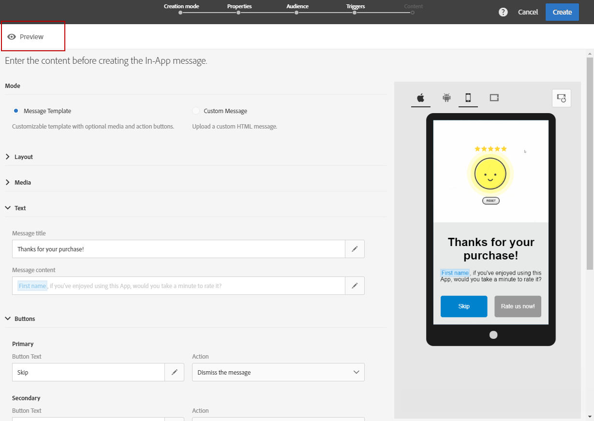

# Een bericht in de app aanpassen{#customizing-an-in-app-message}

Als u uw In-App-bericht wilt verfijnen, kunt u met Adobe Campaign toegang krijgen tot een set geavanceerde opties terwijl u een In-App ontwerpt.

Met de inhoudeditor in de app kunt u kiezen uit twee berichtmodi in de app:

* [Berichtsjabloon](#customizing-with-a-message-template): Met deze sjabloon kunt u uw In-App volledig aanpassen met afbeeldingen of video&#39;s en actieknoppen.
* [Aangepast bericht](#customizing-with-a-custom-html-message): Met deze sjabloon kunt u aangepaste HTML importeren.

**Verwante onderwerpen:**

* [Uw bericht in de app verzenden](../../channels/using/preparing-and-sending-an-in-app-message.md#sending-your-in-app-message)
* [Rapportage in de app](../../reporting/using/in-app-report.md)
* [Lokale meldingstracking implementeren](https://helpx.adobe.com/campaign/kb/local-notification-tracking.html)

## Aanpassen met een berichtsjabloon {#customizing-with-a-message-template}

### Layout {#layout}

Het **[!UICONTROL Layout]** drop-down voorziet u van vier verschillende opties om van afhankelijk van uw overseinenbehoeften te kiezen:

* **[!UICONTROL Full page]**: Dit type lay-out bedekt het volledige scherm van uw publieksapparaten.

   De klasse ondersteunt media (afbeeldingen, video), tekst en knopcomponenten.

* **[!UICONTROL Large modal]**: Deze lay-out wordt weergegeven in een groot waarschuwingsvenster. Uw toepassing is nog steeds zichtbaar op de achtergrond.

   De klasse ondersteunt media (afbeeldingen, video), tekst en knopcomponenten.

* **[!UICONTROL Small modal]**: Deze lay-out wordt weergegeven als een klein waarschuwingsvenster. Uw toepassing is nog steeds zichtbaar op de achtergrond.

   De klasse ondersteunt media (afbeeldingen, video), tekst en knopcomponenten.

* **[!UICONTROL Alert]**: Dit type lay-out wordt weergegeven als een waarschuwingsbericht voor native besturingssystemen.

   Alleen tekst- en knopcomponenten worden ondersteund.

* **[!UICONTROL Local notification]**: Dit type lay-out wordt weergegeven als een bannerbericht.

   Alleen geluid, tekst en bestemming worden ondersteund. Voor meer op lokaal bericht, verwijs naar het [Aanpassen van een lokaal berichttype](#customizing-a-local-notification-message-type).

Elk type lay-outs kan worden voorvertoond op verschillende apparaten, zoals telefoon, tablet, platform, bijvoorbeeld Android of iOS, en oriëntatie, bijvoorbeeld liggend of staand in het rechtervenster van de inhoudeditor.

### Media {#media}

Met de **[!UICONTROL Media]** vervolgkeuzelijst kunt u media toevoegen aan uw In-App-bericht om een aantrekkelijke ervaring voor de eindgebruiker te creëren.

1. Selecteer de **[!UICONTROL Media Type]** tussen afbeelding en video.
1. Voer voor het **[!UICONTROL Image]** mediatype in het **[!UICONTROL Media URL]** veld de URL in op basis van de ondersteunde indelingen.

   Indien nodig kunt u ook het pad invoeren naar een pad **[!UICONTROL Bundled image]** dat kan worden gebruikt als het apparaat offline is.

   

1. Voer voor het **[!UICONTROL Video]** mediatype de URL in het **[!UICONTROL Media URL]** veld in.

   Voer vervolgens de **[!UICONTROL Video poster]** gegevens in die u wilt gebruiken terwijl de video wordt gedownload op de doelapparaten of totdat gebruikers op de afspeelknop tikken.

   

### Tekst {#text}

Indien nodig kunt u ook een berichttitel en inhoud toevoegen aan uw In-App-bericht. Om uw In-App-bericht beter aan te passen, kunt u verschillende verpersoonlijkingsvelden, inhoudsblokken en dynamische tekst aan uw inhoud toevoegen.

1. Voeg in de **[!UICONTROL Text]** vervolgkeuzelijst een titel toe aan het **[!UICONTROL Message title]** veld.

   

1. Voeg uw inhoud toe aan het **[!UICONTROL Message content]** veld.
1. Als u de tekst verder wilt aanpassen, klikt u op het  pictogram om verpersoonlijkingsvelden toe te voegen.

   

1. Typ uw berichtinhoud en voeg uw personaliseringsgebieden indien nodig toe.

   Raadpleeg deze [sectie](../../designing/using/personalization.md#inserting-a-personalization-field)voor meer informatie over personalisatie.

   

1. Controleer de inhoud van uw bericht in het voorvertoningsvenster.

   

### Knoppen {#buttons}

U kunt maximaal twee knoppen toevoegen aan uw In-App-bericht.

1. Typ in de **[!UICONTROL Buttons]** vervolgkeuzelijst de tekst van de eerste knop in de **[!UICONTROL Primary]** categorie.

   

1. Kies welke van de twee acties **[!UICONTROL Dismiss]** en aan uw primaire knoop **[!UICONTROL Redirect]** zal worden toegewezen.
1. Voeg in de **[!UICONTROL Secondary]** categorie zo nodig een tweede knop toe aan de In-app door uw tekst in te voeren.
1. Selecteer de actie die aan de tweede knop is gekoppeld.
1. Als u de **[!UICONTROL Redirect]** handeling kiest, voert u de URL of de koppeling in het **[!UICONTROL Destination URL]** veld in.

   

1. Voer in het **[!UICONTROL Destination URL]** veld uw URL of diepte in als u de **[!UICONTROL Redirect]** handeling hebt gekozen.
1. Controleer de berichtinhoud in het voorvertoningsvenster of klik op de knop Voorvertoning.

   Raadpleeg de pagina [Voorvertoning van het bericht](#previewing-the-in-app-message) in de app.

   

### Instellingen {#settings}

1. Selecteer in de **[!UICONTROL Settings]** categorie de achtergrondkleur tussen licht en donker.
1. Kies of u een knop Sluiten wilt weergeven met de **[!UICONTROL Show close button]** optie waarmee gebruikers het bericht in de app kunnen negeren.
1. Selecteer of de uitlijning van de knop horizontaal of verticaal is met de **[!UICONTROL Button alignment]** optie.
1. Kies of uw bericht in de app na een paar seconden automatisch kan worden verwijderd.

   

## Het type lokaal berichtbericht aanpassen {#customizing-a-local-notification-message-type}

Lokale meldingen kunnen alleen worden geactiveerd door een app op een bepaald tijdstip en afhankelijk van een gebeurtenis. Ze zullen gebruikers waarschuwen dat er iets gebeurt in hun app, zelfs zonder toegang tot internet.
Raadpleeg deze [pagina](https://helpx.adobe.com/campaign/kb/local-notification-tracking.html)voor meer informatie over het bijhouden van lokale meldingen.

Een lokale melding aanpassen:

1. Selecteer op je **[!UICONTROL Content]** pagina **[!UICONTROL Local notification]** de **[!UICONTROL Layout]** rubriek

   

1. Typ onder de **[!UICONTROL Text]** rubriek je **[!UICONTROL Message title]** en **[!UICONTROL Message content]**.

   

1. Kies in de **[!UICONTROL Advanced option]** categorie in het **[!UICONTROL Wait to display]** veld hoelang de lokale melding in seconden op het scherm wordt weergegeven wanneer de gebeurtenis wordt geactiveerd.
1. Voer in het **[!UICONTROL Sound]** veld de bestandsnaam in van het geluidsbestand met de extensie die door het mobiele apparaat moet worden afgespeeld wanneer het lokale bericht wordt ontvangen.

   Het geluidsbestand wordt afgespeeld bij het verzenden van de melding als het bestand is gedefinieerd in het pakket van de mobiele toepassing. Anders wordt het standaardgeluid van het apparaat afgespeeld.

   

1. Geef een bestemming op om uw gebruikers om te leiden wanneer ze communiceren met uw lokale melding in het **[!UICONTROL Deeplink URL]** veld.
1. Als u aangepaste gegevens in de payload wilt doorgeven in de vorm van een sleutelwaardepaar, kunt u aangepaste velden toevoegen aan uw lokale melding. Klik in de **[!UICONTROL Custom fields]** categorie op de **[!UICONTROL Create an element]** knop.
1. Voer **[!UICONTROL Keys]** vervolgens de **[!UICONTROL Values]** bijbehorende sleutel in.

   Houd er rekening mee dat de verwerking en het doel van aangepaste velden volledig afhankelijk is van de mobiele app.

1. Vul in de **[!UICONTROL Apple options]** categorie de **[!UICONTROL Category]** velden in om een categorie-id voor aangepaste handelingen toe te voegen, mits deze beschikbaar zijn in uw mobiele Apple-toepassing.

## Aanpassen met een aangepast HTML-bericht {#customizing-with-a-custom-html-message}

>[!NOTE]
>
>Aangepast HTML-bericht ondersteunt geen personalisatie van inhoud.

In de **[!UICONTROL Custom message]** modus kunt u rechtstreeks een van uw vooraf geconfigureerde HTML-berichten importeren.

Hiervoor hoeft u alleen het bestand van de computer te slepen en neer te zetten of te selecteren.

Het bestand moet een specifieke indeling hebben die u kunt vinden door op de optie Voorbeeldbestand **** downloaden te klikken.

U vindt ook een lijst met aangepaste HTML-vereisten voor een geslaagde import in Adobe Campagne.

Nadat de HTML is geïmporteerd, kunt u een voorvertoning van het bestand op verschillende apparaten in het voorvertoningsvenster bekijken.

## Een voorvertoning weergeven van het bericht in de app {#previewing-the-in-app-message}

Voordat u het bericht in de app verzendt, kunt u testen met uw testprofielen om te controleren wat uw doelgroep ziet wanneer zij uw levering ontvangen.

1. Klik op de **[!UICONTROL Preview]** knop.

   

1. Klik op de **[!UICONTROL Select a test profile]** knop en selecteer een van uw testprofielen om een voorvertoning van de levering weer te geven. Raadpleeg deze [sectie](../../audiences/using/managing-test-profiles.md)voor meer informatie over testprofielen.
1. Controleer uw bericht op verschillende apparaten, zoals Android, iPhone-telefoons of zelfs tablets. U kunt ook controleren of de juiste gegevens worden opgehaald in uw aanpassingsvelden.

   

1. U kunt nu uw bericht verzenden en de impact ervan meten met leveringsrapporten. For more on reporting, refer to [this section](../../reporting/using/in-app-report.md).

