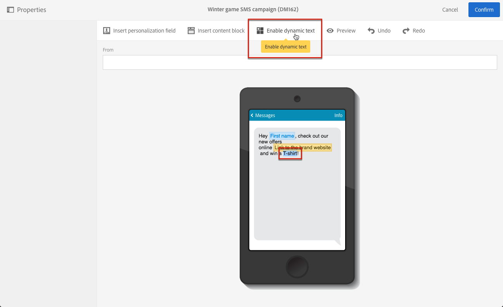

# Dynamische tekst definiëren{#defining-dynamic-text}

Dynamische tekst wordt op dezelfde manier gedefinieerd als dynamische inhoud. Raadpleeg de sectie [Dynamische inhoud](../../designing/using/personalization.md#defining-dynamic-content-in-an-email) definiëren.

>[!NOTE]
>
>Voor SMS en push kunt u alleen dynamische tekst definiëren. U kunt zowel dynamische inhoud als tekst op een openingspagina definiëren. Zie Dynamische inhoud in een e-mailbericht definiëren als u dynamische tekst wilt definiëren met de [e-mailontwerper](../../designing/using/personalization.md#defining-dynamic-content-in-an-email).

In het onderstaande voorbeeld ziet u hoe u dynamische tekst in een SMS-bericht definieert.

1. Selecteer tekst in de tekst van het bericht of de landingspagina.
1. Klik op **[!UICONTROL Enable dynamic text]**.

   

   De **[!UICONTROL Dynamic text]** optie wordt weergegeven in het palet. Het wordt gevormd op de zelfde manier zoals dynamische inhoud.

1. Selecteer een variant.

   

1. Definieer een voorwaarde voor deze variant.

   

Wanneer voor ten minste één variant een voorwaarde is gedefinieerd, wordt een paarse kader rond de dynamische tekst weergegeven.

