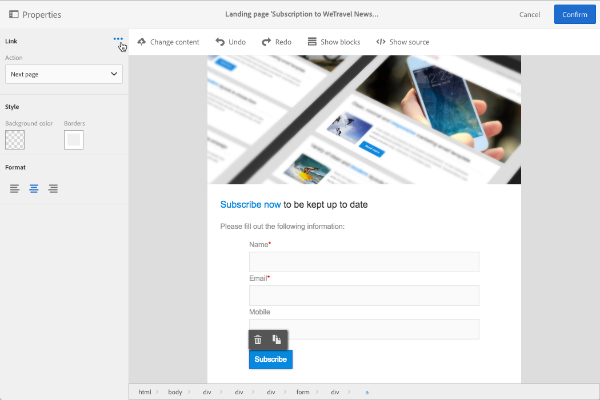

# Een openingspagina ontwerpen{#designing-a-landing-page}

## Informatie over het ontwerpen van inhoud voor pagina-inhoud {#about-content-design}

Aanlandingspagina&#39;s worden gemaakt als elke [marketingactiviteit](../../start/using/marketing-activities.md#about-marketing-activities).

Wanneer u een openingspagina ontwerpt, moet u de inhoud van de pagina zelf, de bevestigingspagina en de foutpagina definiëren. Gebruik de schakeloptie onder de actiebalk om elk van deze pagina&#39;s weer te geven en te configureren.

De inhoud van bestemmingspagina&#39;s wordt ontworpen door de inhoudeditor van de Campagne.

>[!NOTE]
>
>Als uw exemplaar vóór de release van Adobe Campagne Standard 19.0 was geïnstalleerd, hebt u nog steeds toegang tot de oude e-mailinhoudeditor. De interface, gebruiksbeginselen en configuratie zijn meestal dezelfde als hieronder beschreven voor landingspagina&#39;s. Het is echter mogelijk dat niet alle functies beschikbaar of onderhouden zijn in de verouderde e-mailinhoudeditor, die vanaf 19.0 verouderd is. Met de [e-mailontwerper](../../designing/using/designing-content-in-adobe-campaign.md)kunt u uw e-mailinhoud snel bewerken via een interface voor slepen en neerzetten met uitgebreide functies.

Deze pagina beschrijft de specifieke kenmerken van de inhoudseditor van de bestemmingspagina. Raadpleeg de volgende secties in de handleiding **E-mailinhoud** ontwerpen voor meer informatie over de acties die een of meer marketingactiviteiten gemeen hebben:

* [Een aanpassingsveld invoegen](../../designing/using/personalization.md#inserting-a-personalization-field)
* [Een inhoudsblok](../../designing/using/personalization.md#adding-a-content-block)toevoegen.
* [Een koppeling](../../designing/using/links.md#inserting-a-link)invoegen.
* [Afbeeldingen](../../designing/using/images.md)invoegen.
* [Algemene aanbevolen procedures voor het ontwerpen](../../designing/using/designing-content-in-adobe-campaign.md#content-design-best-practices)van inhoud.

>[!NOTE]
>Als u een openingspagina hebt die al vooraf in HTML-indeling is gedefinieerd, kunt u deze rechtstreeks importeren met de **[!UICONTROL Change content]** knop.
>
>Voordat u een HTML-pagina importeert in Adobe Campaign, moet u ervoor zorgen dat deze pagina wordt geopend en correct wordt weergegeven in de verschillende browsers. Als de HTML-pagina JavaScript-scripts bevat, moeten deze worden uitgevoerd zonder fouten buiten de editor. Gebruik in het algemeen geen scripts in de inhoud van berichten om ervoor te zorgen dat deze correct worden verwerkt door e-mailclients.

## Interface van de inhoudseditor voor bestemmingspagina{#landing-page-content-editor-interface}

Met de inhoudeditor voor de openingspagina kunt u inhoud in Adobe Campaign eenvoudig definiëren, wijzigen en aanpassen. Klik op het **[!UICONTROL Content]** blok in het dashboard van de bestemmingspagina om het te openen.

De inhoudeditor is ingedeeld in drie verschillende secties. In deze secties kunt u de inhoud weergeven en bewerken.

1. Met het **palet** aan de linkerkant van het scherm kunt u de algemene opties wijzigen die aan een geselecteerd blok zijn gekoppeld. U kunt de volgende opties wijzigen: achtergrondkleur, rand, tekstuitlijning, zichtbaarheidsvoorwaarde, enz. Zie Een verpersoonlijkingsveld [invoegen](../../designing/using/personalization.md#inserting-a-personalization-field).
1. De **actiebalk** bevat de algemene opties voor de pagina. U kunt een sjabloon selecteren en de weergavemodus wijzigen.
1. In de hoofdbewerkingszone **** kunt u rechtstreeks met de inhoud werken via de contextafhankelijke werkbalk: voegt een koppeling in een afbeelding in, wijzigt het lettertype, verwijdert een veld, enzovoort.

De **actiebalk** bevat verschillende knoppen waarmee u kunt communiceren met de inhoud die wordt gemaakt.

<table> 
 <thead> 
  <tr> 
   <th> Icon  </th> 
   <th> Knopnaam  </th> 
   <th> Kanaal  </th> 
   <th> Beschrijving  </th> 
  </tr> 
 </thead> 
 <tbody> 
  <tr> 
   <td>    </td> 
   <td> Inhoud wijzigen   </td> 
   <td> Openingspagina en e-mail  </td> 
   <td> Hiermee kunt u out-of-the-box-inhoud selecteren of uw eigen HTML-inhoud importeren. Zie <a href="../../designing/using/using-existing-content.md">Bestaande inhoud</a>laden.  </td> 
  </tr> 
  <tr> 
   <td>    </td> 
   <td> Ongedaan maken  </td> 
   <td> Alles  </td> 
   <td> Hiermee annuleert u de laatste uitgevoerde handeling.  </td> 
  </tr> 
  <tr> 
   <td>    </td> 
   <td> Opnieuw  </td> 
   <td> Alles  </td> 
   <td> Hiermee voert u de laatste handeling opnieuw uit die u hebt geannuleerd.  </td> 
  </tr> 
  <tr> 
   <td>    </td> 
   <td> Blokken tonen   </td> 
   <td> Openingspagina en e-mail  </td> 
   <td> Hiermee kunt u de vakken rond de inhoudsblokken weergeven (komt overeen met de <strong>&lt;div&gt;</strong> HTML-tag).  </td> 
  </tr> 
  <tr> 
   <td>    </td> 
   <td> Bron tonen   </td> 
   <td> Openingspagina en e-mail  </td> 
   <td> Hiermee kunt u de HTML-broncode van de pagina weergeven.  </td> 
  </tr> 
 </tbody> 
</table>

De **werkbalk** is een contextueel element van de editor-interface dat verschillende functies biedt, afhankelijk van de geselecteerde zone. Het bevat actieknoppen en knoppen waarmee u de stijl van de tekst kunt wijzigen. De uitgevoerde wijzigingen gelden altijd voor de geselecteerde zone. Wanneer u een blok hebt geselecteerd, kunt u het bijvoorbeeld verwijderen of dupliceren. Nadat u de tekst in een blok hebt geselecteerd, kunt u deze omzetten in een koppeling of de tekst vet maken.

>[!CAUTION]
>
>Met bepaalde werkbalkfuncties kunt u de HTML-inhoud opmaken. Als de pagina echter een CSS-stijlpagina bevat, kunnen de **instructies** uit de stijlpagina **voorrang** krijgen op de instructies die via de werkbalk zijn opgegeven.

<table> 
 <thead> 
  <tr> 
   <th> Icon  </th> 
   <th> Knopnaam  </th> 
   <th> Context  </th> 
   <th> Beschrijving  </th> 
  </tr> 
 </thead> 
 <tbody> 
  <tr> 
   <td>    </td> 
   <td> Koppeling maken naar een externe URL  </td> 
   <td> Willekeurig element  </td> 
   <td> Hiermee kunt u een koppeling naar een URL toevoegen. De details van hoe te om een verbinding te vormen worden voorgesteld in het <a href="../../designing/using/links.md#inserting-a-link">Invoegen van een verbindingssectie</a> .  </td> 
  </tr> 
  <tr> 
   <td>    </td> 
   <td> Koppeling maken naar een bestemmingspagina  </td> 
   <td> Willekeurig element  </td> 
   <td> Hiermee krijgt u toegang tot een bestemmingspagina van Adobe Campaign. De details van hoe te om een verbinding te vormen worden voorgesteld in het <a href="../../designing/using/links.md#inserting-a-link">Invoegen van een verbindingssectie</a> .  </td> 
  </tr> 
  <tr> 
   <td>    </td> 
   <td> Koppeling met abonnement   </td> 
   <td> Willekeurig element  </td> 
   <td> Staat u toe om een verbinding van het de dienstabonnement op te nemen. De details van hoe te om een verbinding te vormen worden voorgesteld in het <a href="../../designing/using/links.md#inserting-a-link">Invoegen van een verbindingssectie</a> .  </td> 
  </tr> 
  <tr> 
   <td>    </td> 
   <td> Unsubscription-koppeling  </td> 
   <td> Willekeurig element  </td> 
   <td> Staat u toe om een de dienstunsubscription verbinding op te nemen. De details van hoe te om een verbinding te vormen worden voorgesteld in het <a href="../../designing/using/links.md#inserting-a-link">Invoegen van een verbindingssectie</a> .  </td> 
  </tr> 
  <tr> 
   <td>    </td> 
   <td> Koppeling verwijderen   </td> 
   <td> Koppeling  </td> 
   <td> Staat u toe om de verbinding, evenals alle configuraties verbonden aan het te schrappen, na het bevestigen.  </td> 
  </tr> 
  <tr> 
   <td>    </td> 
   <td> Een verpersoonlijkingsveld invoegen   </td> 
   <td> Tekstelement  </td> 
   <td> Hiermee kunt u een veld uit de database aan de inhoud toevoegen. Zie Een verpersoonlijkingsveld <a href="../../designing/using/personalization.md#inserting-a-personalization-field">invoegen</a>.  </td> 
  </tr> 
  <tr> 
   <td>    </td> 
   <td> Een inhoudsblok invoegen   </td> 
   <td> Tekstelement  </td> 
   <td> Hiermee kunt u een aanpassingsblok aan de inhoud toevoegen. Zie <a href="../../designing/using/personalization.md#adding-a-content-block">Een inhoudsblok</a>toevoegen.  </td> 
  </tr> 
  <tr> 
   <td>    </td> 
   <td> Dynamische inhoud inschakelen   </td> 
   <td> Tekstelement  </td> 
   <td> Hiermee kunt u dynamische inhoud in de inhoud invoegen. Zie <a href="../../channels/using/designing-a-landing-page.md#defining-dynamic-content-in-a-landing-page">Dynamische inhoud</a>definiëren.  </td> 
  </tr> 
  <tr> 
   <td>    </td> 
   <td> Dynamische inhoud uitschakelen   </td> 
   <td> Tekstelement  </td> 
   <td> Hiermee kunt u dynamische inhoud verwijderen.  </td> 
  </tr> 
  <tr> 
   <td>    </td> 
   <td> Lettertype vergroten   </td> 
   <td> Tekstelement  </td> 
   <td> Hiermee vergroot u de grootte van de geselecteerde tekst (voegt <strong>&lt;span style="font-size:"&gt;</strong>) toe.  </td> 
  </tr> 
  <tr> 
   <td>    </td> 
   <td> Lettertype verkleinen   </td> 
   <td> Tekstelement  </td> 
   <td> Hiermee verkleint u de grootte van de geselecteerde tekst (voegt <strong>&lt;span style="font-size:"&gt;</strong>toe).  </td> 
  </tr> 
  <tr> 
   <td>    </td> 
   <td> Vet  </td> 
   <td> Tekstelement  </td> 
   <td> Hiermee voegt u de stijl Vet toe aan de geselecteerde tekst (plaatst u de tekst tussen de <strong>&lt;strong&gt;</strong><strong>&lt;/strong&gt;</strong> -tags).  </td> 
  </tr> 
  <tr> 
   <td>    </td> 
   <td> Cursief  </td> 
   <td> Tekstelement  </td> 
   <td> Hiermee voegt u de cursieve stijl toe aan de geselecteerde tekst (plaatst u de tekst tussen de <strong>&lt;em&gt;</strong><strong>&lt;/em&gt;</strong> -tags).  </td> 
  </tr> 
  <tr> 
   <td>    </td> 
   <td> Onderstrepen  </td> 
   <td> Tekstelement  </td> 
   <td> Hiermee onderstreept u de geselecteerde tekst (plaatst u de geselecteerde tekst tussen <strong>&lt;span style="text-decoration: underline;"&gt;</strong> tag).  </td> 
  </tr> 
  <tr> 
   <td>    </td> 
   <td> Achtergrondkleur wijzigen   </td> 
   <td> Tekstelement  </td> 
   <td> Hiermee kunt u de achtergrondkleur van het geselecteerde blok wijzigen (voegt style="background-color toe: rgba(170, 86, 255, 0,87).  </td> 
  </tr> 
  <tr> 
   <td>    </td> 
   <td> Fontkleur wijzigen   </td> 
   <td> Tekstelement  </td> 
   <td> Hiermee kunt u de kleur wijzigen van alle tekst in het blok of alleen van de tekst die in het blok is geselecteerd (<strong>&lt;span style="color: #56ff56;"&gt;</strong>).  </td> 
  </tr> 
  <tr> 
   <td>    </td> 
   <td> Afbeelding  </td> 
   <td> Blok met een afbeelding  </td> 
   <td> Hiermee kunt u een afbeelding invoegen vanuit een lokaal opgeslagen bestand.  </td> 
  </tr> 
  <tr> 
   <td>    </td> 
   <td> Verwijderen  </td> 
   <td> Willekeurig blok  </td> 
   <td> Verwijdert het blok en de inhoud ervan.  </td> 
  </tr> 
  <tr> 
   <td>    </td> 
   <td> Dupliceren  </td> 
   <td> Willekeurig blok  </td> 
   <td> Hiermee dupliceert u het blok, inclusief alle bijbehorende stijlen.  </td> 
  </tr> 
 </tbody> 
</table>

## De landingspaginastructuur en -stijl beheren{#managing-landing-page-structure-and-style}

### Blokken beheren in de inhoudeditor {#managing-blocks-in-the-content-editor}

De verschillende HTML-inhoudselementen worden op de bestemmingspagina weergegeven als blokken die overeenkomen met de tag **&lt;div>** **&lt;/div>** . Selecteer een blok om ermee te communiceren. Het wordt dan omringd door een blauwe doos.

Als een blok wordt geselecteerd, zullen de oudervoorwerpen van het overeenkomstige element van HTML in een broodkruimel tonen die bij de bodem van de het uitgeven streek wordt gevestigd.

Wanneer de muis boven een van de breadcrumb-elementen wordt gehouden, wordt het desbetreffende element gemarkeerd. U kunt daarom gemakkelijk tussen de verschillende blokken navigeren en het HTML-element selecteren dat u wilt wijzigen.

Met de opties in het palet en de contextafhankelijke werkbalk kunt u het blok wijzigen, verwijderen of dupliceren.

Voor de blokken met tekst klikt u nogmaals in het blok om de tekstbewerkingsmodus in te schakelen. Het kader rond het blok wordt groen. Vervolgens kunt u tekst selecteren of invoeren. Met de opties in het palet en de contextafhankelijke werkbalk kunt u een koppeling toevoegen of de tekstopmaak wijzigen.

De parameters die zijn gedefinieerd voor een element in een blok (koppelingen, verpersoonlijkingsvelden, inhoudsblokken, enz.) kan op elk gewenst moment vanuit het palet worden gewijzigd.

### Een rand en achtergrond toevoegen in de inhoudseditor {#adding-a-border-and-a-background-in-the-content-editor}

U kunt ook een **achtergrondkleur** definiëren door een kleur te selecteren in het diagram. Deze kleur wordt toegepast op het geselecteerde blok.

U kunt een **rand** aan het geselecteerde blok toevoegen.

### De tekststijl wijzigen in de inhoudseditor {#changing-the-text-style-in-the-content-editor}

Als u de stijl van de tekst wilt wijzigen, moet u in een tekstblok klikken.

Als u de tekstuitlijning wilt wijzigen, selecteert u een van de volgende drie pictogrammen in het palet aan de linkerkant:

* **Links** uitlijnen: lijnt de tekst links van het geselecteerde blok uit (voegt style=&quot;text-align: links;&quot;).
* **Midden**: centreert de tekst in het geselecteerde blok (voegt style=&quot;text-align toe: midden;&quot;).
* **Rechts** uitlijnen: lijnt de tekst rechts van het geselecteerde blok uit (voegt style=&quot;text-align: right;&quot;).

U kunt de werkbalk ook gebruiken om de lettertypekenmerken te wijzigen: U kunt de tekengrootte aanpassen, de tekst vet of cursief maken, de kleur van de tekst onderstrepen of wijzigen. Zie [deze sectie](../../channels/using/designing-a-landing-page.md#landing-page-content-editor-interface).

### Afbeeldingen invoegen in een openingspagina {#inserting-images-in-a-landing-page}

1. Selecteer in de inhoud van een openingspagina een blok met een afbeelding.
1. Selecteer de **[!UICONTROL Insert]** knop.

   

1. Kies een optie **[!UICONTROL Local image]** op de contextafhankelijke werkbalk.

   

1. Selecteer een bestand.

   

1. Pas de afbeeldingseigenschappen naar wens aan.

   

## Dynamische inhoud definiëren in een openingspagina{#defining-dynamic-content-in-a-landing-page}

Als u dynamische inhoud in een openingspagina wilt definiëren, selecteert u een blok met de broodkruimel of door rechtstreeks op een element te klikken.

Bepaalde blokken, zoals afbeeldingen, kunnen niet rechtstreeks worden geselecteerd. Selecteer in dit geval het bovenliggende blok met de breadcrumb. Vervolgens kunt u alle elementen wijzigen die in dit bovenliggende element zijn opgenomen, inclusief afbeeldingen. De voorwaarde wordt toegepast op alle onderliggende elementen in het bovenliggende blok.

De broodkruimel wordt voorgesteld in de [Managing block](../../channels/using/designing-a-landing-page.md#managing-landing-page-structure-and-style) sectie.

De volgende stappen voor het definiëren van dynamische inhoud in een openingspagina zijn vergelijkbaar met de stappen die u moet volgen voor een e-mail. Zie [deze sectie](../../designing/using/personalization.md#defining-dynamic-content-in-an-email).

>[!NOTE]
>
>Als een variant-element rood wordt omlijnd, betekent dit dat er nog geen expressie is gedefinieerd.

U kunt navigeren tussen de verschillende dynamische inhoud van een blok. Dit doet u als volgt:

1. Selecteer het blok.

   Pijlen worden aan de rechter- en linkerzijde van de afbeelding weergegeven.

1. Klik op de pijl naar rechts om door de beschikbare dynamische inhoud te bladeren.

   

   De pijlen aan elke kant worden grijs, afhankelijk van het feit of u de laatst beschikbare of de eerste beschikbare dynamische inhoud hebt bereikt.

   

1. Als u alle voorwaarden wilt verwijderen die op een blok zijn toegepast, selecteert u dat blok en klikt u op het **[!UICONTROL Disable dynamic content]** pictogram.
1. Selecteer de dynamische inhoud die u wilt behouden.

   

In het palet:

* De inhoud met een ingevoerde expressie wordt niet langer in rood weergegeven, maar in grijs weergegeven.
* De momenteel geselecteerde inhoud wordt in blauw weergegeven.

