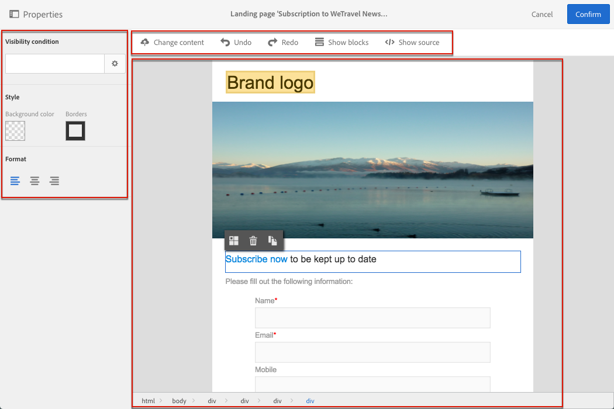
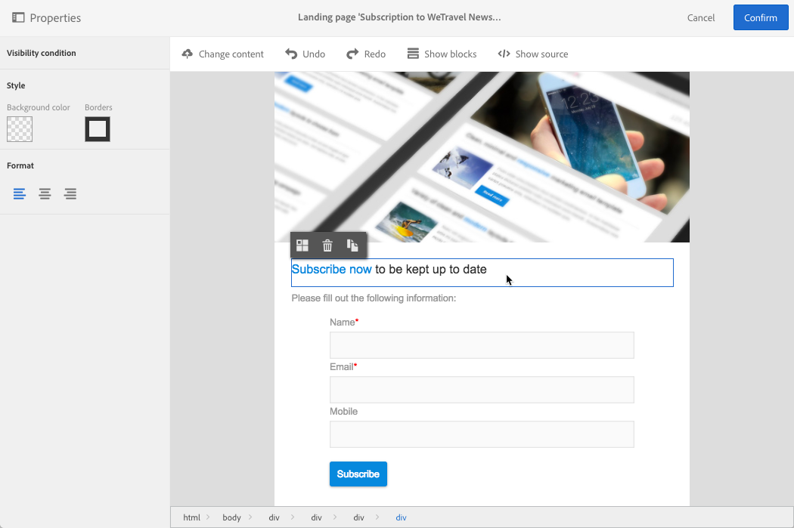
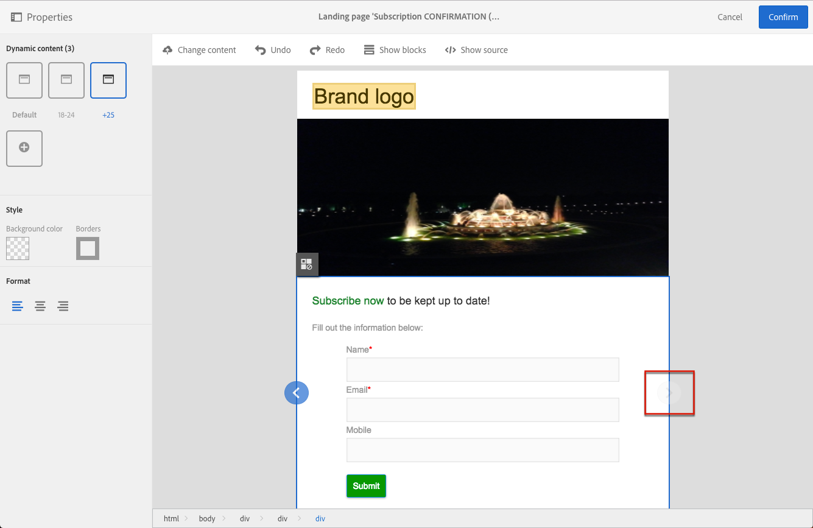

# Een landingspagina ontwerpen{#designing-a-landing-page}

## De content van een landingspagina ontwerpen {#about-content-design}

Landingspagina’s worden gemaakt als een willekeurige [marketingactiviteit](../../start/using/marketing-activities.md#about-marketing-activities).

Wanneer u een landingspagina ontwerpt, moet u de content van de pagina zelf, de bevestigingspagina en de foutpagina definiëren. Gebruik de schakelaar onder de actiebalk om elk van deze pagina’s weer te geven en te configureren.

De content van landingspagina’s wordt ontworpen met de Campaign-contenteditor.

>[!NOTE]
>
>Als uw instantie vóór de release van Adobe Campaign Standard 19.0 is geïnstalleerd, hebt u nog steeds toegang tot de verouderde editor voor e-mailcontent. De interface, gebruiksprincipes en configuratie zijn meestal dezelfde als hieronder beschreven voor landingspagina’s. Het is echter mogelijk dat niet alle functies beschikbaar zijn of onderhouden worden in de verouderde editor voor e-mailcontent, die vanaf de release 19.0 is afgeschaft. Met de [Email Designer](../../designing/using/designing-content-in-adobe-campaign.md) kunt u uw e-mailcontent snel bewerken via een interface voor slepen en neerzetten met uitgebreide functies.

Op deze pagina worden de specifieke kenmerken van de contenteditor voor landingspagina’s beschreven. Raadpleeg de volgende secties in de handleiding over het **ontwerpen van e-mailcontent** voor meer informatie over de acties die een of meer marketingactiviteiten gemeenschappelijk hebben:

* [Een personalisatieveld invoegen](../../designing/using/personalization.md#inserting-a-personalization-field)
* [Een contentblok toevoegen](../../designing/using/personalization.md#adding-a-content-block)
* [Een koppeling invoegen](../../designing/using/links.md#inserting-a-link)
* [Afbeeldingen invoegen](../../designing/using/images.md)
* [Algemene best practices voor het ontwerpen van content](../../designing/using/designing-content-in-adobe-campaign.md#content-design-best-practices)

>[!NOTE]
>Als u een landingspagina hebt die al vooraf in HTML-indeling is gedefinieerd, kunt u deze rechtstreeks importeren met de knop **[!UICONTROL Change content]**.
>
>Voordat u een HTML-pagina importeert in Adobe Campaign, moet u controleren of deze correct wordt geopend en weergegeven in de verschillende browsers. Als de HTML-pagina JavaScript-scripts bevat, moeten deze zonder fouten worden uitgevoerd buiten de editor. Vermijd in het algemeen het gebruik van scripts in de content van berichten om ervoor te zorgen dat deze correct worden verwerkt door e-mailclients.

## Interface van de contenteditor voor landingspagina’s{#landing-page-content-editor-interface}

Met de contenteditor voor landingspagina’s kunt u content in Adobe Campaign eenvoudig definiëren, wijzigen en aanpassen. Klik op het blok **[!UICONTROL Content]** in het dashboard van de landingspagina om de editor te openen.

De contenteditor is ingedeeld in drie verschillende secties. In deze secties kunt u de content weergeven en bewerken.

1. Met het **palet** aan de linkerkant van het scherm kunt u de algemene opties wijzigen die aan een geselecteerd blok zijn gekoppeld. U kunt de volgende opties wijzigen: achtergrondkleur, rand, tekstuitlijning, zichtbaarheidsvoorwaarde, enzovoort. Zie [Een personalisatieveld invoegen](../../designing/using/personalization.md#inserting-a-personalization-field).
1. De **actiebalk** bevat de algemene opties voor de pagina. U kunt een sjabloon selecteren en de weergavemodus wijzigen.
1. In de **hoofdbewerkingszone** kunt u rechtstreeks met de content werken via de contextafhankelijke werkbalk: u kunt een koppeling in een afbeelding invoegen, het lettertype wijzigen, een veld verwijderen, enzovoort.

De **actiebalk** bevat verschillende knoppen die u kunt gebruiken om te werken met de content die wordt gemaakt.

<table> 
 <thead> 
  <tr> 
   <th> Pictogram  </th> 
   <th> Knopnaam  </th> 
   <th> Kanaal  </th> 
   <th> Beschrijving  </th> 
  </tr> 
 </thead> 
 <tbody> 
  <tr> 
   <td>    </td> 
   <td> Change content   </td> 
   <td> Landingspagina en e-mail  </td> 
   <td> Hiermee kunt u kant-en-klare content selecteren of uw eigen HTML-content importeren. Zie <a href="../../designing/using/using-existing-content.md">Bestaande content laden</a>.  </td> 
  </tr> 
  <tr> 
   <td>    </td> 
   <td> Undo   </td> 
   <td> Alles  </td> 
   <td> Hiermee annuleert u de laatste uitgevoerde actie.  </td> 
  </tr> 
  <tr> 
   <td>    </td> 
   <td> Redo   </td> 
   <td> Alles  </td> 
   <td> Hiermee herhaalt u de handeling die u het laatst hebt geannuleerd.  </td> 
  </tr> 
  <tr> 
   <td>    </td> 
   <td> Show blocks   </td> 
   <td> Landingspagina en e-mail  </td> 
   <td> Hiermee kunt u de vakken rond de contentblokken weergeven (dit komt overeen met de HTML-code <strong>&lt;div&gt;</strong>).  </td> 
  </tr> 
  <tr> 
   <td>    </td> 
   <td> Show source   </td> 
   <td> Landingspagina en e-mail  </td> 
   <td> Hiermee kunt u de HTML-broncode van de pagina weergeven.  </td> 
  </tr> 
 </tbody> 
</table>

De **werkbalk** is een contextafhankelijk element van de editorinterface dat verschillende functies biedt afhankelijk van de geselecteerde zone. Het bevat actieknoppen en knoppen waarmee u de stijl van de tekst kunt wijzigen. De uitgevoerde wijzigingen zijn altijd van toepassing op de geselecteerde zone. Wanneer u een blok hebt geselecteerd, kunt u het bijvoorbeeld verwijderen of dupliceren. Nadat u de tekst in een blok hebt geselecteerd, kunt u deze omzetten in een koppeling of de tekst vet maken.

>[!CAUTION]
>
>Met bepaalde werkbalkfuncties kunt u de HTML-content opmaken. Als de pagina echter een CSS-opmaakmodel bevat, kunnen de **instructies** uit het opmaakmodel **voorrang** krijgen op de instructies die via de werkbalk zijn opgegeven.

<table> 
 <thead> 
  <tr> 
   <th> Pictogram  </th> 
   <th> Knopnaam  </th> 
   <th> Context  </th> 
   <th> Beschrijving  </th> 
  </tr> 
 </thead> 
 <tbody> 
  <tr> 
   <td>    </td> 
   <td> Link to an external URL   </td> 
   <td> Willekeurig element  </td> 
   <td> Hiermee kunt u een koppeling naar een URL toevoegen. Details over het configureren van een koppeling worden weergegeven in de sectie <a href="../../designing/using/links.md#inserting-a-link">Een koppeling invoegen</a>.  </td> 
  </tr> 
  <tr> 
   <td>    </td> 
   <td> Link to a landing page   </td> 
   <td> Willekeurig element  </td> 
   <td> Hiermee krijgt u toegang tot een landingspagina van Adobe Campaign. Details over het configureren van een koppeling worden weergegeven in de sectie <a href="../../designing/using/links.md#inserting-a-link">Een koppeling invoegen</a>.  </td> 
  </tr> 
  <tr> 
   <td>    </td> 
   <td> Subscription link   </td> 
   <td> Willekeurig element  </td> 
   <td> Hiermee kunt u een koppeling voor de inschrijving bij een service invoegen. Details over het configureren van een koppeling worden weergegeven in de sectie <a href="../../designing/using/links.md#inserting-a-link">Een koppeling invoegen</a>.  </td> 
  </tr> 
  <tr> 
   <td>    </td> 
   <td> Unsubscription link   </td> 
   <td> Willekeurig element  </td> 
   <td> Hiermee kunt u een koppeling voor de uitschrijving bij een service invoegen. Details over het configureren van een koppeling worden weergegeven in de sectie <a href="../../designing/using/links.md#inserting-a-link">Een koppeling invoegen</a>.  </td> 
  </tr> 
  <tr> 
   <td>    </td> 
   <td> Remove link   </td> 
   <td> Koppeling  </td> 
   <td> Hiermee kunt u de koppeling verwijderen, evenals alle configuraties die eraan zijn gekoppeld, nadat u hebt bevestigd.  </td> 
  </tr> 
  <tr> 
   <td>    </td> 
   <td> Insert a personalization field   </td> 
   <td> Tekstelement  </td> 
   <td> Hiermee kunt u een veld uit de database aan de content toevoegen. Zie <a href="../../designing/using/personalization.md#inserting-a-personalization-field">Een personalisatieveld invoegen</a>.  </td> 
  </tr> 
  <tr> 
   <td>    </td> 
   <td> Insert a content block   </td> 
   <td> Tekstelement  </td> 
   <td> Hiermee kunt u een personalisatieblok aan de content toevoegen. Zie <a href="../../designing/using/personalization.md#adding-a-content-block">Een contentblok toevoegen</a>.  </td> 
  </tr> 
  <tr> 
   <td>    </td> 
   <td> Enable dynamic content   </td> 
   <td> Tekstelement  </td> 
   <td> Hiermee kunt u dynamische content in de content invoegen. Zie <a href="../../channels/using/designing-a-landing-page.md#defining-dynamic-content-in-a-landing-page">Dynamische content definiëren</a>.  </td> 
  </tr> 
  <tr> 
   <td>    </td> 
   <td> Disable dynamic content   </td> 
   <td> Tekstelement  </td> 
   <td> Hiermee kunt u dynamische content verwijderen.  </td> 
  </tr> 
  <tr> 
   <td>    </td> 
   <td> Enlarge font   </td> 
   <td> Tekstelement  </td> 
   <td> Hiermee vergroot u de grootte van de geselecteerde tekst (voegt <strong>&lt;span style=“font-size:”&gt;</strong> toe).  </td> 
  </tr> 
  <tr> 
   <td>    </td> 
   <td> Reduce font   </td> 
   <td> Tekstelement  </td> 
   <td> Hiermee verkleint u de grootte van de geselecteerde tekst (voegt <strong>&lt;span style=“font-size:”&gt;</strong>toe).  </td> 
  </tr> 
  <tr> 
   <td>    </td> 
   <td> Bold   </td> 
   <td> Tekstelement  </td> 
   <td> Hiermee voegt u de stijl Vet toe aan de geselecteerde tekst (plaatst de tekst tussen de code <strong>&lt;strong&gt;</strong><strong>&lt;/strong&gt;</strong>).  </td> 
  </tr> 
  <tr> 
   <td>    </td> 
   <td> Italic   </td> 
   <td> Tekstelement  </td> 
   <td> Hiermee voegt u de stijl Cursief toe aan de geselecteerde tekst (plaatst de tekst tussen de code <strong>&lt;em&gt;</strong><strong>&lt;/em&gt;</strong>).  </td> 
  </tr> 
  <tr> 
   <td>    </td> 
   <td> Underline   </td> 
   <td> Tekstelement  </td> 
   <td> Hiermee onderstreept u de geselecteerde tekst (plaatst de geselecteerde tekst tussen de code <strong>&lt;span style=“text-decoration: underline;”&gt;</strong>).  </td> 
  </tr> 
  <tr> 
   <td>    </td> 
   <td> Change background color   </td> 
   <td> Tekstelement  </td> 
   <td> Hiermee kunt u de achtergrondkleur van het geselecteerde blok wijzigen (voegt style=“background-color: rgba(170, 86, 255, 0,87) toe).  </td> 
  </tr> 
  <tr> 
   <td>    </td> 
   <td> Change font color   </td> 
   <td> Tekstelement  </td> 
   <td> Hiermee kunt u de kleur wijzigen van alle tekst in het blok of alleen van de tekst die in het blok is geselecteerd (<strong>&lt;span style=“color: #56ff56;”&gt;</strong>).  </td> 
  </tr> 
  <tr> 
   <td>    </td> 
   <td> Image   </td> 
   <td> Blok met een afbeelding  </td> 
   <td> Hiermee kunt u een afbeelding invoegen vanuit een lokaal opgeslagen bestand.  </td> 
  </tr> 
  <tr> 
   <td>    </td> 
   <td> Delete   </td> 
   <td> Willekeurig blok  </td> 
   <td> Hiermee verwijdert u het blok en de content ervan.  </td> 
  </tr> 
  <tr> 
   <td>    </td> 
   <td> Duplicate   </td> 
   <td> Willekeurig blok  </td> 
   <td> Hiermee dupliceert u het blok, inclusief alle stijlen die eraan gekoppeld zijn.  </td> 
  </tr> 
 </tbody> 
</table>

## De landingspaginastructuur en -stijl beheren{#managing-landing-page-structure-and-style}

### Blokken beheren in de contenteditor {#managing-blocks-in-the-content-editor}

De verschillende HTML-contentelementen worden op de landingspagina weergegeven als blokken in overeenstemming met de tag **&lt;div>** **&lt;/div>**. Selecteer een blok als u ermee wilt werken. Het blok wordt dan omrand met een blauw kader.

Als een blok wordt geselecteerd, worden de bovenliggende objecten van het overeenkomstige HTML-element weergegeven in een breadcrumb die zich onderaan de bewerkingszone bevindt.

Wanneer u met de muis een van de breadcrumbs aanwijst, wordt het desbetreffende element gemarkeerd. U kunt daardoor gemakkelijk tussen de verschillende blokken navigeren en exact het HTML-element selecteren dat u wilt wijzigen.

Gebruik de opties in het palet en de contextafhankelijke werkbalk om het blok te wijzigen, verwijderen of dupliceren.

Voor de blokken met tekst klikt u nogmaals in het blok om de tekstbewerkingsmodus in te schakelen. Het kader rond het blok wordt groen. Vervolgens kunt u tekst selecteren of invoeren. Gebruik de opties in het palet en de contextafhankelijke werkbalk om een koppeling toe te voegen of de tekstopmaak te wijzigen.

De parameters die zijn gedefinieerd voor een element in een blok (koppelingen, personalisatievelden, contentblokken, enzovoort), kunnen op elk gewenst moment vanuit het palet worden gewijzigd.

### Een rand en achtergrond toevoegen in de contenteditor {#adding-a-border-and-a-background-in-the-content-editor}

U kunt ook een **achtergrondkleur** definiëren door een kleur te selecteren in het diagram. Deze kleur wordt toegepast op het geselecteerde blok.

U kunt een **rand** aan het geselecteerde blok toevoegen.

### De tekststijl wijzigen in de contenteditor {#changing-the-text-style-in-the-content-editor}

Als u de stijl van de tekst wilt wijzigen, moet u in een tekstblok klikken.

Als u de tekstuitlijning wilt wijzigen, selecteert u een van de volgende drie pictogrammen in het palet aan de linkerkant:

* **Links uitlijnen**: Hiermee lijnt u de tekst naar links van het geselecteerde blok uit (voegt style=“text-align: left;” toe).
* **Centreren**: Hiermee centreert u de tekst in het geselecteerde blok (voegt style=“text-align: center;” toe).
* **Rechts uitlijnen**: Hiermee lijnt u de tekst naar rechts van het geselecteerde blok uit (voegt style=“text-align: right;” toe).

U kunt de werkbalk ook gebruiken om de lettertypekenmerken te wijzigen: u kunt de tekengrootte aanpassen, de tekst vet of cursief maken, de tekst onderstrepen of de kleur van de tekst wijzigen. Zie [deze sectie](../../channels/using/designing-a-landing-page.md#landing-page-content-editor-interface).

### Afbeeldingen invoegen in een landingspagina {#inserting-images-in-a-landing-page}

1. Selecteer in de content van een landingspagina een blok met een afbeelding.
1. Selecteer de knop **[!UICONTROL Insert]**.

   

1. Kies **[!UICONTROL Local image]** op de contextafhankelijke werkbalk.

   

1. Selecteer een bestand.

   

1. Pas desgewenst de afbeeldingseigenschappen aan.

   

## Dynamische content definiëren in een landingspagina{#defining-dynamic-content-in-a-landing-page}

Als u dynamische content in een landingspagina wilt definiëren, selecteert u een blok met de breadcrumb of door rechtstreeks op een element te klikken.

Bepaalde blokken, zoals afbeeldingen, kunnen niet rechtstreeks worden geselecteerd. Selecteer in dit geval het bovenliggende blok met de breadcrumb. Vervolgens kunt u alle elementen wijzigen die in dit bovenliggende element zijn opgenomen, inclusief afbeeldingen. De voorwaarde wordt toegepast op alle onderliggende elementen in het bovenliggende blok.

De breadcrumb wordt weergegeven in de sectie [Blokken beheren](../../channels/using/designing-a-landing-page.md#managing-landing-page-structure-and-style).

De volgende stappen voor het definiëren van dynamische content in een landingspagina zijn vergelijkbaar met de stappen die u moet volgen voor een e-mail. Zie [deze sectie](../../designing/using/personalization.md#defining-dynamic-content-in-an-email).

>[!NOTE]
>
>Als een variantelement rood wordt omrand, betekent dit dat er nog geen expressie is gedefinieerd.

U kunt navigeren tussen de verschillende dynamische contentelementen van een blok. Dit doet u als volgt:

1. Selecteer het blok.

   Er worden pijlen aan de rechter- en linkerzijde van de afbeelding weergegeven.

1. Klik op de pijl rechts om door de beschikbare dynamische contentelementen te bladeren.

   

   De pijlen aan beide kanten worden in lichtgrijs weergegeven wanneer u het laatste of eerste beschikbare dynamische contentelement hebt bereikt.

   

1. Als u alle voorwaarden wilt verwijderen die op een blok zijn toegepast, selecteert u dat blok en klikt u op het pictogram **[!UICONTROL Disable dynamic content]**.
1. Selecteer de dynamische content die u wilt behouden.

   

In het palet:

* De content met een ingevoerde expressie wordt niet langer omrand met een rood kader, maar wordt in grijs weergegeven.
* De momenteel geselecteerde content wordt in blauw weergegeven.

