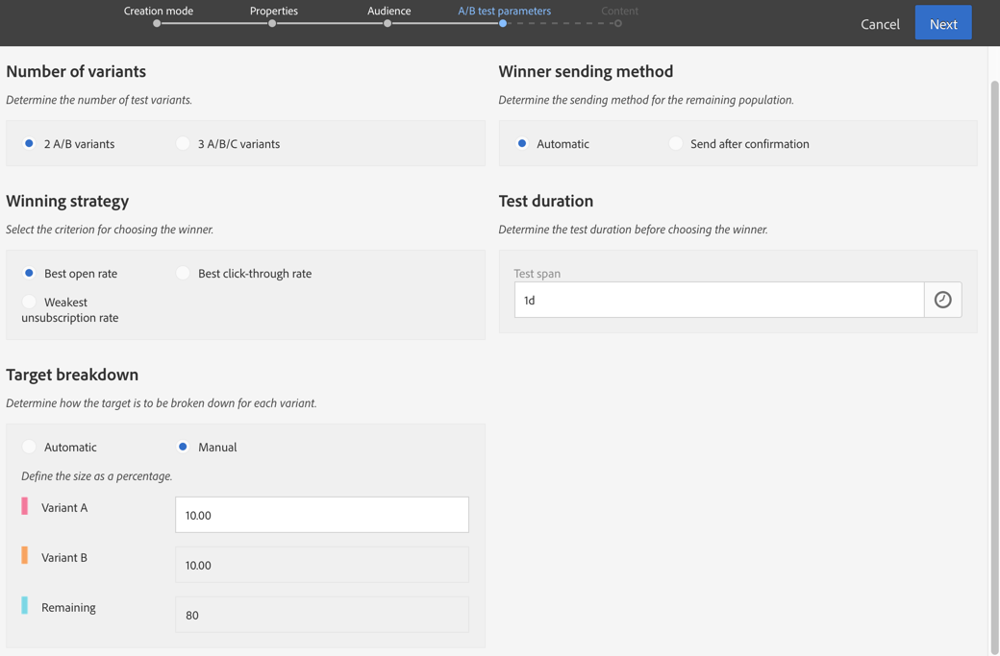

# Een e-mail met een A/B-test ontwerpen{#designing-an-a-b-test-email}

Met de testfunctionaliteit A/B in Adobe Campaign kunt u twee tot drie e-mailvarianten definiëren. Elke variant wordt naar bevolkingsmonsters gestuurd om te bepalen welk resultaat het beste is. Zodra bepaald, wordt de winnende variant dan verzonden naar de resterende populatie.

U kunt de inhoud, het onderwerp of de afzender van de e-mail variëren.

>[!NOTE]
>
>A/B-tests op e-mailberichten die zijn gemaakt in Adobe Experience Manager zijn niet mogelijk.

## Een e-mail met een A/B-test maken {#creating-an-a-b-test-email}

Een test A/B kan worden gecreeerd gebruikend de standaard tovenaar van de e-mailverwezenlijking, waaraan een stap van de A/B testconfiguratie wordt toegevoegd. Het maken van een standaard-e-mailbericht wordt beschreven in de sectie [Een e-mailbericht](../../channels/using/creating-an-email.md) maken.

In de specifieke context van een A/B-test:

1. Maak een nieuw e-mailbericht van een van de drie testsjablonen voor A/B, afhankelijk van het element dat u wilt variëren:

   * A/B-test op verzender
   * A/B-test op inhoud
   * A/B-test op onderwerp
   

   >[!NOTE]
   >
   >Follow-up en A/B-testsjablonen zijn standaard verborgen. Schakel het testvak A/B links ( **[!UICONTROL Filter]** zijpaneel) in om deze weer te geven.

1. Definieer de algemene eigenschappen en het doelpubliek van de e-mail, net als voor een standaard-e-mail. Raadpleeg de sectie [Soorten publiek](../../audiences/using/creating-audiences.md) maken.
1. Bij de vierde stap van de aanmaakwizard definieert u de testparameters A/B:

   * **[!UICONTROL Number of variants]**: U kunt kiezen of u twee of drie varianten wilt gebruiken. Als u drie varianten kiest, kan deze keuze niet worden gewijzigd nadat deze stap is bevestigd in de wizard.
   * **[!UICONTROL Winning strategy]**: Selecteer het criterium dat moet worden gebruikt om de winnende variant te bepalen.
   * **[!UICONTROL Target breakdown]**: Kies welk percentage van het doel elke variant zal ontvangen. Het resterende percentage ontvangt de winnende variant zodra deze is bepaald. De doelprofielen worden willekeurig geselecteerd.
   * **[!UICONTROL Winner sending method]**: Kies of u wilt dat de winnende variant automatisch wordt verzonden zodra deze is bepaald of dat u het verzenden naar de resterende populatie handmatig wilt bevestigen.
   * **[!UICONTROL Test duration]**: Geef de duur van de test op. De winnende variant wordt automatisch bepaald na deze duur. U kunt de winnende variant handmatig kiezen vóór het einde van de test in het e-maildashboard.

      De test moet ten minste één uur duren voordat alle trackinggegevens zijn verzameld en correct in aanmerking zijn genomen om de winnende variant te selecteren.
   

1. Nadat de parameters voor de A/B-test zijn gedefinieerd, gaat u naar de volgende stap in de wizard en definieert u de e-mailinhoud. Afhankelijk van de sjabloon die u hebt gekozen, kunt u verschillende onderwerpen, verschillende namen van afzenders of verschillende inhoud definiëren. Gebruik de carrousel om tussen de verschillende varianten van het element te navigeren. Raadpleeg de sectie [Inhoud-editor](../../designing/using/designing-content-in-adobe-campaign.md) voor meer informatie.

   

1. Bevestig dat u het e-mailbericht maakt. Het e-maildashboard wordt dan weergegeven.
1. Plan het verzenden. De gedefinieerde datum geeft het begin van de A/B-test aan.
1. Controleer de A/B testparameters die in het **[!UICONTROL A/B test parameters]** blok worden getoond. U kunt ze wijzigen totdat u het verzenden van de test bevestigt (stap 9) door het blok te selecteren.

   

1. Bereid het e-mailbericht voor om het doel en het aantal berichten dat moet worden verzonden te analyseren. Raadpleeg de sectie [Verzenden](../../sending/using/preparing-the-send.md) voorbereiden.
1. Controleer voordat u de A/B-test verzendt uw e-mail door proefdrukken te verzenden.
1. Zodra de bereiding is voltooid, bevestigt u de verzending van de test. Na bevestiging kunnen de parameters van de A/B-test niet worden gewijzigd.

   De A/B-test begint op de datum die is gedefinieerd in de **[!UICONTROL Schedule]**.U kunt de voortgang volgen met de **[!UICONTROL A/B test]** en **[!UICONTROL Deployment]** blokken.

   U kunt de winnende variant op elk gewenst moment handmatig selecteren als u de testduur kort wilt houden.

   Nadat het testen is voltooid, wordt een overzichtstabel weergegeven in het **[!UICONTROL A/B Test]** blok. Op deze manier kunt u de verschillende indicatoren bekijken voor de verschillende geteste varianten.

1. Als u als verzendende methode hebt geselecteerd, moet u manueel de winnende variant selecteren beginnen het naar de resterende bevolking te verzenden. **[!UICONTROL Send after confirmation]** Als u hebt geselecteerd **[!UICONTROL Automatic]**, wordt de winnende variant automatisch naar de resterende populatie verzonden zodra deze door het systeem is bepaald.

   >[!NOTE]
   >
   >Als er een verbinding is, moet de winnende variant handmatig worden geselecteerd. U kunt de maker van de e-mail en de modifier(s) ervan op de hoogte stellen dat een variant is gekozen of moet worden geselecteerd. Zie [Adobe Campagne-meldingen](../../administration/using/sending-internal-notifications.md).

Uw e-mailadres is nu gedefinieerd en verzonden. U kunt tot zijn logboeken en rapporten toegang hebben om het succes van uw campagne te meten.

**Verwant onderwerp**:

[Een e-mailvideo](https://docs.adobe.com/content/help/en/campaign-learn/campaign-standard-tutorials/getting-started/create-email-from-homepage.html) maken

## Informatie over A/B-testindicatoren {#about-a-b-test-indicators}

In het e-maildashboard zijn verschillende indicatoren beschikbaar waarmee u uw A/B-test kunt meten: aantal kliks, opent, stuitingen, etc.

Merk op dat de **[!UICONTROL Estimated recipient reactivity]** indicator een tarief is dat het aantal ontvangers vergelijkt die tegen het aantal ontvangers klikten die e-mail opende. Als 10 ontvangers bijvoorbeeld het e-mailbericht hebben geopend en vijf ontvangers erop hebben geklikt. De reactiviteitsgraad is 50%.
