# Een transactiebericht bewerken {#editing-transactional-message}

Zodra u een gebeurtenis <!--(the cart abandonment example as explained in [this section](../../channels/using/getting-started-with-transactional-msg.md#transactional-messaging-operating-principle))--> hebt gecreeerd en gepubliceerd, wordt het overeenkomstige transactiebericht automatisch gecreeerd.

De stappen om de gebeurtenis te vormen en te publiceren worden voorgesteld in [ Vormend een transactionele gebeurtenis ](../../channels/using/configuring-transactional-event.md) en [ het Publiceren van een transactiegebeurtenis ](../../channels/using/publishing-transactional-event.md) sectie.

De stappen voor het openen, bewerken en personaliseren van dit bericht worden hieronder beschreven.

>[!IMPORTANT]
>
>Slechts kunnen de gebruikers met de [ rol van het Beleid ](../../administration/using/users-management.md#functional-administrators) tot transactionele berichten toegang hebben en uitgeven.

Zodra uw bericht klaar is, kan het worden getest en worden gepubliceerd. Zie [ het Testen van een transactioneel bericht ](../../channels/using/testing-transactional-message.md) en [ Transactionele berichtlevenscyclus ](../../channels/using/publishing-transactional-message.md).

## Toegang tot transactieberichten {#accessing-transactional-messages}

Om tot het transactiebericht toegang te hebben dat u creeerde:

1. Klik het **Adobe** embleem, in de top-left hoek.
1. Selecteer **[!UICONTROL Marketing plans]** > **[!UICONTROL Transactional messages]** > **[!UICONTROL Transactional messages]** .

   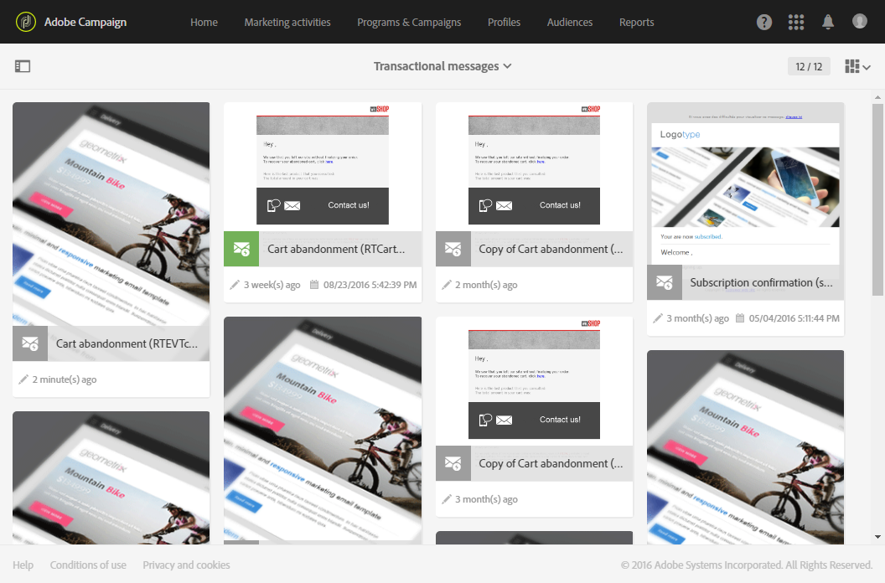

1. Klik op het bericht van uw keuze om het te bewerken.

   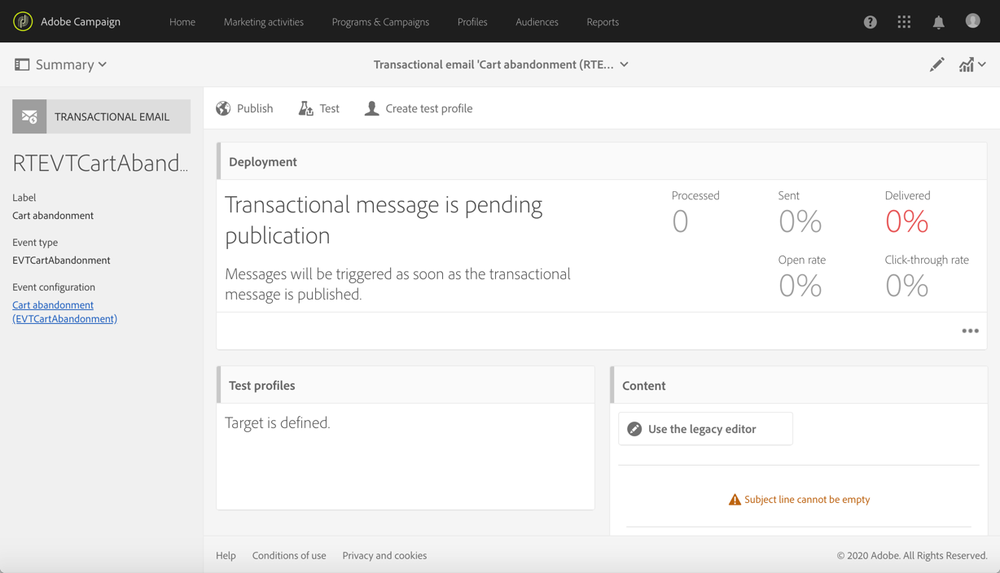

U kunt tot een transactioneel bericht door de verbinding ook direct toegang hebben die in de linkerkant van het overeenkomstige scherm van de gebeurtenisconfiguratie wordt gevestigd. Zie [ Voorproef en het publiceren van een gebeurtenis ](../../channels/using/publishing-transactional-event.md#previewing-and-publishing-the-event)

## Een transactiebericht aanpassen {#personalizing-a-transactional-message}

Voer de onderstaande stappen uit om een transactiebericht te bewerken en aan te passen.

>[!NOTE]
>
>Deze sectie beschrijft hoe te om een **op gebeurtenis-gebaseerde** transactiebericht uit te geven. De **op profiel-gebaseerde** transactionele berichtspecifieke eigenschappen zijn gedetailleerd [ hieronder ](#profile-transactional-message-specificities).
>
>De configuratiestappen om een op gebeurtenis-gebaseerd transactiebericht tot stand te brengen worden voorgesteld in [ deze sectie ](../../channels/using/configuring-transactional-event.md#event-based-transactional-messages).

U wilt bijvoorbeeld een bericht sturen naar gebruikers van uw website die producten aan hun winkelwagentje hebben toegevoegd en de site verlaten zonder dat ze de producten hebben gekocht. Dit voorbeeld wordt voorgesteld in de [ Transactionele overseinen werkend principe ](../../channels/using/getting-started-with-transactional-msg.md#transactional-messaging-operating-principle) sectie.

1. Klik op het **[!UICONTROL Content]** -blok om het onderwerp en de inhoud van uw bericht te wijzigen. In dit voorbeeld selecteert u een sjabloon met afbeeldingen en tekst. Voor meer op e-mailinhoudsmalplaatjes, zie [ het Ontwerpen van e-mails gebruikend malplaatjes ](../../designing/using/using-reusable-content.md#designing-templates).

   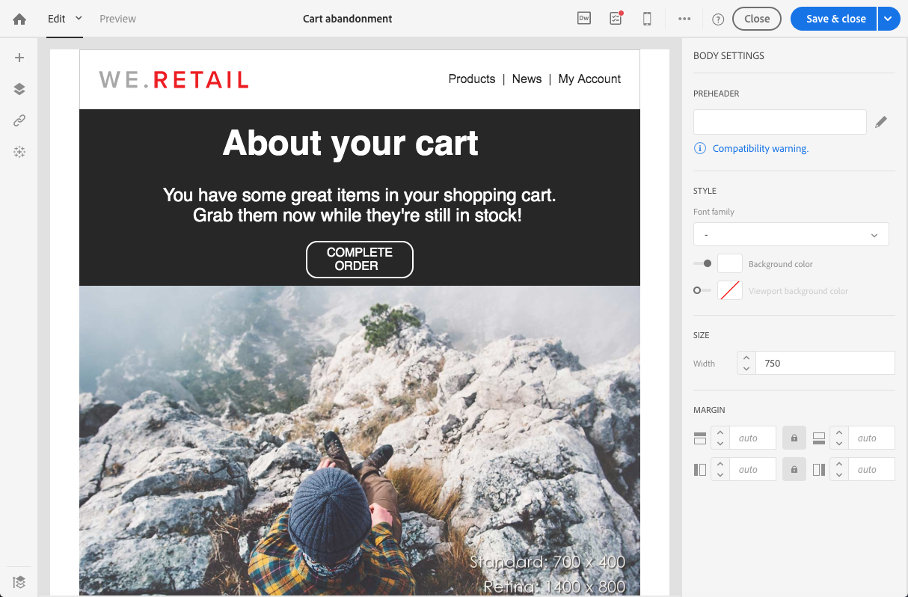

1. Voeg een onderwerp toe en bewerk de inhoud van het bericht naar wens.

   >[!NOTE]
   >
   >De koppeling naar het verlaten winkelwagentje is een koppeling naar een externe URL die de persoon omleidt naar zijn winkelwagentje. Deze parameter wordt niet beheerd in Adobe Campaign.

1. In dit voorbeeld, wilt u drie gebieden toevoegen die u bepaalde toen u [ uw gebeurtenis ](../../channels/using/configuring-transactional-event.md) creeerde: voornaam, het laatst geraadpleegde product, totaal kartbedrag. Om dit te doen, [ neem een verpersoonlijkingsgebied ](../../designing/using/personalization.md#inserting-a-personalization-field) in de berichtinhoud op.

1. Blader naar deze velden via **[!UICONTROL Context]** > **[!UICONTROL Real-time event]** > **[!UICONTROL Event context]** .

   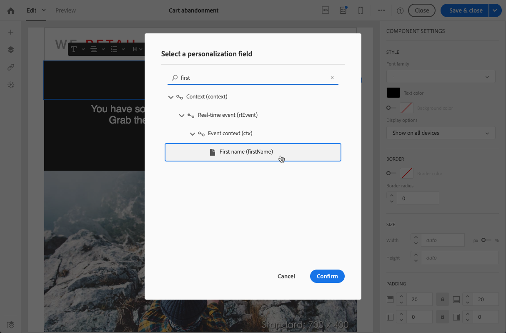

1. U kunt de inhoud van uw bericht ook verrijken. Om dit te doen, voeg gebieden van de lijst toe die u met uw gebeurtenisconfiguratie (zie [ het Verrijken van de gebeurtenis ](../../channels/using/configuring-transactional-event.md#enriching-the-transactional-message-content)) verbond. In dit voorbeeld selecteert u het veld **[!UICONTROL Title (salutation)]** in de **[!UICONTROL Profile]** tabel tot en met **[!UICONTROL Context]** > **[!UICONTROL Real-time event]** > **[!UICONTROL Event context]** .

   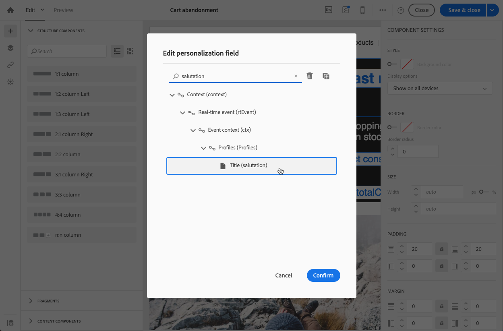

1. Voeg alle benodigde velden in.

   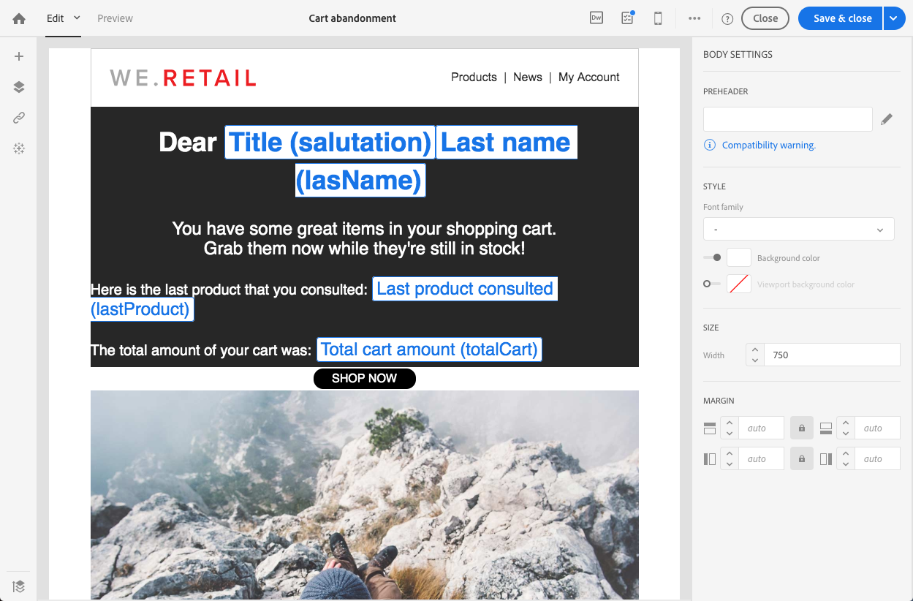

1. Geef een voorvertoning van uw bericht weer door het profiel te selecteren dat u voor deze gebeurtenis hebt gedefinieerd.

   De stappen voor het voorvertonen van een bericht zijn gedetailleerd in de [ Voorhoudende berichten ](../../sending/using/previewing-messages.md) sectie.

   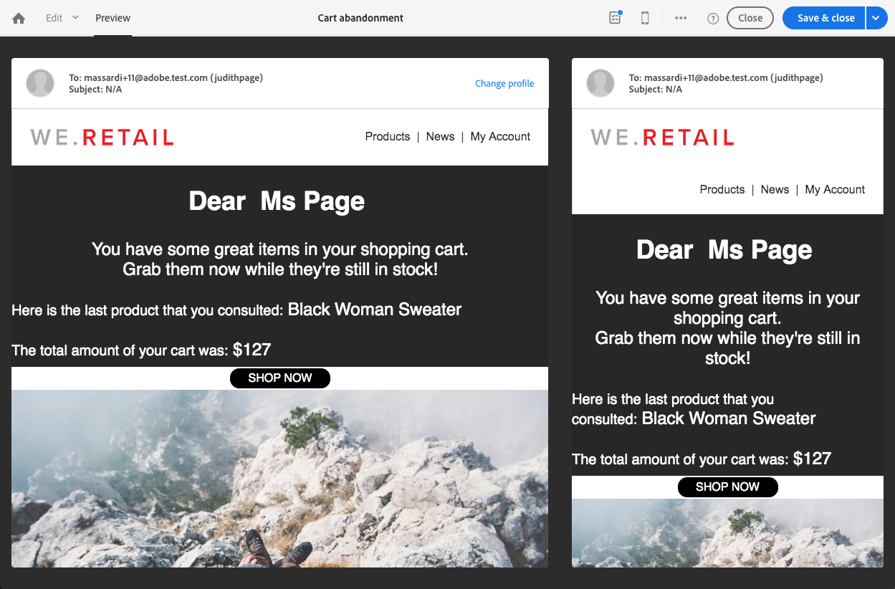

   U kunt controleren of de verpersoonlijkingsvelden overeenkomen met de gegevens die zijn ingevoerd in het testprofiel. Voor meer op dit, zie [ Definiërend een specifiek testprofiel ](../../channels/using/testing-transactional-message.md#defining-specific-test-profile).

<!--
## Using product listings in a transactional message {#using-product-listings-in-a-transactional-message}

When editing the content of a transactional email, you can create product listings referencing one or more data collections. For example, in a cart abandonment email, you can include a list of all products that were in the users' carts when they left your website, with an image, the price, and a link to each product.

>[!IMPORTANT]
>
>Product listings are only available for the email channel, when editing transactional email content through the [Email Designer](../../designing/using/designing-content-in-adobe-campaign.md#email-designer-interface) interface.

To add a list of abandoned products in a transactional message, follow the steps below.

You can also watch [this set of videos](https://experienceleague.adobe.com/docs/campaign-standard-learn/tutorials/designing-content/product-listings-in-transactional-email.html#configure-product-listings-in-transactional-emails) explaining the steps that are required to configure product listings in a transactional email.

>[!NOTE]
>
>Adobe Campaign does not support nested product listings, meaning that you cannot include a product listing inside another one.

### Defining a product listing {#defining-a-product-listing}

Before being able to use a product listing in a transactional message, you need to define at the event level the list of products and the fields for each product of the list you want to display. For more on this, see [Defining data collections](../../channels/using/configuring-transactional-event.md#defining-data-collections).

1. In the transactional message, click the **[!UICONTROL Content]** block to modify the email content.
1. Drag and drop a structure component to the workspace. For more on this, see [Defining the email structure](../../designing/using/designing-from-scratch.md#defining-the-email-structure).

   For example, select a one-column structure component and add a text component, an image component and a button component. For more on this, see [Using content components](../../designing/using/designing-from-scratch.md#about-content-components).

1. Select the structure component you just created and click the **[!UICONTROL Enable product listing]** icon from the contextual toolbar.

   

   The structure component is highlighted with an orange frame and the **[!UICONTROL Product listing]** settings are displayed in the left palette.

   

1. Select how the elements of the collection will be displayed:

    * **[!UICONTROL Row]**: horizontally, meaning each element on one row under the other.
    * **[!UICONTROL Column]**: vertically, meaning each element next to the other on the same row.

   >[!NOTE]
   >
   >The **[!UICONTROL Column]** option is only available when using a multicolumn structure component ( **[!UICONTROL 2:2 column]**, **[!UICONTROL 3:3 column]** and **[!UICONTROL 4:4 column]** ). When editing the product listing, only fill in the first column: the other columns will not be taken into account. For more on selecting structure components, see [Defining the email structure](../../designing/using/designing-from-scratch.md#defining-the-email-structure).

1. Select the data collection you created when configuring the event related to the transactional message. You can find it under the **[!UICONTROL Context]** > **[!UICONTROL Real-time event]** > **[!UICONTROL Event context]** node.

   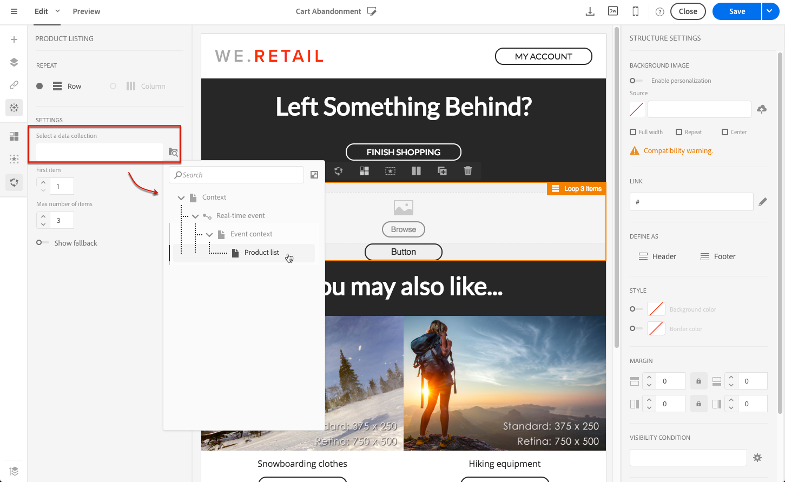

   For more on configuring the event, see [Defining data collections](../../channels/using/configuring-transactional-event.md#defining-data-collections).

1. Use the **[!UICONTROL First item]** drop-down list to select which element will start the list displayed in the email.

   For example, if you select 2, the first item of the collection will not be displayed in the email. The product listing will start on the second item.

1. Select the maximum number of items to display in the list.

   >[!NOTE]
   >
   >If you want the elements of your list to be displayed vertically ( **[!UICONTROL Column]** ), the maximum number of items is limited according to the selected structure component (2, 3 or 4 columns). For more on selecting structure components, see [Editing the email structure](../../designing/using/designing-from-scratch.md#defining-the-email-structure).

### Populating the product listing {#populating-the-product-listing}

To display a list of products coming from the event linked to the transactional email, follow the steps below.

For more on creating a collection and related fields when configuring the event, see [Defining data collections](../../channels/using/configuring-transactional-event.md#defining-data-collections).

1. Select the image component you inserted, select **[!UICONTROL Enable personalization]** and click the pencil in the Settings pane.

   

1. Select **[!UICONTROL Add personalization field]** in the **[!UICONTROL Image source URL]** window that opens.

   From the **[!UICONTROL Context]** > **[!UICONTROL Real-time event]** > **[!UICONTROL Event context]** node, open the node corresponding to the collection that you created (here **[!UICONTROL Product list]** ) and select the image field that you defined (here **[!UICONTROL Product image]** ). Click **[!UICONTROL Save]**.

   

   The personalization field that you selected is now displayed in the Settings pane.

1. At the desired position, select **[!UICONTROL Insert personalization field]** from the contextual toolbar.

   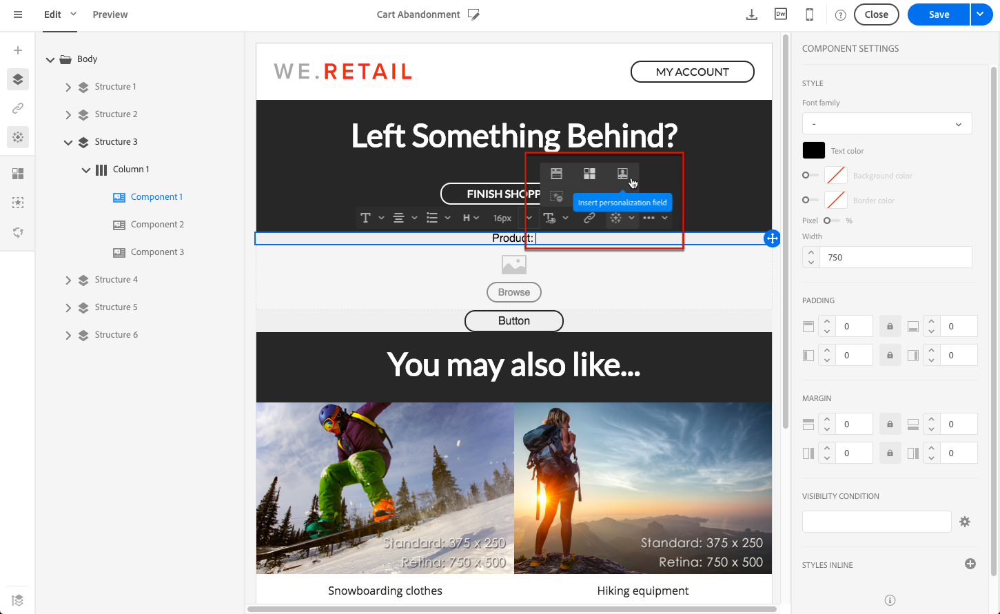

1. From the **[!UICONTROL Context]** > **[!UICONTROL Real-time event]** > **[!UICONTROL Event context]** node, open the node corresponding to the collection that you created (here **[!UICONTROL Product list]** ) and select the field that you created (here **[!UICONTROL Product name]** ). Click **[!UICONTROL Confirm]**.

   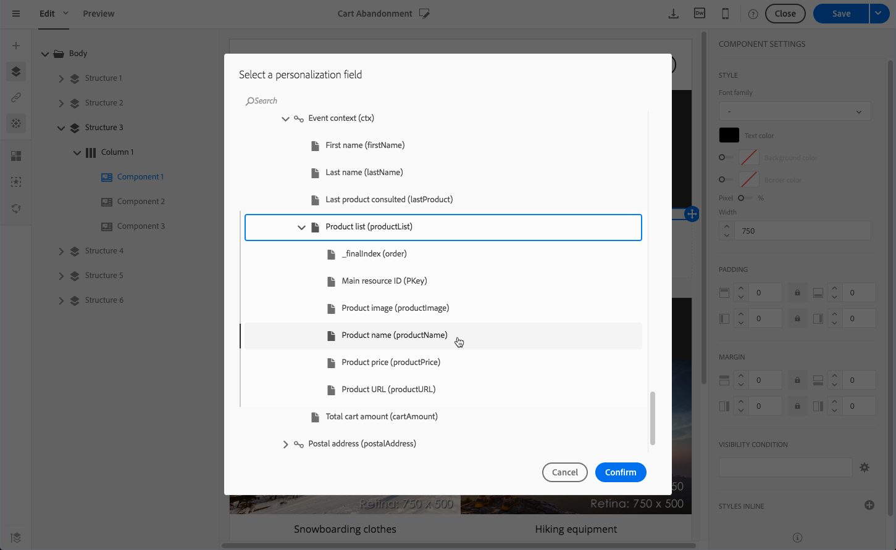

   The personalization field that you selected is now displayed at the desired position in the email content.

1. Proceed similarly to insert the price.
1. Select some text and select **[!UICONTROL Insert link]** from the contextual toolbar.

   

1. Select **[!UICONTROL Add personalization field]** in the **[!UICONTROL Insert link]** window that opens.

   From the **[!UICONTROL Context]** > **[!UICONTROL Real-time event]** > **[!UICONTROL Event context]** node, open the node corresponding to the collection that you created (here **[!UICONTROL Product list]** ) and select the URL field that you created (here **[!UICONTROL Product URL]** ). Click **[!UICONTROL Save]**.

   >[!IMPORTANT]
   >
   >For security reasons, make sure you insert the personalization field inside a link starting with a proper static domain name.

   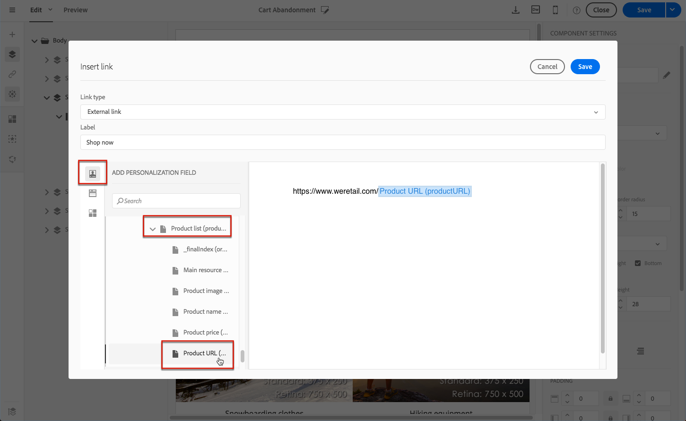

   The personalization field that you selected is now displayed in the Settings pane.

1. Select the structure component on which the product listing is applied and select **[!UICONTROL Show fallback]** to define a default content.

   

1. Drag one or more content components and edit them as needed.

   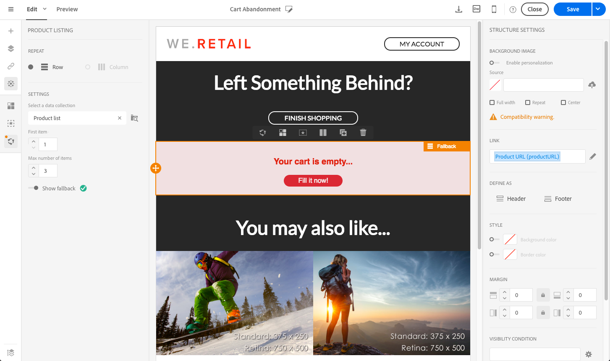

   The fallback content will be displayed if the collection is empty when the event is triggered, for example if a customer has nothing in his cart.

1. From the Settings pane, edit the styles for the product listing. For more on this, see [Managing email styles](../../designing/using/styles.md).
1. Preview the email using a test profile linked to the relevant transactional event and for which you defined collection data. For example, add the following information in the **[!UICONTROL Event data]** section for the test profile you want to use:

   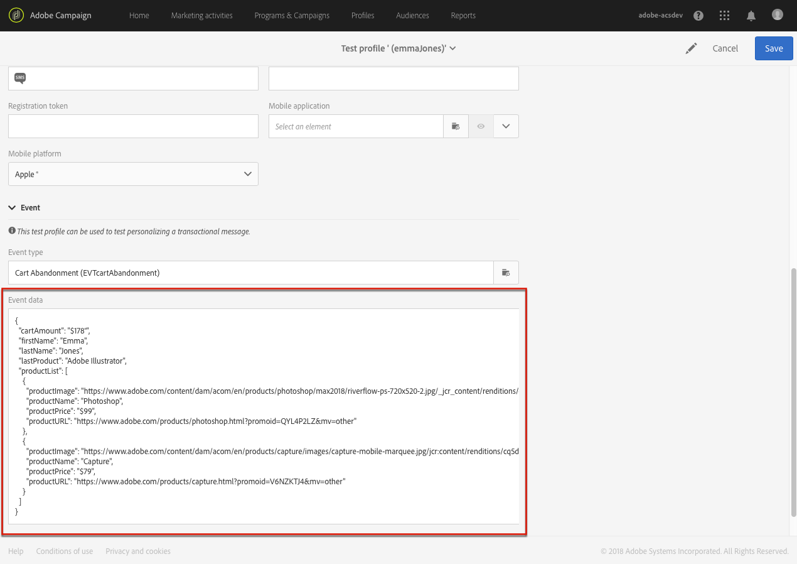

   For more on defining a test profile in a transactional message, see [this section](../../channels/using/testing-transactional-message.md#defining-specific-test-profile).
-->

## Specifieke kenmerken van op profielen gebaseerde transactieberichten {#profile-transactional-message-specificities}

U kunt transactionele berichten verzenden die op klant marketing profielen worden gebaseerd, die u toestaat om alle profielinformatie te hefboomwerking om de berichtinhoud te personaliseren, de unsubscription verbinding te gebruiken, en de regels van de marketingtypologie zoals [ vermoeidheidsregels ](../../sending/using/fatigue-rules.md) toe te passen.

* Voor meer op de verschillen tussen op gebeurtenis-gebaseerde en op profiel-gebaseerde transactionele berichten, zie [ deze sectie ](../../channels/using/getting-started-with-transactional-msg.md#transactional-message-types).

* De configuratiestappen om een op profiel-gebaseerd transactiebericht tot stand te brengen zijn gedetailleerd in [ deze sectie ](../../channels/using/configuring-transactional-event.md#profile-based-transactional-messages).

De stappen voor het maken, bewerken en aanpassen van een bericht voor een profieltransactie zijn meestal dezelfde als voor een bericht voor een gebeurtenistransactie.

De verschillen worden hieronder vermeld.

1. [ ga het transactionele bericht ](#accessing-transactional-messages) dat werd gecreeerd om het uit te geven.
1. Klik in het transactiebericht op de sectie **[!UICONTROL Content]** . Naast de transactionele e-mailsjablonen kunt u ook een e-mailsjabloon kiezen die zich richt op de **[!UICONTROL Profile]** -bron.

   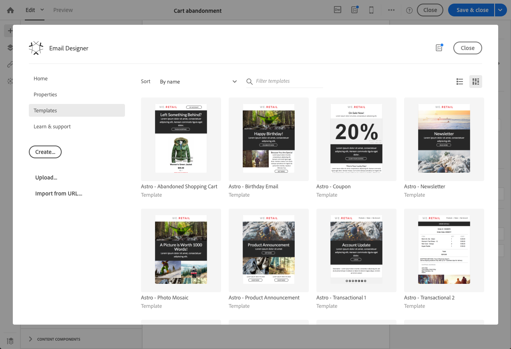

1. Selecteer de standaard e-mailsjabloon. Gelijkaardig aan alle marketing e-mails, omvat het een **unsubscription verbinding**.

   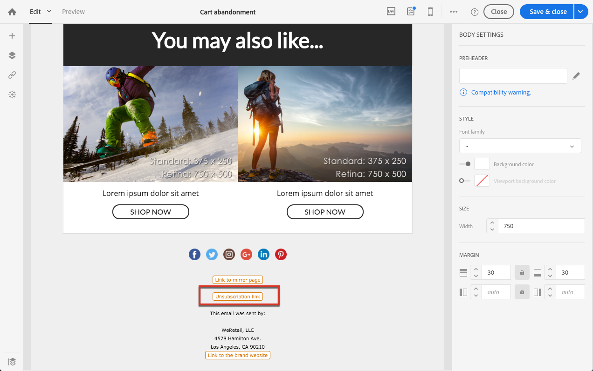

   Voor meer op malplaatjes, zie [ deze sectie ](../../designing/using/using-reusable-content.md#content-templates).

1. Ook, in tegenstelling tot configuraties die op gebeurtenissen in real time worden gebaseerd, hebt u **directe toegang tot alle profielinformatie** om uw bericht te personaliseren. U kunt [ verpersoonlijkingsgebieden ](../../designing/using/personalization.md#inserting-a-personalization-field) toevoegen aangezien u voor een andere standaard marketing e-mail zou doen.

1. Sla uw wijzigingen op voordat u het bericht publiceert. Voor meer op dit, zie [ het Publiceren van een transactioneel bericht ](../../channels/using/publishing-transactional-message.md#publishing-a-transactional-message).

<!--
### Monitoring a profile transactional message delivery {#monitoring-a-profile-transactional-message-delivery}

Once the message is published and your site integration is done, you can monitor the delivery.

1. To view the message delivery log, click the icon at the bottom right of the **[!UICONTROL Deployment]** block.

1. Click the **[!UICONTROL Execution list]** tab.

   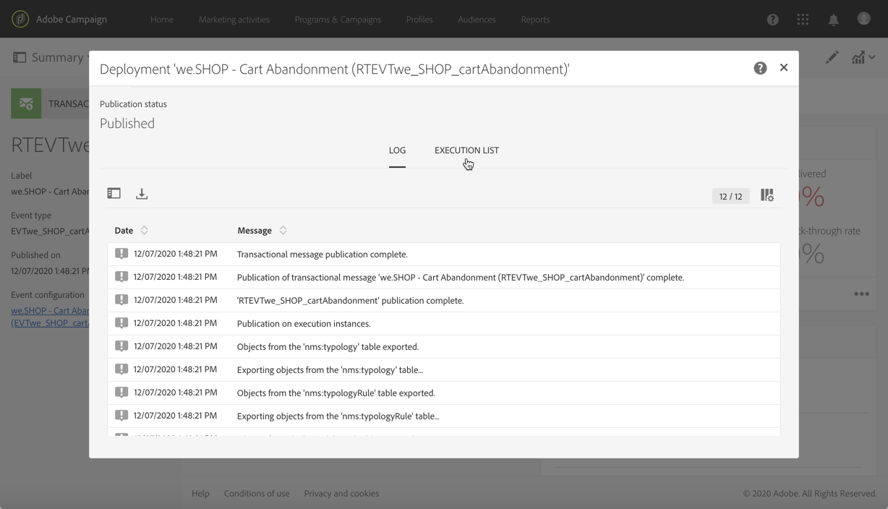

1. Select the latest execution delivery.

   An **execution delivery** is a non-actionable and non-functional technical message created once a month for each transactional message, and each time a transactional message is edited and published again

1. Select the **[!UICONTROL Sending logs]** tab. In the **[!UICONTROL Status]** column, **[!UICONTROL Sent]** indicates that a profile has opted in.

   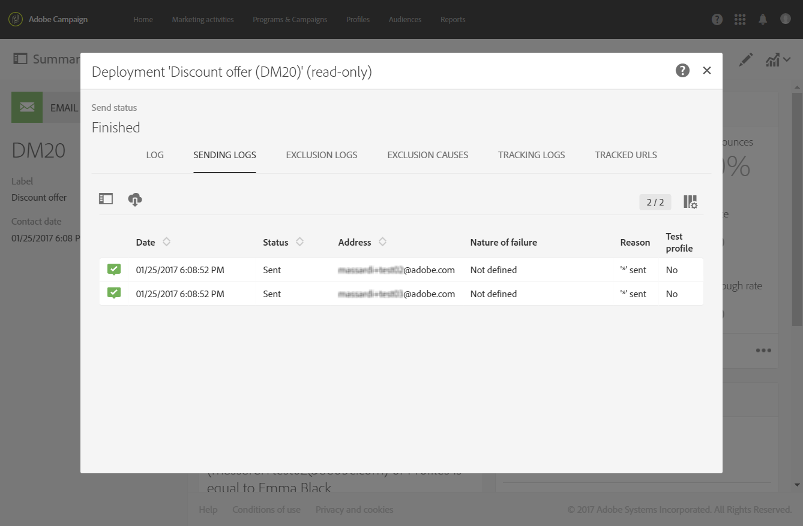

1. Select the **[!UICONTROL Exclusions logs]** tab to view recipients who have been excluded from the message target, such as addresses on denylist.

   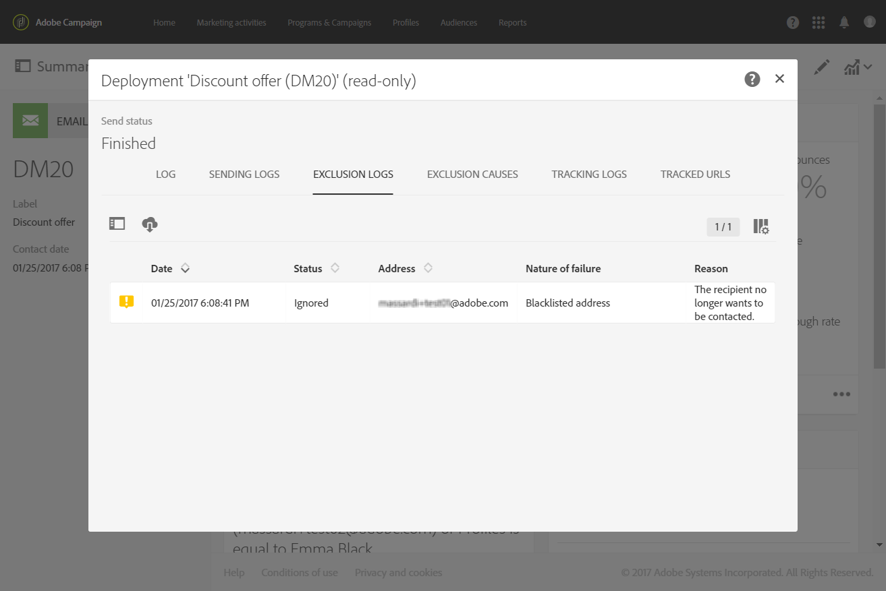

>[!NOTE]
>
>For more information on accessing and using the logs, see [Monitoring a delivery](../../sending/using/monitoring-a-delivery.md).

For any profile that has opted out, the **[!UICONTROL Address on denylist]** typology rule excluded the corresponding recipient.

This rule is part of a specific typology that applies to all transactional messages based on the **[!UICONTROL Profile]** table.

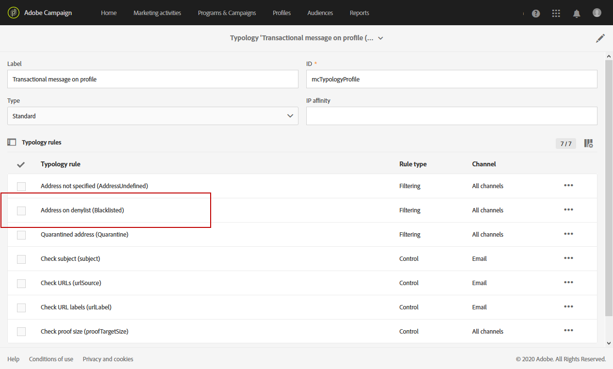

**Related topics**:

* [Integrate the event triggering](../../channels/using/getting-started-with-transactional-msg.md#integrate-event-trigger)
* [About typologies and typology rules](../../sending/using/about-typology-rules.md)
-->
