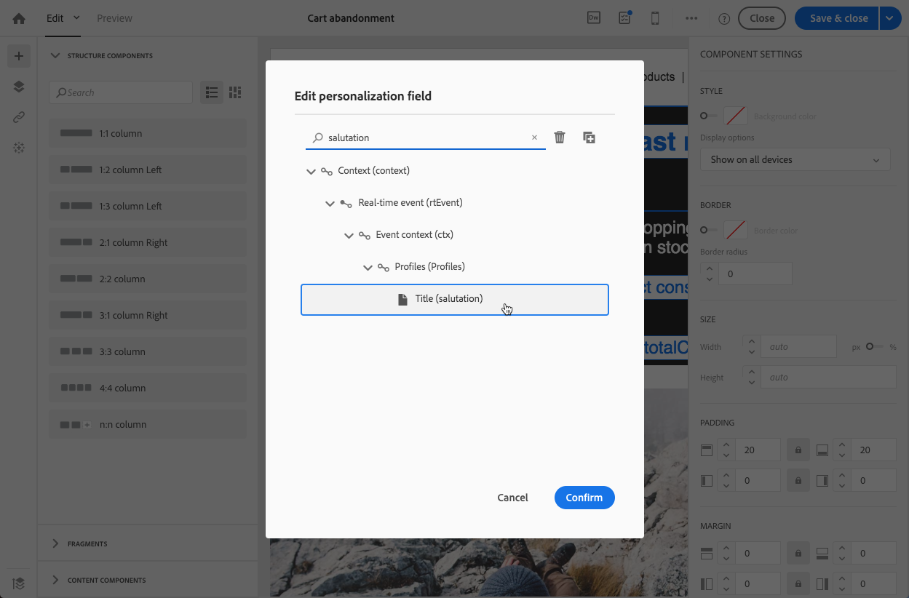

# Een transactiebericht bewerken {#editing-transactional-message}

Zodra u een gebeurtenis<!--(the cart abandonment example as explained in [this section](../../channels/using/getting-started-with-transactional-msg.md#transactional-messaging-operating-principle))--> hebt gecreeerd en gepubliceerd, wordt het overeenkomstige transactionele bericht automatisch gecreeerd.

De stappen om de gebeurtenis te vormen en te publiceren worden voorgesteld in [het Vormen van een transactiegebeurtenis](../../channels/using/configuring-transactional-event.md) en [het Publiceren van een transactiegebeurtenis](../../channels/using/publishing-transactional-event.md) sectie.

De stappen voor het openen, bewerken en personaliseren van dit bericht worden hieronder beschreven.

>[!IMPORTANT]
>
>Alleen gebruikers met de rol [Beheer](../../administration/using/users-management.md#functional-administrators) kunnen transactieberichten openen en bewerken.

Zodra uw bericht klaar is, kan het worden getest en worden gepubliceerd. Zie [Een transactioneel bericht testen](../../channels/using/testing-transactional-message.md) en [Transactioneel bericht lifecylce](../../channels/using/publishing-transactional-message.md).

## Toegang tot transactieberichten {#accessing-transactional-messages}

Om tot het transactiebericht toegang te hebben dat u creeerde:

1. Klik op het **[!UICONTROL Adobe Campaign]**-logo in de linkerbovenhoek.
1. Selecteer **[!UICONTROL Marketing plans]** > **[!UICONTROL Transactional messages]** > **[!UICONTROL Transactional messages]**.

   

1. Klik op het bericht van uw keuze om het te bewerken.

   

U kunt tot een transactioneel bericht door de verbinding ook direct toegang hebben die in de linkerkant van het overeenkomstige scherm van de gebeurtenisconfiguratie wordt gevestigd. Zie [Een gebeurtenis voorvertonen en publiceren](../../channels/using/publishing-transactional-event.md#previewing-and-publishing-the-event)

## Een transactiebericht aanpassen {#personalizing-a-transactional-message}

Voer de onderstaande stappen uit om een transactiebericht te bewerken en aan te passen.

>[!NOTE]
>
>In deze sectie wordt beschreven hoe u een op een gebeurtenis gebaseerd **transactiebericht kunt bewerken.** De specifieke kenmerken van het **op profiel gebaseerde** transactionele bericht worden hieronder [gedetailleerd](#profile-transactional-message-specificities).
>
>De configuratiestappen om een op gebeurtenis-gebaseerd transactiebericht tot stand te brengen worden voorgesteld in [deze sectie](../../channels/using/configuring-transactional-event.md#event-based-transactional-messages).

U wilt bijvoorbeeld een bericht sturen naar gebruikers van uw website die producten aan hun winkelwagentje hebben toegevoegd en de site verlaten zonder dat ze de producten hebben gekocht. Dit voorbeeld wordt voorgesteld in [Transactioneel overseinen werkend principe](../../channels/using/getting-started-with-transactional-msg.md#transactional-messaging-operating-principle) sectie.

1. Klik op het blok **[!UICONTROL Content]** om het onderwerp en de content van uw bericht te wijzigen. In dit voorbeeld selecteert u een sjabloon met afbeeldingen en tekst. Zie [E-mailberichten ontwerpen met sjablonen](../../designing/using/using-reusable-content.md#designing-templates) voor meer informatie over sjablonen voor e-mailinhoud.

   

1. Voeg een onderwerp toe en bewerk de content van het bericht naar wens.

   >[!NOTE]
   >
   >De koppeling naar de verlaten winkelwagen is een koppeling naar een externe URL die de persoon doorstuurt naar zijn/haar winkelwagen. Deze parameter wordt niet beheerd in Adobe Campaign.

1. In dit voorbeeld wilt u drie velden toevoegen die u hebt gedefinieerd toen u [de gebeurtenis maakte](../../channels/using/configuring-transactional-event.md): voornaam, laatst geraadpleegde product, het totale bedrag in de winkelwagen. Neem hiervoor [een personalisatieveld](../../designing/using/personalization.md#inserting-a-personalization-field) op in de berichtcontent.

1. Blader naar deze velden via **[!UICONTROL Context]** > **[!UICONTROL Real-time event]** > **[!UICONTROL Event context]**.

   

1. U kunt de inhoud van uw bericht ook verrijken. Hiervoor voegt u velden uit de tabel toe die u aan uw gebeurtenisconfiguratie hebt gekoppeld (zie [De gebeurtenis verrijken](../../channels/using/configuring-transactional-event.md#enriching-the-transactional-message-content)). In dit voorbeeld selecteert u het veld **[!UICONTROL Title (salutation)]** in de tabel **[!UICONTROL Profile]** via **[!UICONTROL Context]** > **[!UICONTROL Real-time event]** > **[!UICONTROL Event context]**.

   

1. Voeg alle benodigde velden in.

   

1. Bekijk een voorbeeld van uw bericht door het profiel te selecteren dat u voor deze gebeurtenis hebt gedefinieerd.

   De stappen voor het bekijken van een voorbeeld van een bericht worden beschreven in de sectie [Berichten voorvertonen](../../sending/using/previewing-messages.md).

   

   U kunt controleren of de personalisatievelden overeenkomen met de data die in het testprofiel zijn ingevoerd. Zie [Een specifiek testprofiel definiëren](../../channels/using/testing-transactional-message.md#defining-specific-test-profile) voor meer informatie.

## Productvermeldingen gebruiken in een transactiebericht {#using-product-listings-in-a-transactional-message}

Wanneer u de inhoud van een transactie-e-mail bewerkt, kunt u productlijsten maken die verwijzen naar een of meer gegevensverzamelingen. In een e-mailbericht waarin de winkelwagen wordt verlaten, kunt u bijvoorbeeld een lijst opnemen met alle producten die zich in de winkelwagentjes bevonden toen ze uw website verlieten, met een afbeelding, de prijs en een koppeling naar elk product.

>[!IMPORTANT]
>
>Productaanbiedingen zijn alleen beschikbaar voor het e-mailkanaal, wanneer u transactie-e-mailinhoud bewerkt via de interface [E-mail Designer](../../designing/using/designing-content-in-adobe-campaign.md#email-designer-interface).

Volg de onderstaande stappen om een lijst met achtergelaten producten toe te voegen aan een transactiebericht.

U kunt [deze set video&#39;s ook bekijken](https://experienceleague.adobe.com/docs/campaign-standard-learn/tutorials/designing-content/product-listings-in-transactional-email.html?lang=en#configure-product-listings-in-transactional-emails) waarin de stappen worden uitgelegd die nodig zijn om productlijsten in een transactie-e-mail te configureren.

>[!NOTE]
>
>Adobe Campaign biedt geen ondersteuning voor geneste productvermeldingen. Dit betekent dat u geen productvermeldingen in een andere vermelding kunt opnemen.

### Een productvermelding definiëren {#defining-a-product-listing}

Voordat u een productvermelding in een transactiebericht kunt gebruiken, moet u op gebeurtenisniveau de lijst met producten en de velden definiëren voor elk weer te geven product van de lijst. Ga voor meer informatie naar [Dataverzamelingen definiëren](../../channels/using/configuring-transactional-event.md#defining-data-collections).

1. Klik in het transactiebericht op het blok **[!UICONTROL Content]** om de e-mailcontent te wijzigen.
1. Sleep een structuurcomponent naar de werkruimte. Zie [De e-mailstructuur definiëren](../../designing/using/designing-from-scratch.md#defining-the-email-structure) voor meer informatie.

   Selecteer bijvoorbeeld een structuurcomponent met één kolom en voeg een tekstcomponent, een afbeeldingscomponent en een knopcomponent toe. Zie [Inhoudscomponenten gebruiken](../../designing/using/designing-from-scratch.md#about-content-components) voor meer informatie.

1. Selecteer de net gemaakte structuurcomponent en klik op het pictogram **[!UICONTROL Enable product listing]** op de contextgevoelige werkbalk.

   

   De structuurcomponent wordt met een oranje kader gemarkeerd en de instellingen **[!UICONTROL Product listing]** worden in het linkerpalet getoond.

   

1. Selecteer hoe de elementen van de verzameling worden weergegeven:

   * **[!UICONTROL Row]**: horizontaal, elk element op een rij, onder elkaar.
   * **[!UICONTROL Column]**: verticaal, dat wil zeggen alle elementen naast elkaar op dezelfde rij.

   >[!NOTE]
   >
   >De optie **[!UICONTROL Column]** is alleen beschikbaar als u een structuurcomponent met meerdere kolommen gebruikt (**[!UICONTROL 2:2 column]**, **[!UICONTROL 3:3 column]** en **[!UICONTROL 4:4 column]**). Vul bij het bewerken van de productvermelding alleen de eerste kolom in, want de andere kolommen worden buiten beschouwing gelaten. Zie [De e-mailstructuur definiëren](../../designing/using/designing-from-scratch.md#defining-the-email-structure) voor meer informatie over het selecteren van structuurcomponenten.

1. Selecteer de dataverzameling die u hebt gemaakt toen u de gebeurtenis die betrekking had op het transactiebericht configureerde. De code kunt u vinden onder de node **[!UICONTROL Context]** > **[!UICONTROL Real-time event]** > **[!UICONTROL Event context]**.

   

   Zie [Dataverzamelingen definiëren](../../channels/using/configuring-transactional-event.md#defining-data-collections) voor meer informatie over het configureren van de gebeurtenis.

1. Gebruik de vervolgkeuzelijst **[!UICONTROL First item]** om te selecteren welk element als eerste in de lijst in de e-mail wordt vermeld.

   Als u bijvoorbeeld 2 selecteert, wordt het eerste item van de verzameling niet in de e-mail weergegeven. De productvermelding begint bij het tweede item.

1. Selecteer het maximum aantal items dat in de lijst moet worden weergegeven.

   >[!NOTE]
   >
   >Als u wilt dat de elementen van de lijst verticaal (**[!UICONTROL Column]**) worden weergegeven, dan wordt het maximumaantal items beperkt volgens de geselecteerde structuurcomponent (2, 3 of 4 kolommen). Zie [De e-mailstructuur bewerken](../../designing/using/designing-from-scratch.md#defining-the-email-structure) voor meer informatie over het selecteren van structuurcomponenten.

### De productvermelding invullen {#populating-the-product-listing}

Volg onderstaande stappen om een productvermelding van de gebeurtenis die gekoppeld is aan de transactie-e-mail weer te geven.

Zie [Dataverzamelingen definiëren](../../channels/using/configuring-transactional-event.md#defining-data-collections) voor meer informatie over het maken van een verzameling en gerelateerde velden tijdens het configureren van de gebeurtenis.

1. Selecteer de door u ingevoegde afbeeldingscomponent, selecteer **[!UICONTROL Enable personalization]** en klik op het potlood in het deelvenster Instellingen.

   

1. Selecteer **[!UICONTROL Add personalization field]** in het venster **[!UICONTROL Image source URL]** dat verschijnt.

   Open in de node **[!UICONTROL Context]** > **[!UICONTROL Real-time event]** > **[!UICONTROL Event context]** de node die overeenkomt met de door u gemaakte verzameling (hier **[!UICONTROL Product list]**) en selecteer het door u gedefinieerde afbeeldingsveld (hier **[!UICONTROL Product image]**). Klik op **[!UICONTROL Save]**.

   

   Het door u geselecteerde personalisatieveld wordt nu weergegeven in het deelvenster Instellingen.

1. Op de gewenste positie selecteert u **[!UICONTROL Insert personalization field]** op de contextgevoelige werkbalk.

   

1. Open in de node **[!UICONTROL Context]** > **[!UICONTROL Real-time event]** > **[!UICONTROL Event context]** de node die overeenkomt met de door u gemaakte verzameling (hier **[!UICONTROL Product list]**) en selecteer het door u gemaakte veld (hier **[!UICONTROL Product name]**). Klik op **[!UICONTROL Confirm]**.

   

   Het door u geselecteerde personalisatieveld wordt nu op de gewenste positie in de e-mailcontent weergegeven.

1. Ga op dezelfde manier te werk om de prijs in te voegen.
1. Selecteer eerst wat tekst en selecteer vervolgens **[!UICONTROL Insert link]** op de contextgevoelige werkbalk.

   

1. Selecteer **[!UICONTROL Add personalization field]** in het venster **[!UICONTROL Insert link]** dat verschijnt.

   Open in de node **[!UICONTROL Context]** > **[!UICONTROL Real-time event]** > **[!UICONTROL Event context]** de node die overeenkomt met de door u gemaakte verzameling (hier **[!UICONTROL Product list]**) en selecteer het door u gemaakte URL-veld (hier **[!UICONTROL Product URL]**). Klik op **[!UICONTROL Save]**.

   >[!IMPORTANT]
   >
   >Uit veiligheidsoverwegingen dient u ervoor te zorgen dat u het personalisatieveld invoegt in een koppeling die met een correcte statische domeinnaam begint.

   

   Het door u geselecteerde personalisatieveld wordt nu weergegeven in het deelvenster Instellingen.

1. Selecteer de structuurcomponent waarop de productvermelding wordt toegepast en selecteer **[!UICONTROL Show fallback]** om standaardcontent te definiëren.

   

1. Sleep een of meer contentcomponenten en bewerk deze indien noodzakelijk.

   

   De fallback-content wordt weergegeven als de verzameling tijdens het activeren van de gebeurtenis leeg is, bijvoorbeeld als een klant niets in zijn winkelwagen heeft.

1. Bewerk de stijlen voor de productvermelding in het deelvenster Instellingen. Zie [E-mailstijlen beheren](../../designing/using/styles.md) voor meer informatie.
1. Toon een voorbeeld van de e-mail met een testprofiel dat is gekoppeld aan de relevante transactiegebeurtenis en waarvoor u verzamelingsdata hebt gedefinieerd. Voeg bijvoorbeeld de volgende informatie toe aan de sectie **[!UICONTROL Event data]** voor het testprofiel dat u wilt gebruiken:

   

   Ga voor meer informatie over het definiëren van een testprofiel in een transactiebericht naar [deze sectie](../../channels/using/testing-transactional-message.md#defining-specific-test-profile).

## Specificaties van op profielen gebaseerde transactiemeldingen {#profile-transactional-message-specificities}

U kunt transactieberichten verzenden die op klant marketing profielen worden gebaseerd, die u toestaat om alle profielinformatie te gebruiken om de berichtinhoud te personaliseren, de unsubscription verbinding te gebruiken, en marketing typologische regels zoals [moeheidsregels](../../sending/using/fatigue-rules.md) toe te passen.

* Zie [deze sectie](../../channels/using/getting-started-with-transactional-msg.md#transactional-message-types) voor meer informatie over de verschillen tussen op gebeurtenissen gebaseerde en op profielen gebaseerde transactieberichten.

* De configuratiestappen om een op profiel-gebaseerd transactionbericht tot stand te brengen zijn gedetailleerd in [deze sectie](../../channels/using/configuring-transactional-event.md#profile-based-transactional-messages).

<!--### Editing a profile transactional message {#editing-profile-transactional-message}-->

De stappen voor het maken, bewerken en aanpassen van een bericht voor een profieltransactie zijn meestal dezelfde als voor een bericht voor een gebeurtenistransactie.

De verschillen worden hieronder vermeld.

1. [Ga naar het transactionele bericht dat is gemaakt om het te bewerken.](#accessing-transactional-messages)
1. Klik in het transactionele bericht op de sectie **[!UICONTROL Content]**. Naast de transactionele e-mailmalplaatjes, kunt u om het even welk e-mailmalplaatje kiezen dat zich richt op **[!UICONTROL Profile]** middel.

   

1. Selecteer de standaard e-mailsjabloon. Net als bij alle marketinge-mails bevat deze koppeling een **unsubscription-koppeling**.

   

   Zie [deze sectie](../../designing/using/using-reusable-content.md#content-templates) voor meer informatie over sjablonen.

1. Ook, in tegenstelling tot configuraties die op gebeurtenissen in real time worden gebaseerd, hebt u **directe toegang tot alle profielinformatie** om uw bericht te personaliseren. U kunt [personaliseringsgebieden](../../designing/using/personalization.md#inserting-a-personalization-field) toevoegen aangezien u voor een andere standaard marketing e-mail zou doen.

1. Sla uw wijzigingen op voordat u het bericht publiceert. Zie [Een transactiebericht publiceren](../../channels/using/publishing-transactional-message.md#publishing-a-transactional-message) voor meer informatie hierover.

<!--### Monitoring a profile transactional message delivery {#monitoring-a-profile-transactional-message-delivery}

Once the message is published and your site integration is done, you can monitor the delivery.

1. To view the message delivery log, click the icon at the bottom right of the **[!UICONTROL Deployment]** block.

1. Click the **[!UICONTROL Execution list]** tab.

   

1. Select the latest execution delivery.

   An **execution delivery** is a non-actionable and non-functional technical message created once a month for each transactional message, and each time a transactional message is edited and published again

1. Select the **[!UICONTROL Sending logs]** tab. In the **[!UICONTROL Status]** column, **[!UICONTROL Sent]** indicates that a profile has opted in.

   

1. Select the **[!UICONTROL Exclusions logs]** tab to view recipients who have been excluded from the message target, such as addresses on denylist.

   

>[!NOTE]
>
>For more information on accessing and using the logs, see [Monitoring a delivery](../../sending/using/monitoring-a-delivery.md).

For any profile that has opted out, the **[!UICONTROL Address on denylist]** typology rule excluded the corresponding recipient.

This rule is part of a specific typology that applies to all transactional messages based on the **[!UICONTROL Profile]** table.

**Related topics**:

* [Integrate the event triggering](../../channels/using/getting-started-with-transactional-msg.md#integrate-event-trigger)
* [About typologies and typology rules](../../sending/using/about-typology-rules.md)-->
