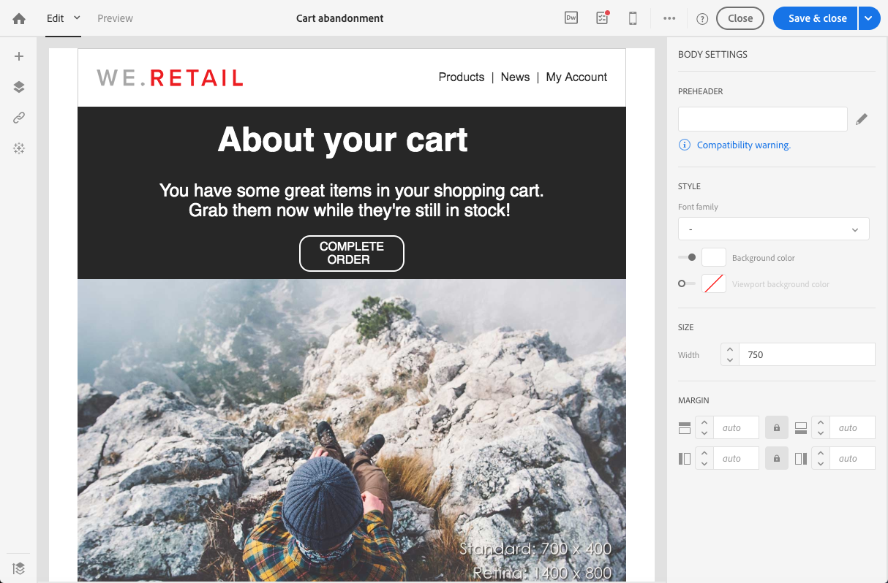
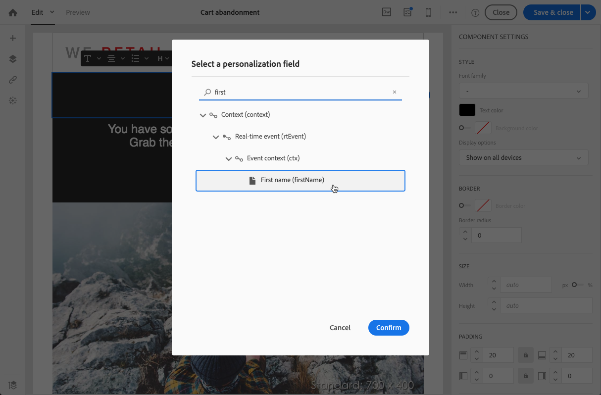
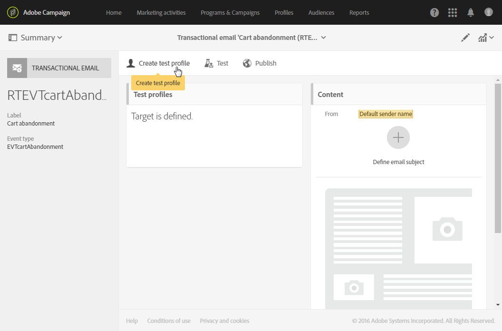

# Transactieberichten voor gebeurtenissen{#event-transactional-messages}

U kunt doelgericht transactieberichten voor gebeurtenissen verzenden. Dit type transactieberichten bevat geen profielinformatie: het leveringsdoel wordt bepaald door de data in de gebeurtenis zelf.

Nadat u een gebeurtenis hebt gemaakt en gepubliceerd (het achterlaten van een winkelwagen, zoals wordt uitgelegd in [deze sectie](../../channels/using/getting-started-with-transactional-msg.md#transactional-messaging-operating-principle)), wordt het bijbehorende transactiebericht automatisch gemaakt.

De configuratiestappen worden getoond in de sectie [Een gebeurtenis configureren voor het verzenden van een transactiebericht](../../administration/using/configuring-transactional-messaging.md#use-case--configuring-an-event-to-send-a-transactional-message).

>[!NOTE]
>
>Transactieberichten voor gebeurtenissen bevatten geen profielinformatie en zijn daarom niet compatibel met moeheidsregels (zelfs niet in geval van een verrijking met profielen). Zie [Moeheidsregels](../../sending/using/fatigue-rules.md#choosing-the-channel).

Om ervoor te zorgen dat de gebeurtenis het verzenden van een transactioneel bericht activeert, moet u het bericht personaliseren en het vervolgens testen en publiceren.

## Toegang tot transactieberichten {#accessing-transactional-messages}

Om tot het transactiebericht toegang te hebben dat u creeerde:

1. Click the **[!UICONTROL Adobe Campaign]** logo, in the top left corner.
1. Selecteer **[!UICONTROL Marketing plans]** > **[!UICONTROL Transactional messages]** > **[!UICONTROL Transactional messages]**.

   

1. Klik op het bericht van uw keuze om het te bewerken.

>[!IMPORTANT]
>
>Om toegang te hebben tot transactionele berichten moet u deel uitmaken van de beveiligingsgroep **[!UICONTROL Administrators (all units)]**.

## Een transactiebericht aanpassen {#personalizing-a-transactional-message}

Volg onderstaande stappen om een transactiebericht te personaliseren:

1. Klik op het blok **[!UICONTROL Content]** om het onderwerp en de content van uw bericht te wijzigen. In dit voorbeeld selecteert u een sjabloon met afbeeldingen en tekst. Zie [Ontwerpen met sjablonen](../../designing/using/using-reusable-content.md#designing-templates) voor meer informatie over sjablonen voor e-mailcontent.

   

1. Voeg een onderwerp toe en bewerk de content van het bericht naar wens.

   >[!NOTE]
   >
   >De koppeling naar de verlaten winkelwagen is een koppeling naar een externe URL die de persoon doorstuurt naar zijn/haar winkelwagen. Deze parameter wordt niet beheerd in Adobe Campaign.

1. In dit voorbeeld wilt u drie velden toevoegen die u hebt gedefinieerd toen u [de gebeurtenis maakte](../../administration/using/configuring-transactional-messaging.md#use-case--configuring-an-event-to-send-a-transactional-message): voornaam, laatst geraadpleegde product, het totale bedrag in de winkelwagen. Neem hiervoor [een personalisatieveld](../../designing/using/personalization.md#inserting-a-personalization-field) op in de berichtcontent.

1. Blader naar deze velden via **[!UICONTROL Context]** > **[!UICONTROL Real-time event]** > **[!UICONTROL Event context]**.

   

1. Als u de content van uw bericht wilt verrijken, voegt u velden toe door deze te selecteren in de tabel waaraan u de gebeurtenis hebt gekoppeld. Selecteer in dit voorbeeld het veld **[!UICONTROL Title (salutation)]** in de tabel **[!UICONTROL Profile]** via **[!UICONTROL Context]** > **[!UICONTROL Real-time event]** > **[!UICONTROL Event context]**.

   

1. Voeg alle benodigde velden in.

   

1. Bekijk een voorbeeld van uw bericht door het profiel te selecteren dat u voor deze gebeurtenis hebt gedefinieerd.

   De stappen voor het bekijken van een voorbeeld van een bericht worden beschreven in de sectie [Berichten voorvertonen](../../sending/using/previewing-messages.md).

   

   U kunt controleren of de personalisatievelden overeenkomen met de data die in het testprofiel zijn ingevoerd. Zie [Een testprofiel definiëren in een transactiebericht](../../channels/using/event-transactional-messages.md#defining-specific-test-profile) voor meer informatie hierover.

## Productvermeldingen gebruiken in een transactiebericht {#using-product-listings-in-a-transactional-message}

U kunt productvermeldingen maken die verwijzen naar een of meer dataverzamelingen in de content van een transactie-e-mail. Zo kunt u in een e-mailbericht over een achtergelaten winkelwagen een lijst opnemen met alle producten die zich in de winkelwagens bevonden toen de website werd afgesloten, met een afbeelding, de prijs en een koppeling naar elk product.

>[!IMPORTANT]
>
>Productvermeldingen zijn alleen beschikbaar wanneer u transactie-e-mails bewerkt via de interface van [Email Designer](../../designing/using/designing-content-in-adobe-campaign.md#email-designer-interface).

Volg de onderstaande stappen om een lijst met achtergelaten producten toe te voegen aan een transactiebericht.

U kunt ook een aantal video&#39;s bekijken waarin de stappen worden uitgelegd voor het configureren van productvermeldingen in een transactie-e-mail. Ga voor meer informatie naar [deze pagina](https://docs.adobe.com/content/help/en/campaign-learn/campaign-standard-tutorials/designing-content/product-listings-in-transactional-email.html).

>[!NOTE]
>
>Adobe Campaign biedt geen ondersteuning voor geneste productvermeldingen. Dit betekent dat u geen productvermeldingen in een andere vermelding kunt opnemen.

### Een productvermelding definiëren {#defining-a-product-listing}

Voordat u een productvermelding in een transactiebericht kunt gebruiken, moet u op gebeurtenisniveau de lijst met producten en de velden definiëren voor elk weer te geven product van de lijst. Ga voor meer informatie naar [Dataverzamelingen definiëren](../../administration/using/configuring-transactional-messaging.md#defining-data-collections).

1. Klik in het transactiebericht op het blok **[!UICONTROL Content]** om de e-mailcontent te wijzigen.
1. Sleep een structuurcomponent naar de werkruimte. Ga voor meer informatie naar [De e-mailstructuur bewerken](../../designing/using/designing-from-scratch.md#defining-the-email-structure).

   Selecteer bijvoorbeeld een structuurcomponent met één kolom en voeg een tekstcomponent, een afbeeldingscomponent en een knopcomponent toe. Ga voor meer informatie naar [Fragmenten en componenten toevoegen](../../designing/using/designing-from-scratch.md#defining-the-email-structure).

1. Selecteer de net gemaakte structuurcomponent en klik op het pictogram **[!UICONTROL Enable product listing]** op de contextgevoelige werkbalk.

   

   De structuurcomponent wordt met een oranje kader gemarkeerd en de instellingen **[!UICONTROL Product listing]** worden in het linkerpalet getoond.

   

1. Selecteer hoe de elementen van de verzameling worden weergegeven:

   * **[!UICONTROL Row]**: horizontaal, elk element op een rij, onder elkaar.
   * **[!UICONTROL Column]**: verticaal, dat wil zeggen alle elementen naast elkaar op dezelfde rij.

   >[!NOTE]
   >
   >De optie **[!UICONTROL Column]** is alleen beschikbaar als u een structuurcomponent met meerdere kolommen gebruikt (**[!UICONTROL 2:2 column]**, **[!UICONTROL 3:3 column]** en **[!UICONTROL 4:4 column]**). Vul bij het bewerken van de productvermelding alleen de eerste kolom in, want de andere kolommen worden buiten beschouwing gelaten. Zie [De e-mailstructuur bewerken](../../designing/using/designing-from-scratch.md#defining-the-email-structure) voor meer informatie over het selecteren van structuurcomponenten.

1. Selecteer de dataverzameling die u hebt gemaakt toen u de gebeurtenis die betrekking had op het transactiebericht configureerde. De code kunt u vinden onder de node **[!UICONTROL Context]** > **[!UICONTROL Real-time event]** > **[!UICONTROL Event context]**.

   

   Zie [Dataverzamelingen definiëren](../../administration/using/configuring-transactional-messaging.md#defining-data-collections) voor meer informatie over het configureren van de gebeurtenis.

1. Gebruik de vervolgkeuzelijst **[!UICONTROL First item]** om te selecteren welk element als eerste in de lijst in de e-mail wordt vermeld.

   Als u bijvoorbeeld 2 selecteert, wordt het eerste item van de verzameling niet in de e-mail weergegeven. De productvermelding begint bij het tweede item.

1. Selecteer het maximum aantal items dat in de lijst moet worden weergegeven.

   >[!NOTE]
   >
   >Als u wilt dat de elementen van de lijst verticaal (**[!UICONTROL Column]**) worden weergegeven, dan wordt het maximumaantal items beperkt volgens de geselecteerde structuurcomponent (2, 3 of 4 kolommen). Zie [De e-mailstructuur bewerken](../../designing/using/designing-from-scratch.md#defining-the-email-structure) voor meer informatie over het selecteren van structuurcomponenten.

### De productvermelding invullen {#populating-the-product-listing}

Volg onderstaande stappen om een productvermelding van de gebeurtenis die gekoppeld is aan de transactie-e-mail weer te geven.

Zie [Dataverzamelingen definiëren](../../administration/using/configuring-transactional-messaging.md#defining-data-collections) voor meer informatie over het maken van een verzameling en gerelateerde velden tijdens het configureren van de gebeurtenis.

1. Selecteer de door u ingevoegde afbeeldingscomponent, selecteer **[!UICONTROL Enable personalization]** en klik op het potlood in het deelvenster Instellingen.

   

1. Selecteer **[!UICONTROL Add personalization field]** in het venster **[!UICONTROL Image source URL]** dat verschijnt.

   Open in de node **[!UICONTROL Context]** > **[!UICONTROL Real-time event]** > **[!UICONTROL Event context]** de node die overeenkomt met de door u gemaakte verzameling (hier **[!UICONTROL Product list]**) en selecteer het door u gedefinieerde afbeeldingsveld (hier **[!UICONTROL Product image]**). Klik op **[!UICONTROL Save]**.

   

   Het door u geselecteerde personalisatieveld wordt nu weergegeven in het deelvenster Instellingen.

1. Op de gewenste positie selecteert u **[!UICONTROL Insert personalization field]** op de contextgevoelige werkbalk.

   

1. Open in de node **[!UICONTROL Context]** > **[!UICONTROL Real-time event]** > **[!UICONTROL Event context]** de node die overeenkomt met de door u gemaakte verzameling (hier **[!UICONTROL Product list]**) en selecteer het door u gemaakte veld (hier **[!UICONTROL Product name]**). Klik op **[!UICONTROL Confirm]**.

   

   Het door u geselecteerde personalisatieveld wordt nu op de gewenste positie in de e-mailcontent weergegeven.

1. Ga op dezelfde manier te werk om de prijs in te voegen.
1. Selecteer eerst wat tekst en selecteer vervolgens **[!UICONTROL Insert link]** op de contextgevoelige werkbalk.

   

1. Selecteer **[!UICONTROL Add personalization field]** in het venster **[!UICONTROL Insert link]** dat verschijnt.

   Open in de node **[!UICONTROL Context]** > **[!UICONTROL Real-time event]** > **[!UICONTROL Event context]** de node die overeenkomt met de door u gemaakte verzameling (hier **[!UICONTROL Product list]**) en selecteer het door u gemaakte URL-veld (hier **[!UICONTROL Product URL]**). Klik op **[!UICONTROL Save]**.

   >[!IMPORTANT]
   >
   >Uit veiligheidsoverwegingen dient u ervoor te zorgen dat u het personalisatieveld invoegt in een koppeling die met een correcte statische domeinnaam begint.

   

   Het door u geselecteerde personalisatieveld wordt nu weergegeven in het deelvenster Instellingen.

1. Selecteer de structuurcomponent waarop de productvermelding wordt toegepast en selecteer **[!UICONTROL Show fallback]** om standaardcontent te definiëren.

   

1. Sleep een of meer contentcomponenten en bewerk deze indien noodzakelijk.

   

   De fallback-content wordt weergegeven als de verzameling tijdens het activeren van de gebeurtenis leeg is, bijvoorbeeld als een klant niets in zijn winkelwagen heeft.

1. Bewerk de stijlen voor de productvermelding in het deelvenster Instellingen. Ga voor meer informatie naar [E-mailstijlen bewerken](../../designing/using/styles.md).
1. Toon een voorbeeld van de e-mail met een testprofiel dat is gekoppeld aan de relevante transactiegebeurtenis en waarvoor u verzamelingsdata hebt gedefinieerd. Voeg bijvoorbeeld de volgende informatie toe aan de sectie **[!UICONTROL Event data]** voor het testprofiel dat u wilt gebruiken:

   

   Ga voor meer informatie over het definiëren van een testprofiel in een transactiebericht naar [deze sectie](../../channels/using/event-transactional-messages.md#defining-specific-test-profile).

## Een transactiebericht testen {#testing-a-transactional-message}

Eerst moet u een specifiek testprofiel maken waarmee u het transactiemelding correct kunt controleren.

### Een specifiek testprofiel definiëren {#defining-specific-test-profile}

Definieer een testprofiel dat aan uw gebeurtenis wordt gekoppeld. Hiermee kunt u een voorbeeld van uw bericht bekijken en een relevante proefdruk verzenden.

1. From the transactional message dashboard, click the **[!UICONTROL Create test profile]** button.

   

1. Geef de informatie die u wilt verzenden op in de JSON-indeling in de sectie **[!UICONTROL Event data used for personalization]**. Dit is de content die wordt gebruikt wanneer een voorbeeld van het bericht wordt weergegeven en wanneer het testprofiel de proef ontvangt.

   

   >[!NOTE]
   >
   >U kunt ook de informatie over de profieltabel invoeren. Zie [De content van het transactiebericht verrijken](../../administration/using/configuring-transactional-messaging.md#enriching-the-transactional-message-content).

1. Zodra gecreeerd, zal het testprofiel vooraf gespecificeerd in het transactiebericht zijn. Klik op het blok **[!UICONTROL Test profiles]** van het bericht om het doel van de proef te controleren.

   

U kunt ook een nieuw testprofiel maken of een profiel gebruiken dat al in het menu **[!UICONTROL Test profiles]** staat. Dit doet u als volgt:

1. Klik in de linkerbovenhoek op het logo **[!UICONTROL Adobe Campaign]** en selecteer **[!UICONTROL Profiles & audiences]** > **[!UICONTROL Test profiles]**.
1. Selecteer in de **[!UICONTROL Event]** sectie de gebeurtenis die u zojuist hebt gemaakt. In dit voorbeeld selecteert u Cart abandonment (EVTcartAbandonment).
1. Geef in het tekstvak **[!UICONTROL Event data]** de informatie op die u in de JSON-indeling wilt verzenden.

   

1. Sla uw wijzigingen op.
1. Open het bericht dat u hebt gemaakt en selecteer het bijgewerkte testprofiel.

**Verwante onderwerpen:**

* [Testprofielen beheren](../../audiences/using/managing-test-profiles.md)
* [Soorten publiek definiëren](../../audiences/using/creating-audiences.md)

### De proefdruk verzenden {#sending-proof}

Nadat u een of meer specifieke testprofielen hebt gemaakt en uw transactiebericht hebt opgeslagen, kunt u een proefdruk verzenden om dit te testen.

De stappen voor het verzenden van een proef worden beschreven in de sectie [Een proef verzenden](../../sending/using/sending-proofs.md).

## Transactiebericht publiceren {#publishing-a-transactional-message}

Nadat u het transactiebericht hebt gecontroleerd, kunt u het publiceren.

Zodra de gebeurtenis ‘Cart abandonment’ wordt geactiveerd, wordt automatisch een bericht verzonden met de titel en de achternaam van de ontvanger, de URL naar de winkelwagen, het laatst geraadpleegde product of een lijst met producten (als u een productvermelding hebt gedefinieerd) en het totale bedrag van de winkelwagen.

Klik op de knop **[!UICONTROL Reports]** voor toegang tot rapporten over uw transactiebericht. Zie [Rapporten](../../reporting/using/about-dynamic-reports.md).

### Opschorting van de publicatie van een transactiebericht {#suspending-a-transactional-message-publication}

U kunt het publiceren van uw transactiebericht opschorten met behulp van de knop **[!UICONTROL Pause]**, bijvoorbeeld als u de data in het bericht wilt wijzigen. De gebeurtenissen worden daarom niet meer verwerkt, maar in plaats daarvan in een wachtrij in de Adobe Campaign-database opgeslagen.

De gebeurtenissen in de wachtrij worden bewaard gedurende een periode die is gedefinieerd in de REST API (zie de [REST API](../../api/using/get-started-apis.md)-documentatie) of in de triggergebeurtenis als u de Triggers Core-service gebruikt (zie [Werken met Campaign and Experience Cloud Triggers](../../integrating/using/about-adobe-experience-cloud-triggers.md)).

Na het klikken op **[!UICONTROL Resume]** worden alle gebeurtenissen in de wachtrij verwerkt (op voorwaarde dat deze niet verlopen zijn). Zij bevatten nu alle wijzigingen die zijn uitgevoerd terwijl de publicatie van de sjabloon was opgeschort.

### Het publiceren van een transactiebericht opheffen {#unpublishing-a-transactional-message}

Door op **[!UICONTROL Unpublish]** te klikken, kunt de publicatie van transactionele berichten en de publicatie van de overeenkomstige gebeurtenis annuleren, waardoor de resource overeenkomend aan de eerder aangemaakte gebeurtenis uit de REST API wordt verwijderd.

Zelfs als de gebeurtenis via uw website wordt geactiveerd, worden de bijbehorende berichten niet meer verzonden en niet opgeslagen in de database.

>[!NOTE]
>
>Als u het bericht opnieuw wilt publiceren, moet u teruggaan naar de bijbehorende gebeurtenisconfiguratie, deze publiceren en vervolgens het bericht publiceren. Zie [Een transactiebericht publiceren](#publishing-a-transactional-message) voor meer informatie hierover.

Als u de publicatie van een gepauzeerd transactiebericht ongedaan maakt, moet u mogelijk tot 24 uur wachten voordat u het bericht opnieuw kunt publiceren. Zo kan de workflow **[!UICONTROL Database cleanup]** alle gebeurtenissen opschonen die naar de wachtrij zijn verzonden.

De stappen voor het pauzeren van een bericht worden uitgebreid beschreven in de sectie[Opschorting van de publicatie van een transactiebericht](#suspending-a-transactional-message-publication).

De workflow **[!UICONTROL Database cleanup]**, die elke dag om 4.00 uur wordt uitgevoerd, is toegankelijk via **[!UICONTROL Administration]** > **[!UICONTROL Application settings]** > **[!UICONTROL Workflows]**.

### Transactiebericht verwijderen {#deleting-a-transactional-message}

Als de publicatie van een transactiebericht ongedaan is gemaakt, of als een transactiebericht nog niet is gepubliceerd, kunt u het transactiebericht uit de lijst met transactieberichten verwijderen. Dit doet u als volgt:

1. Klik in de linkerbovenhoek op het logo **[!UICONTROL Adobe Campaign]** en selecteer **[!UICONTROL Marketing plans]** > **[!UICONTROL Transactional messages]** > **[!UICONTROL Transactional messages]**.
1. Houd de muis boven het gewenste bericht.
1. Klik op de knop **[!UICONTROL Delete element]**.

Het verwijderen van een transactiebericht kan echter alleen onder bepaalde voorwaarden worden uitgevoerd:

* Zorg ervoor dat het transactiebericht de status **[!UICONTROL Draft]** heeft, anders kunt u het bericht niet verwijderen. De status **[!UICONTROL Draft]** is van toepassing op een bericht dat nog niet is gepubliceerd of waarvan [de publicatie ongedaan is gemaakt](#unpublishing-a-transactional-message) (en niet is [gepauzeerd](#suspending-a-transactional-message-publication)).

* **Transactieberichten**: Tenzij een ander transactiebericht is gekoppeld aan de overeenkomstige gebeurtenis, geldt dat als de publicatie van het transactiebericht ongedaan is gemaakt de publicatie van de gebeurtenisconfiguratie ook ongedaan moet worden gemaakt om uw transactiebericht te kunnen verwijderen. Zie [Publicatie van een gebeurtenis ongedaan maken](../../administration/using/configuring-transactional-messaging.md#unpublishing-an-event) voor meer informatie.

   >[!IMPORTANT]
   >
   >Als u een transactiebericht verwijdert waarvoor al meldingen zijn verzonden, worden ook de verzendings- en trackinglogboeken verwijderd.

* **Transactieberichten van een kant-en-klare gebeurtenissjabloon (interne transactieberichten)**: Als een intern transactiebericht als enige bericht aan de overeenkomstige interne gebeurtenis is gekoppeld, kan het niet worden verwijderd. U moet eerst een ander transactiebericht maken door het te dupliceren of via het menu **[!UICONTROL Resources]** > **[!UICONTROL Templates]** > **[!UICONTROL Transactional message templates]**.

## Proces voor het opnieuw bezorgen van een transactiebericht {#transactional-message-retry-process}

Er wordt automatisch opnieuw geprobeerd een tijdelijk onbezorgd transactiebericht te verzenden totdat de levering is vervallen. Zie [Parameters voor geldigheidsperiode](../../administration/using/configuring-email-channel.md#validity-period-parameters) voor meer informatie over de leveringsduur.

Wanneer een transactiebericht niet kan worden verzonden, zijn er twee systemen om het opnieuw te proberen:

* Op transactioneel berichtniveau kan een transactiebericht mislukken voordat de gebeurtenis aan een uitvoeringslevering wordt toegewezen, dus tussen de ontvangst van de gebeurtenis en de voorbereiding van de levering. Zie [Proces nieuwe verwerkingspogingen voor gebeurtenissen](#event-processing-retry-process).
* Qua verzendingsproces kan het transactiebericht vanwege een tijdelijke fout mislukken als de gebeurtenis eenmaal aan een uitvoeringslevering is toegewezen. Zie [Proces voor het opnieuw verzenden van een bericht](#message-sending-retry-process).

### Proces nieuwe verwerkingspogingen voor gebeurtenissen {#event-processing-retry-process}

De gebeurtenisverwerking wordt uitgesteld als de gebeurtenis niet aan een uitvoeringslevering kan worden toegewezen. Hernieuwde pogingen worden uitgevoerd tot de gebeurtenis aan een nieuwe uitvoeringslevering wordt toegewezen.

>[!NOTE]
>
>Een uitgestelde gebeurtenis wordt niet weergegeven in de verzendingslogboeken voor transactieberichten, omdat deze gebeurtenis nog niet is toegewezen aan een uitvoeringslevering.

De gebeurtenis kan bijvoorbeeld niet worden toegewezen aan een uitvoeringslevering omdat de content niet correct is, er een probleem is met toegangsrechten of branding, er een fout is ontdekt bij het toepassen van typologische regels, enz. In dit geval kunt u het bericht pauzeren, het bewerken om het probleem op te lossen en het opnieuw publiceren. Het systeem voor hernieuwde pogingen wijst het bericht dan toe aan een nieuwe uitvoeringslevering.

### Proces voor het opnieuw verzenden van een bericht {#message-sending-retry-process}

Zodra de gebeurtenis aan een uitvoeringslevering is toegewezen, kan het transactiebericht wegens een tijdelijke fout mislukken, bijvoorbeeld als de mailbox van de ontvanger vol is. Zie [Hernieuwde pogingen na een tijdelijke leveringsfout](../../sending/using/understanding-delivery-failures.md#retries-after-a-delivery-temporary-failure)voor meer informatie.

>[!NOTE]
>
>Pas wanneer een gebeurtenis aan een uitvoeringslevering wordt toegewezen, verschijnt het in de verzendingslogboeken van deze uitvoeringslevering. The failed deliveries are displayed in the **[!UICONTROL Execution list]** tab of the transactional message sending logs.

### Procesbeperkingen opnieuw proberen {#limitations}

**Verzendingslogboeken bijwerken**

Tijdens de hernieuwde pogingen worden de verzendingslogboeken van de nieuwe uitvoeringslevering niet onmiddellijk bijgewerkt (het bijwerken wordt uitgevoerd door een geplande workflow). Dit betekent dat het bericht de status **[!UICONTROL Pending]** kan hebben, zelfs als de transactiegebeurtenis door de nieuwe uitvoeringslevering is verwerkt.

**Uitvoering mislukt**

U kunt een uitvoeringslevering niet stoppen. Als de huidige uitvoeringslevering echter mislukt, wordt er een nieuwe levering gemaakt zodra een nieuwe gebeurtenis wordt ontvangen en worden alle nieuwe gebeurtenissen door deze nieuwe uitvoeringslevering verwerkt. Er worden geen nieuwe gebeurtenissen door de mislukte uitvoeringslevering verwerkt.

Als sommige gebeurtenissen die al aan een uitvoeringslevering zijn toegewezen zijn uitgesteld en als die uitvoeringslevering mislukt, wijst het systeem voor hernieuwde pogingen de uitgestelde gebeurtenissen niet toe aan de nieuwe uitvoeringslevering. Dat betekent dus dat deze gebeurtenissen verloren gaan.
