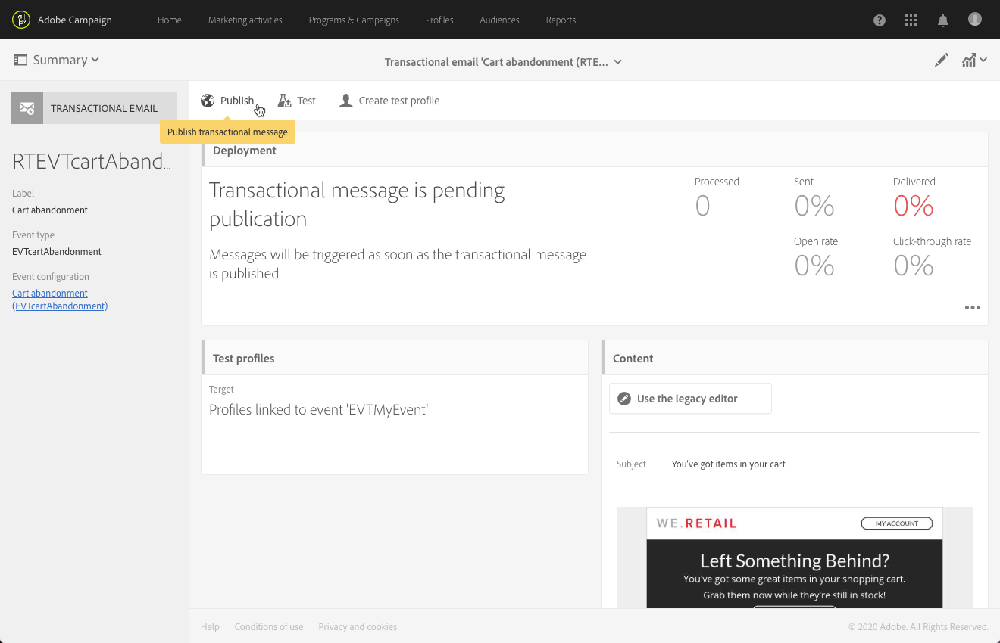

# Transactieberichten voor gebeurtenissen{#event-transactional-messages}

U kunt transactiemeldingen voor gebeurtenissen verzenden die verwijzen naar een gebeurtenis. Dit type van transactieberichten bevat geen profielinformatie: het leveringsdoel wordt bepaald door de gegevens in de gebeurtenis zelf.

Nadat u een gebeurtenis hebt gemaakt en gepubliceerd (de afhandeling van het winkelwagentje, zoals wordt uitgelegd in [deze sectie](../../channels/using/about-transactional-messaging.md#transactional-messaging-operating-principle)), wordt het bijbehorende transactiebericht automatisch gemaakt.

De configuratiestappen worden voorgesteld in het [Vormen van een gebeurtenis om een transactieberichtsectie](../../administration/using/configuring-transactional-messaging.md#use-case--configuring-an-event-to-send-a-transactional-message) te verzenden.

Als de gebeurtenis het verzenden van een transactiemelding moet activeren, moet u het bericht personaliseren, het vervolgens testen en publiceren.

>[!NOTE]
>
>Om tot transactieberichten toegang te hebben, moet u deel van de **[!UICONTROL Administrators (all units)]** veiligheidsgroep uitmaken.
>
>Transactieberichten van gebeurtenissen bevatten geen profielinformatie en zijn daarom niet compatibel met vermoeidheidsregels (zelfs niet in geval van een verrijking met profielen). Zie [Vermoeidheidsregels](../../administration/using/fatigue-rules.md#choosing-the-channel).

## Een testprofiel definiëren in een transactiebericht {#defining-a-test-profile-in-a-transactional-message}

Definieer een aangepast testprofiel, waarmee u een voorbeeld van uw bericht kunt bekijken en een proefdruk kunt verzenden om het te controleren.

### Een testprofiel maken in het transactiebericht {#creating-a-test-profile-within-the-transactional-----------message}

1. Als u het bericht wilt openen dat u hebt gemaakt, klikt u op het **[!UICONTROL Adobe Campaign]** logo in de linkerbovenhoek en selecteert u **[!UICONTROL Marketing plans]** > **[!UICONTROL Transactional messages]** > **[!UICONTROL Transactional messages]**.

   

1. Maak een testprofiel dat aan uw gebeurtenis wordt gekoppeld.

   

1. Geef de informatie die u wilt verzenden op in de JSON-indeling in de **[!UICONTROL Event data used for personalization]** sectie. Dit is de inhoud die wordt gebruikt wanneer een voorbeeld van het bericht wordt weergegeven en wanneer het testprofiel de proefdruk ontvangt.

   

   >[!NOTE]
   >
   >U kunt ook de informatie over de profielentabel invoeren. Zie [De inhoud](../../administration/using/configuring-transactional-messaging.md#enriching-the-transactional-message-content)van het transactiebericht verrijken.

1. Nadat het testprofiel is gemaakt, wordt het vooraf opgegeven in het transactiebericht. Klik op het **[!UICONTROL Test profiles]** blok van het bericht om het doel van de proefdruk te controleren.

   

### Een testprofiel maken buiten het transactiebericht {#creating-a-test-profile-outside-the-transactional-----------message}

U kunt ook een nieuw testprofiel maken of een profiel gebruiken dat al in het **[!UICONTROL Test profiles]** menu staat.

1. Klik op het **[!UICONTROL Adobe Campaign]** logo in de linkerbovenhoek en selecteer **[!UICONTROL Profiles & audiences]** > **[!UICONTROL Test profiles]**.
1. Selecteer in de **[!UICONTROL Event]** sectie van de pagina van het testprofiel dat u hebt gekozen de gebeurtenis die u zojuist hebt gemaakt. In dit voorbeeld selecteert u &quot;Afkapping van winkelwagentje (EVTcartAbandined)&quot;.
1. Geef in het **[!UICONTROL Event data]** tekstvak de informatie op die u wilt verzenden in de JSON-indeling.

   

1. Sla uw wijzigingen op.

U kunt nu het bericht openen dat u hebt gemaakt en het bijgewerkte testprofiel selecteren.

**Verwante onderwerpen:**

* [Testprofielen beheren](../../audiences/using/managing-test-profiles.md)
* [Soorten publiek definiëren](../../audiences/using/creating-audiences.md)

## Een transactiebericht aanpassen {#personalizing-a-transactional-message}

Volg onderstaande stappen om een personalisatie in te stellen in een transactiebericht:

1. Klik op het **[!UICONTROL Content]** blok om het onderwerp en de inhoud van uw bericht te wijzigen. In dit voorbeeld selecteert u een sjabloon met afbeeldingen en tekst. Zie [Ontwerpen met sjablonen](../../designing/using/using-reusable-content.md#designing-templates)voor meer informatie over sjablonen voor e-mailinhoud.

   

1. Voeg een onderwerp toe en bewerk de inhoud van het bericht naar wens.

   >[OPMERKING]
   >
   >De koppeling naar het verlaten winkelwagentje is een koppeling naar een externe URL die de persoon omleidt naar zijn winkelwagentje. Deze parameter wordt niet beheerd in Adobe Campaign.

1. In dit voorbeeld wilt u drie velden toevoegen die u hebt gedefinieerd toen u de gebeurtenis maakte: voornaam, laatst geraadpleegd product, totaal aantal karretjes. Om dit te doen, [neem een verpersoonlijkingsgebied](../../designing/using/personalization.md#inserting-a-personalization-field) in de berichtinhoud op.

1. Blader naar deze velden via **[!UICONTROL Context]** > **[!UICONTROL Real-time event]** > **[!UICONTROL Event context]**.

   

1. Als u de inhoud van uw bericht wilt verrijken, voegt u velden toe door deze te selecteren in de tabel waaraan u de gebeurtenis hebt gekoppeld. Selecteer in ons voorbeeld het **[!UICONTROL Title (salutation)]** veld in de **[!UICONTROL Profile]** tabel via **[!UICONTROL Context]** > **[!UICONTROL Real-time event]** > **[!UICONTROL Event context]**.

   

1. Voeg alle benodigde velden in.

   

1. Geef een voorvertoning van uw bericht weer door het profiel te selecteren dat u voor deze gebeurtenis hebt gedefinieerd.

   De stappen voor het voorvertonen van een bericht worden beschreven in de sectie [Voorvertoning van berichten](../../sending/using/previewing-messages.md) .

   

   U kunt controleren of de verpersoonlijkingsvelden overeenkomen met de gegevens die zijn ingevoerd in het testprofiel. Zie Een testprofiel [definiëren in een transactiebericht](#defining-a-test-profile-in-a-transactional-message)voor meer informatie hierover.

## Productaanbiedingen in een transactiebericht gebruiken {#using-product-listings-in-a-transactional-message}

U kunt productlijsten maken die verwijzen naar een of meer gegevensverzamelingen in de inhoud van een transactie-e-mail. Zo kunt u in een e-mailbericht voor het verlaten van een winkelwagentje een lijst opnemen met alle producten die zich in de winkelwagentjes bevonden toen ze uw website verlieten, met een afbeelding, de prijs en een koppeling naar elk product.

>[!CAUTION]
>
>Aanbiedingen in producten zijn alleen beschikbaar wanneer u transactieberichten bewerkt via de [e-mailinterface van Designer](../../designing/using/designing-content-in-adobe-campaign.md#email-designer-interface) .

Volg de onderstaande stappen om een lijst met verlaten producten toe te voegen in een transactiebericht.

U kunt ook een set video&#39;s bekijken waarin de stappen worden uitgelegd die nodig zijn om productlijsten te configureren in een transactie-e-mail. Zie [deze pagina](https://docs.adobe.com/content/help/en/campaign-learn/campaign-standard-tutorials/designing-content/product-listings-in-transactional-email.html)voor meer informatie.

>[!NOTE]
>
>Adobe Campaign biedt geen ondersteuning voor geneste productaanbiedingen. Dit betekent dat u geen productaanbiedingen in een andere campagne kunt opnemen.

### Een productlijst definiëren {#defining-a-product-listing}

Voordat u een productlijst kunt gebruiken in een transactiebericht, moet u op gebeurtenisniveau de lijst met producten en de velden definiëren voor elk product van de lijst die u wilt weergeven. Zie Gegevensverzamelingen [definiëren voor meer informatie](../../administration/using/configuring-transactional-messaging.md#defining-data-collections).

1. Klik in het transactiebericht op het **[!UICONTROL Content]** blok om de e-mailinhoud te wijzigen.
1. Sleep een structuurcomponent naar de werkruimte. Zie [De e-mailstructuur](../../designing/using/designing-from-scratch.md#defining-the-email-structure)bewerken voor meer informatie.

   Selecteer bijvoorbeeld een structuurcomponent met één kolom en voeg een tekstcomponent, een afbeeldingscomponent en een knopcomponent toe. Zie Fragmenten en componenten toevoegen voor meer informatie.

1. Selecteer de structuurcomponent die u net hebt gemaakt en klik op het **[!UICONTROL Enable product listing]** pictogram op de contextafhankelijke werkbalk.

   

   De structuurcomponent wordt gemarkeerd met een oranje kader en de **[!UICONTROL Product listing]** instellingen worden weergegeven in het linkerpalet.

   

1. Selecteer hoe de elementen van de verzameling worden weergegeven:

   * **[!UICONTROL Row]**: horizontaal: elk element op de ene rij onder de andere.
   * **[!UICONTROL Column]**: verticaal, dat wil zeggen elk element naast elkaar op dezelfde rij.
   >[!NOTE]
   >
   >De **[!UICONTROL Column]** optie is alleen beschikbaar als u een structuurcomponent met meerdere kolommen gebruikt ( **[!UICONTROL 2:2 column]**, **[!UICONTROL 3:3 column]** en **[!UICONTROL 4:4 column]** ). Vul bij het bewerken van de productlijst alleen de eerste kolom in: de overige kolommen worden niet in aanmerking genomen . Zie [De e-mailstructuur](../../designing/using/designing-from-scratch.md#defining-the-email-structure)bewerken voor meer informatie over het selecteren van structuurcomponenten.

1. Selecteer de gegevensverzameling die u hebt gemaakt toen u de gebeurtenis configureerde die betrekking had op het transactiebericht. U vindt de code onder **[!UICONTROL Context]** > **[!UICONTROL Real-time event]** > **[!UICONTROL Event context]** .

   

   Zie Gegevensverzamelingen [definiëren voor meer informatie over het configureren van de gebeurtenis](../../administration/using/configuring-transactional-messaging.md#defining-data-collections).

1. Gebruik de **[!UICONTROL First item]** vervolgkeuzelijst om te selecteren welk element de lijst start die in de e-mail wordt weergegeven.

   Als u bijvoorbeeld 2 selecteert, wordt het eerste item van de verzameling niet weergegeven in de e-mail. De productaanbieding begint voor het tweede object.

1. Selecteer het maximumaantal items dat in de lijst moet worden weergegeven.

   >[!NOTE]
   >
   >Als u wilt dat de elementen van de lijst verticaal ( **[!UICONTROL Column]** ) worden weergegeven, is het maximumaantal items beperkt volgens de geselecteerde structuurcomponent (2, 3 of 4 kolommen). Zie [De e-mailstructuur](../../designing/using/designing-from-scratch.md#defining-the-email-structure)bewerken voor meer informatie over het selecteren van structuurcomponenten.

### De productlijst invullen {#populating-the-product-listing}

Volg onderstaande stappen om een lijst weer te geven met producten die afkomstig zijn van de gebeurtenis die gekoppeld is aan de transactie-e-mail.

Zie Gegevensverzamelingen [definiëren voor meer informatie over het maken van een verzameling en verwante velden tijdens het configureren van de gebeurtenis](../../administration/using/configuring-transactional-messaging.md#defining-data-collections).

1. Selecteer de afbeeldingscomponent die u hebt ingevoegd, selecteer **[!UICONTROL Enable personalization]** en klik op het potlood in het deelvenster Instellingen.

   

1. Selecteer **[!UICONTROL Add personalization field]** in het **[!UICONTROL Image source URL]** venster dat opent.

   Open in het knooppunt **[!UICONTROL Context]** > **[!UICONTROL Real-time event]** > **[!UICONTROL Event context]** het knooppunt dat overeenkomt met de verzameling die u hebt gemaakt (hier **[!UICONTROL Product list]** ) en selecteer het afbeeldingsveld dat u hebt gedefinieerd (hier **[!UICONTROL Product image]** ). Klik op **[!UICONTROL Save]**.

   

   Het door u geselecteerde aanpassingsveld wordt nu weergegeven in het deelvenster Instellingen.

1. Selecteer op de gewenste positie op de contextafhankelijke werkbalk. **[!UICONTROL Insert personalization field]**

   

1. Open in het knooppunt **[!UICONTROL Context]** > **[!UICONTROL Real-time event]** > **[!UICONTROL Event context]** het knooppunt dat overeenkomt met de verzameling die u hebt gemaakt (hier **[!UICONTROL Product list]** ) en selecteer het veld dat u hebt gemaakt (hier **[!UICONTROL Product name]** ). Klik op **[!UICONTROL Confirm]**.

   

   Het door u geselecteerde aanpassingsveld wordt nu op de gewenste positie weergegeven in de e-mailinhoud.

1. Ga op dezelfde manier te werk om de prijs in te voegen.
1. Selecteer tekst en selecteer tekst op de contextafhankelijke werkbalk. **[!UICONTROL Insert link]**

   

1. Selecteer **[!UICONTROL Add personalization field]** in het **[!UICONTROL Insert link]** venster dat opent.

   Open in het knooppunt **[!UICONTROL Context]** > **[!UICONTROL Real-time event]** > **[!UICONTROL Event context]** het knooppunt dat overeenkomt met de verzameling die u hebt gemaakt (hier **[!UICONTROL Product list]** ) en selecteer het URL-veld dat u hebt gemaakt (hier **[!UICONTROL Product URL]** ). Klik op **[!UICONTROL Save]**.

   >[!CAUTION]
   >
   >Om veiligheidsredenen, zorg ervoor u het verpersoonlijkingsgebied binnen een verbinding opneemt die met een juiste statische domeinnaam begint.

   

   Het door u geselecteerde aanpassingsveld wordt nu weergegeven in het deelvenster Instellingen.

1. Selecteer de structuurcomponent waarop de productlijst wordt toegepast en selecteer **[!UICONTROL Show fallback]** om een standaardinhoud te definiëren.

   

1. Sleep een of meer inhoudscomponenten en bewerk deze zo nodig.

   

   De fallback-inhoud wordt weergegeven als de verzameling leeg is wanneer de gebeurtenis wordt geactiveerd, bijvoorbeeld als een klant niets in zijn winkelwagentje heeft.

1. Bewerk de stijlen voor de productlijst in het deelvenster Instellingen. Zie E-mailstijlen bewerken voor meer informatie.
1. Geef een voorvertoning van de e-mail weer met een testprofiel dat is gekoppeld aan de relevante transactiegebeurtenis en waarvoor u verzamelingsgegevens hebt gedefinieerd. Voeg bijvoorbeeld de volgende informatie in de **[!UICONTROL Event data]** sectie toe voor het testprofiel dat u wilt gebruiken:

   

   Zie [deze sectie](#defining-a-test-profile-in-a-transactional-message)voor meer informatie over het definiëren van een testprofiel in een transactiebericht.

## Transactiebericht testen {#testing-a-transactional-message}

Nadat u het transactiebericht hebt opgeslagen, kunt u nu een proefdruk verzenden om het te testen.

De stappen voor het verzenden van een bewijs worden beschreven in het [verzenden van een proefdruk](../../sending/using/sending-proofs.md) .

## Transactiebericht publiceren {#publishing-a-transactional-message}

Nadat u het transactiebericht hebt gecontroleerd, kunt u het publiceren.

Nu, zodra de gebeurtenis van de &quot;Verlaat van de Kar&quot;wordt teweeggebracht, veroorzaakt het automatisch een bericht dat de titel en de familienaam van de ontvanger, de kar URL, het laatste geraadpleegde product of een lijst van producten bevat als u een productlijst, en het totale kartbedrag om te verzenden bepaalde.

Klik op de **[!UICONTROL Reports]** knop voor toegang tot rapporten over je transactiebericht. Zie [Rapporten](../../reporting/using/about-dynamic-reports.md).

## Opschorting van een transactiebericht {#suspending-a-transactional-message-publication}

U kunt het publiceren van uw transactiebericht opschorten door de **[!UICONTROL Pause]** knoop, bijvoorbeeld, te gebruiken om de gegevens te wijzigen in het bericht. De gebeurtenissen worden daarom niet meer verwerkt, maar in plaats daarvan in een wachtrij opgeslagen in de Adobe Campagne-database.

De gebeurtenissen in de wachtrij worden bewaard gedurende een periode die is gedefinieerd in de REST API (zie de documentatie [van de](../../api/using/about-campaign-standard-apis.md)REST API) of in de triggergebeurtenis als u de Triggers Core-service gebruikt (zie [Werken met Triggers](../../integrating/using/about-adobe-experience-cloud-triggers.md)voor campagne en ervaring).

Wanneer u klikt, worden alle gebeurtenissen in de wachtrij (op voorwaarde dat deze niet verlopen zijn) verwerkt. **[!UICONTROL Resume]** Zij bevatten nu alle wijzigingen die zijn uitgevoerd terwijl de publicatie van de template werd opgeschort.

## Het publiceren van een transactiemelding opheffen {#unpublishing-a-transactional-message}

Klik **[!UICONTROL Unpublish]** staat u toe om de transactionele berichtpublicatie, maar ook de publicatie van de overeenkomstige gebeurtenis te annuleren, die van REST API de middel schrapt die aan de gebeurtenis beantwoordt die u eerder creeerde. Zelfs als de gebeurtenis via uw website wordt geactiveerd, worden de bijbehorende berichten niet meer verzonden en niet opgeslagen in de database.

>[!NOTE]
>
>Als u het bericht opnieuw wilt publiceren, moet u teruggaan naar de bijbehorende gebeurtenisconfiguratie, het publiceren en vervolgens het bericht publiceren. Voor meer op dit, zie het [Publiceren van een transactiebericht](#publishing-a-transactional-message).

Als u de publicatie van een gepauzeerd transactiebericht ongedaan maakt, moet u mogelijk tot 24 uur wachten voordat u het bericht opnieuw kunt publiceren. Hiermee kan de **[!UICONTROL Database cleanup]** workflow alle gebeurtenissen opschonen die naar de wachtrij zijn verzonden. De stappen voor het pauzeren van een bericht zijn gedetailleerd in de [Onderbreking van een sectie van de transactieberichtpublicatie](#suspending-a-transactional-message-publication) .

De **[!UICONTROL Database cleanup]** workflow, die elke dag om 4.00 uur wordt uitgevoerd, is toegankelijk via **[!UICONTROL Administration]** > **[!UICONTROL Application settings]** > **[!UICONTROL Workflows]**.

## Transactiebericht verwijderen {#deleting-a-transactional-message}

Door een transactiemelding te selecteren, kunt u het met de **[!UICONTROL Delete element]** knoop schrappen zelfs als het reeds is gepubliceerd. Het verwijderen van een transactiebericht kan echter alleen onder bepaalde voorwaarden worden uitgevoerd:

* **Transactieberichten**: Als u een transactiebericht wilt verwijderen, moet het bericht niet worden gepubliceerd en niet worden gepauzeerd.

   Als het transactiebericht niet gepubliceerd is, moet de gebeurtenisconfiguratie ook unpublished zijn om uw transactiebericht met succes te schrappen, tenzij een ander transactiebericht met de overeenkomstige gebeurtenis verbonden is. Raadpleeg deze [sectie](#unpublishing-a-transactional-message)voor meer informatie over het ongedaan maken van de publicatie van een transactiebericht.

   >[!CAUTION]
   >
   >Als u een transactiemelding verwijdert waarvoor al meldingen zijn verzonden, worden ook de verzendings- en trackinglogboeken verwijderd.

* **Transactieberichten van een uit-van-de-doos gebeurtenissjabloon (interne transactieberichten)**: Als u een intern transactiebericht wilt verwijderen, moet het bericht niet worden gepubliceerd en niet worden gepauzeerd.

   Het zou ook niet het enige transactionele bericht in de gebeurtenis moeten zijn, andere berichten moeten met de overeenkomstige gebeurtenis worden verbonden.

## Transactiebericht opnieuw proberen {#transactional-message-retry-process}

Een tijdelijk onbezorgd transactiebericht is onderworpen aan automatische herpogingen die tot de levering verloopt worden uitgevoerd. Zie Parameters voor de [geldigheidsperiode](../../administration/using/configuring-email-channel.md#validity-period-parameters)voor meer informatie over de leveringsduur.

Wanneer een transactiebericht niet kan worden verzonden, zijn er twee systemen opnieuw proberen:

* Op het transactionele overseinenniveau, kan een transactiebericht ontbreken alvorens de gebeurtenis aan een uitvoeringslevering wordt toegewezen, die tussen de gebeurtenisontvangst en de leveringsvoorbereiding betekent. Zie [Proces](#event-processing-retry-process)voor het opnieuw proberen van gebeurtenissen.
* Op het verzendende procesniveau, zodra de gebeurtenis aan een uitvoeringslevering is toegewezen, kan het transactiebericht wegens een tijdelijke fout ontbreken. Zie [Bericht verzenden opnieuw proberen proces](#message-sending-retry-process).

### Herbewerking van gebeurtenisverwerking {#event-processing-retry-process}

Als de gebeurtenis niet aan een uitvoeringslevering kan worden toegewezen, wordt de gebeurtenisverwerking uitgesteld. De pogingen worden dan uitgevoerd tot het aan een nieuwe uitvoeringslevering wordt toegewezen.

>[!NOTE]
>
>Een uitgestelde gebeurtenis wordt niet weergegeven in het transactiemeldingsbericht dat logbestanden verzendt, omdat deze gebeurtenis nog niet is toegewezen aan een uitvoeringslevering.

De gebeurtenis kon bijvoorbeeld niet worden toegewezen aan een uitvoeringslevering omdat de inhoud niet correct was, er een probleem was met toegangsrechten of branding, er een fout was ontdekt bij het toepassen van typologische regels, enz. In dit geval kunt u het bericht pauzeren, het bewerken om het probleem op te lossen en het opnieuw publiceren. Het hertestsysteem zal het dan aan een nieuwe uitvoeringslevering toewijzen.

### Bericht bij opnieuw proberen {#message-sending-retry-process}

Zodra de gebeurtenis aan een uitvoeringslevering is toegewezen, kan het transactiebericht wegens een tijdelijke fout ontbreken, als de brievenbus van de ontvanger bijvoorbeeld volledig is. Zie [Opnieuw proberen na een tijdelijke leveringsfout](../../sending/using/understanding-delivery-failures.md#retries-after-a-delivery-temporary-failure)voor meer informatie.

>[!NOTE]
>
>Wanneer een gebeurtenis aan een uitvoeringslevering wordt toegewezen, verschijnt het in de verzendende logboeken van deze uitvoeringslevering, en slechts op dit ogenblik. De mislukte leveringen worden weergegeven op het **[!UICONTROL Execution list]** tabblad van het transactiemelding.

### Beperkingen {#limitations}

**Update voor logbestanden verzenden**

In het proces van het opnieuw proberen, worden de verzendende logboeken van de nieuwe uitvoeringslevering niet onmiddellijk bijgewerkt (de update wordt uitgevoerd door een geplande werkschema). Dit betekent dat het bericht in de **[!UICONTROL Pending]** status kan verkeren, zelfs als de transactiegebeurtenis door de nieuwe uitvoeringslevering is verwerkt.

**Uitvoering mislukt**

U kunt een uitvoering niet stoppen. Als de huidige levering van de uitvoering echter mislukt, wordt een nieuwe gebeurtenis gemaakt zodra een nieuwe gebeurtenis wordt ontvangen en worden alle nieuwe gebeurtenissen verwerkt door deze nieuwe levering van de uitvoering. Er worden geen nieuwe gebeurtenissen verwerkt door de mislukte uitvoering.

Als sommige gebeurtenissen die al aan een uitvoeringslevering zijn toegewezen, zijn uitgesteld en als die uitvoeringslevering mislukt, wijst het hertestsysteem de uitgestelde gebeurtenissen niet toe aan de nieuwe uitvoeringslevering, wat betekent dat deze gebeurtenissen verloren gaan.
