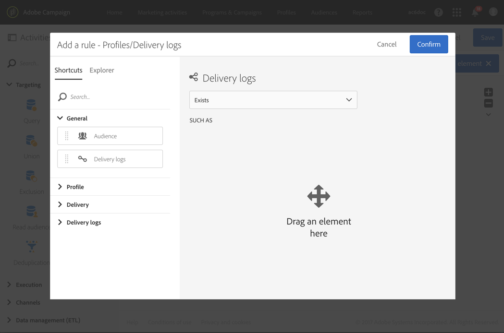

# Vervolgberichten{#follow-up-messages}

U kunt een vervolgbericht verzenden naar de klanten die een specifiek transactiebericht hebben ontvangen. Hiervoor moet u een workflow voor de bijbehorende gebeurtenis instellen.

Het voorbeeld dat in [Transactioneel overseinen werkend principe](../../channels/using/getting-started-with-transactional-msg.md#transactional-messaging-operating-principle) sectie wordt beschreven hergebruiken: er wordt een e-mailbericht met de winkelwagentje verzonden naar gebruikers van uw website die producten aan hun winkelwagentje hebben toegevoegd , maar die de site hebben verlaten zonder dat ze hun aankopen hebben gedaan .

U wilt een vriendelijke herinnering sturen aan alle klanten die het bericht van het verlaten van het winkelwagentje hebben ontvangen maar het na drie dagen niet hebben geopend.

Elke betrokken klant zal dan een vervolgbericht ontvangen dat op de zelfde gegevens wordt gebaseerd die in eerste e-mail werden gebruikt die werd verzonden.

## Toegang tot de vervolgberichten {#accessing-the-follow-up-messages}

Nadat u een gebeurtenis hebt gemaakt en gepubliceerd (het winkelwagentje zoals beschreven in het [voorbeeld](../../channels/using/getting-started-with-transactional-msg.md#transactional-messaging-operating-principle) hierboven), worden het bijbehorende transactiebericht en het vervolgbericht automatisch gemaakt.

De configuratiestappen worden voorgesteld in [Vormend een gebeurtenis om een follow-up bericht](../../administration/using/configuring-transactional-messaging.md#configuring-an-event-to-send-a-follow-up-message) sectie te verzenden.

Voor het afhandelen van een gebeurtenis in een workflow is een leveringssjabloon vereist. Nochtans, wanneer het publiceren van de gebeurtenis, [transactioneel bericht](../../channels/using/event-transactional-messages.md) dat wordt gecreeerd kan niet als malplaatje worden gebruikt. Daarom moet u een specifieke follow-up leveringsmalplaatje creëren dat wordt ontworpen om dit gebeurtenistype te steunen en als malplaatje in een werkschema te gebruiken.

Deze sjabloon openen:

1. Klik op het **[!UICONTROL Adobe Campaign]**-logo in de linkerbovenhoek.
1. Selecteer **[!UICONTROL Resources]** > **[!UICONTROL Templates]** > **[!UICONTROL Delivery templates]**.
1. Schakel het vakje **[!UICONTROL Follow-up messages]** in het linkerdeelvenster in.

   

Alleen de vervolgberichten worden weergegeven.

>[!NOTE]
>
>Om toegang te hebben tot transactionele berichten moet u deel uitmaken van de beveiligingsgroep **[!UICONTROL Administrators (all units)]**.

## Een vervolgbericht verzenden {#sending-a-follow-up-message}

Zodra u het malplaatje van de follow-up levering creeerde, kunt u het in een werkschema gebruiken om een vervolgbericht te verzenden.

1. Open de lijst met marketingactiviteiten en maak een nieuwe workflow.

   Zie [Een workflow maken](../../automating/using/building-a-workflow.md#creating-a-workflow).

1. Sleep een **[!UICONTROL Scheduler]** activiteit in uw werkschema en open het. Stel de uitvoeringsfrequentie eenmaal per dag in.

   De activiteit van de Planner wordt voorgesteld in [Planner](../../automating/using/scheduler.md) sectie.

1. Sleep een **[!UICONTROL Query]** activiteit in uw werkschema en open het.

   De activiteit van de Vraag wordt voorgesteld in [Vraag](../../automating/using/query.md) sectie.

1. Als u de query op een andere bron dan de profielbron wilt uitvoeren, gaat u naar het tabblad **[!UICONTROL Properties]** van de activiteit en klikt u op de vervolgkeuzelijst **[!UICONTROL Resource]**.

   

   >[!NOTE]
   >
   >Standaard is de activiteit vooraf geconfigureerd om te zoeken naar profielen.

1. Selecteer de gebeurtenis die u als doel wilt instellen, zodat u alleen toegang hebt tot gegevens van deze gebeurtenis.

   

1. Ga naar de **[!UICONTROL Target]** tab van de activiteit en sleep het **[!UICONTROL Delivery logs (logs)]** element van het palet naar de werkruimte.

   

   Selecteer **[!UICONTROL Exists]** om zich te richten op alle klanten die het e-mailbericht hebben ontvangen.

   

1. Verplaats het **[!UICONTROL Tracking logs (tracking)]**-element van het palet naar de werkruimte en selecteer **[!UICONTROL Does not exist]** om alle klanten aan te wijzen die de e-mail niet hebben geopend.

   

1. Sleep de gebeurtenis waarop u zich richt (**Afbreken van illustratie** in dit voorbeeld) van het palet naar de werkruimte. Vervolgens definieert u een regel voor alle berichten die drie dagen geleden zijn verzonden.

   

   Dit betekent dat alle ontvangers die het transactiemelding drie dagen voor de uitvoering van de werkstroom hebben ontvangen en nog steeds niet hebben geopend, als doel zijn aangewezen.

   Klik **[!UICONTROL Confirm]** om de vraag te bewaren.

1. Sleep een **e-maillevering** activiteit naar uw werkstroom.

   De activiteit van de E-maillevering wordt voorgesteld in [E-maillevering](../../automating/using/email-delivery.md) sectie.

   

   U kunt ook een [SMS-levering](../../automating/using/sms-delivery.md) of een [Mobiele app-levering](../../automating/using/push-notification-delivery.md)-activiteit gebruiken. Selecteer in dit geval het kanaal **[!UICONTROL Mobile (SMS)]** of **[!UICONTROL Mobile application]** wanneer u de gebeurtenisconfiguratie maakt. Zie [Een gebeurtenis maken](../../administration/using/configuring-transactional-messaging.md#creating-an-event).

1. Open **E-maillevering** activiteit. Schakel in de wizard Maken het vakje **[!UICONTROL Follow-up messages]** in en selecteer de sjabloon voor opvolglevering die na publicatie van de gebeurtenis is gemaakt.

   

1. In de inhoud van het vervolgbericht kunt u de inhoud van de gebeurtenis benutten door personalisatievelden toe te voegen.

   

1. Zoek de velden die u tijdens het maken van uw gebeurtenis hebt gedefinieerd door **[!UICONTROL Context]** > **[!UICONTROL Real-time event]** > **[!UICONTROL Event context]** te selecteren. Zie [Transactiebericht aanpassen](../../channels/using/event-transactional-messages.md#personalizing-a-transactional-message).

   

   Dit betekent dat u dezelfde inhoud, inclusief verrijkte gegevens, die u hebt gebruikt toen de gebeurtenis voor het eerst werd verzonden, kunt gebruiken om een gepersonaliseerde, vriendelijke herinnering te maken.

1. Sla de activiteit op en start de workflow.

Als de workflow eenmaal is gestart, ontvangt elke klant die drie dagen geleden uw kennisgeving van het verlaten van het winkelwagentje heeft ontvangen maar dit niet heeft geopend, een vervolgbericht op basis van dezelfde gegevens.

>[!NOTE]
>
>Als u **[!UICONTROL Profile]** richtende dimensie toen het creëren van de gebeurtenisconfiguratie selecteerde, zal het follow-upbericht ook hefboomwerking de het marketing gegevensbestand van Adobe Campaign. Zie [Profieltransactieberichten](../../channels/using/profile-transactional-messages.md).
