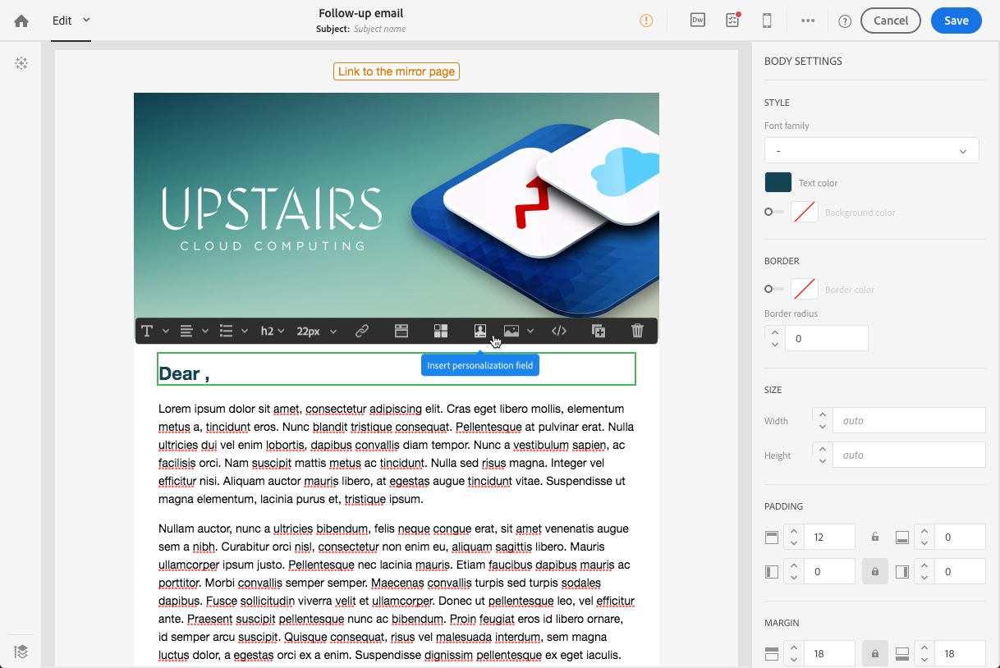

# Vervolgberichten{#follow-up-messages}

U kunt een vervolgbericht verzenden naar de klanten die een specifiek transactiebericht hebben ontvangen. Hiervoor moet u een workflow voor de bijbehorende gebeurtenis instellen.

Laten wij het voorbeeld opnieuw gebruiken dat in de [Transactionele overseinen werkende principesectie](../../channels/using/getting-started-with-transactional-msg.md#transactional-messaging-operating-principle) wordt beschreven: er wordt een e-mailbericht met de winkelwagentje verzonden naar gebruikers van uw website die producten aan hun winkelwagentje hebben toegevoegd , maar die de site hebben verlaten zonder dat ze hun aankopen hebben gedaan .

U wilt een vriendelijke herinnering sturen aan alle klanten die het bericht van het verlaten van het winkelwagentje hebben ontvangen maar het na drie dagen niet hebben geopend.

Elke betrokken klant zal dan een vervolgbericht ontvangen dat op de zelfde gegevens wordt gebaseerd die in eerste e-mail werden gebruikt die werd verzonden.

## De follow-upberichten openen {#accessing-the-follow-up-messages}

Once you have created and published an event (the cart abandonment as per the [example](../../channels/using/getting-started-with-transactional-msg.md#transactional-messaging-operating-principle) above), the corresponding transactional message and follow-up message are created automatically.

The configuration steps are presented in the [Configuring an event to send a follow-up message](../../administration/using/configuring-transactional-messaging.md#configuring-an-event-to-send-a-follow-up-message) section.

Voor het afhandelen van een gebeurtenis in een workflow is een leveringssjabloon vereist. Wanneer u de gebeurtenis publiceert, kan het [transactiemelding](../../channels/using/event-transactional-messages.md) die wordt gemaakt, echter niet als een sjabloon worden gebruikt. Daarom moet u een specifieke follow-up leveringsmalplaatje creëren dat wordt ontworpen om dit gebeurtenistype te steunen en als malplaatje in een werkschema te gebruiken.

Deze sjabloon openen:

1. Click the **[!UICONTROL Adobe Campaign]** logo, in the top left corner.
1. Selecteer **[!UICONTROL Resources]** > **[!UICONTROL Templates]** > **[!UICONTROL Delivery templates]**.
1. Schakel het **[!UICONTROL Follow-up messages]** vakje in het linkerdeelvenster in.

   

Alleen de vervolgberichten worden weergegeven.

>[!NOTE]
>
>Om toegang te hebben tot transactionele berichten moet u deel uitmaken van de beveiligingsgroep **[!UICONTROL Administrators (all units)]**.

## Een vervolgbericht verzenden {#sending-a-follow-up-message}

Zodra u het malplaatje van de follow-up levering creeerde, kunt u het in een werkschema gebruiken om een vervolgbericht te verzenden.

1. Open de lijst met marketingactiviteiten en maak een nieuwe workflow.

   See [Creating a workflow](../../automating/using/building-a-workflow.md#creating-a-workflow).

1. Drag and drop a **[!UICONTROL Scheduler]** activity into your workflow and open it. Stel de uitvoeringsfrequentie eenmaal per dag in.

   De activiteit van de Planner wordt voorgesteld in de sectie van de [Planner](../../automating/using/scheduler.md) .

1. Drag and drop a **[!UICONTROL Query]** activity into your workflow and open it.

   De activiteit van de Vraag wordt voorgesteld in de sectie van de [Vraag](../../automating/using/query.md) .

1. Om de vraag op een middel buiten het profielmiddel in werking te stellen, ga naar het **[!UICONTROL Properties]** lusje van de activiteit en klik de **[!UICONTROL Resource]** drop-down lijst.

   

   >[!NOTE]
   >
   >Standaard is de activiteit vooraf geconfigureerd om te zoeken naar profielen.

1. Selecteer de gebeurtenis die u als doel wilt instellen, zodat u alleen toegang hebt tot gegevens van deze gebeurtenis.

   

1. Ga naar het **[!UICONTROL Target]** tabblad Actie en sleep het **[!UICONTROL Delivery logs (logs)]** element van het palet naar de werkruimte.

   

   Selecteer deze optie **[!UICONTROL Exists]** om alle klanten die het e-mailbericht hebben ontvangen als doel in te stellen.

   

1. Verplaats het **[!UICONTROL Tracking logs (tracking)]** element van het palet naar de werkruimte en selecteer **[!UICONTROL Does not exist]** om alle klanten aan te wijzen die e-mail niet hebben geopend.

   

1. Sleep de gebeurtenis waarop u zich richt (**Afbreken** starten in dit voorbeeld) van het palet naar de werkruimte. Vervolgens definieert u een regel voor alle berichten die drie dagen geleden zijn verzonden.

   

   Dit betekent dat alle ontvangers die het transactiemelding drie dagen voor de uitvoering van de werkstroom hebben ontvangen en nog steeds niet hebben geopend, als doel zijn aangewezen.

   Click **[!UICONTROL Confirm]** to save the query.

1. Drag and drop an **Email delivery** activity into your workflow.

   De leveringsactiviteit via e-mail wordt weergegeven in de sectie [E-maillevering](../../automating/using/email-delivery.md) .

   

   U kunt ook een [SMS-levering](../../automating/using/sms-delivery.md) of een levering [via een](../../automating/using/push-notification-delivery.md) mobiele app gebruiken. Selecteer in dit geval het **[!UICONTROL Mobile (SMS)]** of het **[!UICONTROL Mobile application]** kanaal wanneer u de gebeurtenisconfiguratie maakt. Zie [Een gebeurtenis maken](../../administration/using/configuring-transactional-messaging.md#creating-an-event).

1. Open de **e-mailleveringsactiviteit** . Schakel het **[!UICONTROL Follow-up messages]** vakje in de wizard Maken in en selecteer de sjabloon voor vervolglevering die na publicatie van de gebeurtenis is gemaakt.

   

1. In de inhoud van het vervolgbericht kunt u de inhoud van de gebeurtenis benutten door personalisatievelden toe te voegen.

   

1. U kunt de velden zoeken die u hebt gedefinieerd tijdens het maken van uw gebeurtenis door **[!UICONTROL Context]** > **[!UICONTROL Real-time event]** > **[!UICONTROL Event context]** te selecteren. See [Personalizing a transactional message](../../channels/using/event-transactional-messages.md#personalizing-a-transactional-message).

   

   Dit betekent dat u dezelfde inhoud, inclusief verrijkte gegevens, die u hebt gebruikt toen de gebeurtenis voor het eerst werd verzonden, kunt gebruiken om een gepersonaliseerde, vriendelijke herinnering te maken.

1. Sla de activiteit op en start de workflow.

Als de workflow eenmaal is gestart, ontvangt elke klant die drie dagen geleden uw kennisgeving van het verlaten van het winkelwagentje heeft ontvangen maar dit niet heeft geopend, een vervolgbericht op basis van dezelfde gegevens.

>[!NOTE]
>
>Als u bij het maken van de gebeurtenisconfiguratie de **[!UICONTROL Profile]** doeldimensie hebt geselecteerd, gebruikt het vervolgbericht ook de Adobe Campaign-marketingdatabase. Zie [Profieltransactieberichten](../../channels/using/profile-transactional-messages.md).
