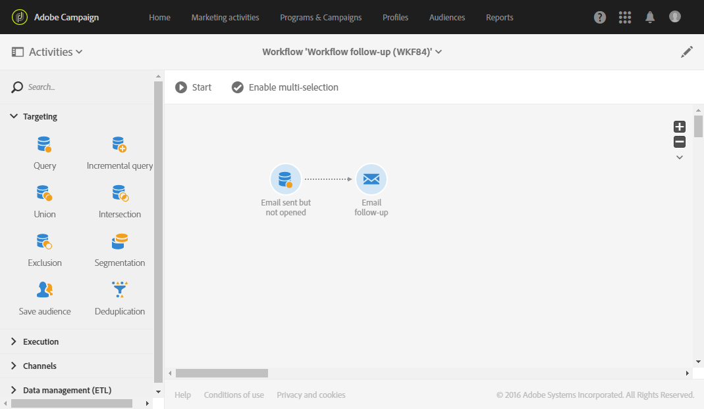

# Vervolgberichten {#follow-up-messages}

Een follow-upbericht is een vooraf bepaalde marketing leveringsmalplaatje dat in een werkschema kan worden gebruikt om een andere mededeling naar de ontvangers van een specifiek transactiebericht te verzenden.

Het voorbeeld dat in het dialoogvenster [Operationeel beginsel van het transactieverkeer](../../channels/using/getting-started-with-transactional-msg.md#transactional-messaging-operating-principle) sectie: er wordt een e-mailbericht met de winkelwagentje verzonden naar gebruikers van uw website die producten aan hun winkelwagentje hebben toegevoegd , maar die de site hebben verlaten zonder dat ze hun aankopen hebben gedaan .

U wilt een vriendelijke herinnering sturen aan alle klanten die het bericht van het verlaten van het winkelwagentje hebben ontvangen maar het na drie dagen niet hebben geopend. Ze ontvangen een vervolgbericht op basis van dezelfde gegevens die werden gebruikt in het eerste e-mailbericht dat werd verzonden.

## Een gebeurtenis configureren om een vervolgbericht te verzenden {#configuring-an-event-to-send-a-follow-up-message}

Om een follow-upbericht te verzenden, moet u eerst dienovereenkomstig de gebeurtenis vormen die met het transactiebericht beantwoordt dat reeds werd ontvangen.

1. Gebruik dezelfde gebeurtenisconfiguratie die u hebt gemaakt om een transactiebericht voor een gebeurtenis te verzenden. Zie [Een transactiegebeurtenis configureren](../../channels/using/configuring-transactional-event.md).
1. Wanneer het vormen van uw gebeurtenis, controleer **[!UICONTROL Create follow-up delivery template for this event]** voordat u de gebeurtenis publiceert.

   

1. [De gebeurtenis voorvertonen en publiceren](../../channels/using/publishing-transactional-event.md#previewing-and-publishing-the-event).

Nadat de gebeurtenis is gepubliceerd, worden automatisch een transactiemelding en een leveringssjabloon voor de follow-up gemaakt die aan de nieuwe gebeurtenis zijn gekoppeld. De stappen voor het verzenden van het vervolgbericht worden beschreven in [deze sectie](#sending-a-follow-up-message).

## De follow-upberichten openen {#accessing-the-follow-up-messages}

Voor het afhandelen van een gebeurtenis in een workflow is een leveringssjabloon vereist. Wanneer u de gebeurtenis publiceert, worden echter de [transactiebericht](../../channels/using/editing-transactional-message.md) die is gemaakt, kan niet als een sjabloon worden gebruikt. Daarom moet u een specifieke follow-up leveringsmalplaatje creëren dat wordt ontworpen om dit gebeurtenistype te steunen en als malplaatje in een werkschema te gebruiken.

Deze sjabloon openen:

1. Klik op de knop **Adobe** in de linkerbovenhoek.
1. Selecteer **[!UICONTROL Resources]** > **[!UICONTROL Templates]** > **[!UICONTROL Delivery templates]**.
1. Controleer de **[!UICONTROL Follow-up messages]** in het linkerdeelvenster.

   

Alleen de vervolgberichten worden weergegeven.

>[!IMPORTANT]
>
>Alleen gebruikers met de [Beheer](../../administration/using/users-management.md#functional-administrators) de rol kan tot transactionele berichten toegang hebben en uitgeven.

## Een vervolgbericht verzenden {#sending-a-follow-up-message}

Zodra u het malplaatje van de follow-up levering creeerde, kunt u het in een werkschema gebruiken om een vervolgbericht te verzenden.

<!--You need to set up a workflow targeting the event corresponding to the transactional message that was already received.-->

1. Open de lijst met marketingactiviteiten en maak een nieuwe workflow.

   Zie [Een workflow maken](../../automating/using/building-a-workflow.md#creating-a-workflow).

1. Sleep een **[!UICONTROL Scheduler]** in uw werkstroom te openen. Stel de uitvoeringsfrequentie eenmaal per dag in.

   De activiteit van de Planner wordt voorgesteld in [Planner](../../automating/using/scheduler.md) sectie.

1. Sleep een **[!UICONTROL Query]** in uw werkstroom te openen.

   De activiteit van de Vraag wordt voorgesteld in [Query](../../automating/using/query.md) sectie.

1. Om de vraag op een middel buiten het profielmiddel in werking te stellen, ga naar **[!UICONTROL Properties]** en klik op de knop **[!UICONTROL Resource]** vervolgkeuzelijst.

   

   >[!NOTE]
   >
   >Standaard is de activiteit vooraf geconfigureerd om te zoeken naar profielen.

1. Selecteer de gebeurtenis die u als doel wilt instellen, zodat u alleen toegang hebt tot gegevens van deze gebeurtenis.

   

1. Ga naar de activiteiten **[!UICONTROL Target]** en sleep de **[!UICONTROL Delivery logs (logs)]** van het palet naar de werkruimte.

   

   Selecteren **[!UICONTROL Exists]** om zich te richten op alle klanten die het e-mailbericht hebben ontvangen.

   

1. Verplaats de **[!UICONTROL Tracking logs (tracking)]** -element van het palet naar de werkruimte en selecteer **[!UICONTROL Does not exist]** om zich te richten op alle klanten die e-mail niet hebben geopend.

   

1. Sleep de gebeurtenis waarop u zich richt en zet deze neer (**Lozing van winkelwagentjes** in dit voorbeeld) vanuit het palet naar de werkruimte. Vervolgens definieert u een regel voor alle berichten die drie dagen geleden zijn verzonden.

   

   Dit betekent dat alle ontvangers die het transactiemelding drie dagen voor de uitvoering van de werkstroom hebben ontvangen en nog steeds niet hebben geopend, als doel zijn aangewezen.

   Klikken **[!UICONTROL Confirm]** om de query op te slaan.

1. Sleep een **E-maillevering** in uw workflow.

   De e-mailleveringsactiviteit wordt weergegeven in de [E-maillevering](../../automating/using/email-delivery.md) sectie.

   

   U kunt ook een [Levering via SMS](../../automating/using/sms-delivery.md) of [Levering pushmelding](../../automating/using/push-notification-delivery.md) activiteit. Selecteer in dit geval de optie **[!UICONTROL Mobile (SMS)]** of **[!UICONTROL Mobile application]** kanaal wanneer het creëren van uw gebeurtenisconfiguratie. Zie [Een gebeurtenis maken](../../channels/using/configuring-transactional-event.md#creating-an-event).

1. Open de **E-maillevering** activiteit. Controleer in de wizard Maken de optie **[!UICONTROL Follow-up messages]** en selecteer de sjabloon voor opvolglevering die na publicatie van de gebeurtenis is gemaakt.

   

1. In de inhoud van het vervolgbericht kunt u de inhoud van de gebeurtenis benutten door personalisatievelden toe te voegen.

   

1. Zoek de velden die u bij het maken van uw gebeurtenis hebt gedefinieerd door **[!UICONTROL Context]** > **[!UICONTROL Real-time event]** > **[!UICONTROL Event context]**. Zie [Een transactiebericht aanpassen](../../channels/using/editing-transactional-message.md#personalizing-a-transactional-message).

   

   Dit betekent dat u dezelfde inhoud, inclusief verrijkte gegevens, die u hebt gebruikt toen de gebeurtenis voor het eerst werd verzonden, kunt gebruiken om een gepersonaliseerde, vriendelijke herinnering te maken.

1. Sla de activiteit op en start de workflow.

Als de workflow eenmaal is gestart, ontvangt elke klant die drie dagen geleden uw kennisgeving van het verlaten van het winkelwagentje heeft ontvangen maar dit niet heeft geopend, een vervolgbericht op basis van dezelfde gegevens.

>[!NOTE]
>
>Als u **[!UICONTROL Profile]** Bij het maken van de gebeurtenisconfiguratie maakt het vervolgbericht ook gebruik van de Adobe Campaign-marketingdatabase. Zie [Profieltransactieberichten](../../channels/using/editing-transactional-message.md#profile-transactional-message-specificities).
