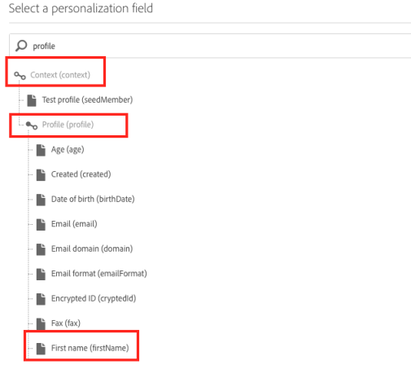

# Een CSV-bestand genereren voor meertalige pushmeldingen{#generating-csv-multilingual-push}

Het uploaden van een CSV-bestand om inhoud te genereren voor levering is een functie die wordt gebruikt voor de ondersteuning van meertalige pushberichten. De indeling van het CSV-bestand moet voldoen aan bepaalde richtlijnen voor het uploaden van het bestand, zodat het bestand kan worden geüpload. In de volgende secties worden de bestandsindeling en de overwegingen daarvoor beschreven.

## Bestandsindeling {#file-format}

Meertalige push vereist 14 kolommen in het CSV-bestand:

1. titel
1. messageBody
1. geluid
1. adge
1. deplinkURI
1. categorie
1. iosMediaAttachmentURL
1. androidMediaAttachmentURL
1. isContentAvailable
1. isMutableContent
1. customFields
1. landinstelling
1. language
1. silentPush

Controleer het CSV-voorbeeld door op de knop **[!UICONTROL Download a sample file]** in het **[!UICONTROL Manage Content Variants]** venster te klikken. For more on this, refer to the this [section](../../channels/using/creating-a-multilingual-push-notification.md).

* **title, messageBody, sound, badge, deplinkURI, category, iosMediaAttachmentURL, androidMediaAttachmentURL**: regelmatig de inhoud van de pushlading. U moet deze informatie op dezelfde manier verstrekken als wanneer het creëren van dupleveringen.
* **Aangepaste velden**:  Gebruik de JSON-indeling voor aangepaste velden, bijvoorbeeld `{"key1":"value1","key2":"value2"}`. Raadpleeg het voorbeeldbestand hierboven voor een voorbeeld van aangepaste velden.
* **isContentAvailable**: markering voor controle van beschikbare inhoud, waarde 1 impliceert waar, waarde 0 impliceert vals. De standaardwaarde is 0. Als u deze kolom leeg laat, wordt de waarde als 0 beschouwd.
* **isMutableContent**: markering voor Mutable Content, waarde 1 impliceert true, waarde 0 betekent false. De standaardwaarde is 0. Als u deze kolom leeg laat, wordt de waarde als 0 beschouwd.
* **landinstelling**: landinstelling is het veld voor taalvarianten, bijvoorbeeld &quot;en_us&quot; voor Amerikaans-Engels en &quot;fr_fr&quot; voor Frankrijk-Frans.
* **taal**: naam van de taal die aan de landinstelling is gekoppeld. Als de landinstelling bijvoorbeeld &#39;en_us&#39; is, moet de naam van de taal &#39;English-United States&#39; zijn.
* **silentPush**: markering voor het type pushmelding. Als het een regelmatig pushbericht is, moet de waarde 0 zijn. Als het een stille push is, moet de waarde 1 zijn. De standaardwaarde is 0. Als u deze kolom leeg laat, wordt de waarde als 0 beschouwd.

## Restricties en richtlijnen voor het maken van CSV-bestanden {#constraints-guideline-csv}

**De naam van elke kolom is vast**.
Neem de naam van elke kolom op in het CSV-bestand. Als u geen kolommen gebruikt voor de inhoud, laat u deze leeg.

**De kolommen &quot;locale&quot; en &quot;language&quot; zijn verplicht en de waarde is uniek voor elke rij.**
Een lege waarde voor deze kolom resulteert in een fout bij het uploaden van het bestand.

**Kolomvolgorde is van belang**. De volgorde van de kolommen in het geüploade bestand moet dezelfde indeling hebben als het voorbeeldbestand.

**Inhoud** van prijskolom. Aangezien dit een CSV-bestand is (staat voor door komma&#39;s gescheiden waarden), moet alle kolominhoud met komma&#39;s (,) worden vermeld. Bijvoorbeeld: &quot;Hallo, Tom!&quot;

**UTF-8-codering is vereist voor internationale tekens.**

**Als u het bestand genereert met onbewerkte tekst, scheidt u elke kolom met &quot;,&quot;.**

**Variant komt niet overeen.** Als u inhoudsblok en doelpubliek met specifieke talen gebruikt, moet u elke beoogde taal in uw CSV-bestand vermelden, anders krijgt u een foutbericht bij het verzenden van de levering.

## Invoeging van het aanpassingsveld in het CSV-bestand {#personalization-field-csv}

Als u verpersoonlijkingsgebieden wilt gebruiken, zou u <span> markering in het dossier moeten omvatten.

Om &quot;firstName&quot;verpersoonlijkingsgebied in messageBody op te nemen, moet het bericht zijn:

```
 "Hello <span class="nl-dce-field nl-dce-done"  data-nl-expr="/context/profile/firstName">First name</span>, this is message".
```

Het veld &quot;firstName&quot; wordt weergegeven door:

```
 <span class="nl-dce-field nl-dce-done" data-nl-expr="/context/profile/firstName">First name</span>
```

In het bereik zijn twee verplichte kenmerken:

* De ene is een klasse die statisch is. Welk verpersoonlijkingsgebied u van plan bent te gebruiken, zal het altijd class=&quot;nl-dce-field nl-dce-done&quot;zijn.

* Een andere is data-nl-expr die de weg van verpersoonlijkingsgebied is. Als u bijvoorbeeld het verpersoonlijkingsveld &quot;firstName&quot; invoegt vanuit de gebruikersinterface, is het navigatiepad **[!UICONTROL Context (context)]** > **[!UICONTROL Profile (profile)]** > **[!UICONTROL First name (firstName)]** (zoals in de onderstaande afbeelding wordt getoond). In dit geval wordt het pad

   ```
   /context/profile/firstName. data-nl-expr="/context/profile/firstName".
   ```



## Landinstellingen en taalnamen {#locale-language-names}

De volgende talen worden ondersteund:

| landinstelling | language |
|:-:|:-:|
| af_za | Afrikaans - Zuid-Afrika |
| sq_al | Albanees - Albanië |
| ar_dz | Arabisch - Algerije |
| ar_bh | Arabisch - Bahrein |
| ar_iq | Arabisch - Irak |
| ar_il | Arabisch - Israël |
| ar_jo | Arabisch - Jordanië |
| ar_kw | Arabisch - Koeweit |
| ar_lb | Arabisch - Libanon |
| ar_ma | Arabisch - Marokko |
| ar_om | Arabisch - Oman |
| ar_qa | Arabisch - Qatar |
| ar_sa | Arabisch - Saudi-Arabië |
| ar_sy | Arabisch - Syrië |
| ar_tn | Arabisch - Tunesië |
| ar_ae | Arabisch - Verenigde Arabische Emiraten |
| ar_ye | Arabisch - Jemen |
| hy_am | Armenië - Armenië |
| az_az | Azerbeidzjan - Azerbeidzjan |
| be_by | Witrussisch - Wit-Rusland |
| bs_ba | Bosnisch - Bosnië |
| bg_bg | Bulgaars - Bulgarije |
| ca_es | Catalaans - Spanje |
| zh_cn | Chinees (vereenvoudigd) - China |
| zh_sg | Chinees (vereenvoudigd) - Singapore |
| zh_hk | Chinees (traditioneel) - SAR Hongkong van China |
| zh_tw | Chinees (traditioneel) - Taiwan |
| hr_hr | Kroatisch - Kroatië |
| cs_cz | Tsjechisch - Tsjechisch |
| da_dk | Deens - Denemarken |
| nl_be | Nederlands - België |
| nl_nl | Nederlands - Nederland |
| en_au | Engels - Australië |
| en_bz | Engels - Belize |
| en_ca | Engels - Canada |
| en_in | Engels - India |
| en_ie | Engels - Ierland |
| en_jm | Engels - Jamaica |
| en_nz | Engels - Nieuw-Zeeland |
| en_ph | Engels - Filipijnen |
| en_za | Engels - Zuid-Afrika |
| en_tt | Engels - Trinidad en Tobago |
| en_gb | Engels - Verenigd Koninkrijk |
| nl_nl | Engels - Verenigde Staten |
| nl_zw | Engels - Zimbabwe |
| Nederlands | Ests - Estland |
| fi_fi | Fins - Finland |
| fr_be | Frans - België |
| fr_ca | Frans - Canada |
| fr_fr | Frans - Frankrijk |
| fr_lu | Frans - Luxemburg |
| fr_ch | Frans - Zwitserland |
| de_at | Duits - Oostenrijk |
| de_de | Duits - Duitsland |
| de_lu | Duits - Luxemburg |
| de_ch | Duits - Zwitserland |
| el_cy | Grieks - Cyprus |
| el_gr | Grieks - Griekenland |
| gu_in | Gujarati - India |
| de | Hebreeuws - Israël |
| hi_in | Hindi - India |
| hu_hu | Hongaars - Hongarije |
| is_is | IJslands - IJsland |
| id_id | Indonesisch - Indonesië |
| it_it | Italiaans - Italië |
| it_ch | Italiaans - Zwitserland |
| ja_jp | ja - Japan |
| kn_in | Kannada - India |
| kk_kz | Kazachstan - Kazachstan |
| ko_kr | Koreaans - Zuid-Korea |
| lv_lv | Lets - Letland |
| lt_lt | Litouws - Litouwen |
| mk_mk | Macedonisch - Macedonië |
| ms_my | Maleis - Maleisië |
| mr_in | Marathi - India |
| no_no | Noors - Noorwegen |
| pl_pl | Pools - Polen |
| pt_br | Portugees - Brazilië |
| pt_pt | Portugees - Portugal |
| pa_in | Punjabi - India |
| ro_md | Roemeens - Moldavië |
| ro_ro | Roemeens - Roemenië |
| ru_kz | Russisch - Kazachstan |
| ru_ru | Russisch - Rusland |
| ru_ua | Russisch - Oekraïne |
| a_in | Sanskrit - India |
| sr_ba | Servisch - Bosnië |
| sr_rs | Servisch - Servië |
| sk_sk | Slowaaks - Slowakije |
| sl_si | Sloveens - Slovenië |
| es_ar | Spaans - Argentinië |
| es_bo | Spaans - Bolivia |
| es_cl | Spaans - Chili |
| es_co | Spaans - Colombia |
| es_cr | Spaans - Costa Rica |
| es_do | Spaans - Dominicaanse Republiek |
| es_ec | Spaans - Ecuador |
| es_sv | Spaans - El Salvador |
| es_gt | Spaans - Guatemala |
| es_hn | Spaans - Honduras |
| es_mx | Spaans - Mexico |
| es_ni | Spaans - Nicaragua |
| es_pa | Spaans - Panama |
| Spes_py | Spaans - Paraguay |
| es_pe | Spaans - Peru |
| es_pr | Spaans - Puerto Rico |
| es_es | Spaans - Spanje |
| es_uy | Spaans - Uruguay |
| es_ve | Spaans - Venezuela |
| sw_ek | Swahili - Kenia |
| sv_fi | Zweeds - Finland |
| sv_se | Zweeds - Zweden |
| ta_in | Tamil - India |
| tt_ru | Tatar - Russisch |
| te_inden | Telugu - India |
| th_th | Thai - Thailand |
| tr_cy | Turks - Cyprus |
| tr_tr | Turks - Turkije |
| uk_ua | Oekraïens - Oekraïne |
| ur_in | Urdu - India |
| ur_pk | Urdu - Pakistan |
| vi_vn | Vietnamees - Vietnam |
