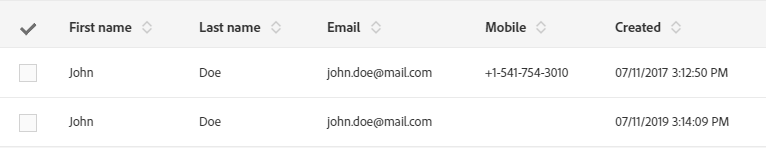

# Aan de slag met landingspagina&#39;s {#getting-started-with-landing-pages}

De belangrijkste stappen bij het instellen van landingspagina&#39;s zijn als volgt:

Op deze pagina vindt u informatie over elk van deze stappen en verwijzingen naar des desbetreffende documentatie voor meer informatie.

**Verwante onderwerpen:**

* [Tutorial voor het maken van landingspagina&#39;s](https://docs.adobe.com/content/help/en/campaign-learn/campaign-standard-tutorials/communication-channels/landing-pages/landing-page-create-and-edit.html) (
* [Een service maken](../../audiences/using/creating-a-service.md)
* [Een dubbele opt-inprocedure instellen](setting-up-a-double-opt-in-process.md)

## Beperkingen voor landingspagina{#landing-page-limitations}

In de onderstaande sectie worden enkele beperkingen weergegeven die u moet kennen voordat u landingspagina&#39;s gaat instellen.

**Schrijven en bijwerken van data**

* Landingspagina&#39;s zijn alleen beschikbaar voor de bronnen **[!UICONTROL Profile]** en **[!UICONTROL Subscription]**. Een record kan worden opgeslagen en bijgewerkt vanuit **[!UICONTROL Profile]** en een abonnement of uitschrijving naar een **[!UICONTROL Service]**.
Voor meer informatie over bronconfiguratie gaat u naar [De datastructuur van een bron configureren](../../developing/using/configuring-the-resource-s-data-structure.md).

>[!CAUTION]
>
>Een landingspagina kan alleen data van de bronnen **[!UICONTROL Profile]** en **[!UICONTROL Subscription]** weergeven of bijwerken.

**Vooraf laden**

* De landingspagina kan niet automatisch een lijst met records weergeven. Ook kunnen er geen services worden vermeld waarop profielen al zijn geabonneerd. Raadpleeg deze [pagina](../../audiences/using/creating-a-service.md) voor meer informatie over services.

* Landingspagina&#39;s met een vooraf ingevuld formulier (data zijn al op de pagina ingevuld) zijn alleen toegankelijk via een e-mailbericht van Adobe Campaign. Een dergelijk formulier kan niet worden geopend vanaf een websitepagina.

**Afstemming**

* Afstemming werkt als volgt: zodra een overeenkomst wordt gevonden, stopt het afstemmingsproces. Dit betekent dat de afstemming alleen kan worden uitgevoerd op één profielrecord, en niet op meerdere records in geval van duplicaten.

Stel dat u de volgende acquisitielandingspagina naar uw profielen wilt verzenden om uw Campaign-database bij te werken met hun mobiele nummers.

Als een van uw profielen de landingspagina invult met nieuwe informatie, maar er al een dubbel profiel is, wordt het profiel bijgewerkt dat het eerst is gemaakt. Dit is omdat profielen prioriteit krijgen op basis van de (meest recente) aanmaakdatum.

Hier is alleen het eerste profiel bijgewerkt aangezien dat de oudste vermelding was.

**Landingspagina&#39;s testen**

* Landingspagina&#39;s werken alleen met profielen, en niet met testprofielen. Dit betekent dat landingspagina&#39;s niet kunnen worden getest als onderdeel van een e-mailproefversie.

## Stap 1 - De sjabloon voor de landingspagina configureren {#configure-the-landing-page-template}

Voordat u een landingspagina instelt, moet u eerst een sjabloon ervoor configureren die aan uw behoeften voldoet. Zodra de sjabloon klaar is, worden alle landingspagina&#39;s die op de sjabloon zijn gebaseerd, vooraf geconfigureerd met de gewenste parameters.

1. Selecteer **[!UICONTROL Resources]** / **[!UICONTROL Templates]** / **[!UICONTROL Landing page templates]** in het menu Geavanceerd (via het Adobe Campaign-logo) en dupliceer vervolgens de sjabloon die u wilt gebruiken.
1. Geef in de sjablooneigenschappen alle parameters op die uw landingspagina&#39;s gemeenschappelijk moeten hebben. Bijvoorbeeld de doeldimensie, de toegangsparameters voor geïdentificeerde of niet-geïdentificeerde bezoekers, acties die specifiek zijn voor formuliervalidatie door een bezoeker, het merk/logo dat in de content moet worden gebruikt, enz. Raadpleeg [deze sectie](../../channels/using/configuring-landing-page.md) voor meer informatie over de eigenschappen van landingspagina&#39;s.
1. Sla uw wijzigingen op.

Raadpleeg [deze sectie](../../channels/using/getting-started-with-landing-pages.md) voor meer informatie over sjablonen voor landingspagina&#39;s.

## Stap 2 - De landingspagina maken en configureren {#create-and-configure-the-landing-page}

Op basis van de sjabloon die in de vorige stap is gedefinieerd maakt u nu een nieuwe landingspagina in een programma of campagne.

1. Maak de landingspagina op basis van de gewenste sjabloon.
1. Voer de algemene parameters van de landingspagina in (label, beschrijving, enz.).
1. U hebt nu toegang tot het dashboard van de landingspagina. Bewerk indien nodig de eigenschappen van de landingspagina (zie [Een landingspagina configureren](../../channels/using/configuring-landing-page.md)). Standaard zijn de eigenschappen gelijk aan de eigenschappen die zijn geconfigureerd in de sjabloon voor de landingspagina.
Uit veiligheidsredenen en voor betere prestaties van het platform raden we u ten sterkste aan om een vervaldatum in te stellen in de eigenschappen van de landingspagina. Als u dat hebt gedaan, wordt de gepubliceerde landingspagina automatisch op de geselecteerde datum verwijderd. Raadpleeg [deze sectie](../../channels/using/testing-publishing-landing-page.md#setting-up-validity-parameters) voor meer informatie over validiteitsparameters.

   

   >[!NOTE]
   >
   >Uw wijzigingen gelden alleen voor de landingspagina die u hebt bewerkt. Als u deze wijzigingen ook op andere landingspagina&#39;s wilt toepassen, moet u ze in een specifieke sjabloon opnemen en vervolgens landingspagina&#39;s maken op basis van die sjabloon.

## Stap 3 - De landingspagina ontwerpen {#design-the-landing-page}

U kunt nu de content van de landingspagina definiëren. De landingspagina bevat standaard drie pagina&#39;s die u kunt doorbladeren met behulp van pijlen: de hoofdpagina met content, een bevestigingspagina en een foutpagina.

Op elke pagina staan velden die standaard zijn geconfigureerd. Indien gewenst kunt u de veldeigenschappen en -toewijzingen aanpassen.

U kunt ook configureren hoe de knop voor bevestiging werkt als een profiel erop klikt. Ook de content van de pagina kan geheel naar wens worden gewijzigd (afbeeldingen, personalisatievelden, enz.). Zo kunt u alvast de voornaam van een profiel invoegen op de bevestigingspagina om ze te bedanken voor hun registratie.

Raadpleeg [deze sectie](../../channels/using/designing-a-landing-page.md) voor meer informatie over het ontwerp van landingspagina&#39;s.

## Stap 4 - De landingspagina testen{#test-the-landing-page}

Als de landingspagina eenmaal is gedefinieerd, kunt u simuleren hoe deze online wordt uitgevoerd en zich gedraagt.

>[!CAUTION]
>
>De testen voor de landingspagina kunnen alleen worden uitgevoerd met profielen, niet met testprofielen. Wanneer het formulier wordt verzonden, worden de data van het geselecteerde profiel ook in het echt bijgewerkt. Als u wilt voorkomen dat echte profielen worden gewijzigd, moet u een namaakprofiel voor de klant gebruiken.

Als u tevreden bent met de manier waarop de landingspagina functioneert, publiceert u de pagina om deze online beschikbaar te maken.

Raadpleeg [deze sectie](../../channels/using/testing-publishing-landing-page.md#testing-the-landing-page-) voor meer informatie over het testen van een landingspagina.

## Stap 5 - De landingspagina publiceren{#publish-the-landing-page}

Als de testen met succes zijn voltooid, publiceert u de landingspagina. Druk hiervoor op de knop **[!UICONTROL Publish]** op de actiebalk in het dashboard. Een controleblok geeft de voortgang en status van de publicatie aan.

Na publicatie kan de landingspagina online worden bekeken. U kunt de landingspagina ook na publicatie altijd bijwerken. Na elke wijziging moet u de pagina wel opnieuw publiceren. U kunt de publicatie van een landingspagina ook op elk gewenst moment ongedaan maken, zodat de pagina niet meer beschikbaar is.

Na publicatie is de landingspagina klaar voor gebruik. Op dit punt kunt u verschillende methoden instellen waarmee u toegang krijgt tot de pagina. Zo kunt u nieuwe profielen opnemen in uw database, of aanvullende informatie over bestaande profielen verkrijgen.

Raadpleeg [deze sectie](../../channels/using/testing-publishing-landing-page.md#publishing-a-landing-page) voor meer informatie over het publiceren van een landingspagina.
